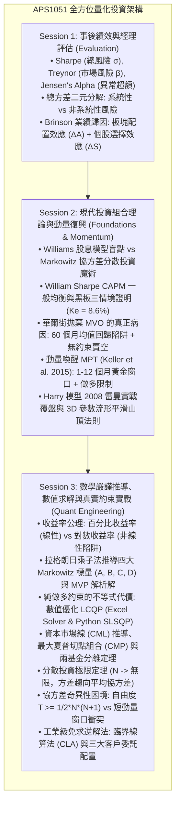
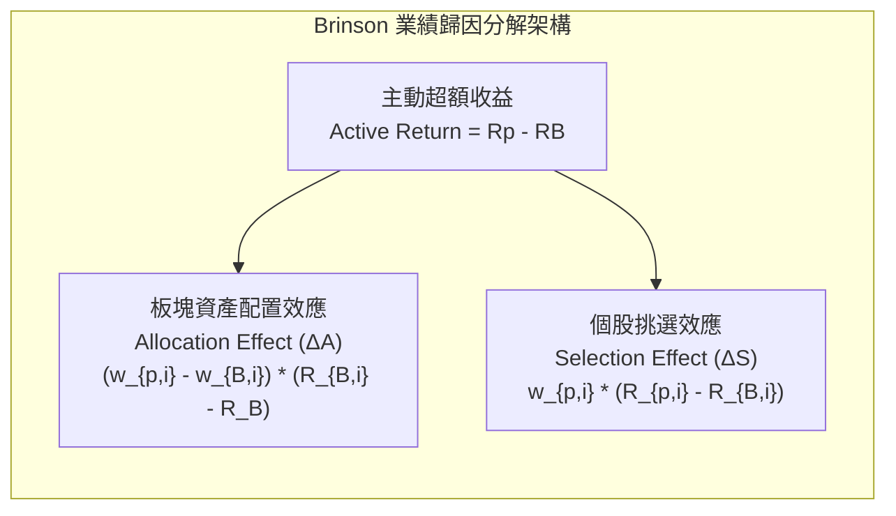

# APS1051: Master Bilingual Study Notes (Sessions 1, 2, and 3)
# 投資組合管理全系列雙語大師研習筆記（第一至三課完整版）

**Course / 課程：** APS1051: Portfolio Management under Real Market Constraints（真實市場約束下的投資組合管理）  
**Institution / 院校：** University of Toronto | Master of Engineering (ELITE Program)  
**Instructors / 教授：** Sabatino Costanzo & Loren Trigo  
**Student / 學生：** ChunKit Poon（潘俊傑）  
**Format Structure / 排版格式：** Deep, rigorous English technical paragraphs paired with immediate Cantonese intuition, real-world commentary, and annotations (每一英語深層技術段落，緊接廣東話實戰直覺與考點註解).

---

## Master Architecture & Roadmap across Sessions 1, 2, and 3
## 第一至三課全景架構路線圖



---

# ==============================================================================
# SECTION I: SESSION 1 — PORTFOLIO & MANAGER EVALUATION
# 第一單元：第一課 —— 投資組合與基金經理業績評估
# ==============================================================================

## 1.1 Course Roadmap & Theoretical vs. Real-World Paradigms (PPP 0)

### English Technical Foundation:
Session 1 establishes the mathematical and institutional foundation of portfolio performance evaluation. In academic finance, modern portfolio theory is frequently presented within a frictionless vacuum characterized by zero transaction costs, infinite liquidity, symmetric borrowing and lending rates, and stable parameter distributions. In contrast, this course establishes the institutional paradigm of **portfolio management under real market constraints**. Across the 11 integrated modules of the curriculum, students transition from static retrospective performance measurement (Modules 1A & 1B) to empirical momentum revival (Module 2), quantitative convex optimization and matrix singularity handling (Module 3), tactical downside risk metrics (Modules 4 & 5), execution frictions and transaction costs (Module 6), automated ETF rotation engines (Module 7), econometric data-mining tests (Module 8), and tactical derivative overlays utilizing options on the S&P 500 and 20-Year Treasuries (`TLT`) around Federal Open Market Committee (FOMC) events (Modules 9–11).

> 🗣️ **廣東話導讀與實戰註解：**  
> 成個課程嘅核心精神，就係將我哋由大學教科書嘅「象牙塔理想世界」拉返入「真實華爾街嘅殘酷戰場」。傳統教科書假設買賣唔使手續費、資產有無限流動性、借錢同存錢利率一樣、而且隨時可以自由沽空（Short-selling）。但現實中，如果你盲目跟從傳統教科書模型，保證金隨時斷裂自爆。第一課嘅首要任務，就係要建立一套客觀、嚴謹嘅量化評估體系：**到底一個基金經理賺到嘅錢，係憑佢嘅真憑實學（Alpha），定純粹係靠借錢加大槓桿、撞中大牛市嘅運氣（Beta）？**

---

## 1.2 Basic Portfolio Evaluation Metrics: Treynor, Sharpe, and Jensen's Alpha (PPP 1)

### English Technical Foundation:
In institutional fund evaluation, absolute nominal return is economically meaningless without conditioning on the underlying risk assumed. An active fund delivering an 18% annualized return via extreme financial leverage or unhedged tail-risk exposure may be vastly inferior to a defensive portfolio generating 12% with minimal drawdowns. Jack Treynor (1965) formulated the **Treynor Ratio ($T_p$)**, which quantifies excess returns per unit of systematic risk:
$$T_p = \frac{R_p - R_f}{\beta_p}$$
Where $\beta_p = \frac{\text{Cov}(R_p, R_m)}{\text{Var}(R_m)} = \sum_{i=1}^n w_i \beta_i$. The Treynor ratio fundamentally assumes that the investor already maintains a fully diversified master portfolio, meaning that all firm-specific unsystematic risk has already been eliminated. Consequently, it evaluates how efficiently an asset or sub-strategy utilizes systematic market risk. In the lecture’s numerical demonstration (Slides 7–10), Manager A ($R_A = 14\%, \beta_A = 1.2$) is compared to Manager B ($R_B = 11\%, \beta_B = 0.8$) against a risk-free rate $R_f = 3\%$. Although Manager A appears superior on nominal returns, Manager B delivers a Treynor ratio of $10.00\%$ ($8\% / 0.8$) versus Manager A’s $9.17\%$ ($11\% / 1.2$), proving that Manager B generates higher compensation per unit of macroeconomic market sensitivity.

> 🗣️ **廣東話導讀與實戰註解：**  
> **金融第一法則：千祈唔好單睇絕對回報！** 一個基金經理同你講佢年賺 18%，但如果佢係借咗九成孖展槓桿、重倉單一妖股博返嚟，隨時下個月就輸到貼地。**特雷諾比率（Treynor Ratio）**專門用嚟衡量「每冒一單位大市系統性風險（$\beta$），可以賺到幾多超額回報」。  
> 留意特雷諾比率嘅**前設條件**：佢假設投資者本身已經持有好分散嘅大資產池，所以個股特有風險已經被對沖咗。就好似課堂例子：經理 A 賺 14%（$\beta = 1.2$），經理 B 賺 11%（$\beta = 0.8$）。表面上經理 A 贏，但除返各自嘅 Beta 之後，經理 B 嘅特雷諾比率係 10%，跑贏經理 A 嘅 9.17%！這證明經理 B 運用大市風險嘅效率更加高。

---

### English Technical Foundation:
Conversely, William Sharpe (1966) introduced the **Sharpe Ratio ($S_p$)**, which scales excess returns against total portfolio risk as measured by sample standard deviation:
$$S_p = \frac{R_p - R_f}{\sigma_p}$$
The divergence between Sharpe and Treynor rankings represents a fundamental lesson in institutional risk management (Instructor Commentary, Slide 23). While Treynor restricts its risk penalty strictly to non-diversifiable market co-movement ($\beta_p$), Sharpe incorporates total return dispersion ($\sigma_p$), encompassing both systematic variance and residual idiosyncratic variance ($\sigma_\epsilon^2$). Consequently, if an active manager runs an aggressive, undiversified portfolio with heavy idiosyncratic single-stock bets, the large idiosyncratic volatility inflates $\sigma_p$, heavily penalizing the Sharpe denominator. Treynor completely ignores this specific risk. Therefore, Sharpe is the mandatory evaluation metric when evaluating a standalone portfolio representing an investor's entire wealth, whereas Treynor is reserved for evaluating sub-allocations within a well-diversified institution.

> 🗣️ **廣東話導讀與實戰註解：**  
> **點解夏普比率（Sharpe）同特雷諾比率（Treynor）嘅排名經常會打交？** 核心玄機在於分母！  
> * **Sharpe 睇總波動率（$\sigma_p$）：** 佢不管你係大市跌定係你間公司自己爆煲，只要你淨值大上大落，分母就會急升，夏普比率即刻暴跌。  
> * **Treynor 只睇大市連動（$\beta_p$）：** 如果你全倉單押一隻生科股，佢嘅特異風險極大，但如果佢同大市相關性低，佢嘅 Beta 可能好細。Treynor 會畀佢極高分，但真實風險隨時大到嚇死人！  
> * **實務結論：** 如果個客打算將成副身家交畀呢個基金（獨立組合 Standalone），一定要睇 **Sharpe**；如果個客只係將 5% 閒錢放入某隻行業主題基金做衛星配置，先可以睇 **Treynor**。

---

### English Technical Foundation:
Michael Jensen (1968) formulated **Jensen's Alpha ($\alpha_p$)**, which measures the empirical abnormal return generated above the theoretical benchmark established by the Capital Asset Pricing Model (CAPM):
$$\alpha_p = R_p - E[R_p] = R_p - [R_f + \beta_p(R_m - R_f)]$$
Jensen's Alpha fundamentally disentangles manager skill from passive market drift. If a portfolio delivers an impressive 16% return during a raging bull market where the benchmark rose 20% and the portfolio's beta was 1.5, the CAPM expected hurdle rate was $R_f + 1.5(R_m - R_f) = 3\% + 1.5(17\%) = 28.5\%$. In this scenario, the manager generated a deeply negative alpha of $\alpha_p = 16\% - 28.5\% = -12.5\%$. Despite positive absolute returns, the manager severely destroyed capital value relative to the systematic risk budget. In econometric practice, Jensen’s Alpha is determined via an ordinary least squares (OLS) time-series regression of excess returns:
$$(R_{p,t} - R_{f,t}) = \alpha_p + \beta_p (R_{m,t} - R_{f,t}) + \epsilon_t$$
True skill is validated institutional-grade only when the regression intercept $\alpha_p$ demonstrates statistical significance at the 95% confidence level ($t\text{-statistic} > 2.0, p\text{-value} < 0.05$).

> 🗣️ **廣東話導讀與實戰註解：**  
> **詹森阿爾法（Jensen's Alpha）就係量化金融嘅「照妖鏡」！**  
> 大牛市嗰陣，隻隻股票都升，基金經理賺 16% 就出嚟自吹自擂。但如果大市升咗 20%，而佢個組合借咗槓桿（$\beta = 1.5$），根據 CAPM，佢本來應該要賺到 28.5% 先至合格！結果佢只賺 16%，佢嘅 Alpha 其實係 **$-12.5\%$**，直情係倒貼輸緊超額回報。在機構實務中，我哋會做 36 到 60 個月嘅月度時間序列回歸，只有當 Alpha 嘅 $t\text{-stat} > 2.0$（統計學顯著），先證明個經理係真材實料，唔係行運撞棍。

---

### English Technical Foundation:
The total risk of an equity portfolio is orthogonally decomposed into systematic and unsystematic components:
$$\sigma_p^2 = \beta_p^2 \sigma_m^2 + \sigma_\epsilon^2$$
* **Systematic (Market / Non-Diversifiable) Risk ($\beta_p^2 \sigma_m^2$):** Stemming from macroeconomic factors (inflation shocks, interest rate adjustments, geopolitical conflict, GDP contractions) that impact the aggregate financial system simultaneously. It cannot be reduced by adding more individual equities.
* **Unsystematic (Idiosyncratic / Diversifiable / Residual) Risk ($\sigma_\epsilon^2$):** Microeconomic shocks inherent to specific firms or narrow industries (product liability lawsuits, executive fraud, clinical trial failures, supply chain bottlenecks). Because idiosyncratic firm disturbances have mutual expectations near zero, holding a properly constructed portfolio of 30 or more uncorrelated assets mathematically diversifies this risk toward zero. Because idiosyncratic risk can be eliminated costlessly, the capital market provides zero expected risk premium for bearing it.

> 🗣️ **廣東話導讀與實戰註解：**  
> **總風險二元拆解定理：**  
> 1. **系統性風險（Systematic Risk）：** 宏觀大氣候（例如加息、通脹、戰爭、疫情）。覆巢之下無完卵，你買多 100 隻股票都避唔開，只能透過衍生工具（期權對沖）或者轉移資產類別（買國債現金）嚟防禦。  
> 2. **非系統性風險（Unsystematic Risk）：** 單一公司特有倒霉事（例如 CEO 造假、研發失敗、工廠失火）。只要組合持有 30 隻以上唔同產業嘅股票，非系統性風險就會被互相對沖消除。**市場係非常精明嘅，既然你可以輕易分散消除呢種風險，市場就絕對唔會畀任何超額溢價你去承擔佢！**

---

## 1.3 Critical Interpretations: Alpha vs. Beta & Information Ratio (PPP 2)

### English Technical Foundation:
Presentation 2 advances the critical analysis of risk-adjusted evaluation metrics. The institutional investment landscape distinguishes strictly between **Alpha** and **Beta**:
* **Alpha:** A zero-sum, highly elusive return premium derived from superior information, advanced mathematical modeling, or proprietary security selection. Alpha is intellectually difficult to generate, expensive to access (typically commanding "2 and 20" hedge fund fee structures), and capacity-constrained.
* **Beta:** Standardized, commoditized exposure to systematic market factors. Beta is abundant, scalable, and extremely cheap to replicate via index funds and exchange-traded funds (ETFs) such as `SPY` for fees under 5 basis points.

The **Information Ratio ($IR$)** refines performance assessment by evaluating active return per unit of tracking risk relative to a specific benchmark portfolio $R_B$:
$$IR = \frac{R_p - R_B}{\text{Tracking Error}} = \frac{R_p - R_B}{\sigma_{(R_p - R_B)}}$$
While the Sharpe Ratio utilizes the risk-free rate $R_f$ as its universal hurdle, the Information Ratio evaluates an active manager against an explicit investment mandate (e.g., beating the Russell 2000 or the MSCI Emerging Markets Index).

#### CSI Institutional Benchmarks for Annualized Sharpe Ratios (Slides 26–32):
* **$S_p < 0.50$ (Substandard / Deficient):** Insufficient excess return relative to volatility. The investor is better served deploying capital into passive index tracking.
* **$0.50 \le S_p < 1.00$ (Good / Acceptable):** Institutional standard for long-only broad equity market allocations.
* **$1.00 \le S_p < 1.50$ (Exceptional / Superior):** Characteristic of elite hedge funds and high-quality multi-asset risk-parity strategies.
* **$S_p \ge 2.00$ (Extraordinary / Suspicious):** Rarely sustainable in capacity-scalable liquid markets. Often indicative of hidden illiquidity premiums, short-volatility tail-risk strategies (selling deep out-of-the-money options), or backtest data-mining overfitting.

> 🗣️ **廣東話導讀與實戰註解：**  
> * **Alpha（超額實力）vs. Beta（廉價市場水流）：** Beta 係大宗商品，求其上網買幾手 SPY 指數 ETF，手續費幾隻點（bps）就買到；但 Alpha 係零和博弈中搶奪返嚟嘅戰利品。好多華爾街基金經理暗中開幾倍槓桿買入高 Beta 股票，升市個陣賺大錢就話自己係「股神」收你 2% 管理費加 20% 表現費，量化評估就係要撕開佢哋嘅畫皮！  
> * **信息比率（Information Ratio, IR）：** 養老金挑選股票基金經理最睇呢個指標。分母係**跟蹤誤差（Tracking Error）**。高 IR 代表經理每偏離基準指數 1% 嘅風險，都能夠穩定帶嚟超額回報。  
> * **全球夏普比率標準線：** 年化 Sharpe 小於 0.5 係垃圾；0.5 到 1.0 係公募基金常規水準；超過 1.0 已經係頂級量化對沖基金門檻；如果有人同你推銷一隻策略年化 Sharpe 高達 2.5，九成九係騙局、過度擬合（Overfitting）、或者賣緊深虛值期權（未見過黑天鵝暴斃）。

---

## 1.4 Brinson Performance Attribution Framework (PPP 3)

### English Technical Foundation:
The **Brinson-Hood-Beebower (BHB, 1986)** performance attribution framework provides the rigorous mathematical methodology for decomposing an active investment manager’s excess return ($R_p - R_B$) into distinct decision-making sources: macroeconomic/sector timing vs. microeconomic stock selection:
$$R_p - R_B = \sum_{i=1}^M \Delta A_i + \sum_{i=1}^M \Delta S_i$$



#### 1. Sector Allocation Effect ($\Delta A_i$):
Measures the manager’s active macro ability to overweight outperforming sectors and underweight underperforming sectors relative to the aggregate benchmark:
$$\Delta A_i = (w_{p,i} - w_{B,i}) (R_{B,i} - R_B)$$
* If the manager overweights ($w_{p,i} > w_{B,i}$) a sector that outperforms the broader benchmark ($R_{B,i} > R_B$), $\Delta A_i > 0$ (positive macro value added).
* If the manager underweights ($w_{p,i} < w_{B,i}$) a sector that lags the broader benchmark ($R_{B,i} < R_B$), $\Delta A_i > 0$ (positive value added via defensive avoidance).

#### 2. Security Selection Effect ($\Delta S_i$):
Measures the manager’s micro ability to pick superior individual securities within each sector, holding sector weight constant:
$$\Delta S_i = w_{p,i} (R_{p,i} - R_{B,i})$$
Where $(R_{p,i} - R_{B,i})$ represents the excess return of the manager’s stock basket within sector $i$ over the sector benchmark, scaled by the manager’s actual commitment of capital $w_{p,i}$.

---

### Step-by-Step Numerical Case Study (+130 bps Walkthrough):
Consider a 3-sector benchmark (Technology, Financials, Healthcare):
* **Benchmark Parameters:**
  * Tech: $w_B = 40\%, R_B = 10\%$
  * Fin: $w_B = 35\%, R_B = 4\%$
  * Health: $w_B = 25\%, R_B = 6\%$
  * **Benchmark Return ($R_B$):** $(0.40 \times 10\%) + (0.35 \times 4\%) + (0.25 \times 6\%) = 4.0\% + 1.4\% + 1.5\% = \mathbf{6.90\%}$.
* **Portfolio Parameters:**
  * Tech: $w_p = 50\%, R_p = 11\%$
  * Fin: $w_p = 20\%, R_p = 3\%$
  * Health: $w_p = 30\%, R_p = 7\%$
  * **Portfolio Return ($R_p$):** $(0.50 \times 11\%) + (0.20 \times 3\%) + (0.30 \times 7\%) = 5.5\% + 0.6\% + 2.1\% = \mathbf{8.20\%}$.
* **Active Total Value Added:** $R_p - R_B = 8.20\% - 6.90\% = \mathbf{+1.30\% \text{ (+130 bps)}}$.

#### Exact Component Calculations:
1. **Allocation Effect ($\Delta A$):**
   * Tech: $(0.50 - 0.40)(10\% - 6.90\%) = +0.10 \times (+3.10\%) = \mathbf{+0.31\%}$
   * Fin: $(0.20 - 0.35)(4\% - 6.90\%) = -0.15 \times (-2.90\%) = \mathbf{+0.435\%}$ *(Underweighting a losing sector)*
   * Health: $(0.30 - 0.25)(6\% - 6.90\%) = +0.05 \times (-0.90\%) = \mathbf{-0.045\%}$
   * **Total Allocation Effect:** $+0.31\% + 0.435\% - 0.045\% = \mathbf{+0.70\% \text{ (+70 bps)}}$.
2. **Selection Effect ($\Delta S$):**
   * Tech: $0.50 \times (11\% - 10\%) = 0.50 \times (+1.0\%) = \mathbf{+0.50\%}$
   * Fin: $0.20 \times (3\% - 4\%) = 0.20 \times (-1.0\%) = \mathbf{-0.20\%}$
   * Health: $0.30 \times (7\% - 6\%) = 0.30 \times (+1.0\%) = \mathbf{+0.30\%}$
   * **Total Selection Effect:** $+0.50\% - 0.20\% + 0.30\% = \mathbf{+0.60\% \text{ (+60 bps)}}$.
3. **Reconciliation:**
   $$\sum \Delta A + \sum \Delta S = +0.70\% + 0.60\% = \mathbf{+1.30\% \text{ (+130 bps)}}$$

> 🗣️ **廣東話導讀與實戰註解：**  
> **Brinson 業績歸因分析係機構面試必考題！** 經理跑贏大市 130 個基點（bps），到底係點贏嘅？  
> 1. **配置效應（Allocation Effect）：** 睇經理大局觀。例如金融股全期只升 4%（跑輸大市嘅 6.90%），經理眼光獨到，將金融股權重由 35% 大削至 20%，負負得正，為組合貢獻咗 **+43.5 bps**！總體配置效應貢獻咗 **+70 bps**。  
> 2. **選股效應（Selection Effect）：** 睇經理微觀揀股眼光。經理喺科技股同醫療股入面挑選出嘅個股都跑贏板塊指數 1%，總選股效應貢獻咗 **+60 bps**。  
> 3. **總結：** 兩者相加剛好完美對數 $70 + 60 = 130\text{ bps}$。這證明經理既有宏觀行業擇時能力，又有微觀挑選黑馬股嘅基本面功力！

---

# ==============================================================================
# SECTION II: SESSION 2 — MODERN PORTFOLIO THEORY & MOMENTUM REVIVAL
# 第二單元：第二課 —— 現代投資組合理論與動量全面復興
# ==============================================================================

## 2.1 The Genesis of Modern Portfolio Theory vs. Williams's DDM (CL 2 PPP 0)

### English Technical Foundation:
Prior to 1952, mainstream investment management lacked any formal mathematical formulation of investment risk. John Burr Williams (1938) established the foundational framework of equity valuation in *The Theory of Investment Value*, postulating that the intrinsic price of any common stock equals the discounted present value of its future dividend stream ($P_0 = \sum D_t / (1+k)^t$). Harry Markowitz observed the catastrophic flaw in strictly applying Williams’s paradigm: a rational investor seeking to maximize discounted return would calculate expected returns across all eligible securities and invest **100% of wealth into the single highest-yielding security**. This logic completely fails to capture institutional behavior, which instinctively demands diversification to avert catastrophic firm-specific bankruptcy. Influenced by James Uspensky’s *Introduction to Probability*, Markowitz (1952) established that rational investors optimize over the joint distribution of returns, formalizing risk mathematically as portfolio variance governed primarily by **pairwise covariance and correlation**:
$$\sigma_p^2 = \sum_{i=1}^n w_i^2 \sigma_i^2 + \sum_{i=1}^n \sum_{j \ne i}^n w_i w_j \sigma_{ij}, \quad \text{Cov}(R_i, R_j) = \rho_{ij} \sigma_i \sigma_j$$

In the instructor's core example (Singapore Retail vs. Brazil Healthcare), two highly volatile assets in isolation exhibit near-zero macroeconomic correlation ($\rho \approx 0$). When combined, their independent idiosyncratic variances cancel out, generating a blended portfolio with aggregate risk substantially lower than either standalone asset. Plotted in $(\sigma, E[R])$ space, all feasible portfolios form the **Markowitz Bullet**, whose upper convex boundary represents the **Efficient Frontier** (maximum return for a given risk, or minimum risk for a given target return).

> 🗣️ **廣東話導讀與實戰註解：**  
> 在 1950 年代前，金融學係冇「風險」嘅數學計法。舊派學者 Williams 認為股票價值就係未來股息折現。Markowitz 踢爆佢嘅致命盲點：如果只睇最高折現收益，投資者咪應該將 **100% 身家全數買入全市場最好個一隻股票**？現實中咁做等於自殺。  
> Markowitz 嘅偉大突破，在於證明投資組合嘅總風險**唔係單獨資產方差嘅簡單加總，而係取決於資產之間嘅協方差（Covariance）同相關系數（$\rho$）**！就好似教授嘅經典比喻：一間新加坡零售公司同一間巴西醫院，兩者宏觀上毫無瓜葛（$\rho \approx 0$）。當新加坡零售生意差嗰陣，巴西醫院可能完全不受影響。兩者結合，組合總波動大跌。這就係分散投資嘅魔術！

---

## 2.2 Sharpe’s General Equilibrium & Blackboard Proof of the CAPM (CL 2 PPP 1)

### English Technical Foundation:
William Sharpe (1964) extended Markowitz’s individual optimization framework into general macroeconomic equilibrium. If all rational investors optimize along the Markowitz Efficient Frontier, what equilibrium prices and expected returns must clear the market? Sharpe derived the **Capital Asset Pricing Model (CAPM)**:
$$E[R_i] = R_f + \beta_i (R_m - R_f)$$

Rather than relying on abstract calculus, the instructors demonstrate the intuitive economic proof of CAPM across **Three Investment Scenarios** (Blackboard Derivation, Slides 19–45):
1. **Scenario 1 (The Risk-Free Baseline):** An investor is offered a default-free government treasury bond yielding guaranteed $R_f = 2\%$. This anchors the baseline time value of money.
2. **Scenario 2 (The Medium-Risk Fund — Rejection & Risk Premium):** A hedge fund manager presents an investment with market-level volatility ($\beta = 1.0$) but offers a net return of $2\%$. The rational investor instantly rejects the offer. Nobody accepts market volatility to earn the exact same return guaranteed by the government. To clear the market, the fund must pay an additional **Equity Risk Premium $(R_m - R_f)$**. If historical market returns are $R_m = 8\%$, the fund must pay $2\% + 6\% = 8\%$.
3. **Scenario 3 (The Higher-Risk Fund — Fair Contract Pricing):** A third fund manager presents an investment with volatility 10% higher than the broader market ($\beta = 1.1$). What is the fair contractual expected return ($K_e$)?
   $$K_e = R_f + \beta (R_m - R_f) = 0.02 + 1.1 \times (0.08 - 0.02) = 0.02 + 0.066 = \mathbf{0.086 \text{ (8.6\%)}}$$
   The line connecting these equilibrium points in $(\beta, E[R])$ space is the **Security Market Line (SML)**.

> 🗣️ **廣東話導讀與實戰註解：**  
> 教授在黑板上用一個極之接地氣嘅「三情境思想實驗」推導 CAPM：  
> 1. **情境 1：** 政府國庫券保證有 2% 回報（無風險 $R_f$）。任何人投資嘅最低門檻就係 2%。  
> 2. **情境 2：** 對沖基金經理推銷一隻中等市場風險基金（$\beta = 1.0$），扣除收費後只畀返 2% 回報。投資者實當場翻枱！既然國債穩袋 2%，我做咩要冒股票大跌風險去賺 2%？經理必須補償**市場風險溢價（$8\% - 2\% = 6\%$）**，總共畀足 8% 先有成交。  
> 3. **情境 3：** 另一隻進攻型基金風險比大市高 10%（$\beta = 1.1$），合理回報應該係幾多？直接套入公式：$2\% + 1.1 \times 6\% = \mathbf{8.6\%}$！多出嚟嘅 0.6% 就係精確補償投資者多承受 10% 系統性風險嘅對價。

---

## 2.3 Empirical Challenges: The Low-Beta Anomaly & 5-Factor Quant Screen (CL 2 PPP 0)

### English Technical Foundation:
Despite CAPM’s elegance, empirical backtests revealed systematic market breakdowns. Fischer Black, Michael Jensen, and Myron Scholes (1972), followed definitively by Eugene Fama and Kenneth French (1992), discovered the **Low-Beta Anomaly**: high-beta equities systematically underperform their CAPM predictions, whereas **low-beta equities consistently deliver superior risk-adjusted returns**. Fama and French established the Multi-Factor paradigm:
* **Size Premium (SMB - Small Minus Big):** Small-capitalization equities historically outperform mega-caps due to higher operating distress risk and illiquidity.
* **Value Premium (HML - High Minus Low):** Value equities (high Book-to-Market / low P/B) outperform high-multiple growth equities.
* **Momentum Factor (Jegadeesh & Titman 1993):** Past 3-to-12 month return winners continue outperforming past losers.
* **Liquidity Premium (Amihud 2002):** Less liquid assets must compensate investors with higher expected yield.

#### The Master Multi-Dimensional Quantitative Screen (Slide 42):
To maximize compound annual growth rate (CAGR), quantitative asset managers combine these factor premia into a synchronized multi-dimensional investment screen:
$$\mathbf{\text{Target Assets: [Low Beta] + [Value Style] + [Small Cap] + [Illiquid] + [Upward Momentum]}}$$
*Instructor Caveat (Slide 43):* While this combined factor screen achieves exceptional multi-decade compounding, it experiences prolonged cyclical drawdowns requiring institutional patient capital.

> 🗣️ **廣東話導讀與實戰註解：**  
> CAPM 喺現實中最出名嘅打臉現象就係**「低 Beta 異象」**：按照教科書，高 Beta 股票風險大應該回報高，但真實數據顯示，幾十年嚟高 Beta 股票長遠全部輸波，低 Beta 防守股反而持續跑贏！  
> 結合 Fama-French 嘅多因子革命，教授總結出**五維量化選股終極公式**：同時篩選【低 Beta】+【價值股】+【小盤股】+【低流動性】+【向上動量】嘅標的。呢種組合長期收益率極為恐怖，但缺點係短期可能會有較大回撤，需要極度冷靜嘅長線資金先頂得住。

---

## 2.4 Modern Portfolio Theory Revived with Momentum (CL 2 PPP 2 / Keller et al. 2015)

### English Technical Foundation:
Despite Markowitz winning the 1990 Nobel Prize in Economics, traditional Mean-Variance Optimization (MVO) was widely abandoned on institutional trading desks:
* **Richard Michaud (1989):** MVO acts as an *"error-maximizing procedure"* that channels capital into assets with the largest estimation noise.
* **Victor DeMiguel, Garlappi, & Uppal (2007):** Naive equal weighting ($1/N$) systematically outperforms complex out-of-sample MVO.
* **Andrew Ang (2014):** Mean-variance optimized weights perform *"horribly"* because tiny parameter estimation errors result in extreme, unstable allocations.

#### The Breakthrough Diagnostic by Keller, Butler, & Kipnis (2015):
Keller, Butler, and Kipnis proved that MVO’s mathematical framework is flawless; its 60-year failure was caused by two catastrophic institutional misapplications:
1. **The 36–60 Month Lookback Trap:** Academics conventionally estimated expected returns over 3 to 5-year historical windows. Over multi-year horizons, asset returns undergo severe **mean reversion** (Asness et al. 2012). MVO was systematically buying historical winners right before they became future losers!
2. **Unconstrained Short-Sales:** Permitting negative weights ($w_i < 0$) allowed quadratic optimizers to take massive, levered long/short bets on statistical noise.

#### The Dual Remedy:
* **Remedy 1:** Enforce **Long-Only Allocations** ($w_i \ge 0$).
* **Remedy 2:** Shorten the estimation lookback horizon to **1 to 12 Months**, harnessing the well-documented empirical phenomenon of **momentum persistence**.

---

### "Harry’s" Stylized High-School Experiment & The 2008 Lehman Simulation (Slides 8–25):
To illustrate the power of this revival, the authors introduce a fictional high-school student, "Harry":
* **Universe:** `SPY` (S&P 500 ETF) and `TLT` (20+ Year US Treasury Bond ETF).
* **Constraints:** Long-only ($w_i \ge 0$), discrete 10% weight permutations, target volatility $\le 10\%$.
* **Lookback:** Only **4 months** of trailing data with monthly rebalancing.

#### Real-Time Performance During the 2008 Crash:
* **September 2008 – April 2009 (The Crash):** While the global financial system collapsed and equities fell >50%, Harry’s 4-month momentum model detected equity decay and massive treasury flight-to-safety, allocating **$[0\% \text{ SPY} + 100\% \text{ TLT}]$**. Harry held 100% Treasuries throughout the crisis, dodging the crash and capturing the bond surge!
* **May 2009 (The Recovery):** As equities bottomed and momentum reversed, the model rotated to **$[90\% \text{ SPY} + 10\% \text{ TLT}]$**, aggressively participating in the initial recovery surge!
* **Multi-Decade Performance (Slide 41):** Total Return = 37.14%, CAGR = **14.17%**, Sharpe Ratio = **1.04**.

> 🗣️ **廣東話導讀與實戰註解：**  
> 點解 Markowitz 攞咗諾貝爾獎，但華爾街交易員都笑佢個模型係「廢物」？  
> 論文作者 Keller 踢爆咗真相：錯嘅唔係 Markowitz，而係班學者同基金經理用錯咗方法！  
> 1. **長週期均值回歸陷阱：** 傳統模型用 3 到 5 年回測數據，但股票 3 到 5 年會出現強烈「均值回歸」（升多必跌）。模型喺歷史最高位買入過去幾年表現最好嘅資產，變相係「高位接火棒」！  
> 2. **無約束沽空：** 容許開負權重沽空，令算法喺細小嘅估算誤差上加幾倍槓桿，搞到組合自爆。  
> 3. **兩大解藥：** **只准做多（$w_i \ge 0$）** ＋ **將回測期縮短到 1 至 12 個月（捕捉動量）**。  
> 高中生 Harry 淨係用 2 隻 ETF（美股 SPY ＋ 國債 TLT）同 4 個月回測窗口。2008 年雷曼破產引發海嘯，全球股市跌逾 50%，Harry 模型自動全倉換入 **100% 國債 TLT** 避險，零虧損之餘仲大賺；2009 年 5 月股市見底，模型即時偵測到動量轉正，瞬間變陣將 **90% 資金抄底 SPY 股票**，實證年複合增長率達 14.17%，夏普比率高達 1.04！

---

## 2.5 3D Parameter Optimization Manifolds & The Smooth Summit Rule (Slides 44–48)

### English Technical Foundation:
When optimizing multi-parameter trading models, the instructors map performance surfaces across three dimensions:
* **X-axis:** Lookback Horizon ($T$, trailing months).
* **Y-axis:** Holding / Rebalance Horizon ($H$, trailing months).
* **Z-axis:** Performance Metric (Sharpe Ratio or predictive correlation).

#### The Golden Summit Rule (Slide 48):
> *"When looking for the maximum correlation or Sharpe ratio across the table, we are trying to find the 'SUMMIT' of a manifold. In case there are two or more summits, we MUST SELECT THE ONE THAT IS 'SMOOTHER' (= DIFFERENTIABLE) OVER THE MORE 'ABRUPT' ONES."*

```
                ▲ Z (Sharpe Ratio)
                │
                │        Smooth Summit (SELECT THIS!)
                │          ╭────────╮
                │         ╭╯        ╰╮
                │        ╭╯          ╰╮
                │        │            │        Abrupt Spike (AVOID!)
                │        │            │            ▲
                │        │            │           ╱ ╲
                └────────┴────────────┴──────────┴───┴──────► X, Y Parameters
                                                       (Overfitting Trap)
```

* **Smooth & Differentiable Summits:** Mathematical continuity implies robustness. In out-of-sample execution, real-world parameters inevitably drift (e.g., the optimal lookback shifts from 4 to 5 months). On a smooth summit, parameter drift results in minimal, continuous performance degradation.
* **Abrupt Needle Spikes:** Sharp spikes represent statistical artifacts, data-snooping, and overfitting. A microscopic regime shift causes the strategy to collapse off a performance cliff.

> 🗣️ **廣東話導讀與實戰註解：**  
> **量化交易員必背金科玉律——「平滑山頂法則」！**  
> 當我哋用電腦掃描參數網格（X 軸係回測期，Y 軸係持倉期，Z 軸係夏普比率），我哋會見到 3D 地形圖上面有高山、亦都有尖刺。  
> 點解一定要揀**平滑嘅山頂（Smooth & Differentiable Summit）**，而千祈唔好揀最高嘅**尖銳刺針（Spikes）**？  
> 因為平滑山頂具備微積分上嘅**可微容錯性**。真實交易中，市場不可能永遠保持喺你回測嘅最佳參數（例如未來最優窗口由 4 個月漂移到 5 個月）。如果你身處平滑山頂，參數稍有偏移，你嘅夏普比率只會輕微下降；但如果你揀咗尖刺，這 100% 係歷史數據「過度擬合（Overfitting）」嘅假象，實盤運作只要參數偏離少少，表現就會由最高峰垂直跌落萬丈深淵！

---

# ==============================================================================
# SECTION III: SESSION 3 — QUANTITATIVE PORTFOLIO ENGINEERING & REAL CONSTRAINTS
# 第三單元：第三課 —— 量化投資組合工程、數學推導與真實約束實戰
# ==============================================================================

## 3.1 Return Metrics: The Fundamental Linearity Axiom (Slides 3–9 & Guide)

### English Technical Foundation:
Quantitative portfolio construction begins with the definition of portfolio holdings and asset returns. Let an eligible universe consist of $n$ assets with share holdings $\boldsymbol{\theta} = (\theta_1, \dots, \theta_n)$ and dollar values $v_i$. The portfolio weight is $w_i = v_i / \sum v_j$, subject to full investment $\mathbf{1}^T \mathbf{w} = 1$.

A critical theoretical nuance emphasized in Session 3 is the mathematical distinction between **Percentage (Arithmetic) Returns** and **Logarithmic (Continuously Compounded) Returns**:
* **Arithmetic Percentage Return:** $R_{i,t} = (P_{i,t} - P_{i,t-1}) / P_{i,t-1}$
* **Logarithmic Return:** $r_{i,t} = \ln(P_{i,t} / P_{i,t-1})$

#### The Portfolio Return Non-Linearity Trap:
For percentage returns, the return of a portfolio is strictly a linear combination of asset returns:
$$R_{p,t} = \sum_{i=1}^n w_i R_{i,t} = \mathbf{w}^T \mathbf{R}_t \implies \mu_p = E[R_{p,t}] = \mathbf{w}^T \boldsymbol{\mu}$$
For logarithmic returns, this linear property **fails completely**:
$$\ln\left( \sum_{i=1}^n w_i \frac{P_{i,t}}{P_{i,t-1}} \right) \ne \sum_{i=1}^n w_i \ln\left(\frac{P_{i,t}}{P_{i,t-1}}\right)$$
*Instructor Axiom:* In portfolio weight optimization, **arithmetic returns must be used exclusively**. Applying weighted averages to logarithmic returns introduces mathematical distortion into the portfolio’s expected return and variance calculations.

> 🗣️ **廣東話導讀與實戰註解：**  
> **初學量化最容易犯嘅低級數學錯誤：用錯 Log Return 計資產權重！**  
> 做時間序列模型（例如計單一股票波動性）嗰陣，Log Return 因為可以時間相加，所以好好用；但係，**喺資產組合加權優化嘅時候，絕對唔可以用對數回報（Log Return）！**  
> 點解？因為只有百分比算術回報（Percentage Return），資產組合嘅總收益先至等於各股票收益嘅線性加權總和（$\mu_p = \mathbf{w}^T \boldsymbol{\mu}$）。如果你將 Log Return 乘以權重相加，數學上完全唔等於組合嘅實際回報！記住：權重優化一律用百分比回報。

---

## 3.2 Variance, Volatility, and Annualization Mechanics (Slides 10–12 & Guide)

### English Technical Foundation:
Asset variance is defined as $\sigma_X^2 = E[(X - \mu_X)^2]$. Over short estimation intervals (daily data), expected returns hover near zero ($\mu \approx 0$). Consequently, variance simplifies to the uncentered second moment:
$$\sigma_X^2 \approx E\left[X^2\right]$$
This zero-mean approximation forms the operational baseline for ARCH/GARCH volatility modeling.

#### Annualization Additivity:
Because independent variances scale linearly with time:
* **Daily Frequency (252 Trading Days):** $\sigma^2_{\text{annual}} = \sigma^2_{\text{daily}} \times 252 \implies \sigma_{\text{annual}} = \sigma_{\text{daily}} \times \sqrt{252}$
* **Monthly Frequency (12 Months):** $\sigma^2_{\text{annual}} = \sigma^2_{\text{monthly}} \times 12 \implies \sigma_{\text{annual}} = \sigma_{\text{monthly}} \times \sqrt{12}$

#### Frequency vs. Sample Size ($T_{\text{freq}}$ vs. $N_{\text{obs}}$):
The annualization scalar ($252$ or $12$) represents annual sampling frequency, NOT sample size. A variance estimated from 20 daily observations is still annualized by multiplying by 252. However, to guarantee statistical stability of the sample covariance matrix, the sample size $N_{\text{obs}}$ should generally exceed 60 observations.

> 🗣️ **廣東話導讀與實戰註解：**  
> 波動率（標準差 $\sigma$）係方差嘅平方根。在金融計算入面，方差隨時間係線性累積嘅，所以：  
> * 日度轉年化：方差乘以 252，標準差（波動率）乘以 $\sqrt{252}$。  
> * 月度轉年化：方差乘以 12，標準差（波動率）乘以 $\sqrt{12}$。  
> 留意教授嘅特別提醒：乘數 252 或 12 只係**採樣頻率**，同學成日將佢同「樣本容量（Sample Size）」搞亂。就算你只用過去 20 日嘅數據計波動率，年化乘數一樣係 $\sqrt{252}$。但為咗保證統計穩定性，樣本長度建議至少要有 60 筆數據以上。

---

## 3.3 Analytical Derivations of Modern Portfolio Theory (Slides 24–32 & Guide)

### English Technical Foundation:
Markowitz formulated optimal portfolio selection as a constrained quadratic optimization problem. In the classic model with a fixed required return $\mu_{\text{req}}$:
$$\min_{\mathbf{w}} \frac{1}{2} \mathbf{w}^T \mathbf{C} \mathbf{w} \quad \text{subject to: } \mathbf{1}^T \mathbf{w} = 1, \quad \boldsymbol{\mu}^T \mathbf{w} = \mu_{\text{req}}$$
Where $\mathbf{C}$ is the $n \times n$ covariance matrix.

#### Lagrangian Derivation (Unconstrained / Shorts Allowed):
Construct the Lagrangian function with multipliers $\lambda_1$ and $\lambda_2$:
$$\mathcal{L}(\mathbf{w}, \lambda_1, \lambda_2) = \frac{1}{2}\mathbf{w}^T \mathbf{C} \mathbf{w} - \lambda_1 (\mathbf{1}^T \mathbf{w} - 1) - \lambda_2 (\boldsymbol{\mu}^T \mathbf{w} - \mu_{\text{req}})$$
Setting the gradient with respect to $\mathbf{w}$ to zero:
$$\nabla_{\mathbf{w}} \mathcal{L} = \mathbf{C}\mathbf{w} - \lambda_1 \mathbf{1} - \lambda_2 \boldsymbol{\mu} = \mathbf{0} \implies \mathbf{w} = \mathbf{C}^{-1}(\lambda_1 \mathbf{1} + \lambda_2 \boldsymbol{\mu})$$

#### The Fundamental Markowitz Scalar Constants:
Define the four fundamental scalars:
$$A = \mathbf{1}^T \mathbf{C}^{-1}\boldsymbol{\mu}, \quad B = \boldsymbol{\mu}^T \mathbf{C}^{-1}\boldsymbol{\mu}, \quad C = \mathbf{1}^T \mathbf{C}^{-1}\mathbf{1}, \quad D = BC - A^2$$
Applying constraints yields the $2 \times 2$ system:
$$\begin{bmatrix} C & A \\ A & B \end{bmatrix} \begin{bmatrix} \lambda_1 \\ \lambda_2 \end{bmatrix} = \begin{bmatrix} 1 \\ \mu_{\text{req}} \end{bmatrix} \implies \lambda_1 = \frac{B - A\mu_{\text{req}}}{D}, \quad \lambda_2 = \frac{C\mu_{\text{req}} - A}{D}$$
Substituting $\lambda_1, \lambda_2$ back yields the exact analytical weight vector:
$$\mathbf{w}^* = \frac{B - A\mu_{\text{req}}}{D}\mathbf{C}^{-1}\mathbf{1} + \frac{C\mu_{\text{req}} - A}{D}\mathbf{C}^{-1}\boldsymbol{\mu}$$

#### Global Minimum Variance Portfolio (MVP):
Omitting the target return constraint yields the minimum risk portfolio at the tip of the Markowitz bullet:
$$\mathbf{w}_{\text{mvp}} = \frac{\mathbf{C}^{-1}\mathbf{1}}{\mathbf{1}^T \mathbf{C}^{-1}\mathbf{1}} = \frac{\mathbf{C}^{-1}\mathbf{1}}{C}, \quad \sigma_{\text{mvp}}^2 = \frac{1}{C}, \quad \mu_{\text{mvp}} = \frac{A}{C}$$

> 🗣️ **廣東話導讀與實戰註解：**  
> 這段係 Markowitz 理論嘅精華數學證明：利用高等微積分嘅拉格朗日乘子法（Lagrange Multipliers）。  
> 透過對權重求偏導，我哋可以定義出四大經典 Markowitz 標量常數（$A, B, C, D$），從而直接推導出效率前緣上任意點嘅封閉式解析權重公式 $\mathbf{w}^*$！而子彈圖最左端嘅「全局最小方差組合（MVP）」，其最優權重就係 $\frac{\mathbf{C}^{-1}\mathbf{1}}{C}$，其方差剛好就係 $\frac{1}{C}$。  
> 留意：呢個解析公式嘅成立，前設係**容許自由賣空（$w_i < 0$）**。

---

### English Technical Foundation:
The fatal limitation of these textbook analytical equations is that they inevitably produce **negative weights ($w_i < 0$)**, dictating aggressive short sales. In institutional reality, short selling entails prohibitive locate borrow fees, margin recall risks, regulatory bans, and unlimited downside liability.

When the realistic non-negativity constraint ($w_i \ge 0$) is enforced, the optimization problem transforms from an equality-constrained Lagrangian system into a **Linearly Constrained Quadratic Program (LCQP)** with inequality constraints. Closed-form analytical expressions cease to exist; the optimal weights must be computed via numerical approximation algorithms (Excel Solver's GRG Nonlinear or Python's SLSQP).

> 🗣️ **廣東話導讀與實戰註解：**  
> **點解教科書嘅解析公式喺真實市場行唔通？**  
> 因為公式計出嚟嘅權重幾乎肯定會有負數（賣空 Shorting）。但在真實世界中，大部分退休基金嚴禁沽空，而且沽空要借貨手續費，遇著暴升仲會被逼倉打靶。  
> 一旦我哋加入真實約束條件「純做多（$w_i \ge 0$）」，數學上就引入咗**不等式約束**，拉格朗日乘子法直接失效，**世界上再冇任何封閉式代數公式可以一筆過計出最優權重**！我哋必須依賴數值求解器（Excel Solver 或 Python SLSQP）做數值逼近求解。

---

## 3.4 Excel Solver & SolverTable Implementation (Slides 33–35 & Guides)

### English Technical Foundation:
The curriculum operationalizes MVO within Microsoft Excel via the **Solver** and **SolverTable** add-ins:
* **Single-Variable Prototype (`SolverMinimization.xlsx` — Slide 33):** Minimizes $y = x^2 + 12x + 32$ using GRG Nonlinear, verifying convergence to vertex $(-6, -4)$.
* **Parametric Sensitivity (`SolverTableExample.xlsx` — Slide 34):** Demonstrates automating multi-run optimizations via One-Way Tables across changing input cells.
* **3-Stock Efficient Frontier (`EfficientFrontier3Stocks.xlsx` — Slide 35):**
  * `MeanReturns` (`B5:D5`), `StDev` (`B6:D6`), Correlation Matrix (`B9:D11`).
  * Covariance Matrix `CovarMat` (`H9:J11`) populated via $\sigma_{ij} = \rho_{ij}\sigma_i\sigma_j$.
  * Changing Cells `Invested` (`B15:D15`), initialized to $0.01$.
  * Portfolio Variance `PortVar` (`B21`):
    ```excel
    =MMULT(Invested, MMULT(CovarMat, TRANSPOSE(Invested)))
    ```
  * Constraints: `TotInvested = 1` (`E15 = 1`), `PortExpReturn >= ReqdReturn` (`B19 >= D19`), and `Make Unconstrained Variables Non-Negative` checked.
  * For $\mu_{\text{req}} = 12\%$, Solver converges to $w_X = 0.50, w_Y = 0.00, w_Z = 0.50$, yielding $\sigma_p = 12.0\%$. Running SolverTable from $10\%$ to $14\%$ (step $0.5\%$) outputs worksheet `STS_1`, plotting the continuous efficient frontier.

> 🗣️ **廣東話導讀與實戰註解：**  
> 喺 Excel 入面構建效率前緣嘅核心步驟：  
> 1. 利用 `MMULT` 同 `TRANSPOSE` 矩陣相乘函數，喺單元格 `B21` 寫出二次型組合方差 $\mathbf{w}^T \mathbf{C} \mathbf{w}$。  
> 2. 打開 Solver，將目標設為最小化 `PortVar`，約束條件設定權重和大於等於 1、組合預期回報大於等於目標回報 `ReqdReturn`，勾選非負（純做多），選 **GRG Nonlinear** 求解。  
> 3. 用 **SolverTable** 自動將目標回報由 10% 掃描到 14%，每次運算結果自動生成一張報表 `STS_1`，一鍵畫出整條光滑嘅效率前緣！

---

## 3.5 Capital Market Portfolio & Two-Fund Separation Theorem (Slides 37–52 & Guide)

### English Technical Foundation:
Combining a risky derived portfolio ($\mu_{\text{der}}, \sigma_{\text{der}}$) with a risk-free asset ($\mu_{rf}, \sigma_{rf} = 0$) produces a linear risk-return tradeoff:
$$\mu_{\text{combo}} = w_{\text{der}} \mu_{\text{der}} + (1 - w_{\text{der}}) \mu_{rf}, \quad \sigma_{\text{combo}} = w_{\text{der}} \sigma_{\text{der}} \implies w_{\text{der}} = \frac{\sigma_{\text{combo}}}{\sigma_{\text{der}}}$$
Substituting $w_{\text{der}}$ yields the **Capital Market Line (CML)** equation:
$$\mu_{\text{combo}} = \mu_{rf} + \left(\frac{\mu_{\text{der}} - \mu_{rf}}{\sigma_{\text{der}}}\right) \sigma_{\text{combo}}$$
The slope is the **Sharpe Ratio** of the risky allocation. Rotating this line upward to its point of maximum tangency with the Markowitz efficient frontier identifies the unique **Capital Market Portfolio (CMP)**.

#### Analytical CMP Weights (with shorts allowed):
$$\mathbf{w}_{\text{cmp}} = \frac{\mathbf{C}^{-1}(\boldsymbol{\mu} - \mu_{rf}\mathbf{1})}{\mathbf{1}^T \mathbf{C}^{-1}(\boldsymbol{\mu} - \mu_{rf}\mathbf{1})}$$

#### Excel Solver Implementation (`MarketPortfolio3Stocks.xlsx` — Slide 52):
Objective cell `Sharpe` (`B24`) is maximized by varying `Invested` (`B15:D15`) subject only to `TotInvested = 1` and non-negativity. **The target return constraint is omitted entirely** because the tangency portfolio is unique. For the 3-stock model, Solver computes $w_X = 0.10, w_Y = 0.00, w_Z = 0.89$, yielding $\mu_{\text{cmp}} = 10.0\%, \sigma_{\text{cmp}} = 8.0\%$.

#### Tobin's Two-Fund Separation Theorem:
Investment decision-making separates into two independent steps:
1. **Technical Optimization (Universal):** The quantitative manager identifies the single tangency portfolio (CMP) maximizing the Sharpe ratio.
2. **Personal Risk Financing (Client-Specific):** Capital is split between the CMP and risk-free cash along the CML line. Because the straight CML line lies strictly above the curved Markowitz frontier, **any combined portfolio on the CML strictly dominates any standalone uncombined equity portfolio with identical volatility**.

> 🗣️ **廣東話導讀與實戰註解：**  
> **資本市場線（CML）與托賓兩基金分離定理：**  
> * 當我哋將無風險國債利率 $\mu_{rf}$ 連線到風險資產前緣嗰陣，條線嘅斜率就係夏普比率。將條射線向上轉動，切於效率前緣嘅最高點，就係全市場最優嘅**切點資本市場組合（CMP）**！  
> * 在 `MarketPortfolio3Stocks.xlsx` 試算表入面，**我哋完全唔需要設定目標回報**，直接將目標單元格設為「極大化夏普比率」，Solver 即刻計出切點權重（10% 股票 X + 89% 股票 Z）。  
> * **兩基金分離定理嘅精髓：** 量化經理對所有客戶都構建同一隻最高 Sharpe 嘅 CMP 組合。保守嘅客配 50% 現金 + 50% CMP；進攻型嘅客配 100% CMP。因為 CML 直線始終壓喺彎曲嘅效率前緣上方，所以**「CMP 混搭現金」嘅效果，絕對好過你直接去買前緣上面同等波動率嘅純股票組合！**

---

## 3.6 Dissection of the Five Production Python Scripts (Slides 53–69)

### English Technical Foundation:
Because Excel cannot scale beyond small universes, Session 3 provides 5 production Python scripts utilizing `scipy.optimize`:
1. [`1.ClassicMarkowitz_...py`](file:///G:/Other%20computers/My%20Computer/aps1051/S3A5.Miscellaneous.HomeworkUpdtd/1.ClassicMarkowitz_FixedRequiredReturnMinimizedVariancePortfolio.py): Optimizes a single efficient portfolio targeting $\mu_{\text{req}} = 8\%$ using Sequential Least Squares Programming (`SLSQP`) with non-negativity bounds `bnds = tuple((0, 1) for x in range(no_assets))`.
2. [`2.ClassicMarkowitz_..._EfficientFrontier.py`](file:///G:/Other%20computers/My%20Computer/aps1051/S3A5.Miscellaneous.HomeworkUpdtd/2.ClassicMarkowitz_FixedRequiredReturnMinimizedVariancePortfolio_EfficientFrontier.py): Replaces Excel's SolverTable by looping over `TargetRet = np.linspace(0.0, 0.25, 50)`, recording minimized volatilities `res['fun']`, and exporting the efficient frontier plot `F2.pdf`.
3. [`3.ClassicMarkowitz_MinimumVariancePortfolio.py`](file:///G:/Other%20computers/My%20Computer/aps1051/S3A5.Miscellaneous.HomeworkUpdtd/3.ClassicMarkowitz_MinimumVariancePortfolio.py): Minimizes total portfolio variance `Variance(weights) = portfolio(weights)[1]**2` subject only to $\sum w_i = 1$, finding the tip of the bullet.
4. [`4.ClassicMarkowitz_MaximumSharpePortfolio...py`](file:///G:/Other%20computers/My%20Computer/aps1051/S3A5.Miscellaneous.HomeworkUpdtd/4.ClassicMarkowitz_MaximumSharpePortfolioOrMarketPortfolio.py): Maximizes the Sharpe ratio by minimizing its negative: `def Sharpe_CAPM(weights): return -portfolio_CAPM(weights, r_f)[2]`.
5. [`5.ClassicMarkowitz_..._FlippedFake.py`](file:///G:/Other%20computers/My%20Computer/aps1051/S3A5.Miscellaneous.HomeworkUpdtd/5.ClassicMarkowitz_FixedRequiredReturnMinimizedVariancePortfolio_EfficientFrontier_FlippedFake.py): Addresses "Harry's Problem" (fixing target volatility $\sigma \le 16\%$ and maximizing return). Because standard `scipy.optimize` lacks Quadratically Constrained Quadratic Programming (QCQP), it precomputes a 50-point lookup table, finds the upper-branch target return matching $\sigma \le 0.16$ ($\mu = 18.88\%$), and executes Program 1.

> 🗣️ **廣東話導讀與實戰註解：**  
> 教授提供嘅 5 隻 Python 程式架構拆解：  
> * **程式 1：** 經典 Markowitz，指定目標回報 8%，調用 `scipy.optimize.minimize`，用 `method='SLSQP'` 求解最小波動率。  
> * **程式 2：** 用 `for` 循環掃描 50 個目標回報點，取代 Excel SolverTable，自動畫出效率前緣圖。  
> * **程式 3：** 移除目標回報，純粹求解方差極小值，定位子彈圖鼻尖嘅全局最小方差組合（MVP）。  
> * **程式 4：** 最大化夏普比率。由於 Python 優化器只能「最小化（minimize）」，所以編程小技巧係**定義一個最小化「負夏普比率（-Sharpe）」嘅目標函數**。  
> * **程式 5（FlippedFake）：** 解決 Harry 鎖定波動率上限嘅問題。因為標準 Python 冇原生二次約束求解器（QCQP），所以程式用咗個聰明嘅查表法變通：先掃描前緣對照表，查出 16% 波動率對應嘅最高回報 18.88%，再調用程式 1 求解。

---

## 3.7 Asymptotic Mathematics of Diversification (Slides & Guides)

### English Technical Foundation:
Session 3 establishes the formal algebraic proof of risk reduction under equal allocation ($w_i = 1/N$). Expanding the portfolio variance sum:
$$\sigma_p^2 = \sum_{i=1}^N w_i^2 \sigma_i^2 + \sum_{i=1}^N \sum_{j \ne i}^N w_i w_j \sigma_{ij} = \frac{1}{N^2}\sum_{i=1}^N \sigma_i^2 + \frac{1}{N^2}\sum_{i=1}^N \sum_{j \ne i}^N \sigma_{ij}$$
Defining Average Asset Variance $\overline{\sigma^2} = \frac{1}{N}\sum \sigma_i^2$ and Average Covariance $\overline{\text{Cov}} = \frac{1}{N(N-1)}\sum \sum_{j \ne i}\sigma_{ij}$:
$$\sigma_p^2 = \frac{1}{N^2}(N\overline{\sigma^2}) + \frac{1}{N^2}(N(N-1)\overline{\text{Cov}}) = \mathbf{\frac{1}{N}\overline{\sigma^2} + \frac{N-1}{N}\overline{\text{Cov}} = \frac{1}{N}(\overline{\sigma^2} - \overline{\text{Cov}}) + \overline{\text{Cov}}}$$

#### The Asymptotic Limit as $N \to \infty$:
$$\lim_{N \to \infty} \sigma_p^2 = \lim_{N \to \infty} \left[ \frac{1}{N}\overline{\sigma^2} + \left(1 - \frac{1}{N}\right)\overline{\text{Cov}} \right] = 0 + 1 \cdot \overline{\text{Cov}} = \mathbf{\overline{\text{Cov}}}$$

#### Institutional Insights:
1. **Idiosyncratic Risk Vanishes:** Specific risk scaled by $1/N$ approaches zero asymptotically.
2. **Systematic Risk is Non-Diversifiable:** Market risk is lower-bounded by average covariance $\overline{\text{Cov}}$.
3. **The 15 to 50 Asset Rule:** 15 assets capture ~90% of diversification benefits; beyond 50 assets marginal gain is virtually zero. However, this rule fails for corporate credit portfolios subject to rare catastrophic tail-risk defaults.

> 🗣️ **廣東話導讀與實戰註解：**  
> **分散投資嘅漸近數學極限證明：**  
> 當我哋將資金平均分配到 $N$ 隻股票（$w_i = 1/N$），組合總方差可以嚴格拆解為兩部分：  
> $$\sigma_p^2 = \frac{1}{N}\overline{\sigma^2} + \left(1 - \frac{1}{N}\right)\overline{\text{Cov}}$$  
> 當 $N \to \infty$（買入無限多隻股票），第一項 $\frac{1}{N}\overline{\sigma^2}$ 即刻變成 0！這證明**個別公司嘅特有風險完全可以被免費分散消除**。  
> 但第二項會收斂為 $\overline{\text{Cov}}$（平均協方差），這就係點解宏觀大市暴跌嗰陣，你買 500 隻股票一樣會跟住跌，因為市場系統性共震係無法靠買多幾隻股票分散嘅。實務上，持有 15 至 30 隻股票已經食足 90% 嘅分散好處，超過 50 隻之後嘅邊際減脂效果幾乎係零！

---

## 3.8 Covariance Singularity & The Degrees-of-Freedom Dilemma (Guides & Code)

### English Technical Foundation:
A covariance matrix $\mathbf{C}$ becomes singular (non-invertible, $\det(\mathbf{C}) = 0$) when asset count $N \ge T$ (observations), collinearity exists, or data cases are cloned. To ensure non-singularity, the statistical rule of thumb requires:
$$T_{\text{obs}} \ge \frac{1}{2}N(N+1)$$
* For $N = 11$ assets: $T_{\text{obs}} \ge \frac{1}{2}(11)(12) = 66$ trading days.
* For $N = 30$ assets: $T_{\text{obs}} \ge 465$ trading days ($\sim 2$ years).

#### The Central Quantitative Conflict:
* Momentum requires **short lookbacks** ($T \le 60$ days) to avoid long-term mean reversion (Keller et al. 2015).
* But $T = 66$ days limits the universe to $N \le 11$ assets to prevent matrix singularity.
* Yet optimal diversification demands $N \ge 15 \sim 30$ assets!

#### Four Industrial Solutions:
1. **Sector ETFs:** Deploying 11 Sector ETFs (e.g., `XLK`, `XLF`) satisfies $N \le 11$ while internally diversifying hundreds of stocks.
2. **Critical Line Algorithm (CLA - Markowitz & Todd 2000, Kwan 2011):** Traces piece-wise linear critical paths across active boundary sets ($\mathbf{IN}, \mathbf{UP}, \mathbf{DN}$) without inverting the covariance matrix, fully solving singular regimes ($N > T$).
3. **Higham (1988) Nearest Positive Definite Projection ([`posdef.py`](file:///G:/Other%20computers/My%20Computer/aps1051/S3B3.Miscellaneous.HomeworkAM_updated/PROGRAMS/markowitz_PYOPT_regularization/markowitz_PYOPT_regularization/posdef.py)):** Projects ill-conditioned matrices onto the symmetric positive definite cone via SVD.
4. **$1/N$ Heuristic Fallback:** Modern engines (like `PyPortfolioOpt`) default to equal weighting when matrix condition numbers blow up.

> 🗣️ **廣東話導讀與實戰註解：**  
> **量化投資組合管理嘅世紀大衝突：**  
> * 矩陣求逆經驗法則：觀測數據必須滿足 $T \ge \frac{1}{2}N(N+1)$，矩陣先唔會奇異（Singular）報錯。  
> * 如果我哋跟 Session 2 嘅動量法則，回測窗口必須短（例如 60 至 66 個交易日），咁資產數目 $N$ 就被死死卡喺 **11 隻之內**！  
> * 但剛才證明過，充分分散投資起碼要 15 到 30 隻資產，咁點算？  
> **四大機構級破解奇招：**  
> 1. **買 11 隻行業板塊 ETF（如科技 XLK、金融 XLF）：** 滿足 $N \le 11$ 免報錯，但每隻 ETF 背後自帶幾百隻股票嘅充分分散！  
> 2. **Markowitz 臨界線算法（CLA）：** 改用轉角組合分段追蹤，**全程完全唔使對成個協方差矩陣求逆**，即使 $N > T$ 依然完美畫出效率前緣！  
> 3. **Higham 最近正定矩陣修復（`posdef.py`）：** 用奇異值分解 SVD 將病態特徵值修正為正數。  
> 4. **等權重（$1/N$）降級備用：** 遇著極端黑天鵝矩陣報警，程式自動退守等權重避險。

---

## 3.9 Practical Portfolio Engineering: Client Mandates (Part 2 HWK)

### English Technical Foundation:
Part 2 applies `markowitz_PYOPT` to 3 distinct client investment mandates over an 11-year post-GFC benchmark (2009-01-30 to 2020-01-30) on `SPY` / `DIA`:
* **Client A (Risk-Averse, Volatility Capped at 15%):**
  * *Model:* **Case 2 (`ef.efficient_risk(0.15)`)** — Flipped Markowitz directly enforces the quadratic constraint $\mathbf{w}^T \mathbf{C} \mathbf{w} \le (0.15)^2$, maximizing return within the hard volatility cap.
* **Client B (Market-Level Return + Fixed Cash/Treasury Cushion):**
  * *Model:* **Case 1 (`ef.max_sharpe()`) combined with Cash** — Uses Two-Fund Separation to linearly scale risk along the Capital Market Line, outperforming standalone equity portfolios burdened by cash drag.
* **Client C (Risk-Indifferent Aggressive Maximum Growth):**
  * *Model:* **Case 3 (`ef.efficient_return()`)** — Targets an aggressive hurdle rate exceeding market benchmarks with zero cash drag, concentrating capital into high-momentum sector ETFs along the upper efficient frontier.

> 🗣️ **廣東話導讀與實戰註解：**  
> **第三課實戰大作業——三大客戶委託調用方案：**  
> * **客戶 A（極度怕輸，波動率硬性封頂 15%）：** 調用 **Case 2（Flipped Markowitz）**，鎖死風險上限，將收益推到極限。  
> * **客戶 B（想賺大市回報，但堅持要留固定比例現金/國債）：** 調用 **Case 1（最大夏普 CMP）**，利用 CML 線性混搭現金。由於 CML 支配前緣，呢種配置遠遠好過直接買一隻帶有現金拖累嘅普通股票基金。  
> * **客戶 C（只要最高回報，零現金，無懼波動）：** 調用 **Case 3（經典 Markowitz 高目標回報）**，在效率前緣頂端全倉押注最高動量嘅行業板塊。

---

# ==============================================================================
# MASTER SUMMARY & REVISION CHEAT-SHEET (S1, S2, S3)
# 全三課必背核心量化公式與結論速查手冊
# ==============================================================================

| 講次 Session | 核心評估/優化指標 Metric | 數學公式 Mathematical Formulation | 核心實務意義 Practical Institutional Rationale |
| :--- | :--- | :--- | :--- |
| **S1** | **特雷諾比率 (Treynor)** | $T_p = \frac{R_p - R_f}{\beta_p}$ | 評估每單位**市場系統性風險**之超額收益；適用於已高度分散的大機構子組合。 |
| **S1** | **夏普比率 (Sharpe)** | $S_p = \frac{R_p - R_f}{\sigma_p}$ | 評估每單位**總波動率**之超額收益；在分母嚴厲懲罰未分散的特異個股風險。 |
| **S1** | **詹森阿爾法 (Alpha)** | $\alpha_p = R_p - [R_f + \beta_p(R_m - R_f)]$ | 剝離大市水漲船高後的真實主動選股超額能力；需 $t\text{-stat} > 2.0$ 驗證顯著性。 |
| **S1** | **Brinson 配置效應** | $\Delta A_i = (w_{p,i} - w_{B,i})(R_{B,i} - R_B)$ | 衡量經理宏觀大類資產/行業板塊超配與低配的擇時能力。 |
| **S1** | **Brinson 選股效應** | $\Delta S_i = w_{p,i}(R_{p,i} - R_{B,i})$ | 衡量經理在特定行業內部挑選跑贏行業基準的黑馬個股能力。 |
| **S2** | **CAPM 均衡定價** | $E[R_i] = R_f + \beta_i(R_m - R_f)$ | 三情境黑板證明（國債 2% $\to$ 大市 8% $\to$ 進攻型 $\beta=1.1$ 索取合理回報 8.6%）。 |
| **S2** | **動量復興兩大解藥** | $w_i \ge 0$ 且 $T \in [1, 12] \text{ 個月}$ | 徹底解決傳統 MVO 60 個月均值回歸陷阱與無約束賣空槓桿自爆難題。 |
| **S2** | **3D 流形平滑山頂** | $\text{Smooth Summit } (\nabla Z \text{ 連續可微})$ | 抵禦參數過擬合（Overfitting）；平滑山頂保證實盤參數漂移時業績不崩潰。 |
| **S3** | **日度波動率年化** | $\sigma_{\text{ann}} = \sigma_{\text{daily}} \times \sqrt{252}$ | 基於方差時間可加性；採樣頻率（252/12）與樣本容量（$N_{\text{obs}} \ge 60$）完全獨立。 |
| **S3** | **組合方差二次型** | $\sigma_p^2 = \mathbf{w}^T \mathbf{C} \mathbf{w}$ | 必須嚴格使用百分比算術回報；對數回報在資產權重加權中完全失效。 |
| **S3** | **Markowitz 解析常數** | $A = \mathbf{1}^T \mathbf{C}^{-1}\boldsymbol{\mu}, C = \mathbf{1}^T \mathbf{C}^{-1}\mathbf{1}, D = BC - A^2$ | 拉格朗日乘子法推導效率前緣封閉式權重解與全局最小方差組合（MVP）。 |
| **S3** | **資本市場線 (CML)** | $\mu_{\text{combo}} = \mu_{rf} + \left(\frac{\mu_{\text{cmp}} - \mu_{rf}}{\sigma_{\text{cmp}}}\right)\sigma_{\text{combo}}$ | 兩基金分離定理：切點組合 CMP 混搭現金，幾何上嚴格支配純股票前緣組合。 |
| **S3** | **分散投資漸近極限** | $\lim_{N \to \infty} \sigma_p^2 = \overline{\text{Cov}}$ | 特異個股方差衰減為零；殘留不可分散的市場平均協方差；15–30 隻資產足矣。 |
| **S3** | **協方差奇異性條件** | $T_{\text{obs}} \ge \frac{1}{2}N(N+1)$ | 短動量窗口與資產數目的衝突；由 11 隻行業 ETF 或臨界線算法（CLA）破局。 |
