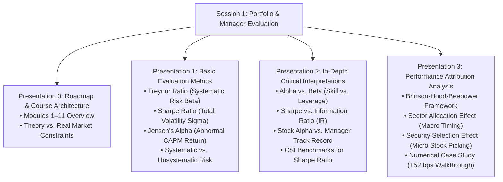
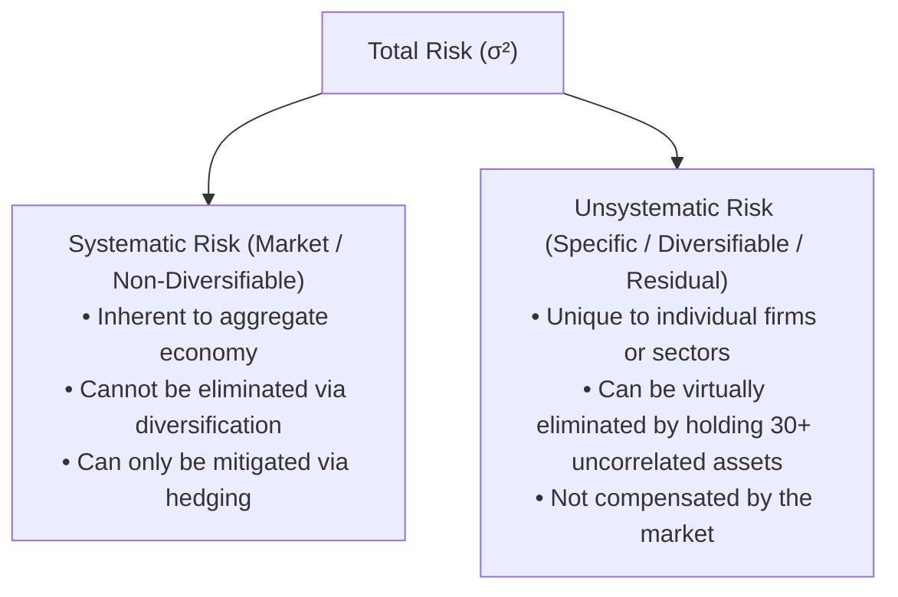
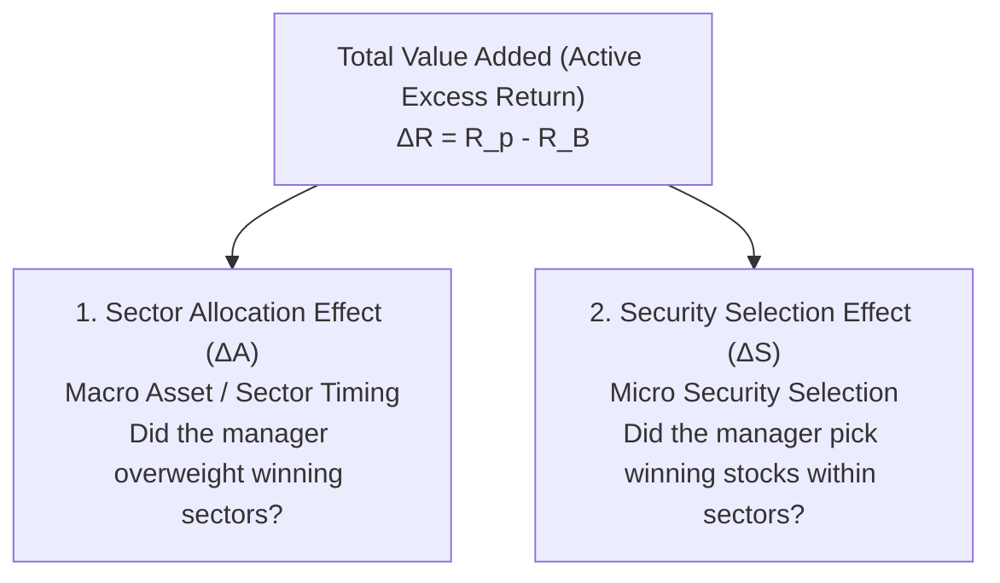

# APS1051: Comprehensive Session 1 Study Notes
**Course:** APS1051: Portfolio Management under Real Market Constraints  
**Institution:** University of Toronto | Master of Engineering (ELITE)  
**Instructors:** Sabatino Costanzo & Loren Trigo  
**Primary Source Material:** 
* `S1A PPPRESENTATIONS` (Presentations 0, 1, 2, and 3)
* `S1B COMMENTS TO THE PPP` (Instructor Transcripts, Blackboard Proofs & Caveats)
* `S1D MISCELLANEOUS` (Attribution Spreadsheets & Python Mini-Courses)

---

## Executive Overview & Conceptual Architecture

Session 1 establishes the mathematical and institutional foundation for **Portfolio and Manager Evaluation**. The core objective is to answer an essential institutional question: **Is a portfolio manager’s performance objectively good or bad? Does their excess return represent genuine investment skill, or is it merely an artifact of leveraged beta exposure and market drift?**

---

## Part 1: Course Roadmap & The Grand Architecture (PPP 0)
*Reference: `PPP 0 INTRODUCTION TO THE COURSE.pptx` (12 Slides) & `CLASS 1 COMMENTS ON PPP 0 2971.edited (1).docx`*

The instructors outline the entire course curriculum across 11 modules, contrasting textbook frictionless finance against real-world portfolio execution:

* **Module 1A (Basic Portfolio & Manager Evaluation):** Deconstructs risk-adjusted performance using Sharpe, Treynor, and Jensen's Alpha.
* **Module 1B (Advanced Attribution Analysis):** Decomposes active returns into macroeconomic sector allocation vs. micro security selection (Brinson model).
* **Module 2 (MPT Revived with Momentum):** Revitalizes Markowitz’s Mean-Variance Optimization by solving the 60-month mean-reversion trap via short 1–12 month momentum windows and long-only constraints (Keller et al. 2015).
* **Module 3 (Quantitative Efficient Frontier & Programming):** Rigorous mathematical derivations of the Efficient Frontier, Excel SolverTable, Markowitz's Critical Line Algorithm (CLA) for rank-deficient covariance matrices ($N > T$), and four production Python scripts.
* **Module 4 (Risk-Adjusted Momentum & Asset Allocation):** Tactical and dual momentum models, Defensive Asset Allocation (DAA), and crash-protection triggers.
* **Module 5 (Downside Risk & Asymmetric Volatility):** Moving beyond symmetric variance: semi-variance, Sortino Ratio, Omega Ratio, Maximum Drawdown (MDD), and Calmar ratios.
* **Module 6 (Real Market Constraints):** Short-selling bans, transaction costs, bid-ask slippage, illiquidity, borrowing constraints, and sample covariance matrix instability (shrinkage estimators, Ledoit-Wolf).
* **Module 7 (Automated Rotational Trading Systems):** Algorithmic backtesting engines across ETF asset universes.
* **Module 8 (Statistical Significance Testing):** Differentiating genuine alpha from luck and data-mining: Timmermann-Pesaran tests, Anatolyev-Gerko directional tests, and White’s Reality Check.
* **Module 9–11 (Tactical Options & Volatility Trading):** Asymmetric volatility overlays, trading weekly options on the S&P 500, and institutional straddles/strangles on 20-Year Treasuries (`TLT`) around Federal Open Market Committee (FOMC) interest rate announcements.

---

## Part 2: Basic Portfolio & Manager Evaluation Tools (PPP 1)
*Reference: `PPP 1 BASIC PORTF & MANAG EVAL.pptx` (44 Slides) & `XCLASS 1 COMMENTS ON PPP 1 3688.edited.docx`*

When evaluating a portfolio, absolute return alone is meaningless. An 18% return in an asset with extreme leverage can be vastly inferior to a 12% return in a low-volatility portfolio. Returns must be evaluated **per unit of risk assumed**.

---

### 2.1 The Treynor Ratio ($T_p$)
Introduced by Jack Treynor (1965), this metric evaluates the excess return generated per unit of **systematic (market) risk**:

$$T_p = \frac{R_p - R_f}{\beta_p}$$

* **Risk Metric Used:** $\beta_p$ (Beta), measuring the portfolio's relative co-movement with the aggregate market portfolio:
  $$\beta_p = \frac{\text{Cov}(R_p, R_m)}{\text{Var}(R_m)} = \sum_{i=1}^N w_i \beta_i$$
* **Fundamental Assumption:** The Treynor Ratio assumes that the investor already holds a **well-diversified master portfolio**, meaning that unsystematic (firm-specific) risk has been eliminated through diversification.
* **When to Apply:** Ideal for comparing **diversified sub-portfolios, specialized asset classes, or multi-manager funds** within an investor's broad asset pool.
* **Instructor Example (Slides 7–10):** Comparing Manager A ($R_A = 14\%, \beta_A = 1.2$) vs. Manager B ($R_B = 11\%, \beta_B = 0.8$) at $R_f = 3\%$:
  $$T_A = \frac{14 - 3}{1.2} = \frac{11}{1.2} = 9.17\%$$
  $$T_B = \frac{11 - 3}{0.8} = \frac{8}{0.8} = 10.00\%$$
  *Manager B is superior*: Manager B generated 10% excess return per unit of market sensitivity, outperforming Manager A despite Manager A having a higher absolute return.

---

### 2.2 The Sharpe Ratio ($S_p$)
Introduced by William Sharpe (1966), this metric measures excess returns per unit of **total risk**:

$$S_p = \frac{R_p - R_f}{\sigma_p}$$

* **Risk Metric Used:** $\sigma_p$ (Standard Deviation), measuring total dispersion of returns (both systematic market volatility and unsystematic idiosyncratic risk).
* **Fundamental Assumption:** Evaluates a **standalone portfolio** that represents the entirety (or dominant portion) of an investor’s wealth.
* **Why Sharpe and Treynor Rankings Diverge (Instructor Commentary, Slide 23):**
  * If a manager holds a concentrated portfolio with heavy single-stock exposure, the portfolio will suffer from large idiosyncratic volatility ($\sigma_p$).
  * The **Sharpe Ratio penalizes the manager for this specific risk** in the denominator.
  * The **Treynor Ratio completely ignores this risk** because it only measures market co-movement ($\beta$).
  * Therefore, Treynor should only be used by investors with already diversified holdings.

---

### 2.3 Jensen’s Alpha ($\alpha_p$)
Developed by Michael Jensen (1968), Alpha determines whether a manager added genuine value above the required benchmark return dictated by the Capital Asset Pricing Model (CAPM):

$$\alpha_p = R_p - E[R_p]$$
$$E[R_p] = R_f + \beta_p (R_m - R_f)$$
$$\alpha_p = R_p - [R_f + \beta_p(R_m - R_f)]$$

* **The Core Mechanism:** Jensen's Alpha is not a simple quotient. It isolates whether the success or failure of a portfolio was due to the manager's active skill or merely the general rise or fall of the macro market.
* **Interpretation:**
  * $\alpha_p > 0$: The manager generated abnormal returns above the Security Market Line (SML). Value was added!
  * $\alpha_p = 0$: Returns exactly matched CAPM expectations. The manager added zero alpha; returns were driven purely by passive market drift.
  * $\alpha_p < 0$: The manager underperformed expectations given the risk assumed.

---

### 2.4 Total Risk Decomposition: Systematic vs. Unsystematic Risk (Slides 37–43)

$$\mathbf{\text{Total Risk } (\sigma_p^2) = \text{Systematic Risk } (\beta_p^2 \sigma_m^2) + \text{Unsystematic Risk } (\sigma_{\epsilon}^2)}$$

* **Instructor Emphases (Slides 42–43):**
  * **Systematic Risk:** Also known as *Market Risk*, *Non-Diversifiable Risk*, or *Global Risk*. It affects all assets simultaneously (e.g., inflation shocks, interest rate hikes, geopolitical war).
  * **Unsystematic Risk:** Also known as *Specific Risk*, *Security Risk*, *Diversifiable Risk*, or *Residual Risk*. It affects only individual companies (e.g., product recall, CEO fraud, patent loss).
  * **Beta’s Nature:** Beta is a measure of **relative co-movement with the market**, not a complete measure of risk.

---

## Part 3: In-Depth Interpretations & Advanced Review (PPP 2)
*Reference: `PPP 2 HELPFUL SUMMARIZED COMMENTS .pptx` (25 Slides) & `XCLASS 1 COMMENTS ON PPP 2 1805.edited.docx`*

Presentation 2 addresses critical practical nuances that professional quants face when interpreting risk metrics:

### 3.1 Alpha vs. Beta: Skill vs. Natural Leverage (Slides 8–11, 24–25)
* **Beta as Leverage:** Beta acts as mechanical leverage. If a manager holds a high-beta portfolio ($\beta = 1.8$) during a roaring bull market, the portfolio will surge with added boost. However, this is **not skill**—it is simply leveraged exposure. When the market plunges, the high-beta portfolio collapses symmetrically with the same added boost!
* **Alpha as Pure Value-Add:** Alpha measures the portion of return that is entirely independent of market direction.
* **The Master Selection Rules (Slides 9 & 25):**
  * **To Maximize Returns with MINIMAL Risk:** Look for a **LOW BETA portfolio** managed by a manager with a **HIGH ALPHA track record**.
  * **To Maximize Returns at ALL COSTS in a Bull Market:** Select a **HIGH BETA portfolio** managed by a manager with a **HIGH ALPHA track record**.

---

### 3.2 The Sharpe Ratio vs. The Information Ratio ($IR$) (Slides 14–15)
* **Sharpe Ratio:** Measures risk-adjusted return relative to cash ($R_f$) per unit of **total absolute standard deviation** ($\sigma_p$). It indirectly benchmarks against the market by asking whether the portfolio beats cash better than the S&P 500 beats cash.
* **Information Ratio ($IR$):** Directly compares an active portfolio’s performance against a **mandated benchmark index** ($R_B$, e.g., Bloomberg Aggregate Bond Index, Russell 2000, or a specialized commodity index):
  $$IR = \frac{R_p - R_B}{\text{Tracking Error}} = \frac{R_p - R_B}{\sigma_{(R_p - R_B)}}$$
* **Why Use the Information Ratio?** Institutional pension funds and endowments hire active managers to beat specific benchmarks. The Information Ratio measures the **consistency of active outperformance** per unit of active deviation risk.

---

### 3.3 What is Considered a "Good" Sharpe Ratio? (Slides 18–19)
* **Canadian Securities Institute (CSI) Academic Benchmarks:**
  * $S \ge 1.0$: Considered **Good**
  * $S \ge 2.0$: Rated as **Very Good**
  * $S \ge 3.0$: Considered **Excellent**
* **Instructor Real-World Reality Check (Slide 19 Comments):** In actual long-term market practice, finding an unhedged long-only portfolio with a Sharpe Ratio greater than **1.0** over full market cycles is exceptionally rare. A long-term Sharpe of 1.0 is considered institutional-grade excellence.

---

### 3.4 Stock Alpha vs. Portfolio Manager Alpha (Slides 20–23)
* **Stock Alpha:** A circumstantial, descriptive metric indicating whether a single security exceeded its CAPM hurdle rate over a specific historical window.
* **Portfolio Manager Alpha:** A longitudinal, structural metric associated with the **manager’s multi-year personal track record across diverse client portfolios and varying market regimes**.
* **Does Negative Alpha Automatically Mean "Sell"? (Slides 22–23):**
  * **No!** A circumstantial low or negative alpha over a short horizon (e.g., one quarter) does not prove the security is overvalued or that the manager has lost their edge.
  * A risk-neutral or risk-tolerant investor may hold through temporary underperformance, while a highly risk-averse investor may treat it as a signal to reallocate.

---

## Part 4: Advanced Performance Attribution: The Brinson Framework (PPP 3)
*Reference: `PPP 3 ADVANCED PORTF & MANAG EVAL.pptx` (35 Slides), `XCLASS 1 COMMENTS ON PPP 3 2896.edited.docx`, and `S1D Spreadsheet`*

When an active portfolio outperforms its benchmark ($R_p - R_B > 0$), how did the manager achieve it? Did they outguess macroeconomic sector cycles, or did they pick superior individual stocks within sectors? The **Brinson-Hood-Beebower (BHB)** model mathematically decomposes active returns.

---

### 4.1 Mathematical Formulations

#### 1. Total Active Excess Return
$$\Delta R = R_p - R_B$$
Where:
* $R_p = \sum_{i=1}^N w_{p,i} R_{p,i}$ (Portfolio Total Return)
* $R_B = \sum_{i=1}^N w_{B,i} R_{B,i}$ (Benchmark Total Return)

#### 2. Sector Allocation Effect ($\Delta A$)
Measures the manager’s ability to allocate capital across sectors (Macro Timing). It quantifies the return from over-weighting outperforming sectors and under-weighting lagging sectors relative to the benchmark:

$$\Delta A_i = (w_{p,i} - w_{B,i}) \times (R_{B,i} - R_B)$$

$$\mathbf{\text{Total Allocation Effect} = \sum_{i=1}^N \Delta A_i = \sum_{i=1}^N (w_{p,i} - w_{B,i})(R_{B,i} - R_B)}$$

* **Logic:** If sector $i$ outperformed the broad benchmark ($R_{B,i} > R_B$) and the manager over-weighted it ($w_{p,i} > w_{B,i}$), $\Delta A_i$ is positive.

#### 3. Security Selection Effect ($\Delta S$)
Measures the manager’s ability to select superior individual securities within each sector (Micro Picking):

$$\Delta S_i = w_{p,i} \times (R_{p,i} - R_{B,i})$$

$$\mathbf{\text{Total Selection Effect} = \sum_{i=1}^N \Delta S_i = \sum_{i=1}^N w_{p,i}(R_{p,i} - R_{B,i})}$$

* **Logic:** If the manager’s stock picks within sector $i$ beat the sector benchmark ($R_{p,i} > R_{B,i}$), $\Delta S_i$ is positive in proportion to the portfolio weight invested in that sector.

#### 4. The Value-Added Identity
$$\mathbf{\Delta R = \text{Total Allocation Effect} + \text{Total Selection Effect} = \sum_{i=1}^N \Delta A_i + \sum_{i=1}^N \Delta S_i = R_p - R_B}$$

---

### 4.2 Comprehensive Case Study Walkthrough (Course Example)
The course analyzes a multi-asset fund holding **Equities, Bonds, and Cash** against a benchmark:

#### Given Market Data (Slides 27–29):
| Asset Class / Sector | Portfolio Weight ($w_{p,i}$) | Benchmark Weight ($w_{B,i}$) | Portfolio Return ($R_{p,i}$) | Benchmark Return ($R_{B,i}$) |
| :--- | :---: | :---: | :---: | :---: |
| **Equities** | $0.50$ ($50\%$) | $0.60$ ($60\%$) | $9.70\%$ | $8.60\%$ |
| **Bonds** | $0.38$ ($38\%$) | $0.30$ ($30\%$) | $9.10\%$ | $9.20\%$ |
| **Cash** | $0.12$ ($12\%$) | $0.10$ ($10\%$) | $5.60\%$ | $5.40\%$ |
| **Total** | **$1.00$ ($100\%$)** | **$1.00$ ($100\%$)** | **$R_p = 8.98\%$** | **$R_B = 8.46\%$** |

#### Step 1: Compute Overall Portfolio and Benchmark Returns
$$R_p = (0.50 \times 9.7\%) + (0.38 \times 9.1\%) + (0.12 \times 5.6\%) = 4.85\% + 3.458\% + 0.672\% = \mathbf{8.98\%}$$
$$R_B = (0.60 \times 8.6\%) + (0.30 \times 9.2\%) + (0.10 \times 5.4\%) = 5.16\% + 2.76\% + 0.54\% = \mathbf{8.46\%}$$
$$\Delta R = R_p - R_B = 8.98\% - 8.46\% = \mathbf{+0.52\% \text{ (+52 bps)}}$$

#### Step 2: Calculate Sector Allocation Effects ($\Delta A_i$)
* **Equities:** $(0.50 - 0.60) \times (8.60\% - 8.46\%) = (-0.10) \times (+0.14\%) = \mathbf{-0.014\%}$
* **Bonds:** $(0.38 - 0.30) \times (9.20\% - 8.46\%) = (+0.08) \times (+0.74\%) = \mathbf{+0.0592\%}$
* **Cash:** $(0.12 - 0.10) \times (5.40\% - 8.46\%) = (+0.02) \times (-3.06\%) = \mathbf{-0.0612\%}$
* **Total Allocation Effect:**
  $$\Delta A = -0.014\% + 0.0592\% - 0.0612\% = \mathbf{-0.016\% \approx -0.02\% \text{ (-2 bps)}}$$

#### Step 3: Calculate Security Selection Effects ($\Delta S_i$)
* **Equities:** $0.50 \times (9.70\% - 8.60\%) = 0.50 \times (+1.10\%) = \mathbf{+0.550\%}$
* **Bonds:** $0.38 \times (9.10\% - 9.20\%) = 0.38 \times (-0.10\%) = \mathbf{-0.038\%}$
* **Cash:** $0.12 \times (5.60\% - 5.40\%) = 0.12 \times (+0.20\%) = \mathbf{+0.024\%}$
* **Total Selection Effect:**
  $$\Delta S = +0.550\% - 0.038\% + 0.024\% = \mathbf{+0.536\% \approx +0.54\% \text{ (+54 bps)}}$$

#### Step 4: Verification and Final Manager Diagnosis (Slide 35)
$$\Delta R = \text{Allocation Effect} + \text{Selection Effect} = -0.02\% + 0.54\% = \mathbf{+0.52\% \text{ (+52 bps)}}$$

> **INSTRUCTOR DIAGNOSIS (Slide 35 Commentary):**  
> *"Through this ingenious calculation, we determine not only that the manager added value (+52 bps), but also that his criteria for selecting individual securities was much better than his criteria for selecting market sectors. 100% of his outperformance was driven by superior stock picking (+54 bps), whereas his sector timing was even slightly detrimental (-2 bps) to performance!"*

---

## Part 5: Session 1 Exercises Checklist & Summary

Session 1 deliverables consist strictly of **12 Session Exercises** across the four comment files in `S1B`, compiled into **one Word document** (`FirstName.LastName.docx`):

### 1. From `CLASS 1 COMMENTS ON PPP 0` (Roadmap)
* **Exercise 1 (Slide 4):** Summarize course structure, Module 1A/1B evaluation, and Module 2/3 MPT momentum revival.
* **Exercise 2 (Slide 8):** Summarize Modules 4–7: downside risk (Sortino/Omega), real market constraints, and rotational trading backtests.
* **Exercise 3 (Slide 12):** Summarize Modules 8–11: statistical significance tests (Timmermann-Pesaran, White's Reality Check) and tactical options hedging around FOMC.

### 2. From `XCLASS 1 COMMENTS ON PPP 1` (Basic Evaluation)
* **Exercise 4 (Slide 10):** Treynor Ratio definition, formula, systematic risk beta denominator, and manager ranking.
* **Exercise 5 (Slide 23):** Sharpe Ratio definition, total volatility sigma denominator, and why Sharpe assumes a standalone portfolio.
* **Exercise 6 (Slide 43):** Jensen’s Alpha formula, CAPM benchmark expected returns, and decomposing total risk into systematic vs. unsystematic.

### 3. From `XCLASS 1 COMMENTS ON PPP 2` (Review & Caveats)
* **Exercise 7 (Slide 7):** Synthesis of Treynor vs. Sharpe vs. Jensen’s Alpha.
* **Exercise 8 (Slide 15):** Alpha vs. Beta dynamics (skill vs. leverage) and Sharpe vs. Information Ratio ($IR$).
* **Exercise 9 (Slide 25):** CSI Sharpe benchmarks ($>1, >2, >3$), Stock Alpha vs. Manager Track Record, and whether negative alpha warrants an immediate sell.

### 4. From `XCLASS 1 COMMENTS ON PPP 3` (Attribution)
* **Exercise 10 (Slide 7):** How managers add value: macro sector allocation vs. micro stock selection.
* **Exercise 11 (Slide 17):** Step-by-step mathematical algorithms for computing Sector Allocation and Security Selection effects.
* **Exercise 12 (Slide 35):** Numerical results of the 3-asset case study: verifying the +52 bps excess return breakdown (-2 bps allocation, +54 bps selection).

---

## Master Comparison Table for Session 1

| Metric / Concept | Mathematical Formula | Risk Proxy Used | When to Use / Key Caveat |
| :--- | :--- | :--- | :--- |
| **Sharpe Ratio ($S_p$)** | $\frac{R_p - R_f}{\sigma_p}$ | Total Volatility ($\sigma_p$) | Complete, standalone portfolios representing total wealth. Penalizes idiosyncratic volatility. |
| **Treynor Ratio ($T_p$)** | $\frac{R_p - R_f}{\beta_p}$ | Systematic Risk ($\beta_p$) | Diversified sub-portfolios in a larger fund. Completely ignores unsystematic firm risk. |
| **Jensen's Alpha ($\alpha_p$)** | $R_p - [R_f + \beta_p(R_m - R_f)]$ | Systematic Beta ($\beta_p$) | Isolating true manager skill and abnormal excess return above CAPM market drift. |
| **Information Ratio ($IR$)** | $\frac{R_p - R_B}{\sigma_{(R_p - R_B)}}$ | Active Tracking Error | Evaluating active institutional managers against a specific mandated benchmark index ($R_B$). |
| **Allocation Effect ($\Delta A_i$)** | $(w_{p,i} - w_{B,i})(R_{B,i} - R_B)$ | Benchmark Relative Return | Measures macroeconomic sector and asset-class weighting skill (Macro Timing). |
| **Selection Effect ($\Delta S_i$)** | $w_{p,i}(R_{p,i} - R_{B,i})$ | Sector Relative Return | Measures micro stock and bond picking skill within individual sectors (Micro Picking). |
