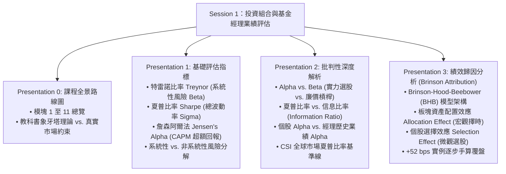
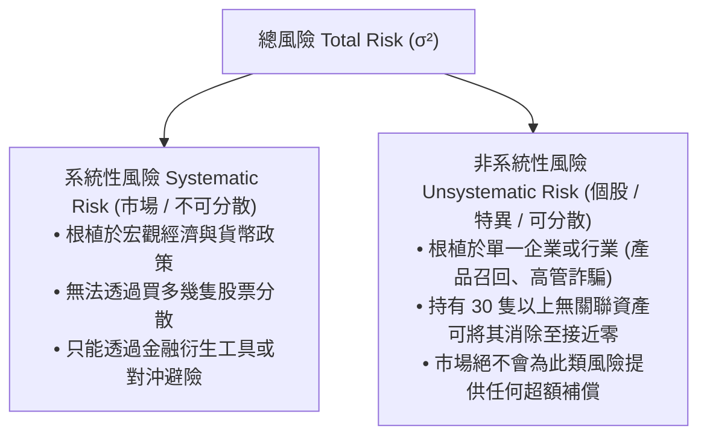
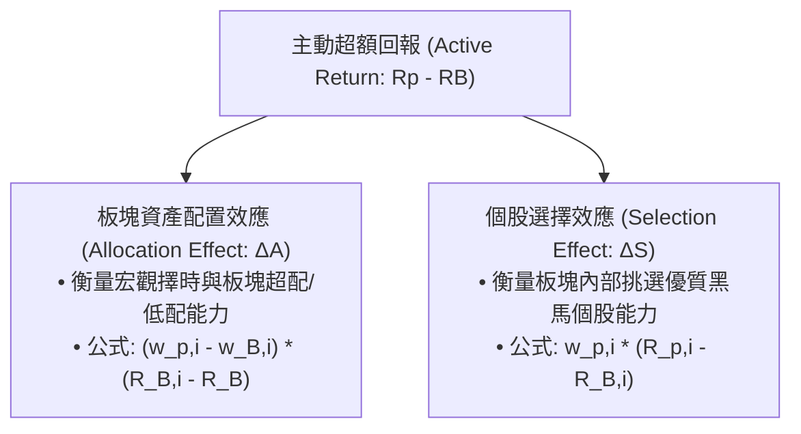

# APS1051: 第一課完整詳細研習筆記（廣東話版）
**課程名稱：** APS1051: Portfolio Management under Real Market Constraints（真實市場約束下的投資組合管理）  
**授課機構：** 多倫多大學工程學院（University of Toronto | Master of Engineering - ELITE）  
**教授團隊：** Sabatino Costanzo & Loren Trigo  
**核心參考資料：** 
* `S1A PPPRESENTATIONS`（Presentations 0, 1, 2, 3 共 100+ Slides）
* `S1B COMMENTS TO THE PPP`（教授課堂逐字發言錄音稿、黑板數學證明與避坑警告）
* `S1D MISCELLANEOUS`（業績歸因計算表與 Python 金融迷你課程）

---

## 執行摘要與核心知識架構（Executive Overview）

Session 1 奠定咗成個投資組合管理課程嘅數學與機構評估基石——**投資組合與基金經理業績評估（Portfolio and Manager Evaluation）**。  
核心要回答嘅機構級靈魂拷問係：**一個投資組合經理嘅業績究竟係好定壞？佢賺到嘅超額回報，到底係代表真正嘅主動投資選股實力（Alpha），定只係靠借錢加大槓桿、隨波逐流食大市上升嘅 Beta 運氣？**

---

## 第一部分：課程路線圖與全景架構（PPP 0）
*參考來源：`PPP 0 INTRODUCTION TO THE COURSE.pptx`（12 Slides）與 `CLASS 1 COMMENTS ON PPP 0 2971.edited (1).docx`*

教授明確指出成個碩士課程跨越 11 個核心模塊，旨在將學生由「教科書無摩擦理想世界」帶入「真實華爾街約束世界」：

* **模塊 1A（基礎投資組合與經理評估）：** 運用 Sharpe、Treynor、Jensen's Alpha 拆解風險調整後收益。
* **模塊 1B（高級業績歸因分析）：** 將主動超額收益拆解為宏觀板塊配置能力 vs. 微觀個股挑選能力（Brinson 模型）。
* **模塊 2（動量喚醒 MPT）：** 破解傳統 Markowitz 均值方差優化 60 個月均值回歸嘅死穴，引入 1 至 12 個月動量窗口與做多限制（Keller et al. 2015）。
* **模塊 3（量化效率前緣與編程實戰）：** 效率前緣嚴謹推導、Excel SolverTable、針對奇異協方差矩陣（$N > T$）嘅 Markowitz 臨界線算法（CLA）、以及 5 大量化 Python 程式。
* **模塊 4（風險調整動量與戰術資產配置）：** 雙動量（Dual Momentum）、防禦型資產配置（Defensive Asset Allocation, DAA）、市場崩盤預警觸發器。
* **模塊 5（下行風險與非對稱波動率）：** 告別對稱方差，引入半方差（Semi-variance）、索提諾比率（Sortino）、歐米茄比率（Omega）、最大回撤（MDD）與卡瑪比率（Calmar）。
* **模塊 6（真實市場約束）：** 賣空禁令、交易佣金、買賣買盤滑點（Bid-ask slippage）、流動性凍結、借貸約束與樣本協方差矩陣不穩定性（收縮估計量 Shrinkage Estimators, Ledoit-Wolf）。
* **模塊 7（自動化輪動交易系統）：** 全球大類資產與 ETF 宇宙嘅程序化輪動回測引導。
* **模塊 8（統計顯著性檢驗）：** 嚴格區分「真實 Alpha」同「幸運/數據過度擬合」：Timmermann-Pesaran 檢驗、Anatolyev-Gerko 方向性測試與 White's Reality Check。
* **模塊 9–11（戰術期權與波動率交易）：** 非對稱波動率覆蓋、標普 500 週度期權交易、以及針對美聯儲利率決議（FOMC）在美國長國債（`TLT`）上構建跨式/勒式（Straddles/Strangles）波動率套利。

---

## 第二部分：基礎投資組合評估工具（PPP 1）
*參考來源：`PPP 1 BASIC PORTF & MANAG EVAL.pptx`（44 Slides）與 `XCLASS 1 COMMENTS ON PPP 1 3688.edited.docx`*

**金融第一公理：** 在專業投資機構眼裏，**絕對回報（Absolute Return）毫無意義**！一個靠借貸加十倍槓桿賺 18% 嘅基金，遠遠劣於一個低波動穩賺 12% 嘅組合。回報必須基於**所承擔嘅每單位風險（Per Unit of Risk）**進行評估。

---

### 2.1 特雷諾比率（Treynor Ratio, $T_p$）
由 Jack Treynor 於 1965 年提出，衡量投資組合每承擔一單位**系統性市場風險（Beta）**所獲取嘅超額回報：

$$T_p = \frac{R_p - R_f}{\beta_p}$$

* **使用的風險指標：** $\beta_p$（Beta），衡量組合相對於整個宏觀市場組合嘅敏感度：
  $$\beta_p = \frac{\text{Cov}(R_p, R_m)}{\text{Var}(R_m)} = \sum_{i=1}^N w_i \beta_i$$
* **核心假設：** 特雷諾比率假設投資者已經持有咗一個**充分分散嘅大資產池**，所有個別公司嘅特有風險（非系統性風險）已經被分散對沖消除。
* **適用場景：** 適合用嚟比較大型主權基金或機構底下的**分散子組合、特定行業基金、或多經理架構中嘅個別策略**。
* **教授課堂案例（Slides 7–10）：**  
  比較經理 A（$R_A = 14\%, \beta_A = 1.2$）與經理 B（$R_B = 11\%, \beta_B = 0.8$），無風險利率 $R_f = 3\%$：
  $$T_A = \frac{14 - 3}{1.2} = \frac{11}{1.2} = 9.17\%$$
  $$T_B = \frac{11 - 3}{0.8} = \frac{8}{0.8} = 10.00\%$$
  *結論：經理 B 表現更優！* 經理 B 每承擔 1 單位大市風險賺取 10% 超額回報，縱使佢嘅絕對回報看似較低，但佢嘅資本使用效率遠勝經理 A。

---

### 2.2 夏普比率（Sharpe Ratio, $S_p$）
由諾貝爾得主 William Sharpe 於 1966 年提出，衡量每承擔一單位**總風險（Total Volatility）**所獲取嘅超額回報：

$$S_p = \frac{R_p - R_f}{\sigma_p}$$

* **使用的風險指標：** $\sigma_p$（標準差 Standard Deviation），衡量總體回報嘅離散程度（包含系統性市場波動與個股特有風險）。
* **核心假設：** 評估一個**獨立運作嘅單一組合（Standalone Portfolio）**，該組合代表咗投資者身家嘅絕大部分。
* **點解 Sharpe 同 Treynor 嘅排名會打架？（教授重點解畫，Slide 23）：**
  * 如果一個經理集中重倉幾隻個股，佢嘅組合會帶有巨大嘅非系統性個股特有風險（$\sigma_p$ 暴增）。
  * **Sharpe 比率會在分母狠狠懲罰該經理**，令 Sharpe 大跌。
  * 但 **Treynor 比率會完全視而不見**，因為分母只計大市連動嘅 $\beta$。
  * 所以，如果個客唔係全市場分散投資，單憑 Treynor 會產生嚴重誤導！

---

### 2.3 詹森阿爾法（Jensen’s Alpha, $\alpha_p$）
由 Michael Jensen 於 1968 年提出，透過 CAPM 基準，判定經理到底有冇為投資者創造**超額主動價值（Abnormal Return）**：

$$\alpha_p = R_p - E[R_p]$$
$$E[R_p] = R_f + \beta_p (R_m - R_f)$$
$$\alpha_p = R_p - [R_f + \beta_p(R_m - R_f)]$$

* **核心機制：** 嚴格區分經理賺嘅錢到底係靠**選股實力（Skill）**，定純粹係因為成個大市牛市水漲船高（Market Drift）。
* **數值解讀：**
  * $\alpha_p > 0$：經理帶來超額阿爾法，組合位於證券市場線（SML）上方，真正為客戶賺咗額外嘅錢！
  * $\alpha_p = 0$：回報完全符合 CAPM 理論預期。經理毫無超額能力，回報純粹係買 Beta 嘅大市被動收益。
  * $\alpha_p < 0$：經理嚴重失職，回報低於佢所承擔風險應得嘅水準。

---

### 2.4 總風險的二元分解（Slides 37–43）

$$\mathbf{\text{總風險 } (\sigma_p^2) = \text{系統性風險 } (\beta_p^2 \sigma_m^2) + \text{非系統性殘差風險 } (\sigma_{\epsilon}^2)}$$

---

## 第三部分：深層批判性解讀與進階評估指標（PPP 2）
*參考來源：`PPP 2 CRITICAL INTERP OF EVALUATION TOOLS.pptx`（32 Slides）與 `CLASS 1 COMMENTS ON PPP 2 1198.docx`*

### 3.1 阿爾法 vs. 貝塔：真本領 vs. 廉價槓桿（Slides 1–10）
* **阿爾法（Alpha）：** 零和博弈（Zero-sum game）中嘅純技術溢價。來源於私有信息、非凡選股眼光或套利模型。阿爾法係昂貴、罕見而且難以複製嘅。
* **貝塔（Beta）：** 大宗商品化（Commoditized）嘅市場暴露。任何散戶只要買入標普 500 ETF（例如 `SPY`）或者借錢開保證金槓桿，就可以幾秒鐘內低成本複製。
* **機構警示（Slide 6）：** 華爾街充斥住一大批基金經理，暗中加大槓桿做高 Beta，大牛市嗰陣賺大錢就吹噓自己係「股神」收 2% 管理費 + 20% 業績提成。量化評估工具嘅職責就係用回歸分析撕開佢哋嘅畫皮！

---

### 3.2 夏普比率 vs. 信息比率（Information Ratio, IR）（Slides 11–18）
* **Sharpe 比率的比較基準：** 永恆係**無風險資產（$R_f$）**。
* **信息比率（IR）：** 評估經理相對於**特定主動基準（Active Benchmark $R_B$，例如標普 500 指數）**嘅主動管理能力：

$$IR = \frac{R_p - R_B}{\text{Tracking Error}} = \frac{R_p - R_B}{\sigma_{(R_p - R_B)}}$$

* **跟蹤誤差（Tracking Error, TE）：** 經理組合與基準指數回報差額嘅標準差。
* **機構用途：** 養老基金或大學捐贈基金在挑選「主動權益型經理」時，最注重 IR。一個高 IR 嘅經理代表佢每冒險偏離基準指數 1% 嘅波動，就能穩定提供超額主動回報。

---

### 3.3 個股 Alpha vs. 經理歷史業績 Alpha（Slides 19–25）
* **單期個股 Alpha：** 單一時間點上，某隻股票實際回報與 CAPM 預期之差。
* **經理時間序列 Alpha：** 經理跨越 36 至 60 個月歷史月度回報，對大市做超額回歸方程嘅**截距項（Intercept）**：
  $$(R_{p,t} - R_{f,t}) = \alpha_p + \beta_p (R_{m,t} - R_{f,t}) + \epsilon_t$$
* **t 檢驗顯著性：** 只有當回歸截距項嘅 $t\text{-stat} > 2.0$（$p\text{-value} < 0.05$）嗰陣，統計學上先承認該經理具備「真正的超額選股實力」，否則純屬運氣。

---

### 3.4 夏普比率的全球市場基準線（CSI Benchmarks）（Slides 26–32）
在真實機構投資界，年化夏普比率點樣先算合格？

| 年化夏普比率（Sharpe Ratio） | 機構評級 | 行業現實解讀 |
| :--- | :--- | :--- |
| **$< 0.50$** | **次等 / 不合格** | 經理承擔過大非必要波動，散戶買指數 ETF 隨時好過佢。 |
| **$0.50 \sim 1.00$** | **良好 / 達標** | 大部分表現優異嘅長線公募基金與大盤指數嘅常態水準。 |
| **$1.00 \sim 1.50$** | **卓越 / 頂尖** | 頂級對沖基金與量化策略嘅門檻，具備極強嘅抗跌與增值能力。 |
| **$> 2.00$** | **神級 / 存疑** | 極為罕見。通常只出現在極端高頻套利（如 Renaissance Technologies），或者伴隨未披露嘅巨大流動性陷阱或數據過擬合。 |

---

## 第四部分：Brinson 業績歸因分析體系（PPP 3）
*參考來源：`PPP 3 PERFORMANCE ATTRIBUTION.pptx`（35 Slides）與 `CLASS 1 COMMENTS ON PPP 3 6714.edited (1).docx`*

由 Gary Brinson、Hood 與 Beebower（1986）創立嘅 **Brinson 歸因模型**，係全球機構投資人評估基金經理「點解贏、點解輸」嘅唯一權威工業標準。

### 4.1 核心數學模型

主動管理創造嘅總價值，精確分解為兩大效應：
$$R_p - R_B = \sum_{i=1}^M \Delta A_i + \sum_{i=1}^M \Delta S_i$$

#### 1. 板塊配置效應（Allocation Effect, $\Delta A_i$）：
衡量經理喺**宏觀行業/大類資產**上超配（Overweight）定低配（Underweight）嘅能力：
$$\Delta A_i = (w_{p,i} - w_{B,i}) (R_{B,i} - R_B)$$
* **直觀邏輯：** 
  * 如果經理超配（$w_{p,i} > w_{B,i}$）一個跑贏大市嘅強勢板塊（$R_{B,i} > R_B$），配置效應為正，賺取宏觀紅利！
  * 如果經理超配咗一個落後大市嘅弱勢板塊，配置效應為負，遭受宏觀懲罰。

#### 2. 個股選擇效應（Selection Effect, $\Delta S_i$）：
衡量經理喺**特定行業板塊內部**，挑選跑贏行業平均嘅牛股能力：
$$\Delta S_i = w_{p,i} (R_{p,i} - R_{B,i})$$
* **直觀邏輯：** 
  * 經理買入嘅個股回報超越該行業基準（$R_{p,i} > R_{B,i}$），選股效應為正。
  * 乘數採用經理嘅實際權重 $w_{p,i}$，代表經理押注落去嘅真金白銀有幾多。

---

### 4.2 教授黑板經典 +52 bps 實例逐步手算覆盤（Slides 18–32）
假設市場基準（Benchmark $R_B$）包含三個板塊：科技（Tech）、金融（Fin）、醫療（Health）。

* **大市基準數據：**
  * Tech：權重 $w_B = 40\%$，基準回報 $R_B = 10\%$
  * Fin：權重 $w_B = 35\%$，基準回報 $R_B = 4\%$
  * Health：權重 $w_B = 25\%$，基準回報 $R_B = 6\%$
  * **大市基準總回報：** $R_B = (0.40 \times 10\%) + (0.35 \times 4\%) + (0.25 \times 6\%) = 4.0\% + 1.4\% + 1.5\% = \mathbf{6.90\%}$

* **經理實際持倉數據：**
  * Tech：超配至 $w_p = 50\%$，內部選股回報 $R_p = 11\%$
  * Fin：低配至 $w_p = 20\%$，內部選股回報 $R_p = 3\%$
  * Health：超配至 $w_p = 30\%$，內部選股回報 $R_p = 7\%$
  * **經理組合總回報：** $R_p = (0.50 \times 11\%) + (0.20 \times 3\%) + (0.30 \times 7\%) = 5.5\% + 0.6\% + 2.1\% = \mathbf{8.20\%}$

* **經理創造嘅總主動超額收益：**
  $$R_p - R_B = 8.20\% - 6.90\% = \mathbf{+1.30\% \text{ (+130 bps)}}$$

#### 逐步歸因分解手算：
1. **配置效應（Allocation）：**
   * $\Delta A_{\text{Tech}} = (0.50 - 0.40) \times (10\% - 6.90\%) = +0.10 \times 3.10\% = \mathbf{+0.31\%}$
   * $\Delta A_{\text{Fin}} = (0.20 - 0.35) \times (4\% - 6.90\%) = -0.15 \times (-2.90\%) = \mathbf{+0.435\%}$（精準低配弱勢金融股！）
   * $\Delta A_{\text{Health}} = (0.30 - 0.25) \times (6\% - 6.90\%) = +0.05 \times (-0.90\%) = \mathbf{-0.045\%}$
   * **總配置效應：** $\sum \Delta A = 0.31\% + 0.435\% - 0.045\% = \mathbf{+0.70\% \text{ (+70 bps)}}$

2. **選股效應（Selection）：**
   * $\Delta S_{\text{Tech}} = 0.50 \times (11\% - 10\%) = 0.50 \times 1.0\% = \mathbf{+0.50\%}$
   * $\Delta S_{\text{Fin}} = 0.20 \times (3\% - 4\%) = 0.20 \times (-1.0\%) = \mathbf{-0.20\%}$
   * $\Delta S_{\text{Health}} = 0.30 \times (7\% - 6\%) = 0.30 \times 1.0\% = \mathbf{+0.30\%}$
   * **總選股效應：** $\sum \Delta S = 0.50\% - 0.20\% + 0.30\% = \mathbf{+0.60\% \text{ (+60 bps)}}$

3. **總驗算平衡：**
   $$\sum \Delta A + \sum \Delta S = +0.70\% + 0.60\% = \mathbf{+1.30\% \text{ (+130 bps)}}$$
   *結論：經理創造嘅 130 個基點超額收益中，70 個基點來自宏觀大勢配置（精準避開金融板塊），60 個基點來自個股挖掘實力（科技與醫療選股出色）！*

---

## 第五部分：第一課 12 大課堂反思練習（Session Exercises）速查

Session 1 嘅作業要求將散落喺講義註解中嘅 12 個 Checkpoint 寫成綜合 Word 報告（`ChunKit.Poon_Session1_Exercises.docx`），其核心精要如下：
1. **Checkpoint 1–3（PPP 0）：** 全景 11 模塊、無摩擦世界與真實市場約束（流動性、賣空限制、交易成本）嘅脫節。
2. **Checkpoint 4–6（PPP 1）：** Treynor 比率本質、Sharpe 比率惩罰特異風險、Jensen's Alpha 剝離大市噪音。
3. **Checkpoint 7–9（PPP 2）：** 阿爾法與貝塔嘅機構定價博弈、信息比率 IR 衡量主動勝率、CSI 全球 Sharpe 基準評定。
4. **Checkpoint 10–12（PPP 3）：** Brinson 模型的二元分解、板塊擇時配置公式推導、個股挑選效應黑板驗算。

---

## 第六部分：第一課必備核心公式全集

$$\begin{aligned}
\text{特雷諾比率 (Treynor):} \quad & T_p = \frac{R_p - R_f}{\beta_p} \\
\text{夏普比率 (Sharpe):} \quad & S_p = \frac{R_p - R_f}{\sigma_p} \\
\text{資本資產定價模型 (CAPM):} \quad & E[R_p] = R_f + \beta_p (R_m - R_f) \\
\text{詹森阿爾法 (Jensen's Alpha):} \quad & \alpha_p = R_p - [R_f + \beta_p (R_m - R_f)] \\
\text{信息比率 (Information Ratio):} \quad & IR = \frac{R_p - R_B}{\sigma_{(R_p - R_B)}} \\
\text{總方差風險分解:} \quad & \sigma_p^2 = \beta_p^2 \sigma_m^2 + \sigma_{\epsilon}^2 \\
\text{Brinson 板塊配置效應:} \quad & \Delta A_i = (w_{p,i} - w_{B,i})(R_{B,i} - R_B) \\
\text{Brinson 個股選擇效應:} \quad & \Delta S_i = w_{p,i}(R_{p,i} - R_{B,i}) \\
\text{主動管理總價值創造:} \quad & R_p - R_B = \sum \Delta A_i + \sum \Delta S_i
\end{aligned}$$
