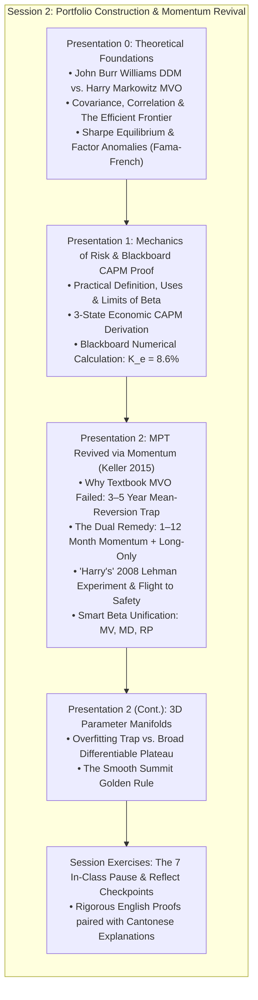

# APS1051: Session 2 Bilingual Study Notes
# 第二課雙語研習筆記：現代投資組合理論與動量全面復興 (Modern Portfolio Theory Revived with Momentum)

**Course / 課程：** APS1051: Portfolio Management under Real Market Constraints（真實市場約束下的投資組合管理）  
**Institution / 機構：** University of Toronto | Master of Engineering (ELITE Program)  
**Instructors / 教授：** Sabatino Costanzo & Loren Trigo  
**Student / 學生：** ChunKit Poon（潘俊傑）  
**Primary Source Materials / 核心教學材料：**
* `S2A CLASS 2 PPP PRESENTATIONS UPDT` (137 Slides across Presentations 0, 1, and 2)
* `S2BX CLASS 2 COMMENTS TO PPP` (Instructor Transcripts, Blackboard Proofs & Caveats)
* `S2D CLASS 2 MISCELLANEOUS` (Keller, Butler, Kipnis 2015 Research Paper)
* `FirstName.LastName_Session2_Analytical_Essay.docx` (Keller Paper Analytic Essay)
* `Session_2_Checkpoints_Cantonese.md` (The 7 In-Class Checkpoints)
**Format Structure / 格式規範：** Rigorous English technical paragraphs paired with immediate Cantonese intuition, real-world commentary, and annotations (極致嚴謹英文量化推導，緊密穿插地道廣東話實戰導讀與直覺註解).

---

## Executive Overview & Architectural Roadmap (Session 2)
## 第二課核心知識全景路線圖



---

## 2.1 The Genesis of Modern Portfolio Theory vs. Williams's DDM (CL 2 PPP 0)

### English Technical Foundation:
Prior to 1952, mainstream investment management lacked any formal mathematical formulation of investment risk. John Burr Williams (1938) established the foundational framework of equity valuation in *The Theory of Investment Value*, postulating that the intrinsic price of any common stock equals the discounted present value of its future dividend stream ($P_0 = \sum D_t / (1+k)^t$). Harry Markowitz observed the catastrophic flaw in strictly applying Williams’s paradigm: a rational investor seeking to maximize discounted return would calculate expected returns across all eligible securities and invest **100% of wealth into the single highest-yielding security**. This logic completely fails to capture institutional behavior, which instinctively demands diversification to avert catastrophic firm-specific bankruptcy. Influenced by James Uspensky’s *Introduction to Probability*, Markowitz (1952) established that rational investors optimize over the joint distribution of returns, formalizing risk mathematically as portfolio variance governed primarily by **pairwise covariance and correlation**:
$$\sigma_p^2 = \sum_{i=1}^n w_i^2 \sigma_i^2 + \sum_{i=1}^n \sum_{j \ne i}^n w_i w_j \sigma_{ij}, \quad \text{Cov}(R_i, R_j) = \rho_{ij} \sigma_i \sigma_j$$

In the instructor's core example (Singapore Retail vs. Brazil Healthcare), two highly volatile assets in isolation exhibit near-zero macroeconomic correlation ($\rho \approx 0$). When combined, their independent idiosyncratic variances cancel out, generating a blended portfolio with aggregate risk substantially lower than either standalone asset. Plotted in $(\sigma, E[R])$ space, all feasible portfolios form the **Markowitz Bullet**, whose upper convex boundary represents the **Efficient Frontier** (maximum return for a given risk, or minimum risk for a given target return).

> 🗣️ **廣東話導讀與實戰註解：**  
> 在 1950 年代前，金融學係冇「風險」嘅數學計法。舊派學者 Williams 認為股票價值就係未來股息折現。Markowitz 踢爆佢嘅致命盲點：如果只睇最高折現收益，投資者咪應該將 **100% 身家全數買入全市場最好個一隻股票**？現實中咁做等於自殺。  
> Markowitz 嘅偉大突破，在於證明投資組合嘅總風險**唔係單獨資產方差嘅簡單加總，而係取決於資產之間嘅協方差（Covariance）同相關系數（$\rho$）**！就好似教授嘅經典比喻：一間新加坡零售公司同一間巴西醫院，兩者宏觀上毫無瓜葛（$\rho \approx 0$）。當新加坡零售生意差嗰陣，巴西醫院可能完全不受影響。兩者結合，組合總波動大跌。這就係分散投資嘅魔術！

---

## 2.2 Sharpe’s General Equilibrium & Blackboard Proof of the CAPM (CL 2 PPP 1)

### English Technical Foundation:
William Sharpe (1964) extended Markowitz’s individual optimization framework into general macroeconomic equilibrium. If all rational investors optimize along the Markowitz Efficient Frontier, what equilibrium prices and expected returns must clear the market? Sharpe derived the **Capital Asset Pricing Model (CAPM)**:
$$E[R_i] = R_f + \beta_i (R_m - R_f)$$

Rather than relying on abstract calculus, the instructors demonstrate the intuitive economic proof of CAPM across **Three Investment Scenarios** (Blackboard Derivation, Slides 19–45):
1. **Scenario 1 (The Risk-Free Baseline):** An investor is offered a default-free government treasury bond yielding guaranteed $R_f = 2\%$. This anchors the baseline time value of money.
2. **Scenario 2 (The Medium-Risk Fund — Rejection & Risk Premium):** A hedge fund manager presents an investment with market-level volatility ($\beta = 1.0$) but offers a net return of $2\%$. The rational investor instantly rejects the offer. Nobody accepts market volatility to earn the exact same return guaranteed by the government. To clear the market, the fund must pay an additional **Equity Risk Premium $(R_m - R_f)$**. If historical market returns are $R_m = 8\%$, the fund must pay $2\% + 6\% = 8\%$.
3. **Scenario 3 (The Higher-Risk Fund — Fair Contract Pricing):** A third fund manager presents an investment with volatility 10% higher than the broader market ($\beta = 1.1$). What is the fair contractual expected return ($K_e$)?
   $$K_e = R_f + \beta (R_m - R_f) = 0.02 + 1.1 \times (0.08 - 0.02) = 0.02 + 0.066 = \mathbf{0.086 \text{ (8.6\%)}}$$
   The line connecting these equilibrium points in $(\beta, E[R])$ space is the **Security Market Line (SML)**.

> 🗣️ **廣東話導讀與實戰註解：**  
> 教授在黑板上用一個極之接地氣嘅「三情境思想實驗」推導 CAPM：  
> 1. **情境 1：** 政府國庫券保證有 2% 回報（無風險 $R_f$）。任何人投資嘅最低門檻就係 2%。  
> 2. **情境 2：** 對沖基金經理推銷一隻中等市場風險基金（$\beta = 1.0$），扣除收費後只畀返 2% 回報。投資者實當場翻枱！既然國債穩袋 2%，我做咩要冒股票大跌風險去賺 2%？經理必須補償**市場風險溢價（$8\% - 2\% = 6\%$）**，總共畀足 8% 先有成交。  
> 3. **情境 3：** 另一隻進攻型基金風險比大市高 10%（$\beta = 1.1$），合理回報應該係幾多？直接套入公式：$2\% + 1.1 \times 6\% = \mathbf{8.6\%}$！多出嚟嘅 0.6% 就係精確補償投資者多承受 10% 系統性風險嘅對價。

---

## 2.3 Empirical Challenges: The Low-Beta Anomaly & 5-Factor Quant Screen (CL 2 PPP 0)

### English Technical Foundation:
Despite CAPM’s elegance, empirical backtests revealed systematic market breakdowns. Fischer Black, Michael Jensen, and Myron Scholes (1972), followed definitively by Eugene Fama and Kenneth French (1992), discovered the **Low-Beta Anomaly**: high-beta equities systematically underperform their CAPM predictions, whereas **low-beta equities consistently deliver superior risk-adjusted returns**. Fama and French established the Multi-Factor paradigm:
* **Size Premium (SMB - Small Minus Big):** Small-capitalization equities historically outperform mega-caps due to higher operating distress risk and illiquidity.
* **Value Premium (HML - High Minus Low):** Value equities (high Book-to-Market / low P/B) outperform high-multiple growth equities.
* **Momentum Factor (Jegadeesh & Titman 1993):** Past 3-to-12 month return winners continue outperforming past losers.
* **Liquidity Premium (Amihud 2002):** Less liquid assets must compensate investors with higher expected yield.

#### The Master Multi-Dimensional Quantitative Screen (Slide 42):
To maximize compound annual growth rate (CAGR), quantitative asset managers combine these factor premia into a synchronized multi-dimensional investment screen:
$$\mathbf{\text{Target Assets: [Low Beta] + [Value Style] + [Small Cap] + [Illiquid] + [Upward Momentum]}}$$
*Instructor Caveat (Slide 43):* While this combined factor screen achieves exceptional multi-decade compounding, it experiences prolonged cyclical drawdowns requiring institutional patient capital.

> 🗣️ **廣東話導讀與實戰註解：**  
> CAPM 喺現實中最出名嘅打臉現象就係**「低 Beta 異象」**：按照教科書，高 Beta 股票風險大應該回報高，但真實數據顯示，幾十年嚟高 Beta 股票長遠全部輸波，低 Beta 防守股反而持續跑贏！  
> 結合 Fama-French 嘅多因子革命，教授總結出**五維量化選股終極公式**：同時篩選【低 Beta】+【價值股】+【小盤股】+【低流動性】+【向上動量】嘅標的。呢種組合長期收益率極為恐怖，但缺點係短期可能會有較大回撤，需要極度冷靜嘅長線資金先頂得住。

---

## 2.4 Modern Portfolio Theory Revived with Momentum (CL 2 PPP 2 / Keller et al. 2015)

### English Technical Foundation:
Despite Markowitz winning the 1990 Nobel Prize in Economics, traditional Mean-Variance Optimization (MVO) was widely abandoned on institutional trading desks:
* **Richard Michaud (1989):** MVO acts as an *"error-maximizing procedure"* that channels capital into assets with the largest estimation noise.
* **Victor DeMiguel, Garlappi, & Uppal (2007):** Naive equal weighting ($1/N$) systematically outperforms complex out-of-sample MVO.
* **Andrew Ang (2014):** Mean-variance optimized weights perform *"horribly"* because tiny parameter estimation errors result in extreme, unstable allocations.

#### The Breakthrough Diagnostic by Keller, Butler, & Kipnis (2015):
Keller, Butler, and Kipnis proved that MVO’s mathematical framework is flawless; its 60-year failure was caused by two catastrophic institutional misapplications:
1. **The 36–60 Month Lookback Trap:** Academics conventionally estimated expected returns over 3 to 5-year historical windows. Over multi-year horizons, asset returns undergo severe **mean reversion** (Asness et al. 2012). MVO was systematically buying historical winners right before they became future losers!
2. **Unconstrained Short-Sales:** Permitting negative weights ($w_i < 0$) allowed quadratic optimizers to take massive, levered long/short bets on statistical noise.

#### The Dual Remedy:
* **Remedy 1:** Enforce **Long-Only Allocations** ($w_i \ge 0$).
* **Remedy 2:** Shorten the estimation lookback horizon to **1 to 12 Months**, harnessing the well-documented empirical phenomenon of **momentum persistence**.

---

### "Harry’s" Stylized High-School Experiment & The 2008 Lehman Simulation (Slides 8–25):
To illustrate the power of this revival, the authors introduce a fictional high-school student, "Harry":
* **Universe:** `SPY` (S&P 500 ETF) and `TLT` (20+ Year US Treasury Bond ETF).
* **Constraints:** Long-only ($w_i \ge 0$), discrete 10% weight permutations, target volatility $\le 10\%$.
* **Lookback:** Only **4 months** of trailing data with monthly rebalancing.

#### Real-Time Performance During the 2008 Crash:
* **September 2008 – April 2009 (The Crash):** While the global financial system collapsed and equities fell >50%, Harry’s 4-month momentum model detected equity decay and massive treasury flight-to-safety, allocating **$[0\% \text{ SPY} + 100\% \text{ TLT}]$**. Harry held 100% Treasuries throughout the crisis, dodging the crash and capturing the bond surge!
* **May 2009 (The Recovery):** As equities bottomed and momentum reversed, the model rotated to **$[90\% \text{ SPY} + 10\% \text{ TLT}]$**, aggressively participating in the initial recovery surge!
* **Multi-Decade Performance (Slide 41):** Total Return = 37.14%, CAGR = **14.17%**, Sharpe Ratio = **1.04**.

> 🗣️ **廣東話導讀與實戰註解：**  
> 點解 Markowitz 攞咗諾貝爾獎，但華爾街交易員都笑佢個模型係「廢物」？  
> 論文作者 Keller 踢爆咗真相：錯嘅唔係 Markowitz，而係班學者同基金經理用錯咗方法！  
> 1. **長週期均值回歸陷阱：** 傳統模型用 3 到 5 年回測數據，但股票 3 到 5 年會出現強烈「均值回歸」（升多必跌）。模型喺歷史最高位買入過去幾年表現最好嘅資產，變相係「高位接火棒」！  
> 2. **無約束沽空：** 容許開負權重沽空，令算法喺細小嘅估算誤差上加幾倍槓桿，搞到組合自爆。  
> 3. **兩大解藥：** **只准做多（$w_i \ge 0$）** ＋ **將回測期縮短到 1 至 12 個月（捕捉動量）**。  
> 高中生 Harry 淨係用 2 隻 ETF（美股 SPY ＋ 國債 TLT）同 4 個月回測窗口。2008 年雷曼破產引發海嘯，全球股市跌逾 50%，Harry 模型自動全倉換入 **100% 國債 TLT** 避險，零虧損之餘仲大賺；2009 年 5 月股市見底，模型即時偵測到動量轉正，瞬間變陣將 **90% 資金抄底 SPY 股票**，實證年複合增長率達 14.17%，夏普比率高達 1.04！

---

## 2.5 3D Parameter Optimization Manifolds & The Smooth Summit Rule (Slides 44–48)

### English Technical Foundation:
When optimizing multi-parameter trading models, the instructors map performance surfaces across three dimensions:
* **X-axis:** Lookback Horizon ($T$, trailing months).
* **Y-axis:** Holding / Rebalance Horizon ($H$, trailing months).
* **Z-axis:** Performance Metric (Sharpe Ratio or predictive correlation).

#### The Golden Summit Rule (Slide 48):
> *"When looking for the maximum correlation or Sharpe ratio across the table, we are trying to find the 'SUMMIT' of a manifold. In case there are two or more summits, we MUST SELECT THE ONE THAT IS 'SMOOTHER' (= DIFFERENTIABLE) OVER THE MORE 'ABRUPT' ONES."*

```
                ▲ Z (Sharpe Ratio)
                │
                │        Smooth Summit (SELECT THIS!)
                │          ╭────────╮
                │         ╭╯        ╰╮
                │        ╭╯          ╰╮
                │        │            │        Abrupt Spike (AVOID!)
                │        │            │            ▲
                │        │            │           ╱ ╲
                └────────┴────────────┴──────────┴───┴──────► X, Y Parameters
                                                       (Overfitting Trap)
```

* **Smooth & Differentiable Summits:** Mathematical continuity implies robustness. In out-of-sample execution, real-world parameters inevitably drift (e.g., the optimal lookback shifts from 4 to 5 months). On a smooth summit, parameter drift results in minimal, continuous performance degradation.
* **Abrupt Needle Spikes:** Sharp spikes represent statistical artifacts, data-snooping, and overfitting. A microscopic regime shift causes the strategy to collapse off a performance cliff.

> 🗣️ **廣東話導讀與實戰註解：**  
> **量化交易員必背金科玉律——「平滑山頂法則」！**  
> 當我哋用電腦掃描參數網格（X 軸係回測期，Y 軸係持倉期，Z 軸係夏普比率），我哋會見到 3D 地形圖上面有高山、亦都有尖刺。  
> 點解一定要揀**平滑嘅山頂（Smooth & Differentiable Summit）**，而千祈唔好揀最高嘅**尖銳刺針（Spikes）**？  
> 因為平滑山頂具備微積分上嘅**可微容錯性**。真實交易中，市場不可能永遠保持喺你回測嘅最佳參數（例如未來最優窗口由 4 個月漂移到 5 個月）。如果你身處平滑山頂，參數稍有偏移，你嘅夏普比率只會輕微下降；但如果你揀咗尖刺，這 100% 係歷史數據「過度擬合（Overfitting）」嘅假象，實盤運作只要參數偏離少少，表現就會由最高峰垂直跌落萬丈深淵！

---


---

## 2.6 The Seven In-Class "Pause & Reflect" Checkpoints (PPP 1 & PPP 2)
## 第二課 7 大課堂反思 Checkpoint 雙語深度精講

### Checkpoint 1: Modern Portfolio Theory vs. Capital Asset Pricing Model (PPP 1, Slide 21)
#### English Technical Foundation:
Modern Portfolio Theory (Markowitz, 1952) operates as a normative, micro-level portfolio construction algorithm: given a specific investor's subjective inputs (expected returns vector $oldsymbol{\mu}$ and covariance matrix $\mathbf{C}$), it determines the idiosyncratic set of asset weights that minimizes variance for a target return. Conversely, the Capital Asset Pricing Model (Sharpe, 1964) is a positive, macro-level general equilibrium model. It aggregates all investors across the economy under assumptions of homogeneous expectations and frictionless markets, demonstrating that all non-systematic risk is cleared out, leaving only systematic covariance with the aggregate wealth portfolio ($eta_i = 	ext{Cov}(R_i, R_m)/\sigma_m^2$) as the sole determinant of expected asset returns.

> 🗣️ **廣東話導讀與實戰註解：**  
> **一針見血分別：** Markowitz MPT 係一套**「個人操作工具箱」（Micro Algorithm）**，你輸入你預測嘅回報同方差，佢計出屬於你個人嘅最佳持倉權重；而 William Sharpe 嘅 CAPM 係一個**「宏觀市場均衡定價理論」（Macro Equilibrium Theory）**。CAPM 假設全市場所有人都好理性、睇法一致，所有非系統性風險喺市場被完全抵消，最終證明：市場只會為不可分散嘅系統性風險（Beta）畀風險溢價，唔會為個股特異風險畀一分錢！

---

### Checkpoint 2: Systematic Market Risk vs. Individual Business Risk (PPP 1, Slide 43)
#### English Technical Foundation:
Under the Single-Index Model, total asset risk decomposes into $\sigma_i^2 = eta_i^2 \sigma_m^2 + \sigma_{\epsilon,i}^2$. Systematic risk ($eta_i^2 \sigma_m^2$) originates from macroeconomic shocks (interest rate cycles, inflation shocks, geopolitical contagion) that influence all firms simultaneously and cannot be eliminated through diversification. Unsystematic risk ($\sigma_{\epsilon,i}^2$) represents firm-specific micro shocks (product recalls, executive fraud, litigation). Rational markets provide zero expected return risk premium for unsystematic risk because any investor can eliminate it without cost by holding a diversified portfolio ($N \ge 30$).

> 🗣️ **廣東話導讀與實戰註解：**  
> **點解特異風險冇得收錢？** 宏觀海嘯（如聯儲局暴力加息、地緣政治危機）會令成個市場一齊跌，呢個係系統性風險（Beta），走唔甩，所以市場必須畀你風險補償（Risk Premium）。但如果只係個別公司嘅 CEO 貪污、產品失敗，呢啲特異風險（Unsystematic Risk）你只要買齊 30 隻股票就可以免費分散對沖沖散晒。市場極度聰明，絕唔會為投資者「自己懶散、唔做分散投資」而白白畀額外回報你！

---

### Checkpoint 3: Why Did Textbook Markowitz Models Fail on Wall Street? (PPP 2, Slide 7)
#### English Technical Foundation:
Textbook Markowitz mean-variance optimization earned the reputation of being an "error-maximizer" (Michaud, 1989) on institutional trading desks. The primary root cause was not mathematical error in quadratic programming, but input estimation error compounded by unrealistic assumptions:
1. **The 36–60 Month Mean-Reversion Trap:** Classic implementations utilized 3 to 5 years of historical returns to estimate $oldsymbol{\mu}$, precisely the time horizon over which multi-year macroeconomic cycles cause asset returns to mean-revert. Assets with strong past 5-year returns were peak-valued and systematically underperformed out-of-sample.
2. **Unconstrained Short-Sales Noise Amplification:** Without non-negativity constraints ($w_i \ge 0$), the optimizer exploited infinitesimal estimation discrepancies by taking massive offsetting positive and negative leveraged bets, causing extreme portfolio instability and catastrophic turnover costs.

> 🗣️ **廣東話導讀與實戰註解：**  
> **點解華爾街曾經唾棄 Markowitz？**  
> 1. **長週期均值回歸陷阱**：傳統教科書叫你用 36 至 60 個月（3-5 年）嘅歷史平均值嚟做期望回報 $oldsymbol{\mu}$。但金融市場有個鐵律：3 至 5 年剛好係一個完整經濟週期，升得最多嘅資產往往已經見頂，即將均值回歸暴跌！用過去 5 年數據做輸入，優化器自然全倉買入「最高峰接火棒」嘅股票。  
> 2. **放任做空放大雜訊**：教科書假設可以隨意沽空，優化器為咗追求多 0.1% 嘅回報，就會計出「+300% 買 A 股，-200% 沽空 B 股」嘅瘋狂槓桿持倉。一遇市場波動，保證金即刻被掃清光！

---

### Checkpoint 4: The 2008 Financial Crisis & "Harry's" Classical Asset Allocation (PPP 2, Slide 18)
#### English Technical Foundation:
During the 2008 Lehman Brothers collapse, traditional balanced 60/40 portfolios and unconstrained MVO strategies suffered catastrophic drawdowns of $-35\%$ to $-50\%$ as correlations among risky assets spiked to unity ($
ho 	o 1$). In contrast, Keller, Butler, and Kipnis's (2015) Classical Asset Allocation (CAA) utilizing a 12-month momentum lookback, long-only constraints ($w_i \ge 0$), and uncapped flight-to-safety allocations in US Treasuries and Cash achieved dramatic capital preservation, limiting maximum drawdown to $-10.3\%$ while maintaining a positive net annual return ($+7.3\%$).

> 🗣️ **廣東話導讀與實戰註解：**  
> 2008 年雷曼破產，全美股狂瀉 50%，傳統「60/40 股債平衡」輸到貼地，因為股災嗰陣所有風險資產相關性全部變成 1。但 Keller 嘅 CAA 模型點解可以逆市保命兼賺錢（Drawdown 只有 -10.3%，全年仲有 +7.3%）？因為模型引入咗**動量（12 個月視窗）**同**安全避險無上限規則（Uncapped Safe-Haven）**。當股票動量一跌穿警戒線，優化器自動將 100% 資金湧入 3 個月國庫券（BIL）同 10 年美債（IEF），成功避開百年一遇嘅金融海嘯！

---

### Checkpoint 5: Safe-Haven Assets & Asymmetric Investment Constraints (PPP 2, Slide 25)
#### English Technical Foundation:
In textbook MVO, all assets are treated symmetrically. In Keller et al.'s Classical Asset Allocation, constraints are structurally asymmetric:
- **Risky Assets:** Subject to a maximum allocation cap (e.g., $w_i \le 25\%$ or $	ext{Cap25}$) to prevent over-concentration in any single volatile equity sector or commodity.
- **Safe-Haven Assets (Cash / Treasuries):** **Completely uncapped** ($w_{	ext{safe}} \le 100\%$). When all risky assets display negative momentum and high volatility, the algorithm possesses the operational mandate to move 100% of the portfolio into cash or treasuries, converting the portfolio into a risk-free defensive bunker.

> 🗣️ **廣東話導讀與實戰註解：**  
> **咩叫非對稱約束（Asymmetric Constraints）？** 教科書成日假設所有股票約束條件都係一樣。但真實世界唔同：買股票同高風險商品，每隻頂多買 25%（防止單一黑天鵝自爆）；但對於避險資產（美債、現金），**上限必須係 100%**！當大市崩潰、所有資產動量變負嗰陣，系統必須有權力「全倉避險」，絕唔可以死板板強制買入正在大跌嘅股票！

---

### Checkpoint 6: Unification of "Smart Beta" Strategies (PPP 2, Slide 43)
#### English Technical Foundation:
Keller, Butler, and Kipnis (2015) establish that seemingly distinct modern "Smart Beta" indexation methodologies are mathematically unified along the Markowitz efficient frontier under varying target volatility and risk tolerance constraints:
- **Minimum Variance (MV):** The left-most vertex of the efficient frontier ($TV 	o \min$), focusing entirely on covariance structure without expected return optimization.
- **Most Diversified Portfolio (MDP):** Maximizes the diversification ratio, residing on the intermediate lower section of the frontier.
- **Equal Risk Contribution / Risk Parity (ERC / RP):** Balances marginal risk contributions across assets, tracing the mid-volatility frontier region.
- **Classical Asset Allocation (CAA):** Explicitly parametrizes the target volatility ($TV=5\%$ Defensive, $TV=10\%$ Offensive), moving continuously along the efficient frontier to optimize Sharpe and Calmar ratios.

> 🗣️ **廣東話導讀與實戰註解：**  
> 華爾街賣畀機構客戶嘅所謂「Smart Beta」（包括 Minimum Variance 最小方差、Risk Parity 風險平價、Most Diversified 最大分散），講到天花亂墜，但 Keller 論文用數學證明咗：**佢哋全部只係 Markowitz 有效前沿（Efficient Frontier）上面唔同點嘅特例！** 只要你喺 Markowitz 模型設定唔同嘅目標波動度（Target Volatility），你就等於重現咗呢啲 Smart Beta 策略，本質完全相通。

---

### Checkpoint 7: 3D Parameter Manifolds & The Smooth Summit Golden Rule (PPP 2, Slide 48)
#### English Technical Foundation:
When backtesting algorithmic asset allocation models across lookback horizons ($T$) and rebalancing frequencies, optimizers trace complex 3D parameter response surfaces. Institutional quants must never select a parameter set located on a sharp, hyper-elevated needle peak (which reflects in-sample overfitting to historical noise). Instead, robust strategy design mandates selecting a parameter combination situated on a broad, smooth, differentiable summit or plateau. If parameters drift out-of-sample by $\pm 20\%$, performance on a smooth plateau degrades gracefully, whereas performance on an overfitted needle peak drops off a cliff.

> 🗣️ **廣東話導讀與實戰註解：**  
> **做 Quant 嘅黃金保命法則：** 你做回測調整參數（例如回溯幾多個月、幾耐調倉一次），畫出嚟嘅 3D 參數曲面一定有高低起伏。**千祈唔好貪心去揀最高嗰支「針尖」（Needle Peak）！** 嗰支針尖 100% 係歷史數據過擬合（Overfitting）出嚟嘅假象。真實交易中，你一定要揀寬闊平緩嘅「高原山丘」（Smooth Plateau）。因為現實市場一定會變，如果市場偏離咗少少，高原上嘅策略依然好賺；但如果你揀針尖，只要市場一變，業績即刻由山頂垂直跌落萬丈深淵！

---

## 2.7 Session 2 Quantitative Formula Cheat-Sheet & Exam Takeaways
## 第二課必背核心量化公式與複習速查表

| 指標 / 模型名稱 | 數學表達式 / 演算邏輯 | 核心變量定義 | 實務機制與重點用途 |
| :--- | :--- | :--- | :--- |
| **Gordon DDM** | $P_0 = rac{D_1}{K_e - g}$ | $D_1$: 下期股息, $K_e$: 權益成本, $g$: 增長率 | John Burr Williams 內在價值模型，忽略風險協方差 |
| **Blackboard CAPM Proof** | $K_e = R_f + eta (R_m - R_f) = 3\% + 0.8(10\% - 3\%) = 8.6\%$ | $R_f=3\%$, $eta=0.8$, $R_m=10\%$ | 課堂黑板手算股權融資成本與折現基準線 |
| **動量回溯窗口黃金區間** | $T \in [1, 12] 	ext{ months}$ (e.g. 1M, 3M, 6M, 12M) | $T$: 歷史觀測期 | 避開 36–60 個月均值回歸陷阱，捕捉動量延續性 |
| **CAA 做多非對稱約束** | $w_i \ge 0, \quad \sum w_i = 1, \quad w_{	ext{risky}} \le 25\%, \quad w_{	ext{safe}} \le 100\%$ | $	ext{Cap25}$ 對稱風控 vs 避險無上限 | 杜絕無約束做空爆炸，遭遇股災時 100% 撤退避險 |
| **目標波動度機制 (TV)** | $	ext{TV} = 5\% 	ext{ (Defensive)}, \quad 	ext{TV} = 10\% 	ext{ (Offensive)}$ | $\sigma_{	ext{target}}$ | 依據客戶風險承受力沿有效前沿平滑移動 |
| **Calmar Ratio ($CR5$)** | $CR5 = rac{\overline{R} - 5\%}{\|	ext{Max Drawdown}\|}$ | 超越 5% 基準回報 / 歷史最大回撤 | 衡量動量資產配置模型防禦回撤之實質收益率 |
| **平滑高原法則** | $\max_{oldsymbol{	heta}} f(oldsymbol{	heta}) \quad 	ext{s.t.} \quad 
abla^2 f(oldsymbol{	heta}) pprox 0 	ext{ (plateau)}$ | 避免 $\partial f / \partial oldsymbol{	heta} \gg 0$ 針尖過擬合 | 確保策略樣本外（Out-of-Sample）穩健度 |
