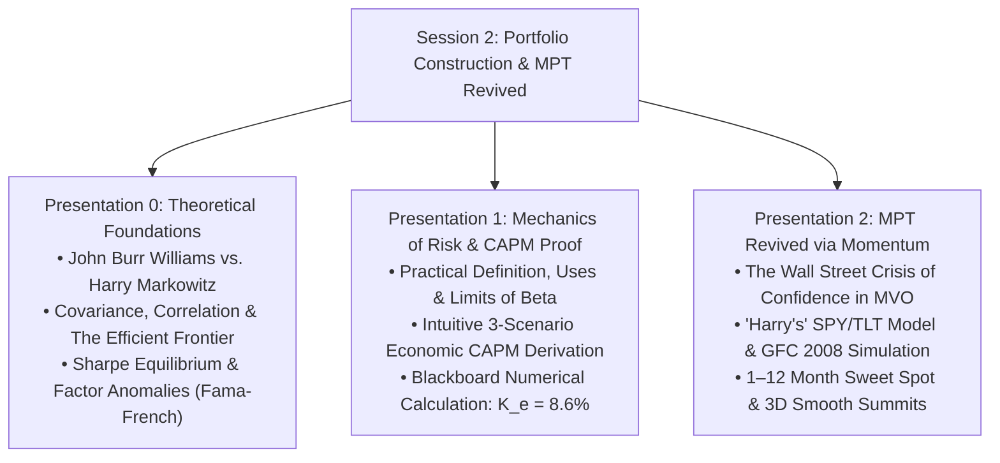
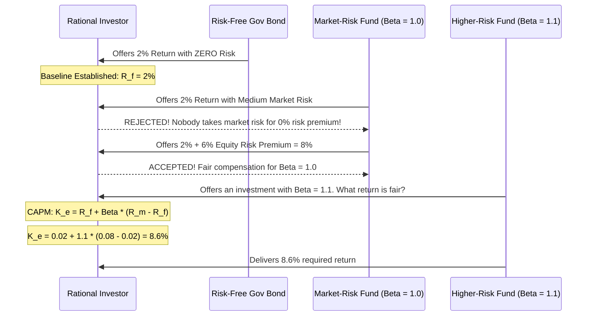

# APS1051: Comprehensive Session 2 Study Notes
**Course:** APS1051: Portfolio Management under Real Market Constraints  
**Institution:** University of Toronto | Master of Engineering (ELITE)  
**Instructors:** Sabatino Costanzo & Loren Trigo  
**Primary Source Material:** 
* `S2A CLASS 2 PPP PRESENTATIONS UPDT` (137 Slides across Presentations 0, 1, and 2)
* `S2BX CLASS 2 COMMENTS TO PPP` (Instructor Transcripts, Blackboard Proofs & Caveats)
* `S2D CLASS 2 MISCELLANEOUS` (Keller, Butler, Kipnis 2015 Research Paper)

---

## Executive Overview & Conceptual Architecture

Session 2 marks the fundamental transition in the course from **Portfolio Evaluation** (Session 1: analyzing existing track records via Sharpe, Treynor, Alpha, and Brinson Attribution) to **Portfolio Construction** (how to build and rebalance profitable portfolios under real-world market constraints).



---

## Part 1: Markowitz’s Modern Portfolio Theory & Sharpe’s CAPM (CL 2 PPP 0)
*Reference: `CL 2 PPP 0 MARKOWITZ & SHARPE UPDT.pptx` (43 Slides) & `XCL 2 COMMENTS ON PPP 1 MARKOWITZ & SHARPE.edited.pdf`*

### 1.1 The Genesis of Quantitative Finance (Slides 1–11)
* **Pre-1950s Status Quo:** Prior to the 1950s, finance lacked any rigorous mathematical definition of investment risk. Risk was treated as an ambiguous, subjective concept.
* **John Burr Williams’s Theory (1938):** In *The Theory of Investment Value*, Williams established the cornerstone of fundamental analysis: the intrinsic value of a stock equals the discounted present value of its expected future dividends:
  $$P_0 = \sum_{t=1}^{\infty} \frac{D_t}{(1 + k)^t}$$
* **Williams's Fatal Flaw:** Markowitz observed that if an investor strictly followed Williams's logic, they would identify the single stock with the highest expected discounted return and invest **100% of their wealth into that single company**. This approach completely ignores the catastrophic danger of idiosyncratic firm-specific blowups.
* **Markowitz’s Revelation (1952):** While waiting outside his advisor Milton Friedman’s office at the University of Chicago, a stockbroker suggested Markowitz apply mathematical programming to the stock market. Influenced by James Uspensky’s *Introduction to Probability*, Markowitz realized that investors do not care about expected returns alone—they care about the **interaction** between expected return and variance.

---

### 1.2 Covariance, Correlation, and the Efficient Frontier (Slides 12–21)
* **The Core Mathematical Breakthrough:** Markowitz proved that a portfolio’s total risk is governed primarily by the **pairwise covariance and correlation** among assets, rather than the isolated variances of individual assets:
  $$\sigma_p^2 = \sum_{i=1}^N w_i^2 \sigma_i^2 + \sum_{i=1}^N \sum_{j \ne i}^N w_i w_j \text{Cov}(R_i, R_j)$$
  $$\text{Cov}(R_i, R_j) = \rho_{i,j} \sigma_i \sigma_j, \quad \rho \in [-1, +1]$$

* **The Magic of Diversification (Instructor's Singapore vs. Brazil Example):**
  * Consider two volatile assets: a retail stock in Singapore and a healthcare company in Brazil. Each asset is highly risky in isolation.
  * However, retail sales in Singapore have virtually zero economic correlation with Brazilian healthcare ($\rho \approx 0$).
  * When one "zigs", the other "zags". Their idiosyncratic volatility cancels out, producing a combined portfolio with substantially lower risk than either asset held alone.
  * If two assets have perfect negative correlation ($\rho = -1$), total portfolio variance can theoretically be driven to zero!

* **The Efficient Frontier (EF):**
  * The parabolic curve plotted in $(\sigma, E[R])$ space representing the set of optimal portfolios that offer:
    1. Maximum expected return for a given level of risk ($\sigma$).
    2. Minimum risk ($\sigma$) for a given target expected return.
  * **Economic Rationality:** Rational investors will **never invest in assets or portfolios lying below the Efficient Frontier**, because doing so means accepting equal or greater risk for inferior returns.
  * **Indifference Curves:** Convex utility curves measuring an individual's personal risk aversion. The unique optimal portfolio for a specific investor is found at the exact point of tangency between their indifference curve and the Efficient Frontier.

---

### 1.3 William Sharpe, Equilibrium, and the CAPM (Slides 22–31)
* **Sharpe’s Equilibrium Question (1964):** William Sharpe asked: *What would asset prices and expected returns look like in general equilibrium if ALL rational investors simultaneously optimized their portfolios along Markowitz's Efficient Frontier?*
* **The Risk-Free Asset ($R_f$):** Government-backed fixed income securities virtually immune to default risk.
* **Systematic Risk / Beta ($\beta$):** A normalized measure of an asset’s sensitivity to the aggregate market portfolio. The market portfolio's beta is defined as $\beta_m = 1.0$.
* **The Capital Asset Pricing Model (CAPM):**
  $$E[R_i] = R_f + \beta_i (R_m - R_f)$$
  Where $(R_m - R_f)$ is the **Market Risk Premium**—the excess return demanded by investors to bear the non-diversifiable risk of the broader equity market.

---

### 1.4 Empirical Challenges & Multi-Factor Anomalies (Slides 32–43)
* **The Low-Beta Anomaly (Fama & French, 1992):** Over empirical backtests from 1966 onwards, standard CAPM broke down: **high-beta stocks systematically underperformed expectations**, while **low-beta stocks delivered higher risk-adjusted returns than predicted by theory**.
* **Fama-French Multi-Factor Dimensions:**
  * **Size Factor (SMB - Small Minus Big):** Small-market-capitalization firms historically deliver higher average returns than large-cap firms due to illiquidity and distress risk.
  * **Style Factor (HML - High Minus Low):** Value stocks (high Book-to-Market / low Price-to-Book) historically beat Growth stocks (low Book-to-Market / high Price-to-Book).
* **Modern Factors (Slides 39–43):**
  * **Momentum Factor (Jegadeesh & Titman, 1993):** Past short-term winners continue outperforming past short-term losers.
  * **Liquidity Premium (Amihud):** Illiquid assets that cannot be sold rapidly without severe price concessions must offer higher expected returns to compensate holders.
* **The Master Multi-Dimensional Quantitative Screen (Slide 42):**
  * To maximize long-term return potential, quantitative managers should construct portfolios that simultaneously capture all five proven premia:
    $$\mathbf{\text{Target Assets: [Low Beta] + [Value Style] + [Small Cap] + [Illiquid] + [Upward Momentum]}}$$
  * *Instructor Caveat (Slide 43):* While this multi-factor combination generates exceptional long-term CAGR, it exhibits substantial short-term drawdown volatility and requires patient capital.

---

## Part 2: Mechanics of Risk: Beta & Step-by-Step CAPM Derivation (CL 2 PPP 1)
*Reference: `CL 2 PPP 1 RISK RETURN CAPM & MKT LINE.pptx` (45 Slides) & `XCL 2 COMMENTS ON PPP 0 RISK RETURN CAPM & MKT LINE.edited.pdf`*

### 2.1 Practical Meaning, Applications, and Limitations of Beta (Slides 1–18)
* **Textbook vs. Practical Definition:**
  * *Textbook:* $\beta = \frac{\text{Cov}(R_i, R_m)}{\text{Var}(R_m)}$. A statistical regression slope.
  * *Practical Intuition:* Beta is a normalized ratio indicating **how aggressively an asset swings relative to the broader market portfolio (S&P 500)**.
* **The Spectrum of Asset Betas:**
  * **Defensive Asset ($\beta = 0.5$, e.g., GlaxoSmithKline):** Swings with half the volatility of the market. If the market plunges 10%, Glaxo is expected to drop only 5%.
  * **Neutral Asset ($\beta = 1.0$, e.g., Apple):** Moves in direct lockstep with broader macroeconomic market fluctuations.
  * **Aggressive Asset ($\beta = 2.0$, e.g., Rio Tinto):** A cyclical mining giant with severe leverage to macroeconomic cycles; swings with double the volatility of the S&P 500.
* **Portfolio Beta:** Linear weighted average of constituent assets:
  $$\beta_p = \sum_{i=1}^N w_i \beta_i$$

#### Three Institutional Uses of Beta (Slides 13–16)
1. **Expected Return Benchmarking:** Projecting baseline hurdle rates for capital budgeting and asset allocation.
2. **Tactical Market Timing:** In anticipating a bull market, rotate capital into high-beta ($\beta > 1$) assets to maximize upside boost; when anticipating market turbulence, rotate into low-beta ($\beta < 1$) assets or cash.
3. **Factor Diversification:** Balancing cyclical and defensive beta sensitivities across asset classes.

#### Three Fatal Criticisms of Beta (Slides 17–18)
1. **Historical Non-Stationarity:** Beta is an OLS regression artifact calculated on historical windows. In real markets, an asset's beta is non-stationary and frequently shifts during market shocks.
2. **Ignores Idiosyncratic Risk:** Beta only measures systematic market co-movement. If an investor holds an undiversified portfolio, company-specific blowups can destroy wealth while beta reports deceptively low risk.
3. **Linearity Assumption:** Beta assumes symmetric co-movement during market upswings and downswings, failing to reflect fat tails, skewness, and liquidity freezes.

---

### 2.2 Intuitive Economic Proof of the CAPM Equation (Slides 19–45)
Rather than relying on abstract calculus, the instructors present an intuitive economic thought experiment across three investment opportunities:

#### Scenario 1: The Risk-Free Asset (Slides 21–22)
* An investor is offered a government-guaranteed bank bond offering **$R_f = 2\%$** with zero risk of default.
* This establishes the baseline: any rational human requires at least 2% return for giving up liquidity.

#### Scenario 2: The Medium-Risk Hedge Fund (Slides 23–34)
* A hedge fund manager approaches the investor offering an alternative investment with **"Medium Risk"** (defined as risk equal to the market portfolio, $\beta = 1.0$).
* When asked about the return, the manager explains that after fees and overhead, the fund will pay **$2\%$**.
* **The Economic Rejection (Slide 27–29):** Every rational investor instantly rejects the offer! Why accept market risk to earn the exact same 2% already guaranteed by the government bond?
* **The Market Risk Premium (Slides 30–34):** To attract capital, the manager must offer an extra return—the **Market Risk Premium $(R_m - R_f)$**. If historical market returns are $R_m = 8\%$, the manager must offer an additional $6\%$ on top of the $2\%$ risk-free rate ($2\% + 6\% = 8\%$).

#### Scenario 3: The Higher-Risk Fund ($\beta = 1.1$) (Slides 35–45)
* A third fund manager presents a fund whose volatility is **10% higher than the market ($\beta = 1.1$)**.
* What is the minimum fair return ($K_e$) she must deliver?



#### Detailed Blackboard Calculation (Slides 39–45):
* Risk-Free Rate: $R_f = 0.02$ ($2\%$)
* Market Return: $R_m = 0.08$ ($8\%$)
* Market Risk Premium: $(R_m - R_f) = 0.08 - 0.02 = 0.06$ ($6\%$)
* Asset Beta: $\beta = 1.1$
* **The CAPM Formula:**
  $$K_e = R_f + \beta (R_m - R_f)$$
  $$K_e = 0.02 + 1.1 \times 0.06 = 0.02 + 0.066 = \mathbf{0.086 \text{ (8.6%)}}$$
* **Instructor Conclusion (Slide 44–45):** The required return of 8.6% precisely compensates the investor for bearing 10% more systematic risk than the broader market. The regression line connecting these points is the **Security Market Line (SML)**.

---

## Part 3: Reviving Modern Portfolio Theory with Momentum (CL 2 PPP 2)
*Reference: `CL 2 PPP 2 MODERN PORT THEORY & MOMENTUM.pptx` (49 Slides) & `XCL 2 COMMENTS ON PPP 2 MODERN PORT THEORY & MOMENTUM.edited.pdf`*

### 3.1 The Wall Street Rejection of Textbook MVO (Slides 1–7)
Despite Markowitz winning the 1990 Nobel Prize in Economics, Modern Portfolio Theory was broadly abandoned by practical Wall Street trading desks:
* **Richard Michaud (1989):** Mean-Variance Optimization is an *"unstable and error-maximizing procedure."*
* **Victor DeMiguel, Garlappi, & Uppal (2007):** Naive equal weighting ($1/N$) nearly always outperforms complex MVO out-of-sample across empirical datasets.
* **Andrew Ang (2014):** *"Mean-variance weights perform horribly... optimized portfolios blow up when there are tiny errors in return and covariance estimates."*
* **Wesley Gray & Quant Blogs (Slide 3):** Institutional quants dismissed Markowitz as "elegant in theory, useless in practice."

#### The Authors' Diagnostic: Why MVO Failed in Practice (Slides 6–7)
Keller, Butler, and Kipnis (2015) discovered that MVO itself was mathematically flawless—it had been **grossly misapplied** for six decades due to two implementation errors:
1. **The 60-Month Lookback Trap:** Academics conventionally used 36 to 60 months (3–5 years) of historical data to estimate expected returns. Over 3–5 year horizons, asset prices undergo profound **mean reversion** (Asness 2012). Thus, the model was systematically buying past winners right before they became future losers!
2. **Unconstrained Short-Sales:** Permitting negative weights ($w_i < 0$) allowed quadratic optimizers to take massive, levered long/short bets on statistical noise, causing catastrophic portfolio blowups.

#### The Dual Remedy:
* **Remedy 1:** Enforce **Long-Only Non-Negative Allocations** ($w_i \ge 0$).
* **Remedy 2:** Shorten estimation horizons to **1 to 12 Months** where momentum and return persistence dominate.

---

### 3.2 "Harry’s" Naive High-School Experiment & The 2008 Crash (Slides 8–25)
To prove their thesis, the authors introduce a fictional high-school student, "Harry" (named after Harry Markowitz):
* **Context:** In late August 2008 (weeks before Lehman Brothers collapsed), Harry is assigned to construct an optimal portfolio with a **target volatility limit of 10%**.
* **Harry’s Constraints & Setup:**
  * **2-Asset Universe:** SPY (S&P 500 ETF) and TLT (20+ Year US Treasury Bond ETF).
  * **Lookback Horizon:** Only **4 months** of monthly total returns (Harry has limited time and refuses to calculate 60 months of data).
  * **Constraint:** Long-only ($w_i \ge 0$, because Harry doesn't understand shorting).
  * **Algorithm:** Simple discrete permutation: evaluates combinations in 10% increments (0%/100%, 10%/90%, ..., 100%/0%) monthly.

#### Real-Time Simulation During the 2008 Global Financial Crisis:
1. **September 2008 – April 2009 (The Crash):**
   * While the global banking system melted down and equities plunged over 50%, Harry’s 4-month momentum model selected:
     $$\mathbf{[0\% \text{ SPY} + 100\% \text{ TLT}]}$$
   * Harry held 100% long Treasuries throughout the entire panic, dodging the crash and capturing the historic bond surge!
2. **May 2009 (The Rebound):**
   * As equities bottomed and momentum turned positive, the combination $[0\% \text{ SPY} + 100\% \text{ TLT}]$ lost its top ranking and was defeated by:
     $$\mathbf{[90\% \text{ SPY} + 10\% \text{ TLT}]}$$
   * Harry aggressively rotated 90% into equities, capturing the explosive economic recovery!
3. **The Result:** Harry’s naive spreadsheet not only survived the worst crisis since 1929—it dramatically outperformed both buy-and-hold SPY and buy-and-hold TLT!

---

### 3.3 Return & Volatility Persistence: The 1–12 Month Sweet Spot (Slides 21–25)
* **The Return Momentum Factor (Faber 2007, Antonacci 2011, Asness 2014):** Empirical return persistence operates over short-to-medium lookbacks of **1 to 12 months**.
* **Generalized Momentum (Keller 2012):** Not only returns, but **volatilities and covariance matrices also exhibit short-term persistence over 1 to 12 months**.
* Combining assets with opposite short-term return patterns (negative correlation) reliably produces lower realized forward volatility.

---

### 3.4 Rotational Trading Performance & 3D Optimization Manifolds (Slides 26–48)
* **Long-Term Multi-Decade Backtest (Slide 41):**
  * Total Annualized Return = **37.14%**
  * Compound Annual Growth Rate (CAGR) = **14.17%**
  * Sharpe Ratio = **1.04**

#### 3D Parameter Optimization Manifolds (Slides 44–47)
The instructors introduce a 3D visualization surface mapping:
* **X-axis:** Lookback Estimation Period ($T$, in months)
* **Y-axis:** Holding / Rebalance Period ($H$, in months)
* **Z-axis:** Performance Metric (Sharpe Ratio or Past/Future Return Correlation)

```
                ▲ Z (Sharpe Ratio)
                │
                │        Smooth Summit (SELECT THIS!)
                │          ╭────────╮
                │         ╭╯        ╰╮
                │        ╭╯          ╰╮
                │        │            │        Abrupt Spike (AVOID!)
                │        │            │            ▲
                │        │            │           ╱ ╲
                └────────┴────────────┴──────────┴───┴──────► X, Y
                                                      (Overfitted Peak)
```

#### The Golden Summit Rule (Slide 48):
> *"When looking for the maximum correlation or Sharpe ratio across the table, we are trying to find the 'SUMMIT' of a manifold. In case there are two or more summits, we MUST SELECT THE ONE THAT IS 'SMOOTHER' (= DIFFERENTIABLE) OVER THE MORE 'ABRUPT' ONES."*

* **Why Choose the Smooth Summit?**
  * A **smooth, differentiable summit** indicates that small real-world parameter drifts (e.g., lookback drifting from 4 to 5 months or holding from 1 to 2 months) will result in minimal performance decay. The strategy is robust to market noise.
  * An **abrupt, needle-like peak** represents fragile data-mining and overfitting. A slight shift in market regime will cause the strategy to fall off a performance cliff out-of-sample.

---

## Part 4: Session 2 Exercises Checklist

Session 2 requires answering **7 Session Exercises** across the two comments PDFs in `S2BX` and compiling them into **one Word document** (`FirstName.LastName.docx`):

### From `XCL 2 COMMENTS ON PPP 1 MARKOWITZ & SHARPE.edited.pdf`
* **Exercise 1 (Page 5, Slides 1–21):** Summary and reflection on Markowitz MVO, covariance, correlation, and the derivation of the Efficient Frontier.
* **Exercise 2 (Page 11, Slides 22–43):** Summary and reflection on William Sharpe's CAPM equilibrium, two-fund separation, the Low-Beta anomaly, Fama-French multi-factor premia, and the 5-factor screening rule.

### From `XCL 2 COMMENTS ON PPP 2 MODERN PORT THEORY & MOMENTUM.edited.pdf`
* **Exercise 3 (Page 4, Slides 1–7):** Summary and reflection on the institutional rejection of MVO (Michaud, DeMiguel, Ang) and the two root causes (60-month mean reversion + unconstrained shorting).
* **Exercise 4 (Page 10, Slides 8–18):** Summary and reflection on Harry's naive SPY/TLT experiment during the 2008 Global Financial Crisis.
* **Exercise 5 (Page 13, Slides 19–25):** Summary and reflection on why the 1–12 month momentum sweet spot rescues MVO and generalized volatility persistence.
* **Exercise 6 (Page 20, Slides 26–43):** Summary and reflection on rotational trading equity curves (CAGR = 14.17%, Sharpe = 1.04) and holding-period sensitivity.
* **Exercise 7 (Page 22, Slides 44–48):** Summary and reflection on 3D optimization manifolds and why smooth summits must be selected over abrupt overfitted peaks.

*(Note: Slide 49 is the separate **Weekly Homework 4-page analytical essay** comparing the lecture vs. omitted concepts in the Keller et al. paper).*

---

## Master Comparison Table for Session 2

| Dimension | Classical MPT (Markowitz 1952) | Empirical Reality (Fama-French, Ang) | Revived MVO (Keller et al. 2015) |
| :--- | :--- | :--- | :--- |
| **Lookback Horizon** | 36–60 Months (3–5 years) | 60 Months suffers severe mean-reversion | **1 to 12 Months** (Momentum sweet spot) |
| **Short Selling** | Unconstrained ($w_i \in \mathbb{R}$) | Huge levered long/short blowout on noise | **Long-Only** ($w_i \ge 0$) |
| **Asset Universe** | Single equity portfolios | Factor anomalies (Size, Value, Momentum) | Multi-Asset ETFs (SPY, TLT, IEF, Cash) |
| **Covariance Stability** | Assumed static | Singular when $N > T$ | Solved via Critical Line Algorithm (CLA) |
| **Surface Selection** | Single point optimization | Overfitted local optima | **Smooth, differentiable 3D summits** |
| **Crisis Performance** | Severe drawdowns | Catastrophic crash exposure | **Dynamic flight to safety (100% Treasuries)** |
