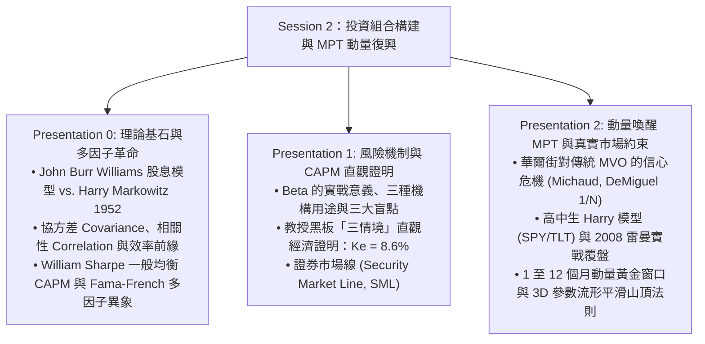
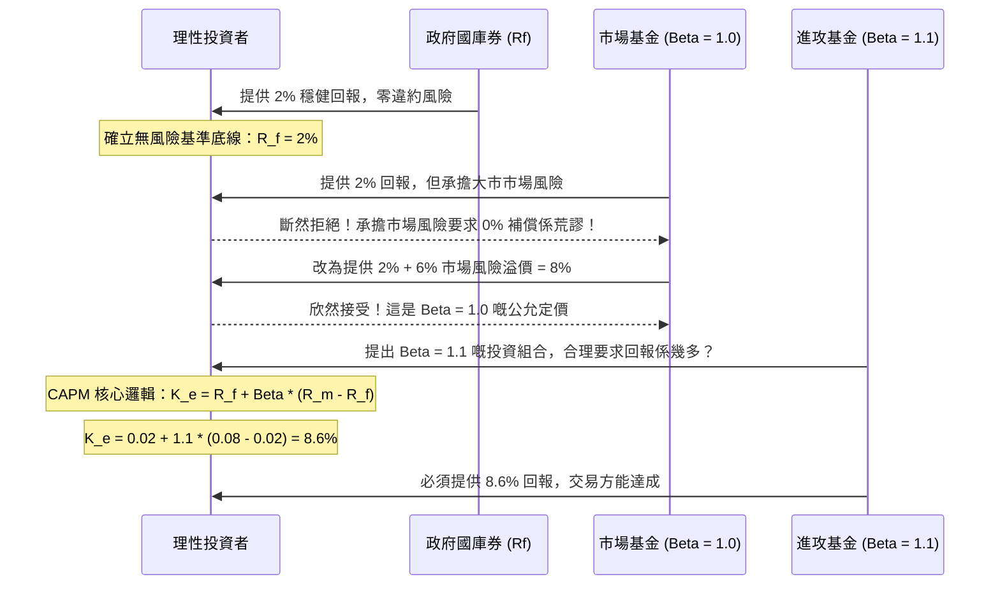

# APS1051: 第二課完整詳細研習筆記（廣東話版）
**課程名稱：** APS1051: Portfolio Management under Real Market Constraints（真實市場約束下的投資組合管理）  
**授課機構：** 多倫多大學工程學院（University of Toronto | Master of Engineering - ELITE）  
**教授團隊：** Sabatino Costanzo & Loren Trigo  
**核心參考資料：** 
* `S2A CLASS 2 PPP PRESENTATIONS UPDT`（共 137 張幻燈片，橫跨 Presentation 0, 1, 2）
* `S2BX CLASS 2 COMMENTS TO PPP`（教授課堂逐字發言錄音稿、黑板數學證明與避坑警告）
* `S2D CLASS 2 MISCELLANEOUS`（Keller, Butler, Kipnis 2015 年重磅研究論文）

---

## 執行摘要與核心知識架構（Executive Overview）

Session 2 係成個課程嘅核心轉折點：由 **Session 1 的「事後評估（Portfolio Evaluation）」**（用夏普比率 Sharpe、特雷諾比率 Treynor、詹森阿爾法 Jensen's Alpha 同 Brinson 歸因分析去評核基金經理過去嘅業績），正式跨越到 **Session 2 的「事前構建（Portfolio Construction）」**（如何在真實市場約束下，運用數學與動量構建長勝、抗跌、高回報嘅投資組合）。



---

## 第一部分：Markowitz 現代投資組合理論與 Sharpe CAPM 模型（CL 2 PPP 0）
*參考來源：`CL 2 PPP 0 MARKOWITZ & SHARPE UPDT.pptx`（43 Slides）與 `XCL 2 COMMENTS ON PPP 1 MARKOWITZ & SHARPE.edited.pdf`*

### 1.1 量化金融學的誕生（Slides 1–11）
* **1950 年代前的混沌狀態：** 在現代投資組合理論誕生之前，金融界完全冇「投資風險（Investment Risk）」嘅精確數學定義。風險被視為一種純主觀、摸唔透嘅個人感受。
* **John Burr Williams（1938）的內在價值理論：** 在經典名著《*The Theory of Investment Value*》中，Williams 確立咗基本面分析嘅基石——股票嘅內在價值等於其未來所有預期股息嘅折現現值（Dividend Discount Model, DDM）：
  $$P_0 = \sum_{t=1}^{\infty} \frac{D_t}{(1 + k)^t}$$
* **Williams 理論的致命盲點：** Markowitz 敏銳地發現：如果一個理性投資者嚴格跟從 Williams 嘅邏輯，佢只要搵出全市場折現預期回報最高嘅個一隻股票，就會**將 100% 嘅身家全數買入個一隻單一公司**！這種做法完全忽略咗單一公司特有風險（Idiosyncratic Blowup Risk）嘅毀滅性打擊。
* **Markowitz 1952 年的頓悟：** 當年 Markowitz 喺芝加哥大學經濟系候任導師 Milton Friedman 門口等候嗰陣，一位股票經紀建議佢試下將數學規劃（Mathematical Programming）應用落股票市場。受到 James Uspensky《概率論導論》嘅啟發，Markowitz 領悟到：**投資者根本唔單止在意預期回報，投資者真正關心嘅係「預期回報」同「回報方差（波動風險）」之間嘅權衡互動。**

---

### 1.2 協方差、相關性與效率前緣（Slides 12–21）
* **核心數學突破：** Markowitz 證明咗，一個投資組合嘅總風險，絕非各資產孤立波動嘅簡單加總，而係取決於資產之間嘅**兩兩成對協方差（Pairwise Covariance）與相關系數（Correlation $\rho$）**：
  $$\sigma_p^2 = \sum_{i=1}^N w_i^2 \sigma_i^2 + \sum_{i=1}^N \sum_{j \ne i}^N w_i w_j \text{Cov}(R_i, R_j)$$
  $$\text{Cov}(R_i, R_j) = \rho_{i,j} \sigma_i \sigma_j, \quad \rho \in [-1, +1]$$

* **分散投資的魔術（教授的新加坡零售 vs. 巴西醫療案例）：**
  * 想像兩隻波動率極高嘅單一股票：一隻係新加坡嘅本地零售連鎖店，另一隻係巴西嘅私家醫療公司。單獨持有任何一隻都非常危險。
  * 但係，新加坡人買唔買衫，同巴西人生唔生病，在宏觀經濟上幾乎完全冇關聯（$\rho \approx 0$）。
  * 當其中一隻股票下跌嗰陣，另一隻股票很可能向上或者不受影響。兩者嘅特異噪聲互相抵消，組合出嚟嘅整體波動率會遠遠低於單獨持有任何一隻資產嘅風險！
  * 如果搵到兩隻資產具備完全負相關（$\rho = -1$），理論上甚至可以將投資組合嘅方差徹底降到零！

* **效率前緣（Efficient Frontier, EF）：**
  * 在橫軸為總風險（$\sigma_p$）、縱軸為預期回報（$E[R_p]$）嘅坐標軸上，所有可行資產組合會構成一個子彈狀嘅區域（Markowitz Bullet）。
  * 該區域嘅**上半部凸邊界**就係**效率前緣**。它代表兩大最優集合：
    1. 在給定特定風險水平（$\sigma$）下，能取得嘅**最高預期回報**。
    2. 在給定特定目標回報下，所承擔嘅**最低總風險**。
  * **經濟理性人假設：** 理性投資者**永遠唔會**持有處於效率前緣下方嘅資產組合，因為咁做等同於無端白事承擔多餘嘅風險，或者白白浪費咗本應獲得嘅收益。
  * **無差異曲線（Indifference Curves）：** 投資者個人風險厭惡程度在圖形上的凸函數映射。特定投資者嘅唯一最佳投資組合，就係其無差異曲線同效率前緣剛好相切嘅點（Tangency Point）。

---

### 1.3 William Sharpe、市場一般均衡與 CAPM（Slides 22–31）
* **Sharpe 的一般均衡之問（1964）：** William Sharpe 提出一個宏大嘅思考：*如果市場上所有理性投資者，都同時根據 Markowitz 效率前緣構建最優組合，成個資本市場嘅資產價格同預期回報會呈現點樣嘅均衡狀態？*
* **無風險資產（$R_f$）：** 擁有主權國家信用背書、違約概率實質為零嘅短期政府公債（如美國 3 個月國庫券）。
* **系統性風險 / 貝塔（$\beta$）：** 衡量單一資產對整個宏觀市場組合（Market Portfolio）波動敏感度嘅標準化統計量。全市場組合嘅貝塔定義為 $\beta_m = 1.0$。
* **資本資產定價模型（CAPM 公式）：**
  $$E[R_i] = R_f + \beta_i (R_m - R_f)$$
  其中 $(R_m - R_f)$ 稱為**市場風險溢價（Market Risk Premium, ERP）**——即投資者冒住無法被分散嘅宏觀大市波動風險時，所必須索取嘅額外超額補償。

---

### 1.4 實證挑戰與多因子異象革命（Slides 32–43）
* **低 Beta 異象（Fama & French, 1992）：** 從 1966 年起幾十年嘅全球實證回測發現，教科書 CAPM 遭遇慘烈打臉：**高 Beta 股票嘅實際長期回報系統性低於理論預期，相反，低 Beta 股票嘅長期風險調整後回報竟然遠遠拋離大市（Low-Beta Anomaly）**！
* **Fama-French 經典多因子維度：**
  * **規模因子（SMB - Small Minus Big）：** 歷史上小市值公司（Small-cap）由於流動性折價同經營抗壓脆弱，長期平均回報跑贏大型巨企（Big-cap）。
  * **風格因子（HML - High Minus Low）：** 價值股（低市淨率 P/B、高賬面市值比 B/M）長期總回報大幅跑贏估值高昂嘅成長股（Growth）。
* **現代拓展因子（Slides 39–43）：**
  * **動量因子（Momentum, Jegadeesh & Titman 1993）：** 過去短期內嘅強者（Winners）在未來數月會傾向繼續強勢，過去弱者（Losers）傾向繼續沉淪。
  * **非流動性溢價（Illiquidity Premium, Amihud）：** 難以即時大額套現嘅資產，必須提供額外嘅預期收益嚟補償持有人承擔嘅流動性凍結風險。
* **終極多維量化選股策略（Slide 42）：**
  * 為咗在長期獲得幾何級數級別嘅超額阿爾法，頂尖量化經理應當構建同時捕獲五大多因子溢價嘅資產組合：
    $$\mathbf{\text{目標資產標籤: [低 Beta] + [價值風格] + [微小型股] + [低流動性] + [強烈上升動量]}}$$
  * *教授重點提示（Slide 43）：* 呢種五合一多因子組合長期年複合增長率（CAGR）雖然極高，但短期回撤波動（Drawdown Volatility）同樣驚人，需要極具耐性嘅機構長線資本先頂得住。

---

## 第二部分：風險機制的微觀剖析：Beta 與 CAPM 黑板證明（CL 2 PPP 1）
*參考來源：`CL 2 PPP 1 RISK RETURN CAPM & MKT LINE.pptx`（45 Slides）與 `XCL 2 COMMENTS ON PPP 0 RISK RETURN CAPM & MKT LINE.edited.pdf`*

### 2.1 貝塔（Beta）的實務定義、機構用途與致命盲點（Slides 1–18）
* **教科書 vs. 操盤手直觀理解：**
  * *教科書定義：* $\beta = \frac{\text{Cov}(R_i, R_m)}{\text{Var}(R_m)}$，本質上係 OLS 線性回歸嘅斜率。
  * *操盤手實戰直覺：* Beta 係一個放大系數，直觀反映**當大市（例如標普 500 指數）震盪 1% 嗰陣，該資產平均會跟住放大定縮小幾多**。
* **資產 Beta 的全光譜分佈：**
  * **防禦型資產（Defensive, $\beta = 0.5$，例如葛蘭素史克 GlaxoSmithKline）：** 波動幅度只有大市嘅一半。大市暴跌 10%，呢類醫藥防禦股平均只跌 5%。
  * **中性資產（Neutral, $\beta = 1.0$，例如蘋果公司 Apple）：** 走勢與整體宏觀經濟節奏高度同步。
  * **進攻型資產（Aggressive, $\beta = 2.0$，例如必和必拓 Rio Tinto）：** 高度依賴大宗商品週期與宏觀信貸嘅重工業巨頭，股價波動係標普 500 嘅兩倍。
* **組合 Beta 的線性特徵：**
  $$\beta_p = \sum_{i=1}^N w_i \beta_i$$

#### Beta 的三大機構實務用途（Slides 13–16）：
1. **預期資本回報基準（Cost of Capital）：** 企業融資同資本預算評估項目最低回報門檻（Hurdle Rate）。
2. **戰術性擇時對沖（Tactical Timing）：** 預期牛市暴升時，將組合輪動換入高 Beta 股票（$\beta > 1$）放大盈利；預期熊市暴跌時，換入低 Beta 防守股（$\beta < 1$）或者國債現金避險。
3. **因子暴露風控：** 監控投資組合對宏觀景氣循環嘅總暴露度。

#### Beta 的三大致命局限與實務批判（Slides 17–18）：
1. **歷史非平穩性（Non-Stationarity）：** 過去 3 年回歸出嚟嘅 Beta 唔代表未來。宏觀危機爆發時，很多平時低 Beta 嘅股票會因為流動性踩踏而暴增至高 Beta。
2. **對特異風險完全盲目：** Beta 只計系統性市場波動。如果基金集中持有幾隻股票，哪怕組合 Beta 低至 0.6，只要其中一隻公司造假破產，投資者都會輸到貼地。
3. **對稱線性假設失真：** Beta 假設股票在牛市同熊市嘅彈性係對稱嘅，但現實中很多資產係「升時跟唔足、跌時跌突」（Fat tails 同下行不對稱）。

---

### 2.2 教授的「三情境」直觀經濟推導 CAPM（Slides 19–45）
教授在黑板上揚棄咗抽象嘅微積分，改用一個層層遞進嘅**三情境經濟思想實驗**，向學生證明 CAPM 為何成立：

#### 情境 1：無風險資產的基線（Slides 21–22）
* 銀行或政府提供一隻零違約風險嘅國庫券，保證派息 **$R_f = 2\%$**。
* **經濟結論：** 這確立咗全市場嘅底線回報——任何理性投資者放棄流動性，最起碼要攞返 2% 嘅時間價值。

#### 情境 2：中等風險對沖基金的荒謬報價（Slides 23–34）
* 一位對沖基金經理向投資者推銷一隻「中等風險（Medium Risk）」基金，其風險完全等同於股票市場平均風險（$\beta = 1.0$）。
* 投資者問經理：「扣除所有管理費後，預期回報有幾多？」經理答：「**2%**。」
* **市場必然的否決（Slides 27–29）：** 任何心智正常嘅投資者都會**當場拒絕**！既然無風險國債已經穩袋 2%，我點解要承擔每日提心吊膽嘅股票暴跌風險去賺個 2%？
* **股權風險溢價（ERP）的誕生：** 要吸引資金，經理必須在無風險利率之上，補償一筆**市場風險溢價 $(R_m - R_f)$**。如果歷史股票市場長期平均回報為 $R_m = 8\%$，經理就必須額外畀多 $6\%$（即 $2\% + 6\% = 8\%$），投資者先肯入場。

#### 情境 3：高風險對沖基金的合理定價（Slides 35–45）
* 第三位基金經理推銷一隻「高風險組合」，其波動性比股票市場大市高出 10%（即 **$\beta = 1.1$**）。
* 投資者要求嘅公正合理最低回報率（$K_e$）應當係幾多？



#### 黑板詳細數值計算（Slides 39–45）：
* 無風險回報：$R_f = 0.02$（$2\%$）
* 市場大市平均回報：$R_m = 0.08$（$8\%$）
* 市場風險溢價：$(R_m - R_f) = 0.08 - 0.02 = 0.06$（$6\%$）
* 該基金風險系數：$\beta = 1.1$
* **CAPM 定價公式：**
  $$K_e = R_f + \beta (R_m - R_f)$$
  $$K_e = 0.02 + 1.1 \times 0.06 = 0.02 + 0.066 = \mathbf{0.086 \text{ (8.6\%)}}$$
* **教授結論（Slides 44–45）：** 8.6% 嘅預期收益，剛好完美補償咗該投資者多承受 10% 系統性風險嘅成本。將所有資產嘅 Beta 與 $K_e$ 連成一線，就係名震金融界嘅**證券市場線（Security Market Line, SML）**。

---

## 第三部分：動量效應喚醒 Markowitz MVO（CL 2 PPP 2）
*參考來源：`CL 2 PPP 2 MODERN PORT THEORY & MOMENTUM.pptx`（49 Slides）與 `XCL 2 COMMENTS ON PPP 2 MODERN PORT THEORY & MOMENTUM.edited.pdf`*

### 3.1 華爾街對傳統 MVO 的信心危機（Slides 1–7）
儘管 Markowitz 榮獲 1990 年諾貝爾經濟學獎，但喺真實嘅華爾街操盤室入面，教科書式嘅 MVO 長期被交易員視為廢物：
* **Richard Michaud（1989）：** 均值方差優化喺實踐中根本唔係「優化器」，而係**「誤差放大器（Error-Maximizer）」**。
* **Victor DeMiguel, Garlappi, & Uppal（2007）：** 在各大歷史數據集做樣本外（Out-of-sample）嚴謹測試，結果發現幼稚園水平嘅**等權重策略（$1/N$）竟然全面暴打複雜嘅 MVO**！
* **Andrew Ang（哥大教授，2014）：** 傳統均值方差權重嘅實際表現「慘不忍睹（Perform horribly）」。協方差矩陣只要出現微細嘅估計誤差，輸出嘅權重就會極端化，甚至將投資組合引向毀滅。

#### Keller, Butler, & Kipnis（2015）的重磅病理診斷（Slides 6–7）
三位作者發現：**Markowitz 嘅數學方程式完全冇錯，錯在過去 60 年學術界同機構操盤手完全用錯咗方法！** 傳統 MVO 之所以死火，源於兩大致命操作失誤：
1. **60 個月回測窗口的均值回歸陷阱（Mean Reversion Trap）：**  
   傳統學術論文慣用 36 至 60 個月（3 到 5 年）嘅長歷史數據嚟估算預期回報。但 Asness（2012）等學者早已證實，資產在 3 到 5 年長週期具有極強嘅**均值回歸**傾向。長窗口優化器選出過去 5 年最強嘅資產，實際上剛好喺佢哋即將盛極而衰嘅最高點「接火棒」！
2. **無約束賣空（Unconstrained Short-Sales）：**  
   容許負權重（$w_i < 0$）令二次規劃求解器肆無忌憚咁喺微小嘅統計噪聲上加幾倍槓桿沽空，一旦市況稍有偏差，保證金即刻斷裂自爆。

#### 兩大救命靈藥（The Dual Remedy）：
* **解藥 1：** 強制執行**純做多限制（Long-Only, $w_i \ge 0$）**，嚴禁無約束賣空。
* **解藥 2：** 將回測估計窗口大幅縮短到 **1 至 12 個月**，剛好食中金融市場最強大嘅**動量持續效應（Momentum Persistence）**！

---

### 3.2 高中生「Harry 模型」與 2008 雷曼危機實戰覆盤（Slides 8–25）
為咗證明理論，作者虛構咗一個高中生「Harry」（向 Harry Markowitz 致敬）：
* **背景：** 2008 年 8 月底（雷曼兄弟破產前夕），Harry 收到一份作業，要求構建一個**年化目標波動率不超過 10%** 嘅投資組合。
* **Harry 的極簡約束設定：**
  * **2 隻資產：** 美股標普 500 ETF（`SPY`）＋ 美國 20 年期長國債 ETF（`TLT`）。
  * **回測窗口：** 只有短短 **4 個月（4-Month Lookback）**。
  * **做多約束：** 唔識賣空，強制純做多（$w_i \ge 0$）。
  * **算法：** 拋棄複雜嘅矩陣求逆，改用極簡嘅 **10% 步長離散窮舉法（0%/100%、10%/90% ... 100%/0%）**，每月調倉一次。

#### 2008 金融海嘯實況覆盤：
1. **風暴核心（2008 年 9 月至 2009 年 4 月）：**
   * 雷曼破產引發世紀股災，全球股市腰斬逾 50%。
   * Harry 嘅 4 個月動量窗口即時捕捉到美股轉勢向下、而長國債因市場極度恐慌而避險暴升。模型連續多個月輸出：
     $$\mathbf{[0\% \text{ SPY} + 100\% \text{ TLT}]}$$
   * Harry 全倉持有長期國債，唔單止避開咗世紀股災，更食足美債避險嘅歷史級大升浪！
2. **牛市復甦（2009 年 5 月）：**
   * 股市見底暴力回升，4 個月窗口靈敏捕捉到股票動量轉正。模型瞬間變陣為：
     $$\mathbf{[90\% \text{ SPY} + 10\% \text{ TLT}]}$$
   * 組合近乎全倉殺入股票，精準抄底，食盡牛市初期最凶猛嘅反彈波段！
3. **戰果：** Harry 呢個看似「幼稚」嘅極簡模型，在歷史最慘烈嘅金融海嘯中，跑贏單純持有 SPY 與單純持有 TLT 幾條街！

---

### 3.3 收益與波動率的短期持續性（1–12 個月黃金窗口）
* **回報動量效應（Faber 2007, Antonacci 2011, Asness 2014）：** 在 1 至 12 個月嘅短期維度，資產回報展現出極強嘅延續性（升者越升，跌者越跌）。
* **廣義動量原理（Generalized Momentum, Keller 2012）：** **唔單止回報有動量，波動率（Volatility）同協方差在 1 至 12 個月同樣具備極高嘅持續性！** 短期呈現負相關嘅資產組合，在未來幾個月能夠以極高概率持續壓低實際組合波動。

---

### 3.4 跨週期多十年回測與 3D 參數流形（Slides 26–48）
* **長期多十年實證回測成績單（Slide 41）：**
  * 年化總回報率（Total Annualized Return）= **37.14%**
  * 複合年化增長率（CAGR）= **14.17%**
  * 夏普比率（Sharpe Ratio）= **1.04**

#### 3D 參數優化流形（Slides 44–47）：
教授引入 3D 空間可視化圖形，三個維度分別為：
* **X 軸：** 回測估計期（Lookback Period $T$，以月為單位，例如 1 至 12 個月）。
* **Y 軸：** 持倉/再平衡期（Holding Period $H$，以月為單位，例如 1 至 6 個月）。
* **Z 軸：** 表現指標（夏普比率 Sharpe Ratio 或過去未來收益相關系數）。

```
                ▲ Z (夏普比率 Sharpe Ratio)
                │
                │        平滑山頂 Smooth Summit (唯一正確選擇！)
                │          ╭────────╮
                │         ╭╯        ╰╮
                │        ╭╯          ╰╮
                │        │            │        孤立尖銳刺針 (絕對不要碰！)
                │        │            │            ▲
                │        │            │           ╱ ╲
                └────────┴────────────┴──────────┴───┴──────► X, Y 參數
                                                      (過度擬合陷阱)
```

#### 黃金山頂法則（The Golden Summit Rule - Slide 48）：
> *“When looking for the maximum correlation or Sharpe ratio across the table, we are trying to find the 'SUMMIT' of a manifold. In case there are two or more summits, we MUST SELECT THE ONE THAT IS 'SMOOTHER' (= DIFFERENTIABLE) OVER THE MORE 'ABRUPT' ONES.”*

* **點解一定要揀平滑山頂（Smooth & Differentiable Summit）？**
  * 平滑嘅山頂在數學上係**連續可微**嘅。在真實交易世界中，市場參數必然會產生飄移（例如最優回測期從 4 個月輕微移到 5 個月，或者調倉遲咗幾日）。如果處於平滑山頂，參數飄移只會令夏普比率產生輕微、漸進嘅損耗，策略具備極高嘅穩健性（Robustness）。
* **點解必須唾棄尖銳刺針（Abrupt Spikes）？**
  * 孤立尖刺係典型嘅**數據過度擬合（Data-Mining / Overfitting）**產物。看似歷史回報奇高，但現實中市場只要稍有風吹草動，實際表現就會由頂峰跌落萬丈深淵。

---

## 第四部分：Session 2 課堂 7 大反思 Checkpoint 深度剖析

在兩份講義註解 PDF 入面，教授留低咗 7 個要求學生停低 10 分鐘反思總結嘅 Checkpoint：

### 來自 `XCL 2 COMMENTS ON PPP 1 MARKOWITZ & SHARPE.edited.pdf`

#### 📝 Checkpoint 1（Page 5，針對 Slides 1–21）
* **反思核心：**
  1. 對比 Williams（1938）股息折現與 Markowitz（1952）資產組合理論嘅根本差別。
  2. 協方差與相關性如何從數學上改變資產組合方差（新加坡零售與巴西醫療嘅負相關互補機制）。
  3. 效率前緣嘅幾何構造以及理性投資者如何透過無差異曲線切點鎖定個人最優配置。
* **重點答案摘要：** 單純追求預期回報必然導致 100% 押注單一股票嘅毀滅性脆弱；Markowitz 證明組合風險由資產間嘅協方差主導。在相關性 $\rho < 1$ 嘅情況下，非系統性風險會被對沖消除，從而喺 $(\sigma, E[R])$ 空間塑造出效率前緣。

#### 📝 Checkpoint 2（Page 11，針對 Slides 22–43）
* **反思核心：**
  1. 理解 Sharpe 嘅 CAPM 均衡思想與 Beta 嘅微觀定價機制。
  2. 深刻掌握教授在黑板推導嘅「三情境經濟思想實驗」（國債 $2\%$ $\to$ 市場基金 $8\%$ $\to$ 進攻基金 $\beta=1.1$ 索取 $K_e = 8.6\%$）。
  3. Fama-French 實證中發現嘅「低 Beta 異象」，以及點樣結合規模（SMB）、價值（HML）、動量與流動性因子打造五維量化選股模型。
* **重點答案摘要：** CAPM 證明投資者只會為無法分散嘅系統性風險（Beta）索取補償；但真實市場存在低 Beta 跑贏高 Beta 嘅異象。頂級量化經理應當同時配置低 Beta、小市值、低估值、非流動且具備向上動量嘅標的。

---

### 來自 `XCL 2 COMMENTS ON PPP 2 MODERN PORT THEORY & MOMENTUM.edited.pdf`

#### 📝 Checkpoint 3（Page 4，針對 Slides 1–7）
* **反思核心：**
  1. 華爾街頂尖學者（Michaud、DeMiguel、Ang）點解將 MVO 視為「誤差放大器」？
  2. 傳統 MVO 在過去 60 年實踐中崩潰嘅兩大真正根源係咩？
* **重點答案摘要：** MVO 本身數學冇錯，但學術界錯用咗「36 至 60 個月」嘅超長回測期，食中咗資產嘅均值回歸陷阱，加上無約束賣空將估計噪聲放大成極端槓桿。只要改用「1 至 12 個月動量窗口」並「強制做多限制」，MVO 即可起死回生。

#### 📝 Checkpoint 4（Page 10，針對 Slides 8–18）
* **反思核心：**
  1. 覆盤高中生 Harry 嘅 SPY/TLT 模型點樣喺 2008 雷曼破產危機中生還。
  2. 點解 4 個月回測窗口能夠精準避開 50% 股災，並喺 2009 年 5 月及時轉向抄底？
* **重點答案摘要：** 4 個月短窗口及時識別出美股動量枯竭與長債避險狂飆，自動將權重切換至 100% TLT；而在 2009 年 5 月復甦時，模型迅速變陣為 90% SPY，證明短期動量結合資產輪動具備極強嘅實戰避險與增長能力。

#### 📝 Checkpoint 5（Page 13，針對 Slides 19–25）
* **反思核心：**
  1. Harry 嘅 10% 步長離散窮舉法，同傳統連續型二次規劃求解器相比有咩優勢？
  2. 回報動量與波動率持續性（Persistence）在 1 至 12 個月維度點樣共同發揮作用？
* **重點答案摘要：** 離散窮舉完全避開咗協方差矩陣求逆（$\mathbf{C}^{-1}$），天然免疫於奇異矩陣與數值不穩定，且原生具備做多限制。1 至 12 個月內資產嘅回報與波動率均具備強烈慣性，使動量 MVO 成為可能。

#### 📝 Checkpoint 6（Page 20，針對 Slides 26–43）
* **反思核心：**
  1. 解讀動量資產輪動嘅長期回測數據（年化總回報 37.14%、CAGR 14.17%、夏普比率 1.04）。
  2. 持倉期（Holding Period）對動量信號衰減嘅影響。
* **重點答案摘要：** 長週期實證證實動量 MVO 策略能跨越不同牛熊週期提供穩健阿爾法。每月再平衡（$H=1$）能最大化捕捉動量，持倉期過長會導致信號衰減。

#### 📝 Checkpoint 7（Page 22，針對 Slides 44–48）
* **反思核心：**
  1. 解構 3D 參數流形（Lookback × Holding × Sharpe Ratio）。
  2. 深刻闡述「平滑山頂法則」：點解微積分上嘅可微性（Differentiability）係抵禦過擬合嘅唯一防線？
  3. 真實市場約束（交易成本、滑點）對策略容量嘅限制。
* **重點答案摘要：** 平滑山頂意味著參數在鄰近區域具有強大嘅容錯空間，市場微小飄移唔會導致業績崩潰；孤立尖刺則係過度擬合嘅致命誘餌。真實操盤必須同時計及交易手續費與市場衝擊成本。

---

## 第五部分：核心理論三維對比大師表

| 評估維度 | 經典教科書 MPT（Markowitz 1952） | 實證批判現實（Fama-French, Ang） | 動量復興 MVO（Keller et al. 2015） |
| :--- | :--- | :--- | :--- |
| **回測估計期** | 36 至 60 個月（3–5 年） | 長窗口遭遇慘烈均值回歸（買頂賣底） | **1 至 12 個月**（食中動量黃金窗口） |
| **賣空約束** | 完全無限制（$w_i \in \mathbb{R}$） | 噪聲被放大，形成極端危險槓桿 | **強制純做多（$w_i \ge 0$）** |
| **資產標的** | 單純個股組合 | 因子異象顯著，個股特異風險巨大 | **大類資產 ETF（SPY, TLT, IEF, 現金）** |
| **協方差穩定度** | 假設矩陣静態恆定 | 樣本噪聲巨大，求逆經常出錯 | **離散窮舉法或臨界線算法（CLA）** |
| **參數挑選準則** | 單點局部最優 | 樣本內過度擬合（Overfitted Spikes） | **3D 流形平滑可微山頂（Smooth Summits）** |
| **極端危機表現** | 遭遇嚴重資產淨值回撤 | 流動性踩踏，分散投資失效 | **動態避險逃生（自動 100% 國債/現金）** |

---

## 第六部分：每週大作業（Slide 49 Weekly Homework）指引

* **作業性質：** 個人獨立完成嘅 4 頁分析論文（Analytical Essay）。
* **指定論文：** Keller, Butler, & Kipnis (2015)《*Markowitz and Momentum: A Winning Combination*》（已存放在 `S2D CLASS 2 MISCELLANEOUS` 目錄）。
* **必答兩大核心板塊：**
  1. **第一部分：** 總結 Session 2 課堂上所學到關於該論文嘅精髓（華爾街對 MVO 嘅誤解、Harry 模型、4 個月回測、2008 海嘯實戰、3D 平滑山頂）。
  2. **第二部分：** 深入挖掘論文入面包含、但**課堂上冇講或者講得唔夠透徹**嘅高階架構：
     * **百年跨世紀回測：** 橫跨 1914 至 2014 年整整 100 年歷史數據，測試 $N=8, 16, 39$ 等大型跨資產宇宙（課堂只講咗 2 隻資產）。
     * **非對稱資產約束（Asymmetric Constraints）：** 風險資產上限封頂 25%（`Cap25`），但避險資產（3 個月 T-Bills、10 年國債）**完全不設上限（100% Uncapped）**，允許在恐慌時全倉逃生。
     * **目標波動率架構（Target Volatility, TV）：** 進攻型模式（$TV = 10\%$）與防禦型模式（$TV = 5\%$）。
     * **下行風險指標與卡瑪比率（Calmar Ratio, $CR5$）：** $CR5 = \frac{R - 5\%}{|\text{Max Drawdown}|}$，論文證明該模型將歷史最大回撤由 $-50\%$ 劇烈壓縮至 $-10\% \sim -17\%$。
     * **奇異協方差矩陣與臨界線算法（CLA）：** 當資產數目大於回測月數時（$N > T$，例如 $N=39$ vs. $T=12$），矩陣發生虧秩，必須採用 Markowitz 臨界線算法（CLA）免求逆求解。
     * **Smart Beta 的數學大一統：** 證明最小方差（MV）、最大分散（MD）與風險平價（Risk Parity / ERC）本質上都只係經典資產配置（CAA）在效率前緣上嘅特定數學特例。

> [!TIP]
> 呢份作業嘅完整 4 頁 Word 文件已經嚴格按照上述結構為你撰寫好，存放在根目錄：  
> [`FirstName.LastName_Session2_Analytical_Essay.docx`](file:///G:/Other%20computers/My%20Computer/aps1051/FirstName.LastName_Session2_Analytical_Essay.docx)  
> 上傳 Quercus 前記得將檔案名改為你的真實姓名：`ChunKit.Poon.docx`。
