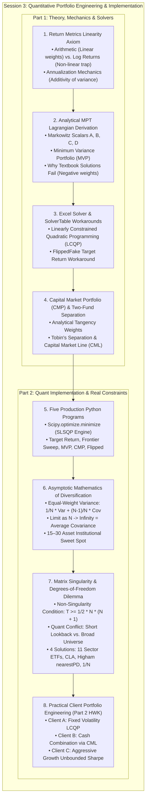

# APS1051: Session 3 Bilingual Study Notes
# 第三課雙語研習筆記：量化投資組合工程、數學推導與真實約束實戰 (Quantitative Portfolio Engineering & Real Market Constraints)

**Course / 課程：** APS1051: Portfolio Management under Real Market Constraints（真實市場約束下的投資組合管理）  
**Institution / 機構：** University of Toronto | Master of Engineering (ELITE Program)  
**Instructors / 教授：** Sabatino Costanzo & Loren Trigo  
**Student / 學生：** ChunKit Poon（潘俊傑）  
**Primary Source Materials / 核心教學材料：**
* `S3A1.Presentations`: `PortfolioPresentation.pptx` (69 Slides) & `PortfolioPresentation_GUIDE.pdf` (Complete Spoken Commentary)
* `S3B1.Presentations`: `1.EffectOfDiversification.pptx` (10 Slides) & `1.Effect of Diversification_GUIDE.pdf`
* `S3A5.Miscellaneous.HomeworkUpdtd`: Python Scripts 1–5, Excel Spreadsheets (`EfficientFrontier3Stocks.xlsx`, `MarketPortfolio3Stocks.xlsx`, `SolverMinimization.xlsx`, `SolverTableExample.xlsx`), Spreadsheet Guides
* `S3B3.Miscellaneous.HomeworkAM_updated`: Critical Line Algorithm (`CLA_Math.pdf`, `KwanCriticalLineAlgorithm.pdf`), Higham Regularization (`posdef.py`), `ChallengeOfDiversification.docx`, `PART 2 HOMEWORK 2 - PYPORTFOLIOOPT.docx`
**Format Structure / 格式規範：** Rigorous English technical paragraphs paired with immediate Cantonese intuition, real-world commentary, and annotations (極致嚴謹英文量化推導，緊密穿插地道廣東話實戰導讀與直覺註解).

---

## Executive Overview & Architectural Roadmap (Session 3)
## 第三課核心知識全景路線圖



---

## 3.1 Return Metrics: The Fundamental Linearity Axiom (Slides 3–9 & Guide)

### English Technical Foundation:
Quantitative portfolio construction begins with the definition of portfolio holdings and asset returns. Let an eligible universe consist of $n$ assets with share holdings $\boldsymbol{\theta} = (\theta_1, \dots, \theta_n)$ and dollar values $v_i$. The portfolio weight is $w_i = v_i / \sum v_j$, subject to full investment $\mathbf{1}^T \mathbf{w} = 1$.

A critical theoretical nuance emphasized in Session 3 is the mathematical distinction between **Percentage (Arithmetic) Returns** and **Logarithmic (Continuously Compounded) Returns**:
* **Arithmetic Percentage Return:** $R_{i,t} = (P_{i,t} - P_{i,t-1}) / P_{i,t-1}$
* **Logarithmic Return:** $r_{i,t} = \ln(P_{i,t} / P_{i,t-1})$

#### The Portfolio Return Non-Linearity Trap:
For percentage returns, the return of a portfolio is strictly a linear combination of asset returns:
$$R_{p,t} = \sum_{i=1}^n w_i R_{i,t} = \mathbf{w}^T \mathbf{R}_t \implies \mu_p = E[R_{p,t}] = \mathbf{w}^T \boldsymbol{\mu}$$
For logarithmic returns, this linear property **fails completely**:
$$\ln\left( \sum_{i=1}^n w_i \frac{P_{i,t}}{P_{i,t-1}} \right) \ne \sum_{i=1}^n w_i \ln\left(\frac{P_{i,t}}{P_{i,t-1}}\right)$$
*Instructor Axiom:* In portfolio weight optimization, **arithmetic returns must be used exclusively**. Applying weighted averages to logarithmic returns introduces mathematical distortion into the portfolio’s expected return and variance calculations.

> 🗣️ **廣東話導讀與實戰註解：**  
> **初學量化最容易犯嘅低級數學錯誤：用錯 Log Return 計資產權重！**  
> 做時間序列模型（例如計單一股票波動性）嗰陣，Log Return 因為可以時間相加，所以好好用；但係，**喺資產組合加權優化嘅時候，絕對唔可以用對數回報（Log Return）！**  
> 點解？因為只有百分比算術回報（Percentage Return），資產組合嘅總收益先至等於各股票收益嘅線性加權總和（$\mu_p = \mathbf{w}^T \boldsymbol{\mu}$）。如果你將 Log Return 乘以權重相加，數學上完全唔等於組合嘅實際回報！記住：權重優化一律用百分比回報。

---

## 3.2 Variance, Volatility, and Annualization Mechanics (Slides 10–12 & Guide)

### English Technical Foundation:
Asset variance is defined as $\sigma_X^2 = E[(X - \mu_X)^2]$. Over short estimation intervals (daily data), expected returns hover near zero ($\mu \approx 0$). Consequently, variance simplifies to the uncentered second moment:
$$\sigma_X^2 \approx E\left[X^2\right]$$
This zero-mean approximation forms the operational baseline for ARCH/GARCH volatility modeling.

#### Annualization Additivity:
Because independent variances scale linearly with time:
* **Daily Frequency (252 Trading Days):** $\sigma^2_{\text{annual}} = \sigma^2_{\text{daily}} \times 252 \implies \sigma_{\text{annual}} = \sigma_{\text{daily}} \times \sqrt{252}$
* **Monthly Frequency (12 Months):** $\sigma^2_{\text{annual}} = \sigma^2_{\text{monthly}} \times 12 \implies \sigma_{\text{annual}} = \sigma_{\text{monthly}} \times \sqrt{12}$

#### Frequency vs. Sample Size ($T_{\text{freq}}$ vs. $N_{\text{obs}}$):
The annualization scalar ($252$ or $12$) represents annual sampling frequency, NOT sample size. A variance estimated from 20 daily observations is still annualized by multiplying by 252. However, to guarantee statistical stability of the sample covariance matrix, the sample size $N_{\text{obs}}$ should generally exceed 60 observations.

> 🗣️ **廣東話導讀與實戰註解：**  
> 波動率（標準差 $\sigma$）係方差嘅平方根。在金融計算入面，方差隨時間係線性累積嘅，所以：  
> * 日度轉年化：方差乘以 252，標準差（波動率）乘以 $\sqrt{252}$。  
> * 月度轉年化：方差乘以 12，標準差（波動率）乘以 $\sqrt{12}$。  
> 留意教授嘅特別提醒：乘數 252 或 12 只係**採樣頻率**，同學成日將佢同「樣本容量（Sample Size）」搞亂。就算你只用過去 20 日嘅數據計波動率，年化乘數一樣係 $\sqrt{252}$。但為咗保證統計穩定性，樣本長度建議至少要有 60 筆數據以上。

---

## 3.3 Analytical Derivations of Modern Portfolio Theory (Slides 24–32 & Guide)

### English Technical Foundation:
Markowitz formulated optimal portfolio selection as a constrained quadratic optimization problem. In the classic model with a fixed required return $\mu_{\text{req}}$:
$$\min_{\mathbf{w}} \frac{1}{2} \mathbf{w}^T \mathbf{C} \mathbf{w} \quad \text{subject to: } \mathbf{1}^T \mathbf{w} = 1, \quad \boldsymbol{\mu}^T \mathbf{w} = \mu_{\text{req}}$$
Where $\mathbf{C}$ is the $n \times n$ covariance matrix.

#### Lagrangian Derivation (Unconstrained / Shorts Allowed):
Construct the Lagrangian function with multipliers $\lambda_1$ and $\lambda_2$:
$$\mathcal{L}(\mathbf{w}, \lambda_1, \lambda_2) = \frac{1}{2}\mathbf{w}^T \mathbf{C} \mathbf{w} - \lambda_1 (\mathbf{1}^T \mathbf{w} - 1) - \lambda_2 (\boldsymbol{\mu}^T \mathbf{w} - \mu_{\text{req}})$$
Setting the gradient with respect to $\mathbf{w}$ to zero:
$$\nabla_{\mathbf{w}} \mathcal{L} = \mathbf{C}\mathbf{w} - \lambda_1 \mathbf{1} - \lambda_2 \boldsymbol{\mu} = \mathbf{0} \implies \mathbf{w} = \mathbf{C}^{-1}(\lambda_1 \mathbf{1} + \lambda_2 \boldsymbol{\mu})$$

#### The Fundamental Markowitz Scalar Constants:
Define the four fundamental scalars:
$$A = \mathbf{1}^T \mathbf{C}^{-1}\boldsymbol{\mu}, \quad B = \boldsymbol{\mu}^T \mathbf{C}^{-1}\boldsymbol{\mu}, \quad C = \mathbf{1}^T \mathbf{C}^{-1}\mathbf{1}, \quad D = BC - A^2$$
Applying constraints yields the $2 \times 2$ system:
$$\begin{bmatrix} C & A \\ A & B \end{bmatrix} \begin{bmatrix} \lambda_1 \\ \lambda_2 \end{bmatrix} = \begin{bmatrix} 1 \\ \mu_{\text{req}} \end{bmatrix} \implies \lambda_1 = \frac{B - A\mu_{\text{req}}}{D}, \quad \lambda_2 = \frac{C\mu_{\text{req}} - A}{D}$$
Substituting $\lambda_1, \lambda_2$ back yields the exact analytical weight vector:
$$\mathbf{w}^* = \frac{B - A\mu_{\text{req}}}{D}\mathbf{C}^{-1}\mathbf{1} + \frac{C\mu_{\text{req}} - A}{D}\mathbf{C}^{-1}\boldsymbol{\mu}$$

#### Global Minimum Variance Portfolio (MVP):
Omitting the target return constraint yields the minimum risk portfolio at the tip of the Markowitz bullet:
$$\mathbf{w}_{\text{mvp}} = \frac{\mathbf{C}^{-1}\mathbf{1}}{\mathbf{1}^T \mathbf{C}^{-1}\mathbf{1}} = \frac{\mathbf{C}^{-1}\mathbf{1}}{C}, \quad \sigma_{\text{mvp}}^2 = \frac{1}{C}, \quad \mu_{\text{mvp}} = \frac{A}{C}$$

> 🗣️ **廣東話導讀與實戰註解：**  
> 這段係 Markowitz 理論嘅精華數學證明：利用高等微積分嘅拉格朗日乘子法（Lagrange Multipliers）。  
> 透過對權重求偏導，我哋可以定義出四大經典 Markowitz 標量常數（$A, B, C, D$），從而直接推導出效率前緣上任意點嘅封閉式解析權重公式 $\mathbf{w}^*$！而子彈圖最左端嘅「全局最小方差組合（MVP）」，其最優權重就係 $\frac{\mathbf{C}^{-1}\mathbf{1}}{C}$，其方差剛好就係 $\frac{1}{C}$。  
> 留意：呢個解析公式嘅成立，前設係**容許自由賣空（$w_i < 0$）**。

---

### English Technical Foundation:
The fatal limitation of these textbook analytical equations is that they inevitably produce **negative weights ($w_i < 0$)**, dictating aggressive short sales. In institutional reality, short selling entails prohibitive locate borrow fees, margin recall risks, regulatory bans, and unlimited downside liability.

When the realistic non-negativity constraint ($w_i \ge 0$) is enforced, the optimization problem transforms from an equality-constrained Lagrangian system into a **Linearly Constrained Quadratic Program (LCQP)** with inequality constraints. Closed-form analytical expressions cease to exist; the optimal weights must be computed via numerical approximation algorithms (Excel Solver's GRG Nonlinear or Python's SLSQP).

> 🗣️ **廣東話導讀與實戰註解：**  
> **點解教科書嘅解析公式喺真實市場行唔通？**  
> 因為公式計出嚟嘅權重幾乎肯定會有負數（賣空 Shorting）。但在真實世界中，大部分退休基金嚴禁沽空，而且沽空要借貨手續費，遇著暴升仲會被逼倉打靶。  
> 一旦我哋加入真實約束條件「純做多（$w_i \ge 0$）」，數學上就引入咗**不等式約束**，拉格朗日乘子法直接失效，**世界上再冇任何封閉式代數公式可以一筆過計出最優權重**！我哋必須依賴數值求解器（Excel Solver 或 Python SLSQP）做數值逼近求解。

---

## 3.4 Excel Solver & SolverTable Implementation (Slides 33–35 & Guides)

### English Technical Foundation:
The curriculum operationalizes MVO within Microsoft Excel via the **Solver** and **SolverTable** add-ins:
* **Single-Variable Prototype (`SolverMinimization.xlsx` — Slide 33):** Minimizes $y = x^2 + 12x + 32$ using GRG Nonlinear, verifying convergence to vertex $(-6, -4)$.
* **Parametric Sensitivity (`SolverTableExample.xlsx` — Slide 34):** Demonstrates automating multi-run optimizations via One-Way Tables across changing input cells.
* **3-Stock Efficient Frontier (`EfficientFrontier3Stocks.xlsx` — Slide 35):**
  * `MeanReturns` (`B5:D5`), `StDev` (`B6:D6`), Correlation Matrix (`B9:D11`).
  * Covariance Matrix `CovarMat` (`H9:J11`) populated via $\sigma_{ij} = \rho_{ij}\sigma_i\sigma_j$.
  * Changing Cells `Invested` (`B15:D15`), initialized to $0.01$.
  * Portfolio Variance `PortVar` (`B21`):
    ```excel
    =MMULT(Invested, MMULT(CovarMat, TRANSPOSE(Invested)))
    ```
  * Constraints: `TotInvested = 1` (`E15 = 1`), `PortExpReturn >= ReqdReturn` (`B19 >= D19`), and `Make Unconstrained Variables Non-Negative` checked.
  * For $\mu_{\text{req}} = 12\%$, Solver converges to $w_X = 0.50, w_Y = 0.00, w_Z = 0.50$, yielding $\sigma_p = 12.0\%$. Running SolverTable from $10\%$ to $14\%$ (step $0.5\%$) outputs worksheet `STS_1`, plotting the continuous efficient frontier.

> 🗣️ **廣東話導讀與實戰註解：**  
> 喺 Excel 入面構建效率前緣嘅核心步驟：  
> 1. 利用 `MMULT` 同 `TRANSPOSE` 矩陣相乘函數，喺單元格 `B21` 寫出二次型組合方差 $\mathbf{w}^T \mathbf{C} \mathbf{w}$。  
> 2. 打開 Solver，將目標設為最小化 `PortVar`，約束條件設定權重和大於等於 1、組合預期回報大於等於目標回報 `ReqdReturn`，勾選非負（純做多），選 **GRG Nonlinear** 求解。  
> 3. 用 **SolverTable** 自動將目標回報由 10% 掃描到 14%，每次運算結果自動生成一張報表 `STS_1`，一鍵畫出整條光滑嘅效率前緣！

---

## 3.5 Capital Market Portfolio & Two-Fund Separation Theorem (Slides 37–52 & Guide)

### English Technical Foundation:
Combining a risky derived portfolio ($\mu_{\text{der}}, \sigma_{\text{der}}$) with a risk-free asset ($\mu_{rf}, \sigma_{rf} = 0$) produces a linear risk-return tradeoff:
$$\mu_{\text{combo}} = w_{\text{der}} \mu_{\text{der}} + (1 - w_{\text{der}}) \mu_{rf}, \quad \sigma_{\text{combo}} = w_{\text{der}} \sigma_{\text{der}} \implies w_{\text{der}} = \frac{\sigma_{\text{combo}}}{\sigma_{\text{der}}}$$
Substituting $w_{\text{der}}$ yields the **Capital Market Line (CML)** equation:
$$\mu_{\text{combo}} = \mu_{rf} + \left(\frac{\mu_{\text{der}} - \mu_{rf}}{\sigma_{\text{der}}}\right) \sigma_{\text{combo}}$$
The slope is the **Sharpe Ratio** of the risky allocation. Rotating this line upward to its point of maximum tangency with the Markowitz efficient frontier identifies the unique **Capital Market Portfolio (CMP)**.

#### Analytical CMP Weights (with shorts allowed):
$$\mathbf{w}_{\text{cmp}} = \frac{\mathbf{C}^{-1}(\boldsymbol{\mu} - \mu_{rf}\mathbf{1})}{\mathbf{1}^T \mathbf{C}^{-1}(\boldsymbol{\mu} - \mu_{rf}\mathbf{1})}$$

#### Excel Solver Implementation (`MarketPortfolio3Stocks.xlsx` — Slide 52):
Objective cell `Sharpe` (`B24`) is maximized by varying `Invested` (`B15:D15`) subject only to `TotInvested = 1` and non-negativity. **The target return constraint is omitted entirely** because the tangency portfolio is unique. For the 3-stock model, Solver computes $w_X = 0.10, w_Y = 0.00, w_Z = 0.89$, yielding $\mu_{\text{cmp}} = 10.0\%, \sigma_{\text{cmp}} = 8.0\%$.

#### Tobin's Two-Fund Separation Theorem:
Investment decision-making separates into two independent steps:
1. **Technical Optimization (Universal):** The quantitative manager identifies the single tangency portfolio (CMP) maximizing the Sharpe ratio.
2. **Personal Risk Financing (Client-Specific):** Capital is split between the CMP and risk-free cash along the CML line. Because the straight CML line lies strictly above the curved Markowitz frontier, **any combined portfolio on the CML strictly dominates any standalone uncombined equity portfolio with identical volatility**.

> 🗣️ **廣東話導讀與實戰註解：**  
> **資本市場線（CML）與托賓兩基金分離定理：**  
> * 當我哋將無風險國債利率 $\mu_{rf}$ 連線到風險資產前緣嗰陣，條線嘅斜率就係夏普比率。將條射線向上轉動，切於效率前緣嘅最高點，就係全市場最優嘅**切點資本市場組合（CMP）**！  
> * 在 `MarketPortfolio3Stocks.xlsx` 試算表入面，**我哋完全唔需要設定目標回報**，直接將目標單元格設為「極大化夏普比率」，Solver 即刻計出切點權重（10% 股票 X + 89% 股票 Z）。  
> * **兩基金分離定理嘅精髓：** 量化經理對所有客戶都構建同一隻最高 Sharpe 嘅 CMP 組合。保守嘅客配 50% 現金 + 50% CMP；進攻型嘅客配 100% CMP。因為 CML 直線始終壓喺彎曲嘅效率前緣上方，所以**「CMP 混搭現金」嘅效果，絕對好過你直接去買前緣上面同等波動率嘅純股票組合！**

---

## 3.6 Dissection of the Five Production Python Scripts (Slides 53–69)

### English Technical Foundation:
Because Excel cannot scale beyond small universes, Session 3 provides 5 production Python scripts utilizing `scipy.optimize`:
1. [`1.ClassicMarkowitz_...py`](file:///G:/Other%20computers/My%20Computer/aps1051/S3A5.Miscellaneous.HomeworkUpdtd/1.ClassicMarkowitz_FixedRequiredReturnMinimizedVariancePortfolio.py): Optimizes a single efficient portfolio targeting $\mu_{\text{req}} = 8\%$ using Sequential Least Squares Programming (`SLSQP`) with non-negativity bounds `bnds = tuple((0, 1) for x in range(no_assets))`.
2. [`2.ClassicMarkowitz_..._EfficientFrontier.py`](file:///G:/Other%20computers/My%20Computer/aps1051/S3A5.Miscellaneous.HomeworkUpdtd/2.ClassicMarkowitz_FixedRequiredReturnMinimizedVariancePortfolio_EfficientFrontier.py): Replaces Excel's SolverTable by looping over `TargetRet = np.linspace(0.0, 0.25, 50)`, recording minimized volatilities `res['fun']`, and exporting the efficient frontier plot `F2.pdf`.
3. [`3.ClassicMarkowitz_MinimumVariancePortfolio.py`](file:///G:/Other%20computers/My%20Computer/aps1051/S3A5.Miscellaneous.HomeworkUpdtd/3.ClassicMarkowitz_MinimumVariancePortfolio.py): Minimizes total portfolio variance `Variance(weights) = portfolio(weights)[1]**2` subject only to $\sum w_i = 1$, finding the tip of the bullet.
4. [`4.ClassicMarkowitz_MaximumSharpePortfolio...py`](file:///G:/Other%20computers/My%20Computer/aps1051/S3A5.Miscellaneous.HomeworkUpdtd/4.ClassicMarkowitz_MaximumSharpePortfolioOrMarketPortfolio.py): Maximizes the Sharpe ratio by minimizing its negative: `def Sharpe_CAPM(weights): return -portfolio_CAPM(weights, r_f)[2]`.
5. [`5.ClassicMarkowitz_..._FlippedFake.py`](file:///G:/Other%20computers/My%20Computer/aps1051/S3A5.Miscellaneous.HomeworkUpdtd/5.ClassicMarkowitz_FixedRequiredReturnMinimizedVariancePortfolio_EfficientFrontier_FlippedFake.py): Addresses "Harry's Problem" (fixing target volatility $\sigma \le 16\%$ and maximizing return). Because standard `scipy.optimize` lacks Quadratically Constrained Quadratic Programming (QCQP), it precomputes a 50-point lookup table, finds the upper-branch target return matching $\sigma \le 0.16$ ($\mu = 18.88\%$), and executes Program 1.

> 🗣️ **廣東話導讀與實戰註解：**  
> 教授提供嘅 5 隻 Python 程式架構拆解：  
> * **程式 1：** 經典 Markowitz，指定目標回報 8%，調用 `scipy.optimize.minimize`，用 `method='SLSQP'` 求解最小波動率。  
> * **程式 2：** 用 `for` 循環掃描 50 個目標回報點，取代 Excel SolverTable，自動畫出效率前緣圖。  
> * **程式 3：** 移除目標回報，純粹求解方差極小值，定位子彈圖鼻尖嘅全局最小方差組合（MVP）。  
> * **程式 4：** 最大化夏普比率。由於 Python 優化器只能「最小化（minimize）」，所以編程小技巧係**定義一個最小化「負夏普比率（-Sharpe）」嘅目標函數**。  
> * **程式 5（FlippedFake）：** 解決 Harry 鎖定波動率上限嘅問題。因為標準 Python 冇原生二次約束求解器（QCQP），所以程式用咗個聰明嘅查表法變通：先掃描前緣對照表，查出 16% 波動率對應嘅最高回報 18.88%，再調用程式 1 求解。

---

## 3.7 Asymptotic Mathematics of Diversification (Slides & Guides)

### English Technical Foundation:
Session 3 establishes the formal algebraic proof of risk reduction under equal allocation ($w_i = 1/N$). Expanding the portfolio variance sum:
$$\sigma_p^2 = \sum_{i=1}^N w_i^2 \sigma_i^2 + \sum_{i=1}^N \sum_{j \ne i}^N w_i w_j \sigma_{ij} = \frac{1}{N^2}\sum_{i=1}^N \sigma_i^2 + \frac{1}{N^2}\sum_{i=1}^N \sum_{j \ne i}^N \sigma_{ij}$$
Defining Average Asset Variance $\overline{\sigma^2} = \frac{1}{N}\sum \sigma_i^2$ and Average Covariance $\overline{\text{Cov}} = \frac{1}{N(N-1)}\sum \sum_{j \ne i}\sigma_{ij}$:
$$\sigma_p^2 = \frac{1}{N^2}(N\overline{\sigma^2}) + \frac{1}{N^2}(N(N-1)\overline{\text{Cov}}) = \mathbf{\frac{1}{N}\overline{\sigma^2} + \frac{N-1}{N}\overline{\text{Cov}} = \frac{1}{N}(\overline{\sigma^2} - \overline{\text{Cov}}) + \overline{\text{Cov}}}$$

#### The Asymptotic Limit as $N \to \infty$:
$$\lim_{N \to \infty} \sigma_p^2 = \lim_{N \to \infty} \left[ \frac{1}{N}\overline{\sigma^2} + \left(1 - \frac{1}{N}\right)\overline{\text{Cov}} \right] = 0 + 1 \cdot \overline{\text{Cov}} = \mathbf{\overline{\text{Cov}}}$$

#### Institutional Insights:
1. **Idiosyncratic Risk Vanishes:** Specific risk scaled by $1/N$ approaches zero asymptotically.
2. **Systematic Risk is Non-Diversifiable:** Market risk is lower-bounded by average covariance $\overline{\text{Cov}}$.
3. **The 15 to 50 Asset Rule:** 15 assets capture ~90% of diversification benefits; beyond 50 assets marginal gain is virtually zero. However, this rule fails for corporate credit portfolios subject to rare catastrophic tail-risk defaults.

> 🗣️ **廣東話導讀與實戰註解：**  
> **分散投資嘅漸近數學極限證明：**  
> 當我哋將資金平均分配到 $N$ 隻股票（$w_i = 1/N$），組合總方差可以嚴格拆解為兩部分：  
> $$\sigma_p^2 = \frac{1}{N}\overline{\sigma^2} + \left(1 - \frac{1}{N}\right)\overline{\text{Cov}}$$  
> 當 $N \to \infty$（買入無限多隻股票），第一項 $\frac{1}{N}\overline{\sigma^2}$ 即刻變成 0！這證明**個別公司嘅特有風險完全可以被免費分散消除**。  
> 但第二項會收斂為 $\overline{\text{Cov}}$（平均協方差），這就係點解宏觀大市暴跌嗰陣，你買 500 隻股票一樣會跟住跌，因為市場系統性共震係無法靠買多幾隻股票分散嘅。實務上，持有 15 至 30 隻股票已經食足 90% 嘅分散好處，超過 50 隻之後嘅邊際減脂效果幾乎係零！

---

## 3.8 Covariance Singularity & The Degrees-of-Freedom Dilemma (Guides & Code)

### English Technical Foundation:
A covariance matrix $\mathbf{C}$ becomes singular (non-invertible, $\det(\mathbf{C}) = 0$) when asset count $N \ge T$ (observations), collinearity exists, or data cases are cloned. To ensure non-singularity, the statistical rule of thumb requires:
$$T_{\text{obs}} \ge \frac{1}{2}N(N+1)$$
* For $N = 11$ assets: $T_{\text{obs}} \ge \frac{1}{2}(11)(12) = 66$ trading days.
* For $N = 30$ assets: $T_{\text{obs}} \ge 465$ trading days ($\sim 2$ years).

#### The Central Quantitative Conflict:
* Momentum requires **short lookbacks** ($T \le 60$ days) to avoid long-term mean reversion (Keller et al. 2015).
* But $T = 66$ days limits the universe to $N \le 11$ assets to prevent matrix singularity.
* Yet optimal diversification demands $N \ge 15 \sim 30$ assets!

#### Four Industrial Solutions:
1. **Sector ETFs:** Deploying 11 Sector ETFs (e.g., `XLK`, `XLF`) satisfies $N \le 11$ while internally diversifying hundreds of stocks.
2. **Critical Line Algorithm (CLA - Markowitz & Todd 2000, Kwan 2011):** Traces piece-wise linear critical paths across active boundary sets ($\mathbf{IN}, \mathbf{UP}, \mathbf{DN}$) without inverting the covariance matrix, fully solving singular regimes ($N > T$).
3. **Higham (1988) Nearest Positive Definite Projection ([`posdef.py`](file:///G:/Other%20computers/My%20Computer/aps1051/S3B3.Miscellaneous.HomeworkAM_updated/PROGRAMS/markowitz_PYOPT_regularization/markowitz_PYOPT_regularization/posdef.py)):** Projects ill-conditioned matrices onto the symmetric positive definite cone via SVD.
4. **$1/N$ Heuristic Fallback:** Modern engines (like `PyPortfolioOpt`) default to equal weighting when matrix condition numbers blow up.

> 🗣️ **廣東話導讀與實戰註解：**  
> **量化投資組合管理嘅世紀大衝突：**  
> * 矩陣求逆經驗法則：觀測數據必須滿足 $T \ge \frac{1}{2}N(N+1)$，矩陣先唔會奇異（Singular）報錯。  
> * 如果我哋跟 Session 2 嘅動量法則，回測窗口必須短（例如 60 至 66 個交易日），咁資產數目 $N$ 就被死死卡喺 **11 隻之內**！  
> * 但剛才證明過，充分分散投資起碼要 15 到 30 隻資產，咁點算？  
> **四大機構級破解奇招：**  
> 1. **買 11 隻行業板塊 ETF（如科技 XLK、金融 XLF）：** 滿足 $N \le 11$ 免報錯，但每隻 ETF 背後自帶幾百隻股票嘅充分分散！  
> 2. **Markowitz 臨界線算法（CLA）：** 改用轉角組合分段追蹤，**全程完全唔使對成個協方差矩陣求逆**，即使 $N > T$ 依然完美畫出效率前緣！  
> 3. **Higham 最近正定矩陣修復（`posdef.py`）：** 用奇異值分解 SVD 將病態特徵值修正為正數。  
> 4. **等權重（$1/N$）降級備用：** 遇著極端黑天鵝矩陣報警，程式自動退守等權重避險。

---

## 3.9 Practical Portfolio Engineering: Client Mandates (Part 2 HWK)

### English Technical Foundation:
Part 2 applies `markowitz_PYOPT` to 3 distinct client investment mandates over an 11-year post-GFC benchmark (2009-01-30 to 2020-01-30) on `SPY` / `DIA`:
* **Client A (Risk-Averse, Volatility Capped at 15%):**
  * *Model:* **Case 2 (`ef.efficient_risk(0.15)`)** — Flipped Markowitz directly enforces the quadratic constraint $\mathbf{w}^T \mathbf{C} \mathbf{w} \le (0.15)^2$, maximizing return within the hard volatility cap.
* **Client B (Market-Level Return + Fixed Cash/Treasury Cushion):**
  * *Model:* **Case 1 (`ef.max_sharpe()`) combined with Cash** — Uses Two-Fund Separation to linearly scale risk along the Capital Market Line, outperforming standalone equity portfolios burdened by cash drag.
* **Client C (Risk-Indifferent Aggressive Maximum Growth):**
  * *Model:* **Case 3 (`ef.efficient_return()`)** — Targets an aggressive hurdle rate exceeding market benchmarks with zero cash drag, concentrating capital into high-momentum sector ETFs along the upper efficient frontier.

> 🗣️ **廣東話導讀與實戰註解：**  
> **第三課實戰大作業——三大客戶委託調用方案：**  
> * **客戶 A（極度怕輸，波動率硬性封頂 15%）：** 調用 **Case 2（Flipped Markowitz）**，鎖死風險上限，將收益推到極限。  
> * **客戶 B（想賺大市回報，但堅持要留固定比例現金/國債）：** 調用 **Case 1（最大夏普 CMP）**，利用 CML 線性混搭現金。由於 CML 支配前緣，呢種配置遠遠好過直接買一隻帶有現金拖累嘅普通股票基金。  
> * **客戶 C（只要最高回報，零現金，無懼波動）：** 調用 **Case 3（經典 Markowitz 高目標回報）**，在效率前緣頂端全倉押注最高動量嘅行業板塊。

---


---

## 3.10 Session 3 Quantitative Formula Cheat-Sheet & Exam Takeaways
## 第三課必背核心量化公式與複習速查表

| 定理 / 概念名稱 | 核心數學公式 / 矩陣表達式 | 變量定義與自由度條件 | 華爾街實務意義與踩坑警告 |
| :--- | :--- | :--- | :--- |
| **百分比收益線性公理** | $R_p = \sum_{i=1}^N w_i R_i = \mathbf{w}^T \mathbf{R}$ | $R_i = (P_t - P_{t-1})/P_{t-1}$ | **嚴禁**在組合加權中使用對數收益率！對數收益加權必然違反線性公理。 |
| **年化波動率法則** | $\sigma_{	ext{ann}} = \sigma_{	ext{daily}} \sqrt{252}, \quad \sigma^2_{	ext{ann}} = \sigma^2_{	ext{daily}} 	imes 252$ | 252 為交易日頻率 | 方差隨時間嚴格線性疊加；樣本容量 $N_{	ext{obs}}$ 影響估計精度，絕不改變年化常數。 |
| **Markowitz 矩陣標量** | $A = \mathbf{1}^T \mathbf{C}^{-1}oldsymbol{\mu}, \quad B = oldsymbol{\mu}^T \mathbf{C}^{-1}oldsymbol{\mu}, \quad C = \mathbf{1}^T \mathbf{C}^{-1}\mathbf{1}, \quad D = BC - A^2$ | $\mathbf{C}$: 協方差矩陣, $oldsymbol{\mu}$: 收益向量 | 決定無約束有效前沿雙曲線形狀的四大核心常數。 |
| **解析最小方差組合 (MVP)** | $\mathbf{w}_{	ext{mvp}} = rac{\mathbf{C}^{-1}\mathbf{1}}{C}, \quad \sigma^2_{	ext{mvp}} = rac{1}{C}, \quad \mu_{	ext{mvp}} = rac{A}{C}$ | 頂點方差 $1/C$ | 有效前沿最左端頂點；無需期望回報輸入即可獲得全局方差最小。 |
| **無約束有效組合權重** | $\mathbf{w}^* = rac{B - A\mu_0}{D} \mathbf{C}^{-1}\mathbf{1} + rac{C\mu_0 - A}{D} \mathbf{C}^{-1}oldsymbol{\mu}$ | $\mu_0$: 目標回報 | 解析解必然產生極端負權重（做空），實盤必須改用數值優化 LCQP 加做多約束。 |
| **切點組合 (CMP / Tangency)** | $\mathbf{w}_{	ext{cmp}} = rac{\mathbf{C}^{-1}(oldsymbol{\mu} - R_f \mathbf{1})}{\mathbf{1}^T \mathbf{C}^{-1}(oldsymbol{\mu} - R_f \mathbf{1})}$ | $R_f$: 無風險利率 | 夏普比率最大點；資本市場線（CML）與前沿唯一相切之純風險資產組合。 |
| **資本市場線 (CML)** | $\mu_{	ext{combo}} = R_f + \left(rac{\mu_{	ext{cmp}} - R_f}{\sigma_{	ext{cmp}}}
ight) \sigma_{	ext{combo}}$ | 斜率為 $	ext{Sharpe}_{	ext{cmp}}$ | 兩基金分離定理：任何客戶的最佳配置，均為切點組合與無風險資產的線性組合。 |
| **等權組合分散定理** | $\sigma_p^2 = rac{1}{N}\overline{\sigma^2} + rac{N-1}{N}\overline{	ext{Cov}}$ | $N$: 資產數量 | 當 $N 	o \infty$ 時，特異方差 $	o 0$，組合方差極限為平均協方差 $\overline{	ext{Cov}}$。 |
| **協方差滿秩非奇異條件** | $T_{	ext{obs}} \ge rac{1}{2}N(N+1)$ | $T$: 歷史期數, $N$: 資產數 | 66 天動量窗口下，資產數上限僅為 11 隻；若 $N > 11$ 矩陣必奇異，無法求逆。 |
| **四大工業級奇異解法** | 1. 11 隻行業板塊 ETF<br>2. CLA 關鍵線算法（無矩陣求逆）<br>3. Higham (1988) `nearestPD` 投影<br>4. $1/N$ 等權回退 | 數值正定正則化 | 解決動量短窗口（$T \le 60$）與分散化大資產數（$N \ge 15$）的核心衝突。 |
