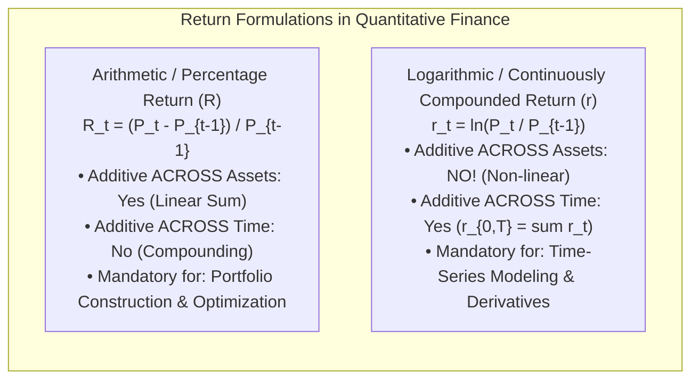
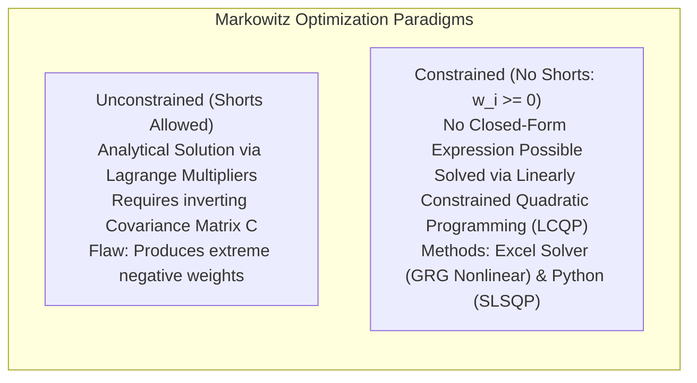
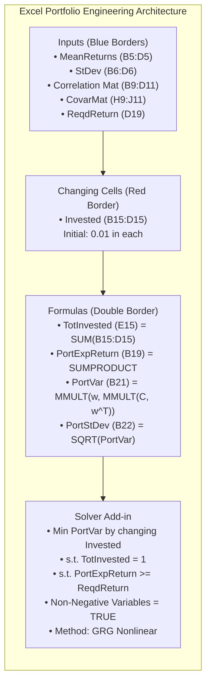
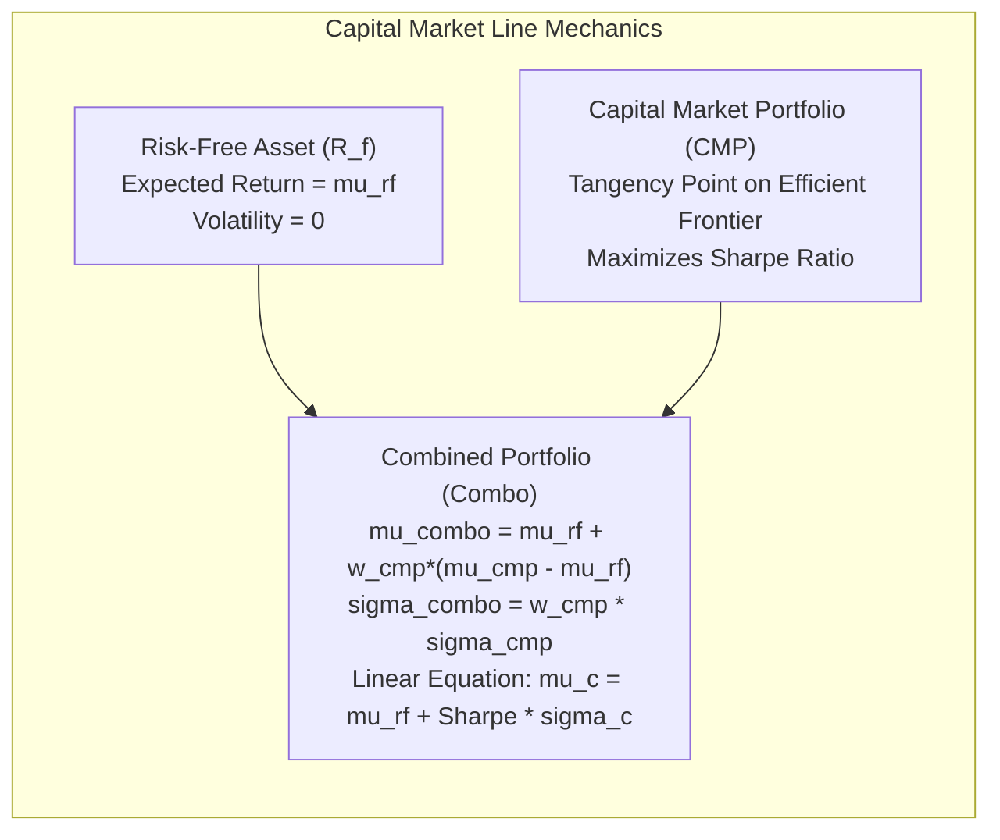
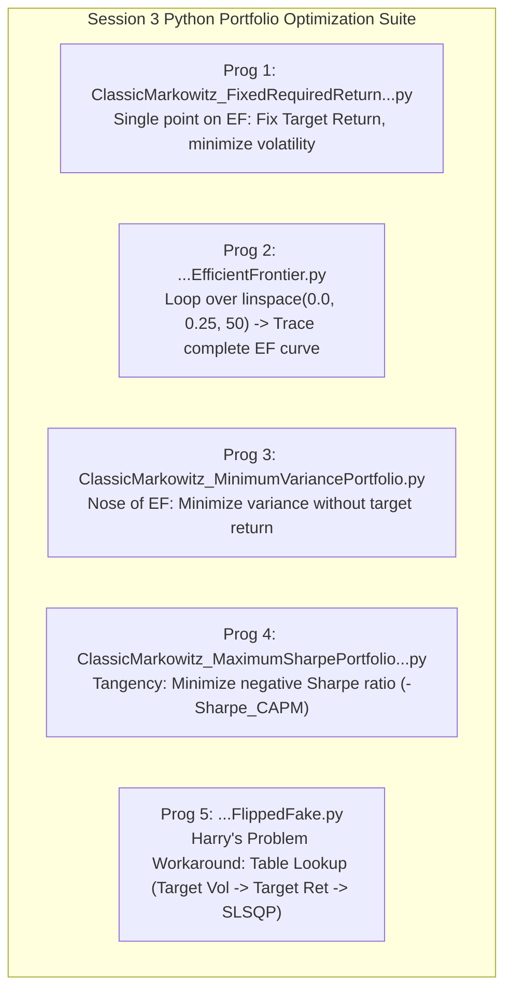
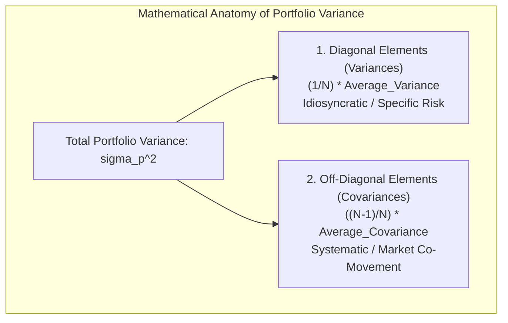
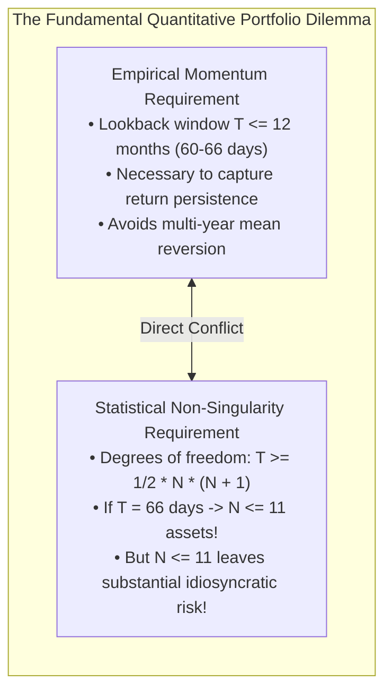
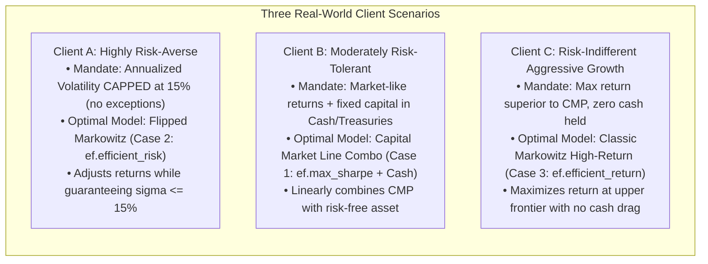

# APS1051: Comprehensive Session 3 Study Notes
**Course:** APS1051: Portfolio Management under Real Market Constraints  
**Institution:** University of Toronto | Master of Engineering (ELITE)  
**Instructors:** Sabatino Costanzo & Loren Trigo  
**Primary Source Materials:**
* `S3A1.Presentations`: `PortfolioPresentation.pptx` (69 Slides) & `PortfolioPresentation_GUIDE.pdf` (Complete Spoken Commentary)
* `S3B1.Presentations`: `1.EffectOfDiversification.pptx` (10 Slides) & `1.Effect of Diversification_GUIDE.pdf`
* `S3A5.Miscellaneous.HomeworkUpdtd`: Python Scripts 1–5, Excel Spreadsheets (`EfficientFrontier3Stocks.xlsx`, `MarketPortfolio3Stocks.xlsx`, `SolverMinimization.xlsx`, `SolverTableExample.xlsx`), Spreadsheet Guides
* `S3B3.Miscellaneous.HomeworkAM_updated`: Critical Line Algorithm (`CLA_Math.pdf`, `KwanCriticalLineAlgorithm.pdf`), Higham Regularization (`posdef.py`), `ChallengeOfDiversification.docx`, `PART 2 HOMEWORK 2 - PYPORTFOLIOOPT.docx`

---

## Executive Overview & Conceptual Architecture

Session 3 delivers the rigorous mathematical, algorithmic, and computational implementation of the theories introduced in Sessions 1 and 2. While Session 1 focused on **Portfolio Evaluation** (evaluating historical performance via Sharpe, Treynor, Alpha, and Brinson attribution) and Session 2 established the **Economic & Empirical Foundations** (the Markowitz-Sharpe paradigm and Keller, Butler, & Kipnis’s 2015 momentum revival), Session 3 transitions directly into **Quantitative Portfolio Engineering**.

```mermaid
flowchart TD
    subgraph S3["Session 3: Quantitative Portfolio Construction & Implementation"]
        direction TB
        subgraph Part1["Part 1: Theory, Mechanics & Classical Solvers"]
            T1["1. Mathematical Vocabulary & Matrix Algebra<br>• Asset Returns: Arithmetic vs. Logarithmic<br>• Covariance, Correlation & Annualization Mechanics<br>• Portfolio Variance in Quadratic Matrix Form"]
            T2["2. Classical Optimization Formulations<br>• Lagrangian Derivation (Unconstrained / Shorts Allowed)<br>• The Markowitz Constants A, B, C, D<br>• Analytical Minimum Variance Portfolio (MVP)"]
            T3["3. Real Market Constraints & Numerical Solvers<br>• Why Textbook Solutions Fail: Negative Weights<br>• Linearly Constrained Quadratic Programming (LCQP)<br>• Excel Solver, SolverTable & GRG Nonlinear"]
            T4["4. Five Core Python Programs (scipy.optimize)<br>• Prog 1: Efficient Portfolio (Target Return)<br>• Prog 2: Efficient Frontier Loop<br>• Prog 3: Global Minimum Variance Portfolio<br>• Prog 4: Tangency / Maximum Sharpe Portfolio<br>• Prog 5: Flipped Markowitz (Lookup Table Workaround)"]
        end

        subgraph Part2["Part 2: Real Market Constraints, Diversification & Industrial Scale"]
            D1["5. Asymptotic Mathematics of Diversification<br>• Derivation of Portfolio Variance under 1/N<br>• Limit as N -> Inf: Idiosyncratic Risk Vanishes<br>• Non-Diversifiable Systematic Risk = Average Covariance<br>• Practical Sweet Spot: 15 to 50 Assets"]
            D2["6. The Matrix Singularity Dilemma<br>• Degrees of Freedom Rule: T >= 1/2 * N * (N + 1)<br>• The Momentum Paradox: Short Lookback vs. Matrix Rank<br>• Higham (1988) Nearest Positive Definite Projection"]
            D3["7. Algorithmic Solutions without Matrix Inversion<br>• Critical Line Algorithm (CLA: Markowitz & Todd 2000, Kwan 2011)<br>• Industrial Optimization via PyPortfolioOpt & IBM CPLEX"]
            D4["8. Portfolio Mandates under Real Constraints<br>• Client A: Capped Volatility (Flipped Markowitz)<br>• Client B: Market-Like Return + Cash (Combo CML)<br>• Client C: Risk-Indifferent Maximum Growth (Uncapped)"]
        end

        Part1 --> Part2
    end
```



---

## Part 1: Mathematical Foundations & Vocabulary (Slides 3–23 & Guide)

Quantitative portfolio optimization requires rigorous formalization of portfolio holdings, returns, variances, and covariances into matrix algebra compatible with numerical optimization routines.

### 1.1 Formal Portfolio Representation & Weight Vectors (Slides 3–5)
* **Asset Universe:** An eligible universe consists of $n$ distinct assets $\{a_1, a_2, \dots, a_n\}$.
* **Portfolio Quantity Vector:** Formally, a portfolio is an ordered $n$-tuple of real numbers representing the number of units (shares) held in each asset:
  $$\boldsymbol{\theta} = (\theta_1, \theta_2, \dots, \theta_n), \quad \theta_i \in \mathbb{R}$$
* **Portfolio Weights ($w_i$):** Let $v_i$ denote the total dollar value of asset $a_i$ contained in the portfolio at time $t = 0$. The portfolio weight $w_i$ is the fraction of total portfolio wealth allocated to asset $i$:
  $$w_i = \frac{v_i}{\sum_{j=1}^n v_j}$$
* **Budget Constraint (Full Investment):** The sum of all asset weights must strictly equal 1 (100% of wealth):
  $$\sum_{i=1}^n w_i = 1$$
* **Vector Notation:**
  $$\mathbf{w} = \begin{bmatrix} w_1 \\ w_2 \\ \vdots \\ w_n \end{bmatrix}, \quad \mathbf{1} = \begin{bmatrix} 1 \\ 1 \\ \vdots \\ 1 \end{bmatrix}$$
  The budget constraint in vector dot-product form is:
  $$\mathbf{1}^T \mathbf{w} = 1$$

---

### 1.2 Arithmetic vs. Logarithmic Asset Returns: The Fundamental Additivity Axiom (Slides 6–9)
A core distinction emphasized in quantitative portfolio theory is the choice of return metric:



* **Arithmetic (Percentage) Return:**
  $$R_i = \frac{P_{i,t} - P_{i,t-1}}{P_{i,t-1}}$$
* **Logarithmic (Continuously Compounded) Return:**
  $$r_i = \ln\left(\frac{P_{i,t}}{P_{i,t-1}}\right)$$
* **The Portfolio Return Non-Linearity Trap:**
  * For arithmetic percentage returns, portfolio return is strictly **linear** across asset weights:
    $$R_p = \sum_{i=1}^n w_i R_i = \mathbf{w}^T \mathbf{R}$$
  * For logarithmic returns, this linear property **collapses completely**:
    $$\ln\left( \sum_{i=1}^n w_i \frac{P_{i,t}}{P_{i,t-1}} \right) \ne \sum_{i=1}^n w_i \ln\left(\frac{P_{i,t}}{P_{i,t-1}}\right)$$
  * *Instructor Rule:* **Never compute portfolio weighted averages on logarithmic returns!** Doing so introduces mathematical distortion into portfolio return calculations. Always compute arithmetic returns for portfolio weight optimization, and restrict log returns to time-series stationarity and volatility calculations.
* **Expected Return Vector ($\boldsymbol{\mu}$):**
  * By the Law of Large Numbers, the expected return of an asset converges to its sample arithmetic mean:
    $$\mu_i = E[R_i] = \frac{1}{T} \sum_{t=1}^T R_{i,t}$$
  * The vector of expected asset returns is denoted:
    $$\boldsymbol{\mu} = \begin{bmatrix} \mu_1 \\ \mu_2 \\ \vdots \\ \mu_n \end{bmatrix}$$
  * Expected Portfolio Return is:
    $$\mu_p = E[R_p] = \mathbf{w}^T \boldsymbol{\mu} = \sum_{i=1}^n w_i \mu_i$$

---

### 1.3 Variance, Volatility, and Annualization Mechanics (Slides 10–12)
* **Theoretical Variance:**
  $$\sigma_X^2 = \text{Var}(X) = E\left[(X - \mu_X)^2\right]$$
* **Sample Standard Deviation:**
  $$\sigma_X = \sqrt{\text{Var}(X)}$$
* **Zero-Mean Variance Approximation (Short Horizons):**
  * Over daily or ultra-short intraday intervals, expected returns hover very close to zero ($\mu \approx 0$).
  * Under this condition, variance simplifies to the uncentered second moment:
    $$\sigma_X^2 \approx E\left[X^2\right]$$
  * This approximation is widely adopted in high-frequency trading and GARCH volatility modeling.
* **Annualization Mechanics & Additivity:**
  * In finance, volatility must be normalized to an annual basis to compare across daily, weekly, or monthly sampling frequencies.
  * Because independent variances are additive over time:
    * **Daily Sampling (252 Trading Days):**
      $$\sigma^2_{\text{annual}} = \sigma^2_{\text{daily}} \times 252$$
      $$\sigma_{\text{annual}} = \sigma_{\text{daily}} \times \sqrt{252}$$
    * **Monthly Sampling (12 Months):**
      $$\sigma^2_{\text{annual}} = \sigma^2_{\text{monthly}} \times 12$$
      $$\sigma_{\text{annual}} = \sigma_{\text{monthly}} \times \sqrt{12}$$
* **Critical Distinction — Frequency vs. Sample Size ($T_{\text{period}}$ vs. $N_{\text{obs}}$):**
  * The annualization multiplier (252 or 12) represents the **annual sampling frequency**, NOT the length of the historical sample!
  * You can calculate daily variance from a sample of 20, 60, or 252 days; in every case, the daily variance is multiplied by 252 to annualize.
  * To ensure statistical stability of the sample variance, the sample size $N_{\text{obs}}$ should generally be at least 60 observations.

---

### 1.4 Covariance, Correlation, and the Covariance Matrix (Slides 13–19)
* **Covariance ($\sigma_{XY}$ or $\text{Cov}(X, Y)$):**
  $$\sigma_{XY} = E\left[(X - \mu_X)(Y - \mu_Y)\right]$$
  * Measures the unstandardized co-movement of two assets.
  * Dimensional units: $[\text{Return}]^2$ (e.g., $\%^2$ or $\text{dollars}^2$).
  * The covariance of an asset with itself equals its variance:
    $$\text{Cov}(X, X) = \sigma_{XX} = \sigma_X^2$$
* **Correlation ($\rho_{XY}$):**
  $$\rho_{XY} = \frac{\sigma_{XY}}{\sigma_X \sigma_Y}, \quad \rho_{XY} \in [-1, +1]$$
  * Standardized, dimensionless measure of linear association.
  * Normalizing by standard deviations removes annoying unit-of-measurement distortions.
* **Covariance Matrix ($\mathbf{C}$ or $\boldsymbol{\Sigma}$):**
  $$\mathbf{C} = \begin{bmatrix}
  \sigma_{11} & \sigma_{12} & \cdots & \sigma_{1n} \\
  \sigma_{21} & \sigma_{22} & \cdots & \sigma_{2n} \\
  \vdots & \vdots & \ddots & \vdots \\
  \sigma_{n1} & \sigma_{n2} & \cdots & \sigma_{nn}
  \end{bmatrix} = \begin{bmatrix}
  \sigma_1^2 & \rho_{12}\sigma_1\sigma_2 & \cdots & \rho_{1n}\sigma_1\sigma_n \\
  \rho_{21}\sigma_2\sigma_1 & \sigma_2^2 & \cdots & \rho_{2n}\sigma_2\sigma_n \\
  \vdots & \vdots & \ddots & \vdots \\
  \rho_{n1}\sigma_n\sigma_1 & \rho_{n2}\sigma_n\sigma_2 & \cdots & \sigma_n^2
  \end{bmatrix}$$
  * Properties of $\mathbf{C}$:
    1. **Symmetric:** $\mathbf{C} = \mathbf{C}^T$ since $\sigma_{ij} = \sigma_{ji}$.
    2. **Positive Semi-Definite:** $\mathbf{w}^T \mathbf{C} \mathbf{w} \ge 0$ for all weight vectors $\mathbf{w}$.

---

### 1.5 Portfolio Variance in Vector & Matrix Notation (Slides 20–23)
* **Summation Form:**
  $$\sigma_p^2 = \sum_{i=1}^n w_i^2 \sigma_i^2 + \sum_{i=1}^n \sum_{j \ne i}^n w_i w_j \sigma_{ij}$$
* **Matrix Product Form:**
  $$\sigma_p^2 = \mathbf{w}^T \mathbf{C} \mathbf{w}$$
  * Dimensional check: $\mathbf{w}^T$ is $(1 \times n)$, $\mathbf{C}$ is $(n \times n)$, and $\mathbf{w}$ is $(n \times 1)$. The matrix product produces a $(1 \times 1)$ scalar.
  * Portfolio Volatility is:
    $$\sigma_p = \sqrt{\mathbf{w}^T \mathbf{C} \mathbf{w}}$$

---

## Part 2: Modern Portfolio Theory — Analytical Derivations & Solutions (Slides 24–32)

Markowitz’s fundamental insight is that optimal portfolio selection is a constrained mathematical optimization problem.



### 2.1 The Classic Markowitz Optimization Problem (Target Return)
An investor specifies a desired target portfolio return $\mu_{\text{req}}$ and seeks the asset allocation that minimizes total portfolio risk.

$$\min_{\mathbf{w}} \frac{1}{2} \mathbf{w}^T \mathbf{C} \mathbf{w}$$
$$\text{subject to: } \begin{cases} \mathbf{1}^T \mathbf{w} = 1 & \text{(Fully invested)} \\ \boldsymbol{\mu}^T \mathbf{w} = \mu_{\text{req}} & \text{(Target return achieved)} \end{cases}$$

*(The factor $\frac{1}{2}$ is introduced for algebraic convenience during differentiation).*

---

### 2.2 Lagrangian Derivation of the Unconstrained Efficient Portfolio (Slide 25)
To solve this linearly constrained quadratic problem analytically, construct the Lagrangian function with multipliers $\lambda_1$ and $\lambda_2$:

$$\mathcal{L}(\mathbf{w}, \lambda_1, \lambda_2) = \frac{1}{2} \mathbf{w}^T \mathbf{C} \mathbf{w} - \lambda_1 (\mathbf{1}^T \mathbf{w} - 1) - \lambda_2 (\boldsymbol{\mu}^T \mathbf{w} - \mu_{\text{req}})$$

Take the gradient with respect to $\mathbf{w}$ and set it to zero:
$$\nabla_{\mathbf{w}} \mathcal{L} = \mathbf{C}\mathbf{w} - \lambda_1 \mathbf{1} - \lambda_2 \boldsymbol{\mu} = \mathbf{0}$$

Assuming the covariance matrix $\mathbf{C}$ is invertible ($\mathbf{C}^{-1}$ exists):
$$\mathbf{w} = \mathbf{C}^{-1} (\lambda_1 \mathbf{1} + \lambda_2 \boldsymbol{\mu}) = \lambda_1 \mathbf{C}^{-1}\mathbf{1} + \lambda_2 \mathbf{C}^{-1}\boldsymbol{\mu}$$

Multiply both sides by $\mathbf{1}^T$ and $\boldsymbol{\mu}^T$ to apply the constraints:
1. $\mathbf{1}^T \mathbf{w} = \lambda_1 (\mathbf{1}^T \mathbf{C}^{-1}\mathbf{1}) + \lambda_2 (\mathbf{1}^T \mathbf{C}^{-1}\boldsymbol{\mu}) = 1$
2. $\boldsymbol{\mu}^T \mathbf{w} = \lambda_1 (\boldsymbol{\mu}^T \mathbf{C}^{-1}\mathbf{1}) + \lambda_2 (\boldsymbol{\mu}^T \mathbf{C}^{-1}\boldsymbol{\mu}) = \mu_{\text{req}}$

#### The Fundamental Markowitz Scalar Constants:
Define the four fundamental scalar quantities:
$$A = \mathbf{1}^T \mathbf{C}^{-1} \boldsymbol{\mu} = \boldsymbol{\mu}^T \mathbf{C}^{-1}\mathbf{1}$$
$$B = \boldsymbol{\mu}^T \mathbf{C}^{-1} \boldsymbol{\mu}$$
$$C = \mathbf{1}^T \mathbf{C}^{-1} \mathbf{1}$$
$$D = BC - A^2$$

This yields the $2 \times 2$ linear system:
$$\begin{bmatrix} C & A \\ A & B \end{bmatrix} \begin{bmatrix} \lambda_1 \\ \lambda_2 \end{bmatrix} = \begin{bmatrix} 1 \\ \mu_{\text{req}} \end{bmatrix}$$

Applying Cramer's rule:
$$\lambda_1 = \frac{B - A\mu_{\text{req}}}{D}, \quad \lambda_2 = \frac{C\mu_{\text{req}} - A}{D}$$

Substituting $\lambda_1$ and $\lambda_2$ back into the weight expression gives the exact closed-form solution:
$$\mathbf{w}^* = \frac{B - A\mu_{\text{req}}}{D} \mathbf{C}^{-1}\mathbf{1} + \frac{C\mu_{\text{req}} - A}{D} \mathbf{C}^{-1}\boldsymbol{\mu}$$

---

### 2.3 The Minimum Variance Portfolio (MVP) (Slides 27–28)
The Minimum Variance Portfolio sits at the extreme tip ("nose") of the Markowitz bullet. It requires no target return:
$$\min_{\mathbf{w}} \frac{1}{2} \mathbf{w}^T \mathbf{C} \mathbf{w} \quad \text{s.t. } \mathbf{1}^T \mathbf{w} = 1$$

Construct the Lagrangian:
$$\mathcal{L}(\mathbf{w}, \lambda) = \frac{1}{2} \mathbf{w}^T \mathbf{C} \mathbf{w} - \lambda (\mathbf{1}^T \mathbf{w} - 1)$$
$$\nabla_{\mathbf{w}} \mathcal{L} = \mathbf{C}\mathbf{w} - \lambda \mathbf{1} = \mathbf{0} \implies \mathbf{w} = \lambda \mathbf{C}^{-1}\mathbf{1}$$

Enforce $\mathbf{1}^T \mathbf{w} = 1$:
$$\mathbf{1}^T (\lambda \mathbf{C}^{-1}\mathbf{1}) = \lambda (\mathbf{1}^T \mathbf{C}^{-1}\mathbf{1}) = \lambda C = 1 \implies \lambda = \frac{1}{C}$$

Thus, the optimal MVP weights are:
$$\mathbf{w}_{\text{mvp}} = \frac{\mathbf{C}^{-1}\mathbf{1}}{\mathbf{1}^T \mathbf{C}^{-1} \mathbf{1}} = \frac{\mathbf{C}^{-1}\mathbf{1}}{C}$$

And the variance of the MVP is:
$$\sigma^2_{\text{mvp}} = \mathbf{w}_{\text{mvp}}^T \mathbf{C} \mathbf{w}_{\text{mvp}} = \frac{\mathbf{1}^T \mathbf{C}^{-1} \mathbf{C} \mathbf{C}^{-1} \mathbf{1}}{C^2} = \frac{\mathbf{1}^T \mathbf{C}^{-1} \mathbf{1}}{C^2} = \frac{C}{C^2} = \frac{1}{C}$$
$$\sigma_{\text{mvp}} = \frac{1}{\sqrt{C}}$$
$$\mu_{\text{mvp}} = \mathbf{w}_{\text{mvp}}^T \boldsymbol{\mu} = \frac{\mathbf{1}^T \mathbf{C}^{-1}\boldsymbol{\mu}}{C} = \frac{A}{C}$$

---

### 2.4 Geometry of the Markowitz Bullet & The Efficient Frontier (Slide 26)
* **Asset Allocation Simplex:** In an $n$-asset universe (e.g., $n = 3$), the set of feasible weights lies on an $(n-1)$-dimensional hyperplane simplex ($\sum w_i = 1$). For 3 assets, this is a 2D equilateral triangle embedded in 3D space.
* **Mapping to Risk-Return Space:** Each point inside this simplex maps non-linearly to an ordered pair $(\sigma_p, \mu_p)$ in the risk-return plane, forming the solid region known as the **Markowitz Bullet**.
* **Analytical Parabola:** The boundary curve of the bullet in $(\sigma_p^2, \mu_p)$ space is an exact parabola:
  $$\sigma_p^2 = \frac{C\mu_p^2 - 2A\mu_p + B}{D} = \frac{1}{C} + \frac{C}{D}\left(\mu_p - \frac{A}{C}\right)^2$$
* **The Efficient Frontier:** In standard deviation space $(\sigma_p, \mu_p)$, the boundary is a hyperbola. The **Efficient Frontier** is strictly the **upper branch** of this hyperbola extending upward from the Minimum Variance Portfolio $(\sigma_{\text{mvp}}, \mu_{\text{mvp}}) = (1/\sqrt{C}, A/C)$. Rational investors will never choose portfolios on the lower branch because they can obtain a higher expected return for the exact same risk on the upper branch.

---

### 2.5 Real Market Constraints: Why Analytical Formulas Fail (Slides 29–32)
* **The Negative Weight Catastrophe:** The unconstrained analytical solution almost always assigns negative weights ($w_i < 0$) to certain assets, corresponding to short sales.
* **Real-World Institutional Hurdles to Short Selling:**
  1. Borrowing costs (locate fees) can be prohibitive for hard-to-borrow securities.
  2. Margin call risk and unlimited liability (a short position has theoretically infinite downside).
  3. Regulatory short-sale bans (e.g., during market crises).
  4. Many institutional mandates (pension funds, endowments, UCITS) are strictly legally prohibited from shorting.
* **The Long-Only Constrained Problem ($w_i \ge 0$):**
  $$\min_{\mathbf{w}} \frac{1}{2} \mathbf{w}^T \mathbf{C} \mathbf{w} \quad \text{s.t. } \mathbf{1}^T \mathbf{w} = 1, \quad \boldsymbol{\mu}^T \mathbf{w} \ge \mu_{\text{req}}, \quad w_i \ge 0 \quad \forall i$$
* **Loss of Closed-Form Solutions:** Because the non-negativity constraint introduces inequalities, simple matrix inversion via Lagrange multipliers is mathematically impossible. The problem must be solved using **Linearly Constrained Quadratic Programming (LCQP)** via numerical approximation algorithms (Excel Solver or Python SLSQP).
* **Frontier Comparison (Slide 32):**
  * When shorts are allowed, the efficient frontier extends infinitely with high leverage (fuchsia curve).
  * When shorts are banned, the efficient frontier contracts (blue curve). However, the unconstrained frontier only provides meaningful return advantages at extreme risk levels ($\sigma > 58\%$), which no real-world investor would tolerate. For realistic volatility targets ($10\% \sim 20\%$), the long-only frontier is nearly as efficient as the unconstrained one!

---

## Part 3: Spreadsheet Modeling: Excel Solver & SolverTable (Slides 33–35 & Guides)

The course details the explicit implementation of MVO inside Microsoft Excel using the **Solver** and **SolverTable** add-ins.



### 3.1 Single-Variable Optimization (`SolverMinimization.xlsx` — Slide 33)
* **Target Problem:** Minimize the quadratic parabola $y = x^2 + 12x + 32$.
* **Analytical Vertex:** $x^* = -\frac{b}{2a} = -\frac{12}{2} = -6$; $y(-6) = 36 - 72 + 32 = -4$.
* **Excel Setup:**
  * Changing cell: `O2` (initialized to an arbitrary starting value, e.g., $-20$).
  * Objective cell: `Q2` with formula `=O2^2 + 12*O2 + 32`.
  * Solver Parameters: Set Objective `Q2` to **Min**, By Changing Variable Cells `O2`, Method: **GRG Nonlinear**.
  * Result: Solver converges immediately to $(-6, -4)$.

---

### 3.2 Parametric Sensitivity with SolverTable (`SolverTableExample.xlsx` — Slide 34)
* **Concept:** When constructing an efficient frontier, Solver must be rerun repeatedly across dozens of target return values. Running this manually is tedious. **SolverTable** automates this by executing Solver iteratively and tabulating the results.
* **Setup:**
  * Changing cell: `M2` ($x$, initialized to $-20$).
  * Objective formula: `O2` ($y = M2^2 + 12*M2 + 32$).
  * Solver Constraint: `M6 = O6` (where `M6` has formula `=M2` and `O6` is the target value varied by SolverTable).
  * SolverTable Configuration: One-Way Table, Input cell: `O6` (range 0 to 10 with increment 1), Output cells: `M2, O2`.
  * Output: SolverTable creates sheet `STS_1` containing the complete parametric curve.

---

### 3.3 The 3-Stock Efficient Frontier Model (`EfficientFrontier3Stocks.xlsx` — Slide 35)
* **Workbook Architecture & Named Ranges:**
  * `MeanReturns` (`B5:D5`): Input vector of expected returns for Stocks X, Y, Z.
  * `StDev` (`B6:D6`): Input vector of standard deviations.
  * Correlations (`B9:D11`): Symmetric matrix with 1s on diagonal.
  * `CovarMat` (`H9:J11`): Covariance matrix populated via $\sigma_{ij} = \rho_{ij} \sigma_i \sigma_j$.
  * `Invested` (`B15:D15`): Changing cells (weights $w_X, w_Y, w_Z$). Initialized to $0.01$.
  * `TotInvested` (`E15`): `=SUM(Invested)`.
  * `PortExpReturn` (`B19`): `=SUMPRODUCT(MeanReturns, Invested)`.
  * `ReqdReturn` (`D19`): Input cell for client's target return (e.g., $0.12$).
  * `PortVar` (`B21`): The fundamental matrix multiplication formula:
    ```excel
    =MMULT(Invested, MMULT(CovarMat, TRANSPOSE(Invested)))
    ```
  * `PortStDev` (`B22`): `=SQRT(PortVar)`.
* **Solver Specification:**
  * Objective: Set `PortVar` (`B21`) to **Min**.
  * By Changing Variable Cells: `Invested` (`B15:D15`).
  * Constraints:
    1. `PortExpReturn >= ReqdReturn` (`B19 >= D19`).
    2. `TotInvested = 1` (`E15 = 1`).
  * Checkbox: **Make Unconstrained Variables Non-Negative** (enforces $w_i \ge 0$).
  * Solving Method: **GRG Nonlinear**.
* **Solving for $\mu_{\text{req}} = 12\%$:**
  * Optimal Weights: $w_X = 0.50$, $w_Y = 0.00$, $w_Z = 0.50$.
  * Portfolio Standard Deviation: $\sigma_p = 12.0\%$; Portfolio Variance: $\sigma_p^2 = 0.0148$.
* **Generating the Complete Efficient Frontier via SolverTable:**
  * Activate SolverTable: OneWay Table.
  * Input cell: `ReqdReturn` (`D19`), Minimum: $0.10$, Maximum: $0.14$, Increment: $0.005$.
  * Output cells: `Invested` (`B15:D15`), `PortStDev` (`B22`), `PortExpReturn` (`B19`).
  * Generated sheet `STS_1` plots `PortStDev` (x-axis) vs. `PortExpReturn` (y-axis), mapping the smooth convex efficient frontier.

---

## Part 4: Capital Market Portfolio Theory & The Two-Fund Separation Theorem (Slides 37–52)

Modern portfolio theory reaches its zenith when risky assets are combined with a risk-free asset ($R_f$, e.g., US Treasury bills).



### 4.1 Combining a Risky Portfolio with a Risk-Free Asset (Slides 41–44)
* **Risky Portfolio (Derived Portfolio):** Expected return $\mu_{\text{der}}$, variance $\sigma^2_{\text{der}}$.
* **Risk-Free Asset:** Expected return $\mu_{rf}$, variance $\sigma^2_{rf} = 0$, and covariance $\text{Cov}(R_{\text{der}}, R_{rf}) = 0$.
* **Weight Allocations:** $w_{\text{der}} + w_{rf} = 1 \implies w_{rf} = 1 - w_{\text{der}}$.
* **Expected Return of the Combination:**
  $$\mu_{\text{combo}} = w_{\text{der}} \mu_{\text{der}} + w_{rf} \mu_{rf} = \mu_{rf} + w_{\text{der}}(\mu_{\text{der}} - \mu_{rf})$$
* **Variance & Volatility of the Combination:**
  $$\sigma^2_{\text{combo}} = w_{\text{der}}^2 \sigma^2_{\text{der}} + w_{rf}^2 (0) + 2 w_{\text{der}} w_{rf} (0) = w_{\text{der}}^2 \sigma^2_{\text{der}}$$
  $$\sigma_{\text{combo}} = w_{\text{der}} \sigma_{\text{der}}$$

---

### 4.2 Derivation of the Capital Market Line (CML) (Slide 45)
From the volatility expression, solve for the risky allocation weight:
$$w_{\text{der}} = \frac{\sigma_{\text{combo}}}{\sigma_{\text{der}}}$$

Substitute $w_{\text{der}}$ into the expected return equation:
$$\mu_{\text{combo}} = \mu_{rf} + \left(\frac{\mu_{\text{der}} - \mu_{rf}}{\sigma_{\text{der}}}\right) \sigma_{\text{combo}}$$

* **Linear Equation Structure:** This is an exact straight line in $(\sigma, \mu)$ space:
  * **Vertical Intercept:** $\mu_{rf}$ (the risk-free rate).
  * **Slope:** $\frac{\mu_{\text{der}} - \mu_{rf}}{\sigma_{\text{der}}}$ — the **Sharpe Ratio** of the risky portfolio!

---

### 4.3 Maximizing the Sharpe Ratio: The Tangency Portfolio (Slides 46–49)
* **The Upward Pivot:** As we select different candidate risky portfolios along the Markowitz bullet, the line connecting $\mu_{rf}$ to that portfolio rotates upward.
* **The Optimum:** The maximum possible return per unit of risk occurs when the line rotates to the exact point of **tangency** with the Markowitz efficient frontier.
* **The Capital Market Portfolio (CMP):** The unique risky portfolio at this tangency point is the CMP (or Market Portfolio). Its slope is the maximum achievable Sharpe Ratio.
* **Lagrangian Analytical Solution (with shorts allowed):**
  $$\mathbf{w}_{\text{cmp}} = \frac{\mathbf{C}^{-1}(\boldsymbol{\mu} - \mu_{rf}\mathbf{1})}{\mathbf{1}^T \mathbf{C}^{-1}(\boldsymbol{\mu} - \mu_{rf}\mathbf{1})}$$
* **Non-Negative Formulation (No Shorts):**
  $$\max_{\mathbf{w}} \frac{\mathbf{w}^T \boldsymbol{\mu} - \mu_{rf}}{\sqrt{\mathbf{w}^T \mathbf{C} \mathbf{w}}} \quad \text{s.t. } \mathbf{1}^T \mathbf{w} = 1, \quad w_i \ge 0$$

---

### 4.4 Capital Market Portfolio in Excel (`MarketPortfolio3Stocks.xlsx` — Slide 52)
* **Differences from Efficient Frontier Spreadsheet:**
  * Cell `B23` is added: `Risk_free` ($= 0.02$ or $0.01$).
  * Cell `B24` is added: `Sharpe` with formula:
    ```excel
    =(PortExpReturn - Risk_free) / StDev
    ```
  * Cell `D19` (`ReqdReturn`) is **completely ignored**! The CMP is unique and independent of client target returns.
* **Solver Specification:**
  * Objective: Set `Sharpe` (`B24`) to **Max**.
  * By Changing Variable Cells: `Invested` (`B15:D15`).
  * Constraints: `TotInvested = 1` (`E15 = 1`).
  * Checkbox: **Make Unconstrained Variables Non-Negative**.
  * Method: **GRG Nonlinear**.
* **Result for 3 Stocks:**
  * Optimal Weights: $w_X = 0.10$, $w_Y = 0.00$, $w_Z = 0.89$.
  * Expected Return: $\mu_{\text{cmp}} = 10.0\%$.
  * Volatility: $\sigma_{\text{cmp}} = 8.0\%$.

---

### 4.5 The Two-Fund Separation Theorem (Slides 50–51, 69)
* **Tobin's Two-Fund Separation Theorem (1958):** The investment decision separates into two independent tasks:
  1. **Technical Optimization (Identical for All Investors):** The quantitative manager identifies the single optimal tangency portfolio (CMP) by maximizing the Sharpe ratio over the risky universe.
  2. **Personal Risk Allocation (Client-Specific):** The client's unique risk aversion determines only how capital is split between the CMP ($w_{\text{cmp}}$) and the risk-free asset ($w_{rf}$):
     * **Conservative Investor (Portfolio B):** $w_{rf} = 0.50$, $w_{\text{cmp}} = 0.50$ (half cash, half CMP).
     * **Aggressive Investor (Portfolio D):** $w_{rf} = 0.00$, $w_{\text{cmp}} = 1.00$ (100% CMP).
     * **Levered Investor:** $w_{rf} < 0$, $w_{\text{cmp}} > 1.00$ (borrowing at $\mu_{rf}$ to invest $>100\%$ in CMP).
* **Strict Dominance:** Because the Capital Market Line is tangent to the efficient frontier, every combined portfolio on the CML lies **strictly above** the Markowitz efficient frontier (except at the single tangency point). Therefore, combining the CMP with cash delivers a higher return for any given volatility than picking a standalone uncombined efficient portfolio!

---

## Part 5: Complete Dissection of the 5 Python Programs (Slides 53–69)

Because Excel cannot handle large-scale portfolios ($N > 30$), Session 3 provides 5 foundational Python programs utilizing `numpy`, `pandas`, and `scipy.optimize` (`SLSQP` solver).



### 5.1 Program 1: Efficient Portfolio with Fixed Required Return
*File: `1.ClassicMarkowitz_FixedRequiredReturnMinimizedVariancePortfolio.py`*
* **Core Functions & Logic:**
  1. **Data Ingestion:** Reads daily closing prices from `L5_Data.csv`.
  2. **Arithmetic Returns:** `returns = (data - data.shift(1)) / data.shift(1)` (enforces percentage returns, avoids log returns).
  3. **Portfolio Function:**
     ```python
     def portfolio(weights):
         weights = np.array(weights)
         P_ret = np.sum(returns.mean() * weights) * 252
         P_vol = np.sqrt(np.dot(weights.T, np.dot(returns.cov() * 252, weights)))
         return np.array([P_ret, P_vol, P_ret / P_vol])
     ```
  4. **Target Return Constraint:** `TargetRet = [0.08]` (8% annual return).
  5. **Constraint Dictionaries:**
     ```python
     cons = (
         {'type': 'eq', 'fun': lambda x: portfolio(x)[0] - TargetRet},
         {'type': 'eq', 'fun': lambda x: np.sum(x) - 1}
     )
     ```
  6. **Bounds (No Short Selling):** `bnds = tuple((0, 1) for x in range(no_assets))` restricts each $w_i \in [0, 1]$.
  7. **Optimization Execution:**
     ```python
     result = sco.minimize(
         lambda x: portfolio(x)[1],      # Minimize volatility (index 1)
         no_assets * [1.0 / no_assets],  # Starting guess (equal weight)
         method='SLSQP',
         bounds=bnds,
         constraints=cons
     )
     ```
  8. **Output Extraction:** `result['x']` contains the optimal asset weights.

---

### 5.2 Program 2: Tracing the Full Efficient Frontier Loop
*File: `2.ClassicMarkowitz_FixedRequiredReturnMinimizedVariancePortfolio_EfficientFrontier.py`*
* **Core Logic:**
  * In Python, Excel's SolverTable is replaced by an explicit `for` loop:
    ```python
    TargetRet = np.linspace(0.0, 0.25, 50)  # 50 target return points from 0% to 25%
    MinVols = []

    for tret in TargetRet:
        cons = (
            {'type': 'eq', 'fun': lambda x: portfolio(x)[0] - tret},
            {'type': 'eq', 'fun': lambda x: np.sum(x) - 1}
        )
        res = sco.minimize(lambda x: portfolio(x)[1], no_assets * [1.0 / no_assets],
                           method='SLSQP', bounds=bnds, constraints=cons)
        MinVols.append(res['fun'])  # res['fun'] is the minimized volatility
    ```
  * Matplotlib generates `F2.pdf` displaying the scatter plot of `(MinVols, TargetRet)`.

---

### 5.3 Program 3: The Minimum Variance Portfolio (MVP)
*File: `3.ClassicMarkowitz_MinimumVariancePortfolio.py`*
* **Core Logic:**
  * Simpler than Program 1 because the return constraint is omitted entirely.
  * Objective Function: `Variance(weights) = portfolio(weights)[1]**2`.
  * Constraints: Only the budget constraint `np.sum(x) - 1 == 0`.
  * Result: Identifies the asset weights that yield the minimum achievable variance across all long-only portfolios.

---

### 5.4 Program 4: Maximum Sharpe / Capital Market Portfolio
*File: `4.ClassicMarkowitz_MaximumSharpePortfolioOrMarketPortfolio.py`*
* **Core Logic:**
  * Introduces the risk-free rate: `r_f = 0.01` (1%).
  * Defines `portfolio_CAPM`:
    ```python
    def portfolio_CAPM(weights, r_f):
        weights = np.array(weights)
        P_ret = np.sum(returns.mean() * weights) * 252
        P_vol = np.sqrt(np.dot(weights.T, np.dot(returns.cov() * 252, weights)))
        return np.array([P_ret, P_vol, (P_ret - r_f) / P_vol])
    ```
  * **The Optimization Trick:** Standard optimizers only *minimize*. To **maximize** the Sharpe ratio, minimize the **negative** Sharpe ratio:
    ```python
    def Sharpe_CAPM(weights):
        return -portfolio_CAPM(weights, r_f)[2]

    result = sco.minimize(Sharpe_CAPM, no_assets * [1.0 / no_assets],
                          method='SLSQP', bounds=bnds, constraints=cons)
    ```

---

### 5.5 Program 5: Flipped Markowitz & The "FlippedFake" Workaround
*File: `5.ClassicMarkowitz_FixedRequiredReturnMinimizedVariancePortfolio_EfficientFrontier_FlippedFake.py`*
* **The Theoretical Problem (Harry's Problem):**
  * In Keller, Butler, & Kipnis (2015), the portfolio targets a fixed volatility cap ($\sigma_p \le \sigma_{\text{target}}$, e.g., $10\%$ or $15\%$) and maximizes return:
    $$\max_{\mathbf{w}} \mathbf{w}^T \boldsymbol{\mu} \quad \text{s.t. } \mathbf{w}^T \mathbf{C} \mathbf{w} \le \sigma^2_{\text{target}}, \quad \mathbf{1}^T \mathbf{w} = 1, \quad w_i \ge 0$$
  * Because the constraint $\mathbf{w}^T \mathbf{C} \mathbf{w} \le \sigma^2$ is **quadratic**, this is a Quadratically Constrained Quadratic Program (QCQP).
  * Neither Excel Solver nor standard `scipy.optimize` handles QCQP natively.
* **The "FlippedFake" Algorithmic Workaround:**
  1. Precompute the efficient frontier table mapping 50 target returns to their minimum volatilities (`MinVols` vs `TargetRet`).
  2. When given a volatility cap (e.g., $\sigma \le 16\%$), scan the table to find the row where `MinVols` $\approx 0.158885$.
  3. Extract the corresponding `TargetRet` on the **upper branch** of the parabola ($\mu = 0.188776$).
  4. Run standard Program 1 with `TargetRet = [0.188776]`.
  5. *Performance Limitation:* While acceptable for a single optimization, running this fake lookup table repeatedly in historical backtests (e.g., daily rolling windows over 10 years) takes hours. This necessitates industrial libraries (`PyPortfolioOpt`, IBM CPLEX, or the Critical Line Algorithm).

---

## Part 6: The Mathematical Effect of Diversification (Slides & Guides)

Why does diversification work? Session 3 provides an exact mathematical proof of risk reduction under equal allocation.



### 6.1 Derivation of Portfolio Variance under Equal Weighting ($w_i = 1/N$)
Consider an eligible universe of $N$ assets. Allocate an equal fraction of capital to each:
$$w_i = \frac{1}{N} \quad \forall i = 1, \dots, N$$

The portfolio variance is:
$$\sigma_p^2 = \sum_{i=1}^N \sum_{j=1}^N w_i w_j \sigma_{ij} = \sum_{i=1}^N w_i^2 \sigma_i^2 + \sum_{i=1}^N \sum_{j \ne i}^N w_i w_j \sigma_{ij}$$

Substitute $w_i = 1/N$:
$$\sigma_p^2 = \sum_{i=1}^N \left(\frac{1}{N}\right)^2 \sigma_i^2 + \sum_{i=1}^N \sum_{j \ne i}^N \left(\frac{1}{N}\right) \left(\frac{1}{N}\right) \sigma_{ij} = \frac{1}{N^2} \sum_{i=1}^N \sigma_i^2 + \frac{1}{N^2} \sum_{i=1}^N \sum_{j \ne i}^N \sigma_{ij}$$

Define the **Average Asset Variance** $\overline{\sigma^2}$:
$$\overline{\sigma^2} = \frac{1}{N} \sum_{i=1}^N \sigma_i^2 \implies \sum_{i=1}^N \sigma_i^2 = N \overline{\sigma^2}$$

Note that an $N \times N$ matrix contains exactly $N(N - 1)$ off-diagonal covariance terms. Define the **Average Covariance** $\overline{\text{Cov}}$:
$$\overline{\text{Cov}} = \frac{1}{N(N - 1)} \sum_{i=1}^N \sum_{j \ne i}^N \sigma_{ij} \implies \sum_{i=1}^N \sum_{j \ne i}^N \sigma_{ij} = N(N - 1) \overline{\text{Cov}}$$

Substitute these definitions back into the portfolio variance equation:
$$\sigma_p^2 = \frac{1}{N^2} \left(N \overline{\sigma^2}\right) + \frac{1}{N^2} \left(N(N - 1) \overline{\text{Cov}}\right)$$

Factorizing terms:
$$\mathbf{\sigma_p^2 = \frac{1}{N} \overline{\sigma^2} + \frac{N - 1}{N} \overline{\text{Cov}} = \frac{1}{N} \left(\overline{\sigma^2} - \overline{\text{Cov}}\right) + \overline{\text{Cov}}}$$

---

### 6.2 The Asymptotic Limit as $N \to \infty$ (Slide 5 & Guide)
Take the mathematical limit as the number of assets $N$ approaches infinity:

$$\lim_{N \to \infty} \sigma_p^2 = \lim_{N \to \infty} \left[ \frac{1}{N} \overline{\sigma^2} + \left(1 - \frac{1}{N}\right) \overline{\text{Cov}} \right]$$
$$\lim_{N \to \infty} \left(\frac{1}{N} \overline{\sigma^2}\right) = 0$$
$$\lim_{N \to \infty} \left(1 - \frac{1}{N}\right) \overline{\text{Cov}} = 1 \cdot \overline{\text{Cov}} = \overline{\text{Cov}}$$

$$\mathbf{\lim_{N \to \infty} \sigma_p^2 = \overline{\text{Cov}}}$$

#### Fundamental Economic Insights:
1. **Idiosyncratic Risk is Fully Diversifiable:** The risk originating from individual companies (lawsuits, CEO scandals, earnings misses) is scaled by $1/N$ and vanishes completely in a large portfolio.
2. **Systematic Risk is Non-Diversifiable:** What remains in an infinite portfolio is solely the **average covariance** ($\overline{\text{Cov}}$). This is the market risk—the systematic co-movement of all assets driven by interest rates, inflation, GDP growth, and geopolitical shocks.
3. **Negative Covariance:** If assets can be found with negative average covariance ($\overline{\text{Cov}} < 0$), total portfolio risk can theoretically drop below the risk of any constituent asset!

---

### 6.3 The Practical Diversification Curve: How Many Stocks Are Enough? (Slide 6 & Guide)
* **The Diminishing Returns of Diversification:**
  * Going from **1 to 15 assets** eliminates ~85%–90% of diversifiable idiosyncratic risk.
  * Going from **15 to 30 assets** captures virtually all remaining diversification benefits.
  * Going **beyond 50 assets** yields a marginal risk reduction that is for all practical purposes **equal to zero**.
* **The Corporate Bond Exception:**
  * The "15 to 50 assets" rule holds true when assets share a single dominant macroeconomic factor (e.g., equities or government bonds).
  * It **fails** for corporate bonds, where rare, catastrophic default events (credit tail-risk) require a universe of hundreds of issuers to properly diversify.

---

### 6.4 Monte Carlo Simulation Analysis: `EffectOfDiversification.py` (Slides 7–9)
The provided script simulates a random covariance matrix to visualize diversification:
1. Simulates a random correlation matrix with 1s on the diagonal and symmetric off-diagonal entries.
2. Generates random standard deviations: `cov = (std @ std.T) * corr`.
3. Iteratively calculates the variance of equal-weighted portfolios for universe sizes from $N = 2$ to $N = 100$:
   ```python
   for j in range(1, nObs - bgn):
       C = cov[1:j + bgn + 1, 1:j + bgn + 1]
       w = (1 / j) * np.ones((j + bgn, 1))
       sig2[j] = w.T @ C @ w
   ```
4. Normalizes variance as a percentage of the 2-asset portfolio: `sig2pct = (sig2 / sig2[1]) * 100`.
5. The resulting plot demonstrates a steep exponential decay in risk between $N = 2$ and $N = 15$, flattening out completely past $N = 30$.

---

## Part 7: Matrix Singularity, The Degrees-of-Freedom Dilemma & Advanced Solutions

This section addresses one of the most critical themes in real-world quantitative portfolio management: **why sample covariance matrices fail and how quantitative practitioners fix them.**



### 7.1 Mathematical Causes of Covariance Matrix Singularity (Slide 10 & Guide)
A covariance matrix $\mathbf{C}$ is **singular** (non-invertible, $\det(\mathbf{C}) = 0$) when its columns are linearly dependent. In portfolio optimization, this causes quadratic solvers to fail catastrophically. The primary causes are:
1. **The Small-Sample Problem ($T \le N$):** When the number of assets $N$ equals or exceeds the number of historical time-series observations $T$, the rank of $\mathbf{C}$ is at most $T - 1 < N$. The matrix is mathematically singular.
2. **Collinearity / Exact Linear Combinations:** Two assets are identical, or differ merely in mean or scale (e.g., dual-listed share classes or cloned tracking funds).
3. **Data Duplication:** If historical data cases are duplicated or imputed without noise, singularity is guaranteed.

---

### 7.2 The Statistical Rule of Thumb & The Momentum Dilemma (Guide & Notes)
* **Degrees of Freedom Rule:** To ensure that the sample covariance matrix is well-conditioned and invertible, the number of independent observations must satisfy:
  $$T_{\text{obs}} \ge \frac{1}{2} N (N + 1)$$
  * For $N = 11$ assets: $T_{\text{obs}} \ge \frac{1}{2}(11)(12) = 66$ trading days.
  * For $N = 30$ assets: $T_{\text{obs}} \ge \frac{1}{2}(30)(31) = 465$ trading days ($\sim 2$ years).
  * For $N = 100$ assets: $T_{\text{obs}} \ge \frac{1}{2}(100)(101) = 5,050$ trading days ($\sim 20$ years).
* **The Practitioner's Paradox:**
  * In Session 2, Keller, Butler, & Kipnis proved that MVO only succeeds in real markets when lookback windows are **short** ($1 \sim 12$ months, e.g., 60 days) to harness momentum.
  * But a 60-day window limits the asset universe to $N \le 11$ assets!
  * Yet Section 6 proved that optimal diversification requires at least $15 \sim 30$ assets.

---

### 7.3 Four Industry Solutions to the Singularity Dilemma
Practitioners resolve this tension through four distinct methodologies:

#### Solution 1: Universe Aggregation via Sector ETFs
* Instead of optimizing 500 individual stocks, select **11 Sector ETFs** (e.g., XLK, XLF, XLE, XLV).
* Because each ETF internally holds hundreds of stocks, idiosyncratic firm risk is already diversified away inside each ETF.
* An 11-asset ETF universe satisfies the $T = 66$ day non-singularity condition while achieving full market diversification!

#### Solution 2: The Critical Line Algorithm (CLA — Markowitz & Todd 2000, Kwan 2011)
* Standard quadratic solvers rely on inverting the covariance matrix $\mathbf{C}^{-1}$ at each step.
* Markowitz’s **Critical Line Algorithm (CLA)** reformulates the problem by partitioning assets into three active sets:
  * $\mathbf{IN}$: Assets strictly between lower and upper bounds ($0 < w_i < u_i$).
  * $\mathbf{UP}$: Assets locked at their upper bound ($w_i = u_i$).
  * $\mathbf{DN}$: Assets locked at their lower bound ($w_i = 0$).
* CLA solves the Karush-Kuhn-Tucker (KKT) conditions piecewise linearly, moving from one "corner portfolio" to the next across critical lines.
* **Core Advantage:** CLA **does not require inverting the full covariance matrix** and successfully traces the exact, continuous efficient frontier even when $\mathbf{C}$ is rank-deficient or singular ($N > T$)!

#### Solution 3: Higham (1988) Nearest Positive Definite Matrix (`posdef.py`)
* When sample noise or collinearity produces zero or negative eigenvalues, project $\mathbf{C}$ onto the cone of symmetric positive definite (SPD) matrices using Nicholas Higham’s algorithm (`nearestPD` in `posdef.py`):
  1. Force symmetry: $\mathbf{B} = \frac{\mathbf{A} + \mathbf{A}^T}{2}$.
  2. Compute Singular Value Decomposition (SVD): $\mathbf{B} = \mathbf{V} \mathbf{S} \mathbf{V}^T$.
  3. Reconstruct positive semi-definite matrix: $\mathbf{H} = \mathbf{V} \text{diag}(\mathbf{s}) \mathbf{V}^T$.
  4. Average: $\mathbf{A}_2 = \frac{\mathbf{B} + \mathbf{H}}{2}$.
  5. Check positive definiteness via Cholesky decomposition ($\mathbf{A} = \mathbf{L} \mathbf{L}^T$). If Cholesky fails, perturb diagonal eigenvalues iteratively until $\mathbf{A}_3$ is strictly positive definite.

#### Solution 4: Equal-Weight Heuristic ($1/N$) Fallback
* When an optimizer encounters an unresolvable singular matrix during automated backtesting, modern libraries (like `PyPortfolioOpt`) fall back to an equal-weighted $1/N$ allocation. As shown by DeMiguel, Garlappi, & Uppal (2009), $1/N$ routinely outperforms unconstrained, noisy sample MVO in out-of-sample tests.

---

## Part 8: Practical Portfolio Engineering: Homework Mandates & Client Scenarios

Part 2 of Session 3 applies these tools to real client specifications using `markowitz_PYOPT` and `PyPortfolioOpt`.



### 8.1 The Benchmark Comparison (SPY vs. DIA)
* **Backtest Period:** January 30, 2009 to January 30, 2020 (11 years, post-2008 GFC bull run).
* **Proxy Selection:** S&P 500 ETF (`SPY`) or Dow Jones Industrial Average ETF (`DIA`).
* **Required Metrics (Computed on Adjusted Close):**
  1. **Compound Annual Growth Rate (CAGR):**
     $$\text{CAGR} = \left(\frac{P_{\text{end}}}{P_{\text{start}}}\right)^{\frac{1}{Y}} - 1, \quad Y = 11.00 \text{ years}$$
  2. **Annualized Volatility ($\sigma_{\text{ann}}$):** Standard deviation of monthly percentage returns $\times \sqrt{12}$.
  3. **Annualized Sharpe Ratio ($S_{\text{ann}}$):**
     $$S_{\text{ann}} = \frac{\text{CAGR} - R_f}{\sigma_{\text{ann}}}$$

---

### 8.2 Client Allocation Profiles & Software Case Mapping
The `markowitz_PYOPT` framework provides 4 execution cases:

| Case | Name | PyPortfolioOpt Method | Client Match | Rationale |
| :--- | :--- | :--- | :--- | :--- |
| **Case 1** | Tangency / Capital Market Portfolio | `ef.max_sharpe(risk_free_rate)` | **Client B** (combined with Cash) | Maximizes Sharpe ratio; cash weight adjusts risk along CML. |
| **Case 2** | Flipped Markowitz | `ef.efficient_risk(target_volatility)` | **Client A** | Guarantees volatility $\le 15\%$ while maximizing return. |
| **Case 3** | Classic Markowitz | `ef.efficient_return(target_return)` | **Client C** | Targets high return hurdle exceeding market with zero cash. |
| **Case 4** | Global Minimum Variance | `ef.min_volatility()` | Safety Baseline | Used to test feasibility of volatility bounds. |

* **Client A Analysis:** Client A demands a strict volatility cap ($\sigma \le 15\%$). Running Case 2 guarantees that the quadratic risk constraint $\mathbf{w}^T \mathbf{C} \mathbf{w} \le (0.15)^2$ is strictly satisfied.
* **Client B Analysis:** Client B wants market-like returns while holding a fixed cash cushion. The two-fund separation theorem proves that combining the Tangency Portfolio (Case 1) with risk-free cash along the CML is strictly more efficient than holding an uncombined equity portfolio with cash drag.
* **Client C Analysis:** Client C is risk-indifferent and wants maximum returns without cash. Running Case 3 with an aggressive return hurdle pushes allocation along the upper efficient frontier into high-momentum sector ETFs/stocks.

---

### 8.3 Dow Jones Stocks vs. Industry Sector ETFs: Empirical Conclusions
* **Asset Universe Comparison:**
  * Universe 1: 28 individual Dow Jones industrial equities.
  * Universe 2: 21 S&P 500 Industry Sector ETFs or 10 Market Sector ETFs.
* **Key Findings:**
  1. **ETF Diversification Advantage:** Sector ETFs exhibit substantially lower idiosyncratic volatility and higher matrix conditioning, preventing solver breakdown during market crashes.
  2. **CAGR & Sharpe Superiority:** High-momentum sector ETF portfolios generated higher Sharpe ratios and lower maximum drawdowns than unconstrained stock portfolios over the 2009–2020 period.
  3. **Algorithmic Stability:** While Classic Markowitz with SLSQP struggles with singular matrices during volatile sub-periods, the Critical Line Algorithm (CLA) consistently navigates corner portfolios without numerical instability.

---

## Part 9: Comprehensive Mathematical Formula Cheat-Sheet

$$\begin{aligned}
\text{Portfolio Weight:} \quad & w_i = \frac{v_i}{\sum v_j}, \quad \mathbf{1}^T \mathbf{w} = 1 \\
\text{Arithmetic Return:} \quad & R_{i,t} = \frac{P_{i,t} - P_{i,t-1}}{P_{i,t-1}} \\
\text{Expected Portfolio Return:} \quad & \mu_p = \mathbf{w}^T \boldsymbol{\mu} = \sum_{i=1}^n w_i \mu_i \\
\text{Sample Covariance:} \quad & \sigma_{ij} = \frac{1}{T-1} \sum_{t=1}^T (R_{i,t} - \mu_i)(R_{j,t} - \mu_j) \\
\text{Correlation Normalization:} \quad & \rho_{ij} = \frac{\sigma_{ij}}{\sigma_i \sigma_j} \in [-1, 1] \\
\text{Annualized Volatility (Daily):} \quad & \sigma_{\text{ann}} = \sigma_{\text{daily}} \times \sqrt{252} \\
\text{Portfolio Variance (Matrix Form):} \quad & \sigma_p^2 = \mathbf{w}^T \mathbf{C} \mathbf{w} = \sum_{i=1}^n \sum_{j=1}^n w_i w_j \sigma_{ij} \\
\text{Markowitz Scalars:} \quad & A = \mathbf{1}^T \mathbf{C}^{-1}\boldsymbol{\mu}, \quad B = \boldsymbol{\mu}^T \mathbf{C}^{-1}\boldsymbol{\mu}, \quad C = \mathbf{1}^T \mathbf{C}^{-1}\mathbf{1}, \quad D = BC - A^2 \\
\text{Analytical Efficient Portfolio:} \quad & \mathbf{w}^* = \frac{B - A\mu_{\text{req}}}{D} \mathbf{C}^{-1}\mathbf{1} + \frac{C\mu_{\text{req}} - A}{D} \mathbf{C}^{-1}\boldsymbol{\mu} \\
\text{Analytical Minimum Variance Portfolio:} \quad & \mathbf{w}_{\text{mvp}} = \frac{\mathbf{C}^{-1}\mathbf{1}}{C}, \quad \sigma^2_{\text{mvp}} = \frac{1}{C}, \quad \mu_{\text{mvp}} = \frac{A}{C} \\
\text{Capital Market Line (CML):} \quad & \mu_{\text{combo}} = \mu_{rf} + \left(\frac{\mu_{\text{cmp}} - \mu_{rf}}{\sigma_{\text{cmp}}}\right) \sigma_{\text{combo}} \\
\text{Analytical Capital Market Portfolio:} \quad & \mathbf{w}_{\text{cmp}} = \frac{\mathbf{C}^{-1}(\boldsymbol{\mu} - \mu_{rf}\mathbf{1})}{\mathbf{1}^T \mathbf{C}^{-1}(\boldsymbol{\mu} - \mu_{rf}\mathbf{1})} \\
\text{Equal-Weighted Portfolio Variance:} \quad & \sigma_p^2 = \frac{1}{N} \overline{\sigma^2} + \frac{N-1}{N} \overline{\text{Cov}} \\
\text{Infinite Diversification Limit:} \quad & \lim_{N \to \infty} \sigma_p^2 = \overline{\text{Cov}} \\
\text{Degrees of Freedom Non-Singularity:} \quad & T_{\text{obs}} \ge \frac{1}{2} N (N + 1)
\end{aligned}$$
