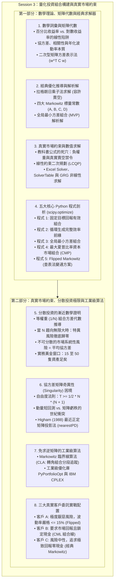

# APS1051: 第三課完整詳細研習筆記（廣東話版）
**課程名稱：** APS1051: Portfolio Management under Real Market Constraints（真實市場約束下的投資組合管理）  
**授課機構：** 多倫多大學工程學院（University of Toronto | Master of Engineering - ELITE）  
**教授團隊：** Sabatino Costanzo & Loren Trigo  
**核心參考資料：** 
* `S3A1.Presentations`：`PortfolioPresentation.pptx`（69 Slides）與完整語音逐字稿 `PortfolioPresentation_GUIDE.pdf`
* `S3B1.Presentations`：`1.EffectOfDiversification.pptx`（10 Slides）與 `1.Effect of Diversification_GUIDE.pdf`
* `S3A5.Miscellaneous.HomeworkUpdtd`：Python 程式 1–5、Excel 模型（`EfficientFrontier3Stocks.xlsx`、`MarketPortfolio3Stocks.xlsx`、`SolverMinimization.xlsx`、`SolverTableExample.xlsx`）與操作指南
* `S3B3.Miscellaneous.HomeworkAM_updated`：臨界線算法數學證明（`CLA_Math.pdf`、`KwanCriticalLineAlgorithm.pdf`）、Higham 正定投影算法（`posdef.py`）、`PART 2 HOMEWORK 2 - PYPORTFOLIOOPT.docx`

---

## 執行摘要與核心架構（Executive Overview）

Session 3 係成個課程嘅**量化算法與實戰編程核心**。如果話 Session 1 解決咗「點樣客觀評分（Evaluation）」、Session 2 建立咗「動量結合 MPT 嘅經濟直覺（Intuition）」，咁 Session 3 就係正式深入**嚴謹數學矩陣推導、二次規劃數值求解（Numerical Optimization）、分散投資極限證明、以及三大客戶真實約束配置（Portfolio Engineering）**。



---

## 第一部分：數學基礎與矩陣詞彙（Slides 3–23 & Guide）

### 1.1 資產組合與權重向量（Slides 3–5）
* **資產宇宙（Asset Universe）：** 包含 $n$ 隻合格資產 $\{a_1, a_2, \dots, a_n\}$。
* **持倉份額元組（Quantity Vector）：** 形式上，一個投資組合係一個有序的實數實體，代表持有每隻資產的股數/份額：
  $$\boldsymbol{\theta} = (\theta_1, \theta_2, \dots, \theta_n), \quad \theta_i \in \mathbb{R}$$
* **資產權重（Portfolio Weights, $w_i$）：** 資產 $a_i$ 在 $t=0$ 時刻佔整個投資組合總價值的百分比：
  $$w_i = \frac{v_i}{\sum_{j=1}^n v_j}$$
* **預算全額投資約束（Budget Constraint）：** 所有資產權重之和必須嚴格等於 1（100% 資金）：
  $$\sum_{i=1}^n w_i = 1 \iff \mathbf{1}^T \mathbf{w} = 1$$

---

### 1.2 百分比回報 vs. 對數回報：不可違背的線性公理（Slides 6–9）
這是量化金融中最容易踩坑嘅數學細節：

* **算術百分比回報率（Percentage / Arithmetic Return）：**
  $$R_i = \frac{P_{i,t} - P_{i,t-1}}{P_{i,t-1}}$$
* **對數回報率（Logarithmic / Continuous Return）：**
  $$r_i = \ln\left(\frac{P_{i,t}}{P_{i,t-1}}\right)$$
* **投資組合回報的非線性陷阱（The Non-Linearity Trap）：**
  * 在百分比回報下，投資組合回報係資產權重嘅**嚴格線性加權總和**：
    $$R_p = \sum_{i=1}^n w_i R_i = \mathbf{w}^T \mathbf{R} \implies \mu_p = \mathbf{w}^T \boldsymbol{\mu}$$
  * 但對於對數回報，呢個線性加權法則**徹底崩潰**：
    $$\ln\left( \sum_{i=1}^n w_i \frac{P_{i,t}}{P_{i,t-1}} \right) \ne \sum_{i=1}^n w_i \ln\left(\frac{P_{i,t}}{P_{i,t-1}}\right)$$
  * *教授鐵律：* **在構建投資組合和計算資產權重時，絕對不能用對數回報！** 對數回報只適用於時間序列單一資產建模或衍生品定價；所有跨資產權重優化必須嚴格採用百分比回報。
* **預期回報向量（$\boldsymbol{\mu}$）：**
  由大數定律（Law of Large Numbers），期望值可用樣本算術平均數替代：
  $$\boldsymbol{\mu} = \begin{bmatrix} \mu_1 \\ \mu_2 \\ \vdots \\ \mu_n \end{bmatrix}, \quad \mu_p = \mathbf{w}^T \boldsymbol{\mu}$$

---

### 1.3 方差、歷史波動率與年化機制（Slides 10–12）
* **方差定義：** $\sigma_X^2 = \text{Var}(X) = E[(X - \mu_X)^2]$。
* **短週期零均值方差近似（Zero-Mean Approximation）：**
  在日度或高頻交易中，短期預期收益極度接近零（$\mu \approx 0$）。因此方差可高度近似為未中心化的平方均值：
  $$\sigma_X^2 \approx E\left[X^2\right]$$
  這是後續 ARCH/GARCH 波動率模型的核心假設。
* **年化方差的可加性（Annualization Additivity）：**
  由於獨立變量的方差隨時間線性累積：
  * **日度數據（一年 252 個交易日）：**  
    $$\sigma^2_{\text{annual}} = \sigma^2_{\text{daily}} \times 252, \quad \sigma_{\text{annual}} = \sigma_{\text{daily}} \times \sqrt{252}$$
  * **月度數據（一年 12 個月）：**  
    $$\sigma^2_{\text{annual}} = \sigma^2_{\text{monthly}} \times 12, \quad \sigma_{\text{annual}} = \sigma_{\text{monthly}} \times \sqrt{12}$$
* **關鍵辨析——年化頻率 vs. 樣本容量（$T_{\text{freq}}$ vs. $N_{\text{obs}}$）：**
  * 乘數 252 或 12 代表的是**採樣頻率**，絕非計算方差所用嘅歷史樣本數量！
  * 無論你用 20 日定 60 日日度回報計方差，年化乘數都係 252。
  * 為了保證樣本方差的統計穩定性，樣本容量 $N_{\text{obs}}$ 一般建議至少要有 60 個觀測值。

---

### 1.4 協方差矩陣與組合方差的矩陣表達式（Slides 13–23）
* **協方差（$\sigma_{ij}$）：**
  $$\sigma_{ij} = \text{Cov}(X_i, X_j) = E[(X_i - \mu_i)(X_j - \mu_j)]$$
  單位為 $[\text{收益率}]^2$（例如 $\%^2$ 或 $\text{元}^2$）。資產與自身的協方差就是方差：$\sigma_{ii} = \sigma_i^2$。
* **相關系數（$\rho_{ij}$）：**
  $$\rho_{ij} = \frac{\sigma_{ij}}{\sigma_i \sigma_j} \in [-1, +1]$$
* **協方差矩陣（$\mathbf{C}$ 或 $\boldsymbol{\Sigma}$）：**
  主對角線上是各資產的**方差**，非對角線上是兩兩資產的**協方差**：
  $$\mathbf{C} = \begin{bmatrix}
  \sigma_1^2 & \rho_{12}\sigma_1\sigma_2 & \cdots & \rho_{1n}\sigma_1\sigma_n \\
  \rho_{21}\sigma_2\sigma_1 & \sigma_2^2 & \cdots & \rho_{2n}\sigma_2\sigma_n \\
  \vdots & \vdots & \ddots & \vdots \\
  \rho_{n1}\sigma_n\sigma_1 & \rho_{n2}\sigma_n\sigma_2 & \cdots & \sigma_n^2
  \end{bmatrix}$$
* **投資組合總方差的矩陣二次型：**
  $$\sigma_p^2 = \mathbf{w}^T \mathbf{C} \mathbf{w}$$
  $$\sigma_p = \sqrt{\mathbf{w}^T \mathbf{C} \mathbf{w}}$$

---

## 第二部分：現代投資組合理論的解析推導（Slides 24–32）

### 2.1 經典 Markowitz 優化問題設定（固定目標回報，最小化方差）
$$\min_{\mathbf{w}} \frac{1}{2} \mathbf{w}^T \mathbf{C} \mathbf{w}$$
$$\text{約束條件: } \begin{cases} \mathbf{1}^T \mathbf{w} = 1 & \text{(全額投資預算約束)} \\ \boldsymbol{\mu}^T \mathbf{w} = \mu_{\text{req}} & \text{(達到客戶指定的目標回報)} \end{cases}$$

---

### 2.2 拉格朗日乘子法嚴謹求解（容許賣空 / 無符號約束）
構造拉格朗日函數（Lagrangian），引入乘子 $\lambda_1, \lambda_2$：
$$\mathcal{L}(\mathbf{w}, \lambda_1, \lambda_2) = \frac{1}{2}\mathbf{w}^T \mathbf{C} \mathbf{w} - \lambda_1 (\mathbf{1}^T \mathbf{w} - 1) - \lambda_2 (\boldsymbol{\mu}^T \mathbf{w} - \mu_{\text{req}})$$

對權重向量 $\mathbf{w}$ 求一階偏導並設為零向量：
$$\nabla_{\mathbf{w}} \mathcal{L} = \mathbf{C}\mathbf{w} - \lambda_1 \mathbf{1} - \lambda_2 \boldsymbol{\mu} = \mathbf{0} \implies \mathbf{w} = \mathbf{C}^{-1} (\lambda_1 \mathbf{1} + \lambda_2 \boldsymbol{\mu})$$

將 $\mathbf{w}$ 分別代入兩條約束條件：
1. $\mathbf{1}^T \mathbf{w} = \lambda_1 (\mathbf{1}^T \mathbf{C}^{-1}\mathbf{1}) + \lambda_2 (\mathbf{1}^T \mathbf{C}^{-1}\boldsymbol{\mu}) = 1$
2. $\boldsymbol{\mu}^T \mathbf{w} = \lambda_1 (\boldsymbol{\mu}^T \mathbf{C}^{-1}\mathbf{1}) + \lambda_2 (\boldsymbol{\mu}^T \mathbf{C}^{-1}\boldsymbol{\mu}) = \mu_{\text{req}}$

#### 定義四大 Markowitz 標量常數：
$$A = \mathbf{1}^T \mathbf{C}^{-1}\boldsymbol{\mu} = \boldsymbol{\mu}^T \mathbf{C}^{-1}\mathbf{1}$$
$$B = \boldsymbol{\mu}^T \mathbf{C}^{-1}\boldsymbol{\mu}$$
$$C = \mathbf{1}^T \mathbf{C}^{-1}\mathbf{1}$$
$$D = BC - A^2$$

建立 $2 \times 2$ 線性方程組並用克萊姆法則求解：
$$\begin{bmatrix} C & A \\ A & B \end{bmatrix} \begin{bmatrix} \lambda_1 \\ \lambda_2 \end{bmatrix} = \begin{bmatrix} 1 \\ \mu_{\text{req}} \end{bmatrix} \implies \lambda_1 = \frac{B - A\mu_{\text{req}}}{D}, \quad \lambda_2 = \frac{C\mu_{\text{req}} - A}{D}$$

將乘子代回，得出**無約束有效組合權重的精確解析解**：
$$\mathbf{w}^* = \frac{B - A\mu_{\text{req}}}{D}\mathbf{C}^{-1}\mathbf{1} + \frac{C\mu_{\text{req}} - A}{D}\mathbf{C}^{-1}\boldsymbol{\mu}$$

---

### 2.3 全局最小方差組合（MVP - Slide 28）
全局最小方差組合位於 Markowitz 子彈圖的最左端頂點（Nose），無需任何目標回報約束：
$$\min_{\mathbf{w}} \frac{1}{2} \mathbf{w}^T \mathbf{C} \mathbf{w} \quad \text{s.t. } \mathbf{1}^T \mathbf{w} = 1$$
$$\nabla_{\mathbf{w}} \mathcal{L} = \mathbf{C}\mathbf{w} - \lambda \mathbf{1} = \mathbf{0} \implies \mathbf{w} = \lambda \mathbf{C}^{-1}\mathbf{1}$$
$$\mathbf{1}^T (\lambda \mathbf{C}^{-1}\mathbf{1}) = \lambda C = 1 \implies \lambda = \frac{1}{C}$$

因此，MVP 的最優權重與性質為：
$$\mathbf{w}_{\text{mvp}} = \frac{\mathbf{C}^{-1}\mathbf{1}}{\mathbf{1}^T \mathbf{C}^{-1}\mathbf{1}} = \frac{\mathbf{C}^{-1}\mathbf{1}}{C}$$
$$\sigma^2_{\text{mvp}} = \frac{1}{C}, \quad \sigma_{\text{mvp}} = \frac{1}{\sqrt{C}}, \quad \mu_{\text{mvp}} = \frac{A}{C}$$

---

### 2.4 教科書公式的死穴：點解真實世界必須禁用解析解？（Slides 29–32）
* **負權重與賣空災難：** 上述優美嘅解析公式幾乎必然會輸出**負權重（$w_i < 0$）**。
* **真實機構約束：** 賣空需要借券費、保證金催繳隨時平倉、流動性乾涸時借唔到券，而且多數退休基金與監管法規（如 UCITS）嚴厲禁止做空。
* **純做多約束的數學代價：** 只要加入純做多約束（$w_i \ge 0$），拉格朗日乘子法立即失效（因為引入了不等式約束）。此時**完全無法寫出封閉式的代數公式**，必須轉為**線性約束二次規劃（LCQP）**，透過數值近似算法（Excel Solver 或 Python SLSQP）求解！
* **邊界對比（Slide 32）：** 雖然容許賣空嘅邊界回報看似較高，但只在極端高波動區（$\sigma > 58\%$）先有顯著差異。在機構正常的 $10\% \sim 20\%$ 波動範圍內，純做多效率前緣與無約束前緣幾乎重疊，因此拋棄賣空並唔會犧牲實務回報！

---

## 第三部分：Excel 試算表建模實踐（Slides 33–35 & Guides）

### 3.1 單變量非線性優化（`SolverMinimization.xlsx` — Slide 33）
* 目標：求解拋物線 $y = x^2 + 12x + 32$ 的極小值。
* 頂點解析坐標：$x^* = -b/(2a) = -6$；$y(-6) = -4$。
* Excel 設定：可變單元格 `O2`（$x$），目標單元格 `Q2`（公式 `=O2^2 + 12*O2 + 32`）設為 **Min**，求解方法選 **GRG Nonlinear**，瞬間收斂至 $(-6, -4)$。

### 3.2 參數敏感度分析（`SolverTableExample.xlsx` — Slide 34）
* 解決痛點：要繪製效率前緣，必須手動重複運行幾十次 Solver。**SolverTable** 插件實現全自動參數掃描。
* 運作邏輯：將目標變量 $x$ 綁定至約束條件單元格 `M6 = O6`，SolverTable 在單向表格（OneWay Table）中將輸入單元格 `O6` 由 0 逐步增加至 10（步長 1），自動記錄每次 Solver 運算後嘅最優值。

### 3.3 3 隻股票效率前緣建模（`EfficientFrontier3Stocks.xlsx` — Slide 35）
* **單元格與命名區域定義：**
  * `MeanReturns`（`B5:D5`）：3 隻股票的預期收益率。
  * `StDev`（`B6:D6`）：標準差。
  * 相關系數矩陣（`B9:D11`）。
  * 協方差矩陣 `CovarMat`（`H9:J11`）：利用 $\sigma_{ij} = \rho_{ij}\sigma_i\sigma_j$ 計算。
  * 權重變量 `Invested`（`B15:D15`）：初始值設為 $0.01$。
  * 總權重 `TotInvested`（`E15`）：`=SUM(Invested)`。
  * 預期組合收益 `PortExpReturn`（`B19`）：`=SUMPRODUCT(MeanReturns, Invested)`。
  * 客戶目標收益 `ReqdReturn`（`D19`）：輸入值（例如 $0.12$ 即 $12\%$）。
  * **組合方差核心矩陣公式 `PortVar`（`B21`）：**
    ```excel
    =MMULT(Invested, MMULT(CovarMat, TRANSPOSE(Invested)))
    ```
  * 組合波動率 `PortStDev`（`B22`）：`=SQRT(PortVar)`。
* **Solver 具體配置：**
  * 目標：`PortVar` 設為 **Min**。
  * 可變單元格：`Invested`（`B15:D15`）。
  * 約束條件：
    1. `PortExpReturn >= ReqdReturn`（`B19 >= D19`）。
    2. `TotInvested = 1`（`E15 = 1`）。
  * 勾選 **Make Unconstrained Variables Non-Negative**（強制 $w_i \ge 0$）。
  * 求解方法：**GRG Nonlinear**。
* **輸出結果（當 $\mu_{\text{req}} = 12\%$ 時）：**
  * 最優權重：$w_X = 0.50, w_Y = 0.00, w_Z = 0.50$。
  * 組合標準差：$\sigma_p = 12.0\%$；方差：$\sigma_p^2 = 0.0148$。
* **SolverTable 繪製完整前緣：**
  * 輸入單元格：`ReqdReturn`（`D19`），由 0.10 到 0.14，步長 0.005。
  * 輸出單元格：`Invested`、`PortStDev`、`PortExpReturn`。
  * 自動生成 `STS_1` 工作表並繪出完美向左凸的效率前緣曲線！

---

## 第四部分：資本市場組合與兩基金分離定理（Slides 37–52）

### 4.1 風險資產與無風險資產的線性組合（Slides 41–45）
* 衍生風險組合（Derived Portfolio）：預期回報 $\mu_{\text{der}}$，方差 $\sigma^2_{\text{der}}$。
* 無風險資產（Risk-Free Asset）：預期回報 $\mu_{rf}$，方差 $\sigma^2_{rf} = 0$，協方差 $\text{Cov}(R_{\text{der}}, R_{rf}) = 0$。
* 投資比例：$w_{\text{der}} + w_{rf} = 1 \implies w_{rf} = 1 - w_{\text{der}}$。
* 組合回報與波動率：
  $$\mu_{\text{combo}} = w_{\text{der}} \mu_{\text{der}} + (1 - w_{\text{der}}) \mu_{rf} = \mu_{rf} + w_{\text{der}} (\mu_{\text{der}} - \mu_{rf})$$
  $$\sigma_{\text{combo}} = w_{\text{der}} \sigma_{\text{der}} \implies w_{\text{der}} = \frac{\sigma_{\text{combo}}}{\sigma_{\text{der}}}$$

### 4.2 資本市場線（Capital Market Line, CML）的推導（Slide 45）
將 $w_{\text{der}}$ 代回回報方程：
$$\mu_{\text{combo}} = \mu_{rf} + \left(\frac{\mu_{\text{der}} - \mu_{rf}}{\sigma_{\text{der}}}\right) \sigma_{\text{combo}}$$
* 截距為無風險利率 $\mu_{rf}$。
* 斜率為風險資產的**夏普比率（Sharpe Ratio）**！

### 4.3 切點最優化：資本市場組合（CMP - Slides 46–49）
* 當我們將射線由 $\mu_{rf}$ 出發向上旋轉，斜率（夏普比率）逐漸增大。
* 當射線剛好與 Markowitz 效率前緣**相切於唯一一點**嗰陣，夏普比率達到全市場理論最大值！
* 該切點組合稱為**資本市場組合（Capital Market Portfolio, CMP）**。
* **解析權重公式（容許賣空）：**
  $$\mathbf{w}_{\text{cmp}} = \frac{\mathbf{C}^{-1}(\boldsymbol{\mu} - \mu_{rf}\mathbf{1})}{\mathbf{1}^T \mathbf{C}^{-1}(\boldsymbol{\mu} - \mu_{rf}\mathbf{1})}$$
* **純做多數值優化公式（No Shorts）：**
  $$\max_{\mathbf{w}} \frac{\mathbf{w}^T \boldsymbol{\mu} - \mu_{rf}}{\sqrt{\mathbf{w}^T \mathbf{C} \mathbf{w}}} \quad \text{s.t. } \mathbf{1}^T \mathbf{w} = 1, \quad w_i \ge 0$$

### 4.4 Excel 求解 CMP（`MarketPortfolio3Stocks.xlsx` — Slide 52）
* 與前緣試算表的關鍵差異：
  1. 新增單元格 `B23`（`Risk_free` = 0.02）與 `B24`（`Sharpe` = `(PortExpReturn - Risk_free) / StDev`）。
  2. **完全無視目標回報約束 `D19`**（因為切點組合在數學上是唯一的！）。
* Solver 設定：將 `Sharpe`（`B24`）設為 **Max**，強制非負，運算得出切點權重：
  * $w_X = 0.10, w_Y = 0.00, w_Z = 0.89$。
  * $\mu_{\text{cmp}} = 10.0\%, \sigma_{\text{cmp}} = 8.0\%$。

### 4.5 托賓兩基金分離定理（Tobin's Separation Theorem - Slide 50, 69）
* **技術優化與風險偏好完全解耦：**
  1. **第一步（所有人一致）：** 無論客戶性格如何，量化經理首先求解出夏普比率最高的唯一切點組合 CMP。
  2. **第二步（按客戶定製）：** 只需調整資金在 CMP 與無風險資產（現金/國債）之間的分配比例：
     * 保守型客戶：50% 現金 + 50% CMP。
     * 平衡型客戶：100% 全配 CMP。
     * 進攻型客戶：融資加槓桿（借入現金）持有 >100% CMP。
* **嚴格幾何支配性：** 由於 CML 直線始終處於凸雙曲線效率前緣的上方，因此**任何將 CMP 與現金結合的組合，都嚴格優於直接持有同等波動率的純股票前緣組合！**

---

## 第五部分：五大 Python 量化程式逐行全剖析（Slides 53–69）

### 5.1 程式 1：固定目標回報的有效組合
*檔案：`1.ClassicMarkowitz_FixedRequiredReturnMinimizedVariancePortfolio.py`*
* **百分比回報數據預處理：**
  `returns = (data - data.shift(1)) / data.shift(1)`（嚴禁使用 log 回報）。
* **組合特徵函數：**
  ```python
  def portfolio(weights):
      weights = np.array(weights)
      P_ret = np.sum(returns.mean() * weights) * 252
      P_vol = np.sqrt(np.dot(weights.T, np.dot(returns.cov() * 252, weights)))
      return np.array([P_ret, P_vol, P_ret / P_vol])
  ```
* **約束條件字典：**
  ```python
  cons = (
      {'type': 'eq', 'fun': lambda x: portfolio(x)[0] - TargetRet}, # 回報等於目標
      {'type': 'eq', 'fun': lambda x: np.sum(x) - 1}                # 權重和為 1
  )
  bnds = tuple((0, 1) for x in range(no_assets))                   # 純做多邊界
  ```
* **調用 SLSQP 二次規劃器：**
  ```python
  result = sco.minimize(lambda x: portfolio(x)[1], no_assets * [1.0 / no_assets],
                        method='SLSQP', bounds=bnds, constraints=cons)
  ```

### 5.2 程式 2：循環掃描生成完整效率前緣
*檔案：`2.ClassicMarkowitz_..._EfficientFrontier.py`*
* 在 Python 中用 `for tret in np.linspace(0.0, 0.25, 50)` 代替 Excel 的 SolverTable。
* 每次循環更新約束條件並求解最小方差，將各點 $(P_{\text{vol}}, P_{\text{ret}})$ 記錄入數組，最後調用 `matplotlib` 導出 `F2.pdf` 前緣散佈圖。

### 5.3 程式 3：全局最小方差組合（MVP）
*檔案：`3.ClassicMarkowitz_MinimumVariancePortfolio.py`*
* 目標函數為純方差：`Variance(weights) = portfolio(weights)[1]**2`。
* 移除目標回報約束，只保留權重和為 1 的約束，精確定位子彈圖最左端鼻尖。

### 5.4 程式 4：最大夏普比率資本市場組合
*檔案：`4.ClassicMarkowitz_MaximumSharpePortfolioOrMarketPortfolio.py`*
* 引入無風險利率 `r_f = 0.01`。
* **優化工程技巧：** 由於標準優化庫只有 `minimize`（最小化函數），要**最大化夏普比率**，必須轉化為**最小化「負夏普比率」**：
  ```python
  def Sharpe_CAPM(weights):
      return -portfolio_CAPM(weights, r_f)[2]
  result = sco.minimize(Sharpe_CAPM, no_assets * [1.0 / no_assets],
                        method='SLSQP', bounds=bnds, constraints=cons)
  ```

### 5.5 程式 5：Flipped Markowitz 與「查表法變通方案」（FlippedFake）
*檔案：`5.ClassicMarkowitz_..._FlippedFake.py`*
* **理論痛點（Harry's Problem）：** Keller 論文要求「鎖定目標波動率（$\sigma_p \le \sigma_{\text{target}}$），最大化回報」。由於風險約束 $\mathbf{w}^T \mathbf{C} \mathbf{w} \le \sigma^2$ 係**二次非線性約束**，數學上屬於二次約束二次規劃（QCQP）。
* **變通方案（FlippedFake）：** 標準 Python 同 Excel 都冇原生 QCQP 求解器。程式先運算前緣掃描生成 50 組 $(\text{MinVols}, \text{TargetRet})$ 對照表。當客戶指定波動率上限（例如 $\sigma \le 16\%$），程式在表中檢索 $\text{MinVols} \approx 0.158885$，提取拋物線上半支對應嘅目標回報 $\mu = 0.188776$，再調用程式 1 求解。
* *實務缺陷：* 單次運算尚可，但如果在歷史回測中每日/每月循環，查表法速度極慢，實盤必須引入專用求解器（如 IBM CPLEX 或臨界線算法 CLA）。

---

## 第六部分：分散投資的漸近數學證明（Slides & Guides）

### 6.1 等權重組合（$w_i = 1/N$）方差公式嚴謹推導
考慮由 $N$ 隻資產組成的等權重組合，每隻資產分配資金 $w_i = 1/N$。組合總方差展開為：
$$\sigma_p^2 = \sum_{i=1}^N \sum_{j=1}^N w_i w_j \sigma_{ij} = \sum_{i=1}^N w_i^2 \sigma_i^2 + \sum_{i=1}^N \sum_{j \ne i}^N w_i w_j \sigma_{ij}$$

將 $w_i = 1/N$ 代入：
$$\sigma_p^2 = \sum_{i=1}^N \left(\frac{1}{N}\right)^2 \sigma_i^2 + \sum_{i=1}^N \sum_{j \ne i}^N \left(\frac{1}{N}\right) \left(\frac{1}{N}\right) \sigma_{ij} = \frac{1}{N^2} \sum_{i=1}^N \sigma_i^2 + \frac{1}{N^2} \sum_{i=1}^N \sum_{j \ne i}^N \sigma_{ij}$$

定義**資產平均方差 $\overline{\sigma^2}$**：
$$\overline{\sigma^2} = \frac{1}{N} \sum_{i=1}^N \sigma_i^2 \implies \sum_{i=1}^N \sigma_i^2 = N \overline{\sigma^2}$$

矩陣對角線外共有 $N(N - 1)$ 個協方差項。定義**資產平均協方差 $\overline{\text{Cov}}$**：
$$\overline{\text{Cov}} = \frac{1}{N(N - 1)} \sum_{i=1}^N \sum_{j \ne i}^N \sigma_{ij} \implies \sum_{i=1}^N \sum_{j \ne i}^N \sigma_{ij} = N(N - 1) \overline{\text{Cov}}$$

代回方差表達式：
$$\sigma_p^2 = \frac{1}{N^2} (N \overline{\sigma^2}) + \frac{1}{N^2} (N(N - 1) \overline{\text{Cov}})$$
$$\mathbf{\sigma_p^2 = \frac{1}{N} \overline{\sigma^2} + \frac{N - 1}{N} \overline{\text{Cov}} = \frac{1}{N} \left(\overline{\sigma^2} - \overline{\text{Cov}}\right) + \overline{\text{Cov}}}$$

---

### 6.2 漸近極限證明（當 $N \to \infty$ 時）
取 $N$ 趨向無限大的極限：
$$\lim_{N \to \infty} \sigma_p^2 = \lim_{N \to \infty} \left[ \frac{1}{N} \overline{\sigma^2} + \left(1 - \frac{1}{N}\right) \overline{\text{Cov}} \right]$$
$$\lim_{N \to \infty} \left(\frac{1}{N} \overline{\sigma^2}\right) = 0$$
$$\lim_{N \to \infty} \left(1 - \frac{1}{N}\right) \overline{\text{Cov}} = 1 \times \overline{\text{Cov}} = \overline{\text{Cov}}$$
$$\mathbf{\lim_{N \to \infty} \sigma_p^2 = \overline{\text{Cov}}}$$

#### 兩大顛覆性金融結論：
1. **個股特異風險完全可被消除：** 單一公司的暴雷風險乘以 $1/N$，在大型組合中衰減為零！
2. **市場系統性風險不可分散：** 組合最終殘留嘅風險全部來自資產間嘅**平均協方差（$\overline{\text{Cov}}$）**。只要宏觀經濟一震盪，所有股票共同下挫，呢部分風險無法靠盲目買多幾隻股票消除。

### 6.3 實務分散曲線與公司債反例
* **邊際效用遞減：** 由 1 隻增加到 15 隻資產，可消除 ~90% 嘅可分散風險；增加到 30 隻幾乎捕獲全部好處；**超過 50 隻資產後，邊際風險降低效果實質等於零**。
* **公司債例外：** 上述規則僅適用於單一主導因子的股票或國債；在企業債券（Corporate Bonds）宇宙中，由於極端違約信用尾部風險存在，需要分散持有幾百隻發行人方能有效風控。

---

## 第七部分：協方差矩陣奇異性與動量回測的世紀衝突

### 7.1 自由度經驗法則與動量悖論
* **矩陣非奇異（可求逆）條件：**
  $$T_{\text{obs}} \ge \frac{1}{2} N (N + 1)$$
  * 若資產數 $N = 11$，所需獨立觀測期 $T \ge \frac{1}{2}(11)(12) = 66$ 日。
  * 若資產數 $N = 30$，所需觀測期 $T \ge 465$ 日（近 2 年）。
* **量化投資的核心死結：**
  * Session 2 證明咗動量效應要求**短回測期（$T \le 60$ 日）**，否則會陷入長週期均值回歸。
  * 但 60 日回測期限制了資產數目**不能超過 11 隻**，否則協方差矩陣會發生**虧秩（Rank-deficient）或奇異（Singular）**，導致優化器報錯崩潰！
  * 然而，充分分散投資又要求至少 $15 \sim 30$ 隻資產。

### 7.2 四大工業級破局解法
1. **大類行業板塊 ETF 替代法：** 選擇 11 隻行業 ETF（如 XLK, XLF, XLE）。由於 ETF 內部已各自包含上百隻個股，11 隻 ETF 既滿足 $T=66$ 日短動量要求，又天然完成咗全市場充分分散！
2. **Markowitz 臨界線算法（CLA - Markowitz & Todd 2000, Kwan 2011）：**  
   CLA 透過將資產劃分為內部集（$\mathbf{IN}$）、上限集（$\mathbf{UP}$）與下限集（$\mathbf{DN}$），利用 KKT 條件逐步跟蹤轉角組合（Corner Portfolios）。**CLA 運算全程完全無需對整個協方差矩陣求逆**，即使 $N > T$ 矩陣奇異，依然能精確繪製出整條效率前緣！
3. **Higham（1988）最近正定矩陣投影法（`posdef.py`）：**  
   利用奇異值分解（SVD）將包含負特徵值嘅病態矩陣，投影到對稱正定（SPD）矩陣錐體上，修復矩陣正定性。
4. **等權重（$1/N$）降級備用機制：** 當回測中某期矩陣徹底崩潰時，程式自動退守等權重分配，維持回測平穩運行。

---

## 第八部分：三大真實客戶委託實戰配置（Part 2 Homework）

* **基準測試（Benchmark）：** 標普 500 ETF（`SPY`）或道瓊斯 ETF（`DIA`），回測區間 2009 年 1 月 30 日至 2020 年 1 月 30 日（11 年黃金牛市），計算 CAGR、年化波動率與夏普比率。
* **三大客戶委託與調用方案：**
  * **客戶 A（極度厭惡風險）：** 要求年化波動率嚴格封頂 **$\le 15\%$**。  
    $\to$ 調用 **Case 2（Flipped Markowitz / `ef.efficient_risk(0.15)`）**，鎖死風險上限，極大化預期收益。
  * **客戶 B（中度風險偏好，要求鎖定固定比例現金）：** 要求接近大市回報，但必須配置一定比例現金（國債）。  
    $\to$ 調用 **Case 1（最大夏普組合 / `ef.max_sharpe()`）**，利用兩基金分離定理，將 CMP 與現金沿 CML 直線線性混搭。
  * **客戶 C（風險中性，追求極致回報）：** 不設波動上限，不留任何現金拖累，要求回報超越大市。  
    $\to$ 調用 **Case 3（經典 Markowitz / `ef.efficient_return()`）**，設定高目標回報，在效率前緣進攻型頂端挑選高動量資產。

---

## 第九部分：第三課全套必背核心數學公式彙編

$$\begin{aligned}
\text{資產權重預算約束:} \quad & \sum_{i=1}^n w_i = 1 \iff \mathbf{1}^T \mathbf{w} = 1 \\
\text{投資組合算術收益率:} \quad & \mu_p = \mathbf{w}^T \boldsymbol{\mu} = \sum_{i=1}^n w_i \mu_i \\
\text{投資組合方差 (矩陣二次型):} \quad & \sigma_p^2 = \mathbf{w}^T \mathbf{C} \mathbf{w} = \sum_{i=1}^n \sum_{j=1}^n w_i w_j \sigma_{ij} \\
\text{日度年化波動率:} \quad & \sigma_{\text{ann}} = \sigma_{\text{daily}} \times \sqrt{252} \\
\text{Markowitz 標量常數:} \quad & A = \mathbf{1}^T \mathbf{C}^{-1}\boldsymbol{\mu}, \; B = \boldsymbol{\mu}^T \mathbf{C}^{-1}\boldsymbol{\mu}, \; C = \mathbf{1}^T \mathbf{C}^{-1}\mathbf{1}, \; D = BC - A^2 \\
\text{有效組合解析權重 (容許賣空):} \quad & \mathbf{w}^* = \frac{B - A\mu_{\text{req}}}{D}\mathbf{C}^{-1}\mathbf{1} + \frac{C\mu_{\text{req}} - A}{D}\mathbf{C}^{-1}\boldsymbol{\mu} \\
\text{全局最小方差組合 (MVP):} \quad & \mathbf{w}_{\text{mvp}} = \frac{\mathbf{C}^{-1}\mathbf{1}}{C}, \quad \sigma^2_{\text{mvp}} = \frac{1}{C}, \quad \mu_{\text{mvp}} = \frac{A}{C} \\
\text{資本市場線 (CML 方程):} \quad & \mu_{\text{combo}} = \mu_{rf} + \left(\frac{\mu_{\text{cmp}} - \mu_{rf}}{\sigma_{\text{cmp}}}\right) \sigma_{\text{combo}} \\
\text{切點組合解析權重 (CMP):} \quad & \mathbf{w}_{\text{cmp}} = \frac{\mathbf{C}^{-1}(\boldsymbol{\mu} - \mu_{rf}\mathbf{1})}{\mathbf{1}^T \mathbf{C}^{-1}(\boldsymbol{\mu} - \mu_{rf}\mathbf{1})} \\
\text{等權重組合方差拆解:} \quad & \sigma_p^2 = \frac{1}{N} \overline{\sigma^2} + \frac{N - 1}{N} \overline{\text{Cov}} \\
\text{無限分散極限定理:} \quad & \lim_{N \to \infty} \sigma_p^2 = \overline{\text{Cov}} \\
\text{協方差非奇異自由度條件:} \quad & T_{\text{obs}} \ge \frac{1}{2} N (N + 1)
\end{aligned}$$
