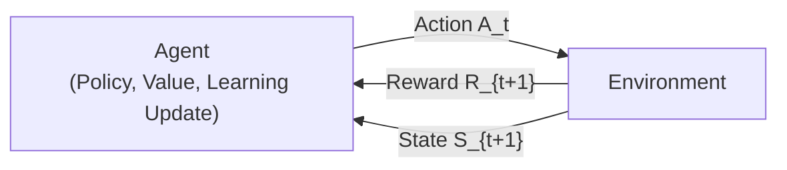
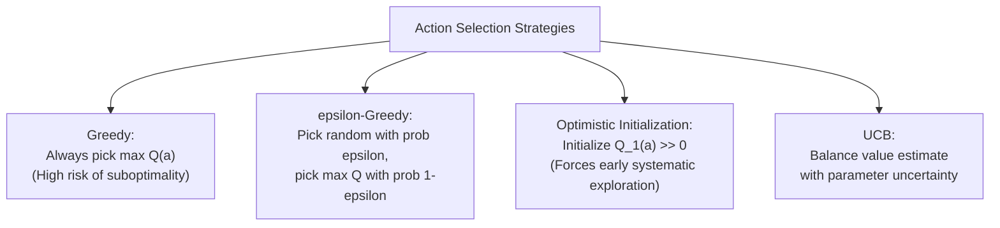

# APS1080: Intro to Reinforcement Learning
# Lecture 1 Study Notes: Foundations, Bandits & Finite MDPs
**Textbook Reference**: Sutton & Barto (2020), Chapters 1, 2, and 3  
**Associated Course Milestone**: [Exercise 1](file:///G:/Other%20computers/My%20Computer/aps1080/Exercise1.md) (Due Oct 7)

---

## 1. Course Philosophy & The Reinforcement Learning Paradigm

### 1.1 Reinforcement Learning as "Systems AI"
Reinforcement learning is a computational approach to learning from interaction to achieve goals. Unlike traditional machine learning paradigms that passively digest datasets, RL models an active agent embedded in an environment.

> 💡 **粵語解構 (Cantonese Intuition)**:  
> 簡單嚟講，Supervised Learning 就好似老師比咗成副有答案嘅 past paper 你背；而 Unsupervised Learning 就好似比一大堆無 label 嘅雜物你，叫你自己分門別類。但 **Reinforcement Learning (RL)** 係完全唔同嘅哲學——佢好似掟個初生 BB 去個陌生世界，無人會每一步指點佢「呢步啱、嗰步錯」，只有當佢跌痛咗或者食到糖嗰陣，環境先會比個 scalar reward（獎勵或懲罰）。Agent 唯有靠自己喺互動中不斷試錯（Trial-and-Error），學識點樣做長遠最著數嘅決策。呢種「有目的性嘅互動學習」，就係所謂嘅 Systems AI。

| Machine Learning Paradigm | Feedback Type | Objective | Key Challenge |
| :--- | :--- | :--- | :--- |
| **Supervised Learning** | *Instructed* (True label/target provided by supervisor) | Minimize prediction error on labeled dataset | Generalization to unseen data |
| **Unsupervised Learning** | *Unlabeled* (No target or external feedback) | Discover hidden geometric structure, density, or clustering | Representation quality |
| **Reinforcement Learning** | *Evaluative* (Scalar reward signal assessing chosen action) | Maximize cumulative long-term reward signal | Credit assignment, exploration vs. exploitation |

> [!IMPORTANT]
> **Evaluative vs. Instructive Feedback**: 
> Evaluative feedback indicates *how good* an action was, but not whether it was the *best* possible action or what other action should have been taken. This fundamental distinction necessitates active trial-and-error exploration.

> 💡 **粵語註釋 (Evaluative vs Instructive)**:  
> **Instructive（指導性）**：教練直接話你知：「頭先呢球波你應該打反手抽擊！」（話埋正確答案比你知）。  
> **Evaluative（評價性）**：教練只係喺你打完之後比個分數：「頭先嗰下得 2 分！」（佢無講其他打法會唔會更高分）。因為你永遠唔知其他選擇有幾好，所以你一定要親自去試其他打法，呢個就係點解 RL 必然存在 **Exploration vs. Exploitation（探索與利用）** 嘅兩難。

---

## 2. Anatomy of an RL Agent & Problem Formulation (Chapter 1)

### 2.1 What Problem Does an RL Agent Solve?
An RL agent solves a **sequential decision-making problem** under uncertainty:
- The agent takes actions in an environment over discrete time steps.
- The actions influence not only the immediate reward, but also the subsequent states and all future rewards.

> 💡 **粵語解構 (Sequential Decision-Making)**:  
> 點解叫「Sequential（序列性）」？因為你而家做嘅每一個決定，唔單止影響你即刻拎到幾多分，仲會直接改變世界嘅狀態（State），影響你幾步之後甚至成個遊戲嘅生死。好似落盤棋咁，你而家行呢隻卒，眼前可能零著數（Reward = 0），但十步之後就因為呢隻卒控死咗對手而贏棋。

### 2.2 Core Components Inside an RL Agent
1. **Policy ($\pi$)**:
   - The agent's behavior function mapping states to actions: $\pi(a \mid s) \doteq \Pr(A_t = a \mid S_t = s)$.
   - Can be deterministic ($a = \pi(s)$) or stochastic.
2. **Reward Signal ($R$)**:
   - Immediate scalar signal sent by the environment at each time step.
   - Defines the *primary goal* of the agent.
3. **Value Function ($V(s)$ or $Q(s, a)$)**:
   - The expected cumulative future reward from a state (or state-action pair).
   - While rewards define immediate satisfaction ("how good is this state right now?"), values specify long-term desirability ("how good is this state considering everything that can follow?").
4. **Model of the Environment** *(optional)*:
   - Agent's internal representation of the environment dynamics.
   - Predicts next state and expected reward: $p(s', r \mid s, a)$.
   - Enables *planning* (Model-based RL) vs pure *trial-and-error* (Model-free RL).

> 💡 **粵語解構 (Reward vs Value Function 的核心分別)**:  
> 記住呢句口訣：「**Reward 係快感，Value 係前途！**」  
> - **Reward（即時獎勵）**：就好似你今晚通宵打機，眼前嘅多巴胺好爽（即時 Reward = +100），但聽朝考試隨時食蛋。  
> - **Value（長期價值）**：計算緊「由呢個狀態出發，計埋之後所有折扣獎勵，我平均可以拎到幾多分」。雖然今晚溫書好辛苦（Reward = -10），但因為聽朝會 Pass 甚至攞 A（未來 Reward 巨大），所以溫書呢個狀態嘅 Value 其實極高。RL Agent 真正要最大化嘅，永遠係 **Value** 而唔係單純貪圖眼前嘅 Reward！

### 2.3 The Tic-Tac-Toe Case Study ([`chapter01/tic_tac_toe.py`](file:///G:/Other%20computers/My%20Computer/aps1080/chapter01/tic_tac_toe.py))
- **State Representation**: 9-element array hash representing board configurations.
- **Value Table $V(s)$**: Initialized to $1$ for winning terminal states, $0$ for losing, $0.5$ for non-terminal and draw states.
- **Temporal-Difference (TD) Update**:
  $$V(s) \leftarrow V(s) + \alpha [V(s') - V(s)]$$
  - $s$ is the state prior to the move, $s'$ is the state after the move (and opponent's response).
  - The value of earlier states is pulled toward the value of successor states, backing up success/failure across the game without an explicit minimax tree.
- **Exploitation vs Exploration**:
  - **Exploit**: Choose $\arg\max_{s'} V(s')$ (greedy move).
  - **Explore**: Choose a random move with probability $\epsilon$ to discover novel states.

> 💡 **粵語解構 (井字過三關點樣自學？)**:  
> 喺 `tic_tac_toe.py` 入面，Agent 根本無 Minimax 搜索樹，亦唔知咩叫戰術。佢一開始當所有盤面都係 50% 機會贏（$V=0.5$）。當佢最後一步贏咗棋（$V(s_{\text{end}}) = 1.0$），透過 TD Update：
> $$V(s) \leftarrow V(s) + \alpha [V(s') - V(s)]$$
> 佢會將贏棋前面嗰幾步嘅估值拉高少少；輸棋嗰陣就將前面嗰幾步嘅估值拉低。玩得越多次，勝利或者失敗嘅「因果價值」就會一路向後倒流（Backup），最後 Agent 就自然學識佈局同防守！

---

## 3. The Exploration vs. Exploitation Dilemma (Chapter 2)

Chapter 2 isolates evaluative feedback in a **non-associative setting** (a single state where actions do not change future states).

### 3.1 The $k$-Armed Bandit Problem
Given $k$ discrete actions, each action $a$ has an unknown true expected value:
$$q_*(a) \doteq \mathbb{E}[R_t \mid A_t = a]$$

The agent maintains estimates $Q_t(a) \approx q_*(a)$.

> 💡 **粵語解構 (多臂老虎機 k-Armed Bandit)**:  
> 想像你去澳門賭場，眼前有 $k$ 部老虎機。每部機嘅中獎機率都唔同（$q_*(a)$），但無人寫喺額頭。你每次只可以拉一部機嘅手掣：  
> - 如果你一直拉贏過錢嗰部機，呢個叫 **Exploit（利用）**——但你隨時錯過隔離一部中獎率高 10 倍嘅「神機」。  
> - 如果你去拉其他未試過嘅機，呢個叫 **Explore（探索）**——但代價係你可能輸錢。  
> 呢個就係 Bandit 嘅核心矛盾。

### 3.2 Action-Value Estimation & Incremental Updates
Using sample averages:
$$Q_t(a) = \frac{\sum_{i=1}^{t-1} R_i \cdot \mathbb{I}(A_i = a)}{\sum_{i=1}^{t-1} \mathbb{I}(A_i = a)}$$

The general incremental update rule (per-step):
$$\text{NewEstimate} \leftarrow \text{OldEstimate} + \text{StepSize} \cdot \left[ \text{Target} - \text{OldEstimate} \right]$$
$$Q_{n+1} = Q_n + \frac{1}{n} [R_n - Q_n]$$

For non-stationary environments, a constant step-size parameter $\alpha \in (0, 1]$ is used instead of $\frac{1}{n}$:
$$Q_{n+1} = Q_n + \alpha [R_n - Q_n] = (1 - \alpha)^n Q_1 + \sum_{i=1}^n \alpha (1 - \alpha)^{n-i} R_i$$
*(an exponentially decaying recency-weighted average)*.

> 💡 **粵語解構 (點解個 Update 公式永遠係咁樣？)**:  
> 記住呢個貫穿全個 RL 課程嘅無敵萬能公式：  
> $$\text{新估值} = \text{舊估值} + \text{步長} \times [\text{目標 Target} - \text{舊估值}]$$  
> 後面個括號 $[ \text{Target} - \text{舊估值} ]$ 就係「**驚喜度 / 預測誤差（Error）**」！  
> 如果實際結果同你預期一樣，Error = 0，唔洗改；如果比你預期好，Error > 0，將估值向上調；如果比預期差，向下調。  
> 如果環境會隨時間變（Non-stationary），我哋唔用 $\frac{1}{n}$，而係用固定常數 $\alpha$。咁樣越舊嘅回憶就會以 $(1-\alpha)$ 嘅速度指數級忘記，確保 Agent 永遠重視最新嘅資訊！

### 3.3 Action Selection Strategies

#### Upper-Confidence-Bound (UCB) Action Selection
$$A_t \doteq \arg\max_a \left[ Q_t(a) + c \sqrt{\frac{\ln t}{N_t(a)}} \right]$$

- $t$: total elapsed time steps.
- $N_t(a)$: number of times action $a$ has been selected.
- $c > 0$: exploration parameter controlling confidence interval width.
- If $N_t(a) = 0$, $a$ is considered maximizing and pulled immediately.

> 💡 **粵語解構 (UCB 嘅數學美感：樂觀面對不確定性)**:  
> UCB 嘅思想叫做 *Optimism in the Face of Uncertainty*。公式分為兩部分：  
> 1. $Q_t(a)$：眼前嘅實力（平均攞到幾多分）。  
> 2. $c \sqrt{\frac{\ln t}{N_t(a)}}$：潛力值（因為你試得少，$N_t(a)$ 細，所以不確定性大）。  
> 哪怕某個動作眼前睇落好平庸，但只要你好耐無試過佢（$N_t(a)$ 細），後面嗰項就會暴升，迫 Agent 比多次機會佢！一旦試咗幾次發現真係廢，$N_t(a)$ 變大，後面嗰項縮返水，Agent 就唔會再浪費時間試佢。呢種探索比單純撞手神的 $\epsilon$-greedy 聰明太多！

---

## 4. Finite Markov Decision Processes (Chapter 3)

Chapter 3 introduces the formal mathematical framework for associative, multi-step sequential decision problems.

### 4.1 The Agent-Environment Interface
At discrete time steps $t = 0, 1, 2, \dots$:
1. Agent observes state $S_t \in \mathcal{S}$.
2. Agent executes action $A_t \in \mathcal{A}(s)$.
3. Environment transitions to state $S_{t+1} \in \mathcal{S}$ and emits scalar reward $R_{t+1} \in \mathcal{R} \subset \mathbb{R}$.

Trajectory:
$$S_0, A_0, R_1, S_1, A_1, R_2, S_2, A_2, R_3, \dots$$

### 4.2 The Markov Property & Transition Dynamics
A state signal $S_t$ satisfies the **Markov Property** if it retains all relevant information from complete past history:
$$\Pr(S_t = s', R_t = r \mid S_{t-1} = s, A_{t-1} = a, S_{t-2}, A_{t-2}, \dots, S_0, A_0) = p(s', r \mid s, a)$$

> 💡 **粵語解構 (咩叫 Markov Property 馬可夫性質？)**:  
> 一句講晒：「**未來只同現在有關，同過去無關！**」  
> 當前呢個狀態 $S_t$ 已經完整包含咗之前所有歷史嘅精華。你唔需要知架車之前點樣由多倫多揸到溫哥華，你只要知「架車而家喺邊度、時速幾多、油缸剩幾多油」，就足夠精確預測下一個狀態！如果一個狀態做唔到呢點（例如你只知架車位置但唔知車速），咁佢就唔滿足 Markov Property。

From $p(s', r \mid s, a)$, we derive:
- **State-transition probabilities**:
  $$p(s' \mid s, a) = \sum_{r \in \mathcal{R}} p(s', r \mid s, a)$$
- **Expected reward for state-action pairs**:
  $$r(s, a) \doteq \mathbb{E}[R_t \mid S_{t-1} = s, A_{t-1} = a] = \sum_{r \in \mathcal{R}} r \sum_{s' \in \mathcal{S}} p(s', r \mid s, a)$$

### 4.3 Goals, The Reward Hypothesis, and Returns
> [!NOTE]
> **The Reward Hypothesis (Sutton & Barto 3.2)**:
> *"That all of what we mean by goals and purposes can be well thought of as the maximization of the expected value of the cumulative sum of a received scalar signal (called reward)."*

#### Return $G_t$
- **Episodic Tasks** (finite horizon $T$):
  $$G_t \doteq R_{t+1} + R_{t+2} + \dots + R_T$$
- **Continuing Tasks & Discounting $\gamma \in [0, 1)$**:
  $$G_t \doteq R_{t+1} + \gamma R_{t+2} + \gamma^2 R_{t+3} + \dots = \sum_{k=0}^\infty \gamma^k R_{t+k+1}$$

#### The Fundamental Recursive Identity of Returns
$$G_t = R_{t+1} + \gamma G_{t+1}$$

*Special cases of $\gamma$*:
- If $\gamma = 0$: The agent is purely **myopic** ($G_t = R_{t+1}$, only cares about the very next reward).
- As $\gamma \to 1$: The agent becomes increasingly **farsighted**, weighting future rewards almost equally with immediate ones.

> 💡 **粵語解構 (點解一定要有 Discount Factor $\gamma$？)**:  
> 1. **數學原因**：喺永不結束嘅 Continuing Task 入面，如果 $\gamma = 1$，Return 隨時加到 $\infty$ 發散，數學上無得比大細。當 $\gamma < 1$，無限幾何級數收斂，總價值保證有限（Bounded）。  
> 2. **現實原因**：人無遠慮必有近憂。「聽日拿到嘅 100 蚊」點都好過「十年後先拿到嘅 100 蚊」，因為未來充滿不確定性。$\gamma$ 就代表 Agent 嘅「耐心值」！

---

## 5. Policies, Value Functions, and Bellman Equations

### 5.1 Definitions
* **Stochastic Policy**: $\pi(a \mid s) \doteq \Pr(A_t = a \mid S_t = s)$.
* **State-Value Function $v_\pi(s)$**:
  $$v_\pi(s) \doteq \mathbb{E}_\pi [G_t \mid S_t = s]$$
* **Action-Value Function $q_\pi(s, a)$**:
  $$q_\pi(s, a) \doteq \mathbb{E}_\pi [G_t \mid S_t = s, A_t = a]$$

### 5.2 Bellman Expectation Equations

#### 1. For State-Values $v_\pi(s)$:
$$v_\pi(s) = \sum_{a \in \mathcal{A}(s)} \pi(a \mid s) \sum_{s' \in \mathcal{S}} \sum_{r \in \mathcal{R}} p(s', r \mid s, a) \left[ r + \gamma v_\pi(s') \right]$$

#### 2. For Action-Values $q_\pi(s, a)$:
$$q_\pi(s, a) = \sum_{s' \in \mathcal{S}} \sum_{r \in \mathcal{R}} p(s', r \mid s, a) \left[ r + \gamma \sum_{a' \in \mathcal{A}(s')} \pi(a' \mid s') q_\pi(s', a') \right]$$

> 💡 **粵語解構 (拆解 Bellman Expectation 嘅階梯結構)**:  
> 唔好比上面條式嚇親！佢嘅物理本質極度簡單：  
> - 你企喺狀態 $s$。  
> - 你睇下自己個 Policy，有幾多成機會揀動作 $a$（$\sum_a \pi(a|s)$）。  
> - 揀咗動作 $a$ 之後，睇下大自然環境有幾多成機會掟你去新狀態 $s'$ 並比即時獎勵 $r$（$\sum_{s',r} p(s',r|s,a)$）。  
> - 去到新狀態 $s'$ 之後，長遠回報就係新狀態嘅價值 $v_\pi(s')$（折現後變 $\gamma v_\pi(s')$）。  
> 換言之：「**我而家嘅身價 = 眼前預期拎到嘅糖 + 折現後我下一個狀態嘅身價！**」呢個就係自洽關係（Consistency Condition）。

---

### 5.3 Bellman Optimality Equations
An optimal policy $\pi_*$ achieves the maximum possible value for all states:
$$v_*(s) \doteq \max_\pi v_\pi(s) \quad \forall s \in \mathcal{S}$$
$$q_*(s, a) \doteq \max_\pi q_\pi(s, a) \quad \forall s \in \mathcal{S}, a \in \mathcal{A}(s)$$

#### 1. Bellman Optimality Equation for $v_*(s)$:
$$v_*(s) = \max_{a \in \mathcal{A}(s)} \sum_{s', r} p(s', r \mid s, a) \left[ r + \gamma v_*(s') \right]$$

#### 2. Bellman Optimality Equation for $q_*(s, a)$:
$$q_*(s, a) = \sum_{s', r} p(s', r \mid s, a) \left[ r + \gamma \max_{a'} q_*(s', a') \right]$$

> 💡 **粵語解構 (Expectation vs Optimality: 線性與非線性的分水嶺)**:  
> - **Bellman Expectation Equation**：無 $\max$，只有加權平均（$\sum$）。所以佢係一套**線性方程組（Linear System）**，可以好似高中代數咁用矩陣逆運算 $(\mathbf{I} - \gamma \mathbf{P})^{-1} \mathbf{r}$ 直接解出唯一答案！  
> - **Bellman Optimality Equation**：因為出咗個 $\max_a$，代表我哋永遠揀最好嗰條路！正正因為呢個 $\max$，方程組變成**非線性（Non-linear）**，再無辦法一步做矩陣逆運算解開。我哋必須用動態規劃（Dynamic Programming，即 Lecture 2 的 Value Iteration / Policy Iteration）一步步逼近佢！

---

## 6. Synthesis: Linking Lecture 1 to Exercise 1 & Test A

| Topic / Requirement | Textbook Section | Where It Appears in Deliverables |
| :--- | :--- | :--- |
| **Tic-Tac-Toe TD Learning** | Chapter 1.5 | [Exercise 1 Part B](file:///G:/Other%20computers/My%20Computer/aps1080/Exercise1.md): Instrument [`tic_tac_toe.py`](file:///G:/Other%20computers/My%20Computer/aps1080/chapter01/tic_tac_toe.py) for interactive play, print $V(s)$, and log exploit vs. explore moves. |
| **Returns & Discounting** | Chapter 3.3 | [Exercise 1 Part A](file:///G:/Other%20computers/My%20Computer/aps1080/Exercise1.md): Exercises 3.7, 3.8, 3.9. |
| **Value Function Derivations** | Chapter 3.5 | [Exercise 1 Part A](file:///G:/Other%20computers/My%20Computer/aps1080/Exercise1.md): Exercise 3.12. |
| **Bellman Expectation Backup Diagrams** | Chapter 3.5 | [Exercise 1 Part A](file:///G:/Other%20computers/My%20Computer/aps1080/Exercise1.md): Exercises 3.18, 3.19. |
| **Dynamic Programming Foundations** | Chapter 3 & 4 | Assignment 1 (Due Oct 14) and Cumulative Test A (Oct 21). |
