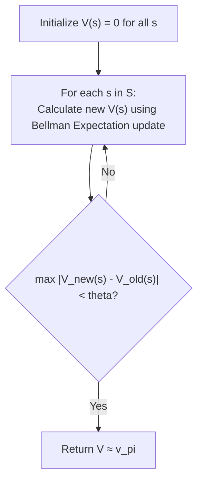
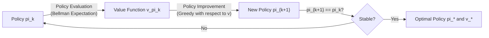
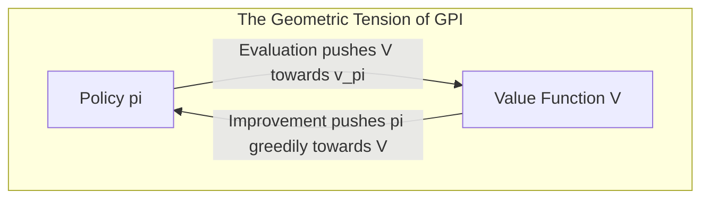

# APS1080: Intro to Reinforcement Learning
# Lecture 2 Study Notes: Dynamic Programming & Generalized Policy Iteration
**Textbook Reference**: Sutton & Barto (2020), Chapter 4  
**Associated Course Milestone**: [Assignment 1: Dynamic Programming](file:///G:/Other%20computers/My%20Computer/aps1080/README.md#L101) (Due Oct 14)

---

## 1. Introduction to Dynamic Programming (DP)

### 1.1 What is Dynamic Programming in RL?
Dynamic Programming refers to a collection of algorithms that can be used to compute optimal policies given a **perfect model of the environment** formulated as a Markov Decision Process (MDP).

* **Model-Based**: Requires complete knowledge of the transition dynamics $p(s', r \mid s, a)$.
* **Bootstrapping**: DP algorithms update value estimates based on other value estimates:
  $$\text{Estimate}(S_t) \leftarrow \mathbb{E} \left[ R_{t+1} + \gamma \cdot \text{Estimate}(S_{t+1}) \right]$$
* **Core Philosophy**: Use value functions ($v(s)$ or $q(s,a)$) to organize and structure the search for optimal policies.

> 💡 **粵語解構 (咩係 Dynamic Programming 同 Bootstrapping？)**:  
> 喺 RL 嘅世界入面，**Dynamic Programming（動態規劃，簡稱 DP）** 係有「上帝視角」嘅演算法！點解叫上帝視角？因為佢假設我哋已經有成個世界嘅完美說明書——即係 transition dynamics $p(s', r \mid s, a)$（喺邊個狀態揀邊個動作，有幾多成機率去邊度、攞幾多分，全部知到一清二楚）。  
> 而 **Bootstrapping（自力更生 / 用估值更新估值）** 就係 DP 嘅靈魂：我哋唔需要真係由頭玩到尾，只要用「下一個狀態嘅估值」，就可以即刻推算「當前狀態嘅估值」！好似你問朋友由多倫多去溫哥華幾耐，朋友話：「我唔知成個路程點行，但我知由卡加利去溫哥華要 12 個鐘，而你揸去卡加利要 30 個鐘。」你即刻就知道多倫多去溫哥華大約要 $30 + 12 = 42$ 個鐘。呢種「用後面嘅估算嚟更新前面嘅估算」，就叫 Bootstrapping！

---

## 2. Policy Evaluation (The Prediction Problem)

### 2.1 The Objective
Given a fixed policy $\pi$, compute its state-value function $v_\pi(s)$ for all $s \in \mathcal{S}$.

### 2.2 Iterative Policy Evaluation
Recall the **Bellman Expectation Equation** for $v_\pi$:
$$v_\pi(s) = \sum_{a \in \mathcal{A}(s)} \pi(a \mid s) \sum_{s' \in \mathcal{S}} \sum_{r \in \mathcal{R}} p(s', r \mid s, a) \left[ r + \gamma v_\pi(s') \right]$$

Iterative Policy Evaluation turns this equation into an iterative update rule. Starting from an arbitrary initial value function $v_0$ (with $v_0(\text{terminal}) = 0$):

$$v_{k+1}(s) \leftarrow \sum_{a} \pi(a \mid s) \sum_{s', r} p(s', r \mid s, a) \left[ r + \gamma v_k(s') \right] \quad \forall s \in \mathcal{S}$$

> 💡 **粵語解構 (Iterative Policy Evaluation 點樣運作？)**:  
> 想像你有一套固定嘅行棋策略 $\pi$（例如亂咁行、或者逢空位就衝），你點知呢套策略有幾好？  
> 做法就係：先將棋盤所有格子嘅身價 $v_0(s)$ 設做 0。然後喺成個棋盤不斷做「**掃描（Sweep）**」：每一格嘅新身價 $v_{k+1}(s)$，就係照住策略 $\pi$ 行一步之後，撞到嘅即時獎勵，再加上隔離格仔嘅舊身價 $v_k(s')$。掃一次唔準，掃十次、一百次，數值就會好似水波擴散咁逐漸平靜穩定落嚟。呢個收斂出嚟嘅身價，就係 $v_\pi$！

### 2.3 Implementation Details: Two Arrays vs. In-Place
1. **Two-Array Version**:
   - Keeps two tables: $v_k$ (read-only for step $k$) and $v_{k+1}$ (written during the sweep).
   - Exactly matches the theoretical recurrence relation.
2. **In-Place (One-Array) Version**:
   - Updates values directly in a single array: $v(s) \leftarrow \sum_a \pi(a \mid s) \sum_{s', r} p(s', r \mid s, a) [r + \gamma v(s')]$.
   - As a state's value is updated, the new value is immediately available for subsequent state updates in the same sweep.
   - **Properties**: Faster convergence, smaller memory footprint, and guaranteed convergence to $v_\pi$.

> 💡 **粵語實戰貼士 (Two Arrays vs In-Place)**:  
> 寫 Assignment 1 嘅時候千祈唔好搞亂！  
> - **Two-Array** 就好似你做功課抄一份新嘅，舊嗰份完全唔改，抄完先一次過 replace。雖然理論好乾淨，但要霸雙倍 RAM。  
> - **In-Place** 就係直接喺同一張紙上擦咗舊答案寫新答案！如果前一格更新咗，後一格計數嗰陣即刻食到最新數值。實測證明，**In-Place 收斂速度快接近一倍**，而且理論上保證一定會收斂，所以寫 code 一定優先用 In-Place！

### 2.4 Stopping Criterion
A sweep evaluates the maximum change in value across all states:
$$\Delta \leftarrow \max_{s \in \mathcal{S}} |v(s) - v_{\text{old}}(s)|$$
Stop when $\Delta < \theta$, where $\theta > 0$ is a small threshold ensuring near-exact convergence.

---

## 3. Policy Improvement

Once we know how good a policy $\pi$ is by computing $v_\pi(s)$, we can ask: *should we change our policy to choose an action $a \neq \pi(s)$?*

### 3.1 The Action-Value Perspective
The value of selecting action $a$ in state $s$, and subsequently following policy $\pi$:
$$q_\pi(s, a) \doteq \sum_{s', r} p(s', r \mid s, a) \left[ r + \gamma v_\pi(s') \right]$$

If $q_\pi(s, a) > v_\pi(s)$ for some action $a$, it is strictly better to select $a$ in state $s$ once, and follow $\pi$ thereafter.

### 3.2 The Policy Improvement Theorem
Let $\pi$ and $\pi'$ be any pair of deterministic policies such that, for all $s \in \mathcal{S}$:
$$q_\pi(s, \pi'(s)) \ge v_\pi(s)$$

Then the policy $\pi'$ must be as good as, or better than, $\pi$:
$$v_{\pi'}(s) \ge v_\pi(s) \quad \forall s \in \mathcal{S}$$

If strict inequality holds at any state, then $\pi'$ is strictly superior to $\pi$.

> 💡 **粵語解構 (Policy Improvement Theorem 嘅白話精髓)**:  
> 呢個定理係成個 RL 最偉大嘅數學保證之一！  
> 佢話：「如果喺某個狀態，你轉行另一個動作 $a$，而呢個動作帶嚟嘅預期回報 $q_\pi(s, a)$ 竟然高過你原本策略嘅身價 $v_\pi(s)$；咁樣，你直接將成套策略更新做『見到 $s$ 就必出動作 $a$』，你成套新策略嘅整體表現就保證**只會變好、絕對唔會變差**！」  
> 呢個定理比咗我哋膽量去放心貪婪化（Greedy Update），唔洗驚改咗某一步會搞躝全局！

### 3.3 Greedy Policy Generation
We update the policy greedily with respect to the action values:
$$\pi'(s) \doteq \arg\max_{a \in \mathcal{A}(s)} q_\pi(s, a) = \arg\max_{a \in \mathcal{A}(s)} \sum_{s', r} p(s', r \mid s, a) \left[ r + \gamma v_\pi(s') \right]$$

---

## 4. Policy Iteration

Policy Iteration combines complete **Policy Evaluation** and **Policy Improvement** in an alternating loop:

$$\pi_0 \xrightarrow{\text{Evaluation}} v_{\pi_0} \xrightarrow{\text{Improvement}} \pi_1 \xrightarrow{\text{Evaluation}} v_{\pi_1} \xrightarrow{\text{Improvement}} \dots \xrightarrow{\text{Improvement}} \pi_*$$

### 4.1 Convergence Guarantee
Because a finite MDP has only a finite number of deterministic policies ($|\mathcal{A}|^{|\mathcal{S}|}$), and each iteration strictly improves the policy, **Policy Iteration must converge to the optimal policy $\pi_*$ and optimal value function $v_*$ in a finite number of iterations**.

> 💡 **粵語解構 (Policy Iteration：有潔癖嘅完美主義者)**:  
> Policy Iteration 嘅做嘢風格就係「極度嚴謹」：  
> 1. 每當佢拿到一套新策略，佢一定要喺 Policy Evaluation 嗰度做無數次掃描，直到數值完全收斂（$\Delta < \theta$），算清算楚呢套策略嘅真正價值 $v_\pi$。  
> 2. 算清算楚之後，先至做一次 Policy Improvement，將所有格仔貪婪更新為最好嘅動作。  
> 3. 重複呢個循環，直到策略完全無再郁過（Policy Stable），即係已經登頂成仙（Optimal Policy）！

---

## 5. Value Iteration

### 5.1 The Bottleneck of Policy Iteration
Policy Iteration requires multiple sweeps over the state space in each evaluation step. Does evaluation really need to converge fully to $v_\pi$?

**No.** Value Iteration truncates policy evaluation to **a single sweep** ($k = 1$):
$$v_{k+1}(s) \leftarrow \max_{a \in \mathcal{A}(s)} \sum_{s', r} p(s', r \mid s, a) \left[ r + \gamma v_k(s') \right] \quad \forall s \in \mathcal{S}$$

This update is the **Bellman Optimality Equation** turned into an operational update rule!

### 5.2 Algorithm Comparison: Policy Iteration vs. Value Iteration

| Dimension | Policy Iteration | Value Iteration |
| :--- | :--- | :--- |
| **Inner Loop** | Full evaluation sweep until convergence ($\Delta < \theta$) | Single update step per state ($\max_a$) |
| **Equation Used in Update** | Bellman **Expectation** Equation: $\sum_a \pi(a \mid s)$ | Bellman **Optimality** Equation: $\max_a$ |
| **Explicit Policy Storage** | Yes (maintains both $\pi(s)$ and $V(s)$ arrays) | No (updates only $V(s)$; policy extracted at the end) |
| **Iterations to Converge** | Very few policy improvement steps (typically 3–5) | More sweeps over $V$, but each sweep is computationally cheap |
| **Typical Runtime** | Can be slow if state space is large due to inner loop | Often substantially faster in wall-clock time |

> 💡 **粵語解構 (Value Iteration：快狠準嘅實用主義者)**:  
> Value Iteration 就好似問：「喂，我都未決定好最後用邊套策略，使唔使喺 Evaluation 嗰度嘥咁多時間計得咁精準呀？」  
> 所以佢好乾脆：**每一輪只掃一次，而且每掃一格就直接用 $\max_a$ 揀最勁嗰個動作！**  
> 佢喺成個過程中根本唔儲存策略陣列 $\pi$，只係一路更新 $V(s)$。直到 $V(s)$ 嘅變化細過門檻 $\theta$，佢先至喺最後一刻「啪」一聲做一次 $\arg\max$，一口氣輸出最佳策略 $\pi_*$。喺寫 code 同實際工程入面，Value Iteration 通常比 Policy Iteration 跑得快好多！

---

## 6. Generalized Policy Iteration (GPI)

**Generalized Policy Iteration (GPI)** describes the broad concept of allowing policy evaluation and policy improvement to interact, regardless of the granularity or frequency of the two processes.

- Two opposing forces drive toward consistency:
  - Evaluation makes the value function consistent with the current policy.
  - Improvement makes the policy greedy with respect to the current value function.
- When both processes have no further changes to make, the system reaches equilibrium:
  $$v = v_* \quad \text{and} \quad \pi = \pi_*$$

> 💡 **粵語解構 (GPI 的太極陰陽哲學)**:  
> Sutton & Barto 書入面最靚嘅概念就係 GPI！  
> 想像兩條互相角力嘅線：一條係「評估（Evaluation）」，想逼身價 $V$ 去貼合當前嘅策略；另一條係「改進（Improvement）」，當身價 $V$ 一變，策略又即刻想貪婪叛變。  
> 兩者看似互相扯貓尾、互相搞亂對方，但正正係呢種動態張力，好似雙螺旋咁，一步一步將個系統推向最神聖嘅平衡點——**Optimal Value $v_*$ 同 Optimal Policy $\pi_*$**！幾乎後續所有進階演算法（Sarsa, Q-Learning, Actor-Critic）全部都係 GPI 嘅化身！

---

## 7. Connecting Lecture 2 to Assignment 1

In [Assignment 1](file:///G:/Other%20computers/My%20Computer/aps1080/README.md#L101), you will implement:
1. **Iterative Policy Evaluation** on Gridworld (`chapter03/grid_world.py`).
2. **Policy Iteration** (Policy Evaluation loop + Greedy Policy Improvement).
3. **Value Iteration** (Single sweep using Bellman Optimality operator).
4. Analysis of stopping criteria ($\theta = 10^{-4}$), discount factors $\gamma \in \{0.5, 0.9, 1.0\}$, and boundary collision conditions.
