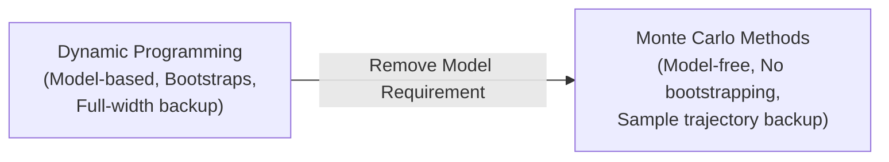
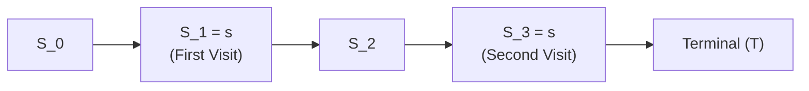
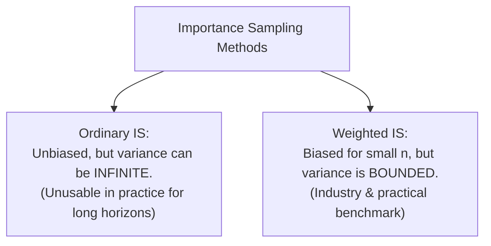

# APS1080: Intro to Reinforcement Learning
# Lecture 3 Study Notes: Monte Carlo Methods
**Textbook Reference**: Sutton & Barto (2020), Chapter 5  
**Course Schedule**: Lecture 3 (Sept 23)  
**Code Reference**: [`chapter05/blackjack.py`](file:///G:/Other%20computers/My%20Computer/aps1080/chapter05/blackjack.py), [`chapter05/infinite_variance.py`](file:///G:/Other%20computers/My%20Computer/aps1080/chapter05/infinite_variance.py)

---

## 1. Overview: From Dynamic Programming to Monte Carlo

Dynamic Programming requires a complete model of the environment ($p(s', r \mid s, a)$). In real-world engineering and systems problems, this transition distribution is rarely known analytically.

**Monte Carlo (MC) methods** solve the RL problem through **experience**—sample sequences of states, actions, and rewards from interaction with an actual or simulated environment.



### Core Characteristics of Monte Carlo:
1. **Model-Free**: Learns directly from sampled episodes without requiring transition probabilities or reward distributions.
2. **Episodic Tasks Only**: MC methods are defined only for episodic tasks; learning occurs only *after* an episode terminates and actual returns $G_t$ are observed.
3. **No Bootstrapping**: MC does *not* update value estimates based on successor value estimates (unlike DP and TD). Value estimates are updated toward actual empirical returns:
   $$V(S_t) \leftarrow V(S_t) + \alpha [G_t - V(S_t)]$$
4. **Independent State Updates**: The computational expense of estimating the value of a single state is independent of the total number of states in the environment.

> 💡 **粵語解構 (DP 轉向 Monte Carlo：由「睇說明書」變為「落場真打」)**:  
> 喺 Lecture 2 講嘅 Dynamic Programming（DP），好似你打機前攞住本官方攻略本，每一步嘅機率分毫不差。但現實世界（例如自動駕駛、金融炒賣、甚至廿一點 Blackjack）點會有本完美說明書比你？  
> **Monte Carlo（蒙地卡羅，簡稱 MC）** 嘅思維就係「**無說明書？咁我就落場真打一千場！**」  
> 佢有三大特點：  
> 1. **Model-free**：完全唔需要知背後嘅物理公式。  
> 2. **一定要打完一鋪（Episodic）**：中途唔計數，一定要等場波完咗、勝負已分，攞到真實嘅總回報 $G_t$ 先至做結算。  
> 3. **零 Bootstrapping**：唔會用「隔離格嘅估值」嚟呃自己，佢只信「**真金白銀攞到嘅最終總回報 $G_t$**」！

---

## 2. Monte Carlo Prediction (Estimating $v_\pi$)

### 2.1 First-Visit MC vs. Every-Visit MC
Consider an episode where a state $s$ is visited multiple times:



* **First-Visit MC**:
  - Averages returns following only the **first** time state $s$ is visited in each episode.
  - **Properties**: Each sample return is an independent and identically distributed (i.i.d.) estimate of $v_\pi(s)$.
  - **Unbiased**: $\mathbb{E}[G_t \mid \text{first visit to } s] = v_\pi(s)$.
  - **Variance**: Standard error decreases at the rate $1/\sqrt{n}$.
* **Every-Visit MC**:
  - Averages returns following **all** visits to state $s$ across episodes.
  - **Properties**: Returns are not completely independent within an episode, but estimates converge asymptotically to $v_\pi(s)$.

> 💡 **粵語解構 (First-Visit vs Every-Visit 嘅白話分別)**:  
> 想像你打緊一隻 RPG 遊戲，喺同一鋪入面，你兩次經過「十字路口」呢個狀態（$s$）。  
> - **First-Visit MC**：好專一，只認「第一次」見到你嘅那一刻！佢只記錄你第一次經過十字路口之後到爆機嘅總回報，同一次遊戲入面第二次再路過就當睇唔到。好處係每鋪只出一個 data point，數學上完全獨立同分佈（i.i.d.），**保證 Unbiased（絕對無偏差）**！  
> - **Every-Visit MC**：好貪心，只要經過一次就記一筆賬。雖然同一鋪嘅兩次經歷有啲相關性，但只要你玩得夠多鋪，兩者最後都會收斂去同一個正確數值。考試如果考證明，**First-Visit MC** 係最乾淨、最常被考嘅！

### 2.2 First-Visit MC Prediction Algorithm
```text
Initialize:
    pi <- policy to be evaluated
    V(s) in R, arbitrarily (e.g., 0) for all s in S
    Returns(s) <- empty list for all s in S

Loop forever (for each episode):
    Generate an episode following pi: S_0, A_0, R_1, S_1, A_1, ..., S_{T-1}, A_{T-1}, R_T
    G <- 0
    Loop for each step of episode, t = T-1, T-2, ..., 0:
        G <- gamma * G + R_{t+1}
        Unless S_t appears in S_0, S_1, ..., S_{t-1}:
            Append G to Returns(S_t)
            V(S_t) <- average(Returns(S_t))
```

---

## 3. Monte Carlo Estimation of Action Values ($q_\pi$) & Exploring Starts

### 3.1 Why Action Values ($q_\pi$) are Required for Control
In Model-Free RL, knowing state values $v(s)$ is **insufficient for control**. Without a transition model $p(s', r \mid s, a)$, the agent cannot perform one-step lookahead to find the best action:
$$a^* = \arg\max_a \sum_{s', r} p(s', r \mid s, a) [r + \gamma v(s')] \quad \leftarrow \text{Impossible without } p!$$

Therefore, model-free methods must learn **action values** $q(s, a)$ directly:
$$\pi^*(s) = \arg\max_a q(s, a) \quad \leftarrow \text{Can be evaluated immediately without a model!}$$

> 💡 **粵語解構 (點解 Model-Free 必須學 $Q(s, a)$ 而唔係 $V(s)$？)**:  
> 呢個係 Test A 必考嘅觀念題！  
> 如果你有個完美 Model（好似 DP），你只要知每個格仔嘅身價 $V(s')$ 就夠，因為你可以「腦內預演」行左、行右、行上、行落會去到邊格。  
> 但如果係 **Model-Free**，你根本唔知出咗「左拳」之後環境會點變！如果你淨係手握 $V(s)$，你企喺度望住啲動作根本唔知揀邊個。相反，如果你學嘅係 **$Q(s, a)$**（喺呢個狀態出左拳值 8 分，出右拳值 3 分），你一眼望落去揀最高分嗰個即刻搞掂，完全唔洗求個環境話你知未來係點！

### 3.2 The Exploring Starts (ES) Assumption
If a policy is deterministic, many state-action pairs $(s, a)$ may never be visited, preventing the agent from discovering better actions.

* **Exploring Starts**: The assumption that every state-action pair has a non-zero probability of being selected as the **start of an episode**:
  $$\Pr(S_0 = s, A_0 = a) > 0 \quad \forall s \in \mathcal{S}, a \in \mathcal{A}(s)$$
* **Limitation**: Highly unrealistic in real physical applications (e.g., you cannot start a self-driving car in the middle of a catastrophic rollover crash).

---

## 4. Monte Carlo Control: On-Policy $\epsilon$-Greedy

To eliminate the unrealistic Exploring Starts assumption, the agent must ensure continuous exploration throughout all episodes.

### 4.1 On-Policy vs. Off-Policy Learning
* **On-Policy**: Evaluates and improves the *same* policy used to make decisions.
* **Off-Policy**: Evaluates a *target policy* $\pi$ while generating behavior using a different *behavior policy* $b$.

### 4.2 $\epsilon$-Greedy Policies
With probability $\epsilon$, choose a random action; with probability $1 - \epsilon$, choose the greedy action:
$$\pi(a \mid s) = \begin{cases} 
1 - \epsilon + \frac{\epsilon}{|\mathcal{A}(s)|} & \text{if } a = \arg\max_{a'} Q(s, a') \\ 
\frac{\epsilon}{|\mathcal{A}(s)|} & \text{if } a \neq \arg\max_{a'} Q(s, a') 
\end{cases}$$

Every action has a guaranteed minimum selection probability $\frac{\epsilon}{|\mathcal{A}(s)|} > 0$, satisfying persistent exploration without exploring starts.

> 💡 **粵語解構 (On-Policy 嘅妥協：做個留有後路嘅人)**:  
> On-Policy 嘅哲學就係「**你點樣行，你就學緊點樣行**」。  
> 因為你用緊 $\epsilon$-greedy 嚟玩遊戲（有 $\epsilon$ 機會手掣失靈或者手痕亂咁撳），所以你學出嚟嘅 $Q$ 值會好自然咁考慮到呢個「手痕風險」。例如喺懸崖邊，明明貼住邊行最近，但因為驚自己有 $\epsilon$ 機會跌落懸崖，On-Policy Agent 會自動學識繞道而行！

---

## 5. Off-Policy Prediction via Importance Sampling

Off-policy methods decouple the **target policy** $\pi$ (the policy being learned/optimized, typically deterministic greedy) from the **behavior policy** $b$ (the exploratory policy generating experience).

### 5.1 Assumption of Coverage
$$\pi(a \mid s) > 0 \implies b(a \mid s) > 0 \quad \forall s \in \mathcal{S}, a \in \mathcal{A}$$

### 5.2 The Importance Sampling Ratio
To estimate expectations under $\pi$ using samples drawn from $b$, we weight each trajectory by the relative probability of the trajectory occurring under $\pi$ versus $b$:

$$\rho_{t:T-1} \doteq \frac{\prod_{k=t}^{T-1} \pi(A_k \mid S_k) p(S_{k+1} \mid S_k, A_k)}{\prod_{k=t}^{T-1} b(A_k \mid S_k) p(S_{k+1} \mid S_k, A_k)} = \prod_{k=t}^{T-1} \frac{\pi(A_k \mid S_k)}{b(A_k \mid S_k)}$$

> [!IMPORTANT]
> **Cancellation of Transition Dynamics**:
> Notice that the unknown transition probabilities $p(S_{k+1} \mid S_k, A_k)$ appear in both numerator and denominator and **completely cancel out**! This allows off-policy learning to be 100% model-free.

> 💡 **粵語解構 (Importance Sampling 的終極精髓：偷睇別人打機)**:  
> 想像一下：你想學李小龍嘅極致打法（Target Policy $\pi$：招招致命、零多餘動作）；但你自己只係個初學者，打起上嚟好慌亂周圍試（Behavior Policy $b$）。  
> 你點樣可以用自己慌亂嘅打機錄影帶，去評估李小龍嘅身價？  
> 答案就係 **Importance Sampling（重要性採樣）**！  
> 關鍵公式：  
> $$\rho = \frac{\pi(A_t|S_t)}{b(A_t|S_t)}$$  
> 如果某一步，李小龍好想出（$\pi$ 機率高），而你咁啱又撞手神出咗（$b$ 機率低），咁呢一步就極度有參考價值，$\rho \gg 1$，權重放大！相反，如果你出咗一步李小龍一生都唔會出嘅白痴動作（$\pi = 0$），咁成個乘積即刻變 0，成段回憶直接作廢！最神奇嘅係：**大自然環境嘅物理機率 $p(s'|s,a)$ 喺分子分母完全約簡消晒！** 唔洗知環境物理，都可以做 Off-policy 學習！

---

### 5.3 Ordinary vs. Weighted Importance Sampling

Given a set of episodes where state $s$ was visited at times $\{t_1, t_2, \dots, t_n\}$:

#### 1. Ordinary Importance Sampling:
$$V(s) \doteq \frac{\sum_{i=1}^n \rho_{t_i:T(i)-1} G_{t_i}}{n}$$
- **Unbiased**: $\mathbb{E}[V(s)] = v_\pi(s)$.
- **Variance**: Can be **infinite/unbounded** because the product of ratios $\rho$ can explode if trajectories are long!

#### 2. Weighted Importance Sampling:
$$V(s) \doteq \frac{\sum_{i=1}^n \rho_{t_i:T(i)-1} G_{t_i}}{\sum_{i=1}^n \rho_{t_i:T(i)-1}}$$
- **Biased**: Has a small finite-sample bias (bias $\to 0$ as $n \to \infty$).
- **Variance**: **Bounded and dramatically lower**. If only a single sample exists, $V(s) = \frac{\rho G}{\rho} = G$, completely eliminating variance from scaling.
- **Practical Standard**: Weighted IS is overwhelmingly preferred in empirical RL.



---

## 6. Summary Comparison: DP vs. MC

| Feature | Dynamic Programming (DP) | Monte Carlo (MC) |
| :--- | :--- | :--- |
| **Model Requirement** | Model-based (Requires $p(s', r \mid s, a)$) | Model-free (Learns from experience samples) |
| **Bootstrapping** | Yes (Updates from successor state values) | No (Updates toward actual episode return $G_t$) |
| **Task Type** | Continuing or Episodic | Episodic tasks only |
| **Bias / Variance** | Biased initially, zero sampling variance | Unbiased (First-Visit), high sampling variance |
| **Computation Focus** | Full sweeps over all $|\mathcal{S}|$ states | Focuses updates only on states actually visited |
