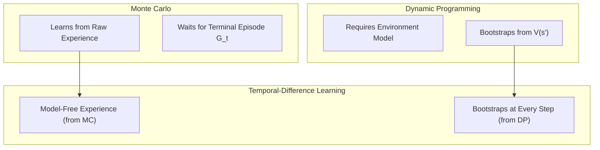
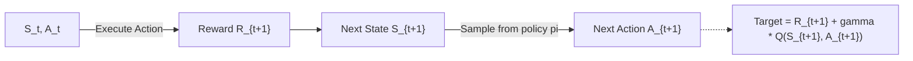

# APS1080: Intro to Reinforcement Learning
# Lecture 4 Study Notes: Temporal-Difference (TD) Learning
**Textbook Reference**: Sutton & Barto (2020), Chapter 6  
**Course Schedule**: Lecture 4 (Sept 30)  
**Code Reference**: [`chapter06/cliff_walking.py`](file:///G:/Other%20computers/My%20Computer/aps1080/chapter06/cliff_walking.py), [`chapter06/maximization_bias.py`](file:///G:/Other%20computers/My%20Computer/aps1080/chapter06/maximization_bias.py), [`chapter06/random_walk.py`](file:///G:/Other%20computers/My%20Computer/aps1080/chapter06/random_walk.py), [`chapter06/windy_grid_world.py`](file:///G:/Other%20computers/My%20Computer/aps1080/chapter06/windy_grid_world.py)

---

## 1. The Core Idea: The Marriage of DP and Monte Carlo

Temporal-Difference (TD) learning is the central, defining idea of modern reinforcement learning. It combines the primary strengths of Dynamic Programming and Monte Carlo:

| Feature | Dynamic Programming (Ch 4) | Monte Carlo (Ch 5) | Temporal-Difference (Ch 6) |
| :--- | :--- | :--- | :--- |
| **Model Needed?** | Yes ($p(s', r \mid s, a)$) | **No** (model-free) | **No** (model-free) |
| **Bootstrapping?** | **Yes** (from $v(s')$) | No (from return $G_t$) | **Yes** (from $v(S_{t+1})$) |
| **Sampling?** | No (full-width expectation) | **Yes** (sample paths) | **Yes** (sample transitions) |
| **Task Timing** | Full state sweeps | End of episode only | **Step-by-step (online)** |



> 💡 **粵語解構 (TD 點解係 RL 史上最偉大嘅發明？)**:  
> 記住一句話：「**TD 係 DP 同 MC 生出嚟嘅混血神童！**」  
> - **DP 嘅長處**係識得 Bootstrapping（用未來估值更新當前估值，唔洗等到天荒地老）；但弱點係一定要有上帝視角（Model）。  
> - **MC 嘅長處**係唔需要 Model，落場試錯就得；但弱點係太固執，一定要打到成局完結（Terminal）先至肯更新，如果個任務永不結束（Continuing），MC 即刻廢武功！  
> - **TD（時序差分）** 完美的將兩者合體：**佢落場打機（Model-Free），但每行一步，就即刻用下一步嘅估值嚟更新前一步（Online Bootstrapping）！**

---

## 2. TD Prediction: TD(0)

### 2.1 The One-Step TD Update Rule
At transition from $S_t$ to $S_{t+1}$ with reward $R_{t+1}$:
$$V(S_t) \leftarrow V(S_t) + \alpha \left[ R_{t+1} + \gamma V(S_{t+1}) - V(S_t) \right]$$

* **TD Target**:
  $$\text{Target} = R_{t+1} + \gamma V(S_{t+1})$$
  *(An estimate of the true return $G_t = R_{t+1} + \gamma G_{t+1}$)*
* **TD Error ($\delta_t$)**:
  $$\delta_t \doteq R_{t+1} + \gamma V(S_{t+1}) - V(S_t)$$
  The mismatch between the current estimate $V(S_t)$ and the improved estimate $R_{t+1} + \gamma V(S_{t+1})$.

> 💡 **粵語解構 (TD Error $\delta_t$：人生嘅「驚喜值」)**:  
> 乜嘢係 TD Error？佢就係你行咗一步之後嘅「**落差感**」！  
> 舉個生活例子：  
> - 你放工出門口嗰陣（狀態 $S_t$），估計搭地鐵返屋企要 30 分鐘（$V(S_t) = -30$）。  
> - 點知一行落月台（狀態 $S_{t+1}$），見到地鐵寫住「信號故障延誤 20 分鐘」，你當場估計返屋企仲要 50 分鐘（$V(S_{t+1}) = -50$）。  
> - 喺呢一秒，雖然你仲未真正返到屋企（未到 Terminal），但你個腦已經即刻知奶嘢，TD Error 係負數！  
> - MC 會叫你「等返到屋企坐低先至檢討啦」；但 **TD(0) 會喺你望到個指示牌嗰一刻，即刻將『放工出門口』嗰個狀態嘅時間估值調高！** 呢個就係 TD 嘅即時性同敏銳度！

---

## 3. Batch Training: Batch TD vs. Batch MC

When given a fixed, finite batch of training episodes repeatedly until convergence:

* **Batch Monte Carlo**:
  Minimizes the **Mean Squared Error** on the training data:
  $$\arg\min_V \sum_{k} (G_k - V(S_k))^2$$
  Yields zero sample error on past data, but may overfit non-Markov properties.
* **Batch TD(0)**:
  Converges to the **Certainty-Equivalence Estimate**—the maximum-likelihood model of the underlying Markov process. It estimates what the value function would be if the true transition dynamics matched the observed empirical frequencies.
* **Key Takeaway**: TD exploits the Markov property directly; on Markovian problems, TD is consistently more data-efficient than MC.

---

## 4. Sarsa: On-Policy TD Control

To perform control (policy optimization), we substitute state values $V(s)$ with state-action values $Q(s, a)$.

### 4.1 The Sarsa Update Rule
Named after the quintuple $(S_t, A_t, R_{t+1}, S_{t+1}, A_{t+1})$:
$$Q(S_t, A_t) \leftarrow Q(S_t, A_t) + \alpha \left[ R_{t+1} + \gamma Q(S_{t+1}, A_{t+1}) - Q(S_t, A_t) \right]$$

* **On-Policy Mechanism**: The action $A_{t+1}$ evaluated in the TD target is the **actual action** chosen by the agent's behavior policy (e.g., $\epsilon$-greedy) in the next state.



---

## 5. Q-Learning: Off-Policy TD Control

Watkins (1989) introduced **Q-Learning**, which decouples action evaluation from action execution.

### 5.1 The Q-Learning Update Rule
$$Q(S_t, A_t) \leftarrow Q(S_t, A_t) + \alpha \left[ R_{t+1} + \gamma \max_{a} Q(S_{t+1}, a) - Q(S_t, A_t) \right]$$

* **Off-Policy Mechanism**: Regardless of what action the agent actually selects at $S_{t+1}$, the update target assumes the agent will act **optimally (greedily)** by taking $\max_a Q(S_{t+1}, a)$.
* **Convergence**: $Q \to q_*$ directly, as long as all state-action pairs are continually updated and standard step-size conditions are satisfied.

> 💡 **粵語解構 (Sarsa vs Q-Learning：現實老實人 vs 理論狂人)**:  
> 呢個係全個 RL 最經典嘅對決！  
> - **Sarsa（老實人）**：佢嘅 target 係 $R_{t+1} + \gamma Q(S_{t+1}, A_{t+1})$。佢睇住自己「真係會出嗰個動作 $A_{t+1}$」。因為佢用 $\epsilon$-greedy，佢知自己有機會手痕亂出招，所以佢好小心謹慎。  
> - **Q-Learning（狂妄天才）**：佢嘅 target 係 $R_{t+1} + \gamma \max_a Q(S_{t+1}, a)$！佢完全無視下一次自己係咪會手痕，佢假設自己下一秒「**必定發揮 100% 完美水準（$\max_a$）**」！佢學出嚟嘅永遠係理論最完美嘅最佳路徑（$q_*$）。

---

## 6. Cliff Walking Case Study: Sarsa vs. Q-Learning

```text
[S] . . . . . . . . . . [G]
 C   C   C   C   C   C   C   (Cliff: Reward = -100, reset to S)
```

In the Cliff Walking environment ([`chapter06/cliff_walking.py`](file:///G:/Other%20computers/My%20Computer/aps1080/chapter06/cliff_walking.py)):
- **Step Reward**: $-1$ per transition.
- **Cliff Penalty**: $-100$ and reset to start $[S]$.

### Behavioral Divergence Under $\epsilon = 0.1$:
1. **Q-Learning**:
   - Learns the **optimal path** (skirting right along the edge of the cliff).
   - *Online Performance*: Poor! Because it explores with $\epsilon = 0.1$, it occasionally falls off the cliff into the $-100$ abyss. Its online average reward is low (~$-45$).
2. **Sarsa**:
   - Learns the **safe path** (taking the long detour around the top of the grid).
   - *Online Performance*: Excellent! It accounts for its own exploratory nature ($\epsilon$), actively protecting itself from accidental falls. Its online average reward is much higher (~$-20$).
3. **If $\epsilon \to 0$**: Both converge to the exact same optimal edge path.

> 💡 **粵語解構 (懸崖行走的生動比喻)**:  
> 想像懸崖邊有一條直達終點嘅獨木橋，跌落去罰 100 分。  
> - **Q-Learning** 係特技演員，佢計過「只要行獨木橋，5 步就到終點（最優解）」。但他忘記咗自己飲咗酒有 10% 機會手震（$\epsilon=0.1$），結果每行幾次就跌落懸崖粉身碎骨一次！  
> - **Sarsa** 係精明嘅普通人，佢知道自己飲咗酒會手震，所以佢話：「獨木橋雖快，但我寧願行上面大馬路兜個大圈，雖然多用幾步，但永遠唔會跌死！」  
> 結論：**喺有探索噪聲嘅真實環境入面，Sarsa 嘅在線實戰表現往往比 Q-Learning 更安全平穩！**

---

## 7. Maximization Bias and Double Q-Learning

### 7.1 What is Maximization Bias?
Because the $\max$ operator is convex, taking the maximum of noisy value estimates introduces a systematic positive bias:
$$\mathbb{E} \left[ \max_a Q(s, a) \right] \ge \max_a \mathbb{E} \left[ Q(s, a) \right]$$

Even if all actions have a true expected value of $0$, random variance will cause some actions to have estimated values $> 0$. The $\max$ operator greedily latches onto these overestimations, leading to disastrously poor policies.

### 7.2 Double Q-Learning Solution
Decouple **action selection** from **action evaluation** using two separate value tables $Q_1$ and $Q_2$:
- With 50% probability, update $Q_1$:
  $$A^* = \arg\max_a Q_1(S_{t+1}, a) \quad \text{(Select best action using } Q_1\text{)}$$
  $$Q_1(S_t, A_t) \leftarrow Q_1(S_t, A_t) + \alpha \left[ R_{t+1} + \gamma Q_2(S_{t+1}, A^*) - Q_1(S_t, A_t) \right] \quad \text{(Evaluate using } Q_2\text{)}$$
- With 50% probability, swap roles and update $Q_2$.

Because $Q_2(S_{t+1}, A^*)$ is an independent estimate, the expected value is completely unbiased ($\mathbb{E}[Q_2] = q_*$). This completely eliminates maximization bias! (See [`chapter06/maximization_bias.py`](file:///G:/Other%20computers/My%20Computer/aps1080/chapter06/maximization_bias.py)).

> 💡 **粵語解構 (Maximization Bias 與 Double Q-Learning：避開盲目樂觀)**:  
> 點解會有「Maximization Bias（最大化偏差）」？  
> 想像有 10 隻股票，真實期望回報全部都係 0（平手）。但因為市場有雜音，今日有幾隻咁啱升咗少少（估值 +2），有幾隻跌咗少少（估值 -2）。如果你的策略係「每次都揀最好嗰隻（$\max$）」，你實會揀中嗰幾隻咁啱升咗嘅股票，誤以為個市好好賺（$\mathbb{E}[\max] > 0$）！  
> **Double Q-Learning 點解搞得掂？**  
> 佢請咗兩個獨立分析師：**大廚（$Q_1$）負責揀菜，二廚（$Q_2$）負責試味！**  
> $Q_1$ 話：「我覺得 A 動作最好！」然後交比 $Q_2$ 評分：「你覺得好無用，等我獨立幫 A 動作打分！」因為 $Q_2$ 無參與挑選，所以佢唔會有樂觀偏見。呢個經典思想，直接啟發咗幾十年後 DeepMind 的 **Double DQN**！
