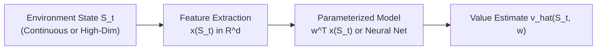
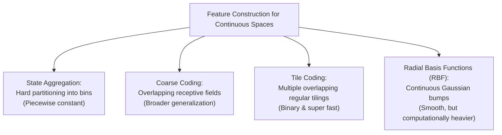

# APS1080: Intro to Reinforcement Learning
# Lecture 5 Study Notes: On-Policy Prediction with Function Approximation
**Textbook Reference**: Sutton & Barto (2020), Chapter 9  
**Course Schedule**: Lecture 5 (Oct 7)  
**Code Reference**: [`chapter09/random_walk.py`](file:///G:/Other%20computers/My%20Computer/aps1080/chapter09/random_walk.py), [`chapter09/square_wave.py`](file:///G:/Other%20computers/My%20Computer/aps1080/chapter09/square_wave.py)

---

## 1. The Necessity of Function Approximation

### 1.1 The Breakdown of Tabular RL
In Chapters 1–6, value functions were represented as lookup tables with one entry per state $V(s)$ or state-action pair $Q(s, a)$.
* In real-world problems (continuous control, robotics, games like Go or StarCraft), the state space is either **uncountably infinite** or astronomically large ($|\mathcal{S}| \gg 10^{20}$).
* Tabular representations suffer from two fatal limitations:
  1. **Memory constraints**: Inability to store lookup tables for millions of states.
  2. **Data efficiency**: The agent can only ever visit a microscopic fraction of all states. Without generalization, learning what to do in state $s$ gives zero guidance for an unvisited state $s'$ that differs only by a fraction of a millimeter.

### 1.2 Generalization
**Function approximation** parameterizes the value function using a weight vector $\mathbf{w} \in \mathbb{R}^d$, where $d \ll |\mathcal{S}|$:
$$\hat{v}(s, \mathbf{w}) \approx v_\pi(s)$$

Updating the weights using experience from state $S_t$ automatically changes the value estimates of other similar states, enabling **generalization**.

> 💡 **粵語解構 (點解一定要告別查表法 Tabular？)**:  
> 喺 Chapter 1-6，我哋好似小學日記咁，開個 Python `dict()` 逐格記錄：每個盤面對應一個數字。  
> 但現實中如果係揸車，你隻腳踩深油門 0.001 毫米，嚴格嚟講就已經係一個全新嘅 State！如果用查表法，世界上有無限咁多個 State，你部電腦爆炸都裝唔晒（Memory 唔夠）。而且最攞命嘅係：你喺「踩深 1.0 毫米」嗰陣學識避開前車，如果無 **Generalization（泛化能力）**，你下次踩到「1.001 毫米」嗰陣就會變成白痴，完全唔知要避車！  
> 所以我哋必須引入 **Function Approximation（函數逼近）**——用一組參數權重 $\mathbf{w}$（例如線性權重或者神經網絡）嚟代表價值函數。只要學一次，隔離啲相似狀態就會一齊被更新！

---

## 2. The Prediction Objective: Mean Squared Value Error ($\overline{\text{VE}}$)

Because the parameter dimension $d$ is far smaller than $|\mathcal{S}|$, an exact match ($\hat{v}(s, \mathbf{w}) = v_\pi(s)$ for all $s$) is generally impossible. Approximating one state accurately often forces another state to be approximated less accurately.

### 2.1 The Value Error Objective
We define the weighted **Mean Squared Value Error**:
$$\overline{\text{VE}}(\mathbf{w}) \doteq \sum_{s \in \mathcal{S}} \mu(s) \left[ v_\pi(s) - \hat{v}(s, \mathbf{w}) \right]^2$$

* **State Distribution $\mu(s)$**:
  - $\mu(s) \ge 0$, $\sum_{s} \mu(s) = 1$.
  - Represents the fraction of time spent in state $s$ under the target policy $\pi$ (the **on-policy distribution**).
  - In continuing tasks, $\mu(s)$ is the stationary distribution of the Markov chain.
  - States that are visited frequently are weighted heavily; rare states matter less.

> 💡 **粵語解構 (為甚麼目標函數要有 $\mu(s)$ 加權？)**:  
> 想像你讀書時間有限，你應該將精力放喺邊度？梗係放喺「考試經常出」嗰幾課！  
> 狀態分佈 $\mu(s)$ 就係呢個意思：如果某個狀態你幾千年先遇到一次（$\mu(s) \approx 0$），就算神經網絡估錯少少都完全無傷大雅；但如果某個狀態係你每日返工揸車都會遇到（$\mu(s)$ 好大），你就必須調教參數 $\mathbf{w}$ 令呢個狀態估得精精準準！

---

## 3. Stochastic Gradient Descent (SGD) and Semi-Gradient Methods

### 3.1 True Stochastic Gradient Descent
If we perform gradient descent on $\overline{\text{VE}}$ using an observed transition at time $t$:
$$\mathbf{w}_{t+1} = \mathbf{w}_t - \frac{1}{2} \alpha \nabla_{\mathbf{w}} \left[ v_\pi(S_t) - \hat{v}(S_t, \mathbf{w}_t) \right]^2 = \mathbf{w}_t + \alpha \left[ v_\pi(S_t) - \hat{v}(S_t, \mathbf{w}_t) \right] \nabla \hat{v}(S_t, \mathbf{w}_t)$$

In practice, the true value $v_\pi(S_t)$ is unknown. We substitute an estimated target $U_t$:
$$\mathbf{w}_{t+1} = \mathbf{w}_t + \alpha \left[ U_t - \hat{v}(S_t, \mathbf{w}_t) \right] \nabla \hat{v}(S_t, \mathbf{w}_t)$$

### 3.2 Monte Carlo as True Gradient Descent
If we use the full empirical return as target ($U_t = G_t$):
- $G_t$ is an **unbiased estimate** of $v_\pi(S_t)$ ($\mathbb{E}[G_t \mid S_t] = v_\pi(S_t)$).
- **True Gradient Descent**: The update vector is an unbiased estimate of the negative gradient of $\overline{\text{VE}}$.
- **Guaranteed Convergence**: Converges to a local optimum under standard decreasing step-size conditions.

### 3.3 Semi-Gradient TD(0)
If we use the one-step bootstrapping target ($U_t = R_{t+1} + \gamma \hat{v}(S_{t+1}, \mathbf{w}_t)$):
$$\mathbf{w}_{t+1} = \mathbf{w}_t + \alpha \left[ R_{t+1} + \gamma \hat{v}(S_{t+1}, \mathbf{w}_t) - \hat{v}(S_t, \mathbf{w}_t) \right] \nabla \hat{v}(S_t, \mathbf{w}_t)$$

> [!WARNING]
> **Why is it called "Semi-Gradient"?**:
> The target $U_t = R_{t+1} + \gamma \hat{v}(S_{t+1}, \mathbf{w}_t)$ **depends on the parameter vector $\mathbf{w}_t$**! 
> True gradient descent would require taking the gradient of the target with respect to $\mathbf{w}$ as well:
> $$\nabla_{\mathbf{w}} [U_t - \hat{v}(S_t, \mathbf{w})]^2 = -2 [U_t - \hat{v}(S_t, \mathbf{w})] (\gamma \nabla \hat{v}(S_{t+1}, \mathbf{w}) - \nabla \hat{v}(S_t, \mathbf{w}))$$
> Semi-gradient methods deliberately **drop the derivative of the target**, treating $U_t$ as an independent scalar constant.

> 💡 **粵語解構 (「半梯度 Semi-Gradient」究竟有幾反直覺？)**:  
> 呢個係全個 Lecture 5 最精髓嘅考試陷阱！  
> 點解叫「半（Semi-）」梯度？  
> 喺 Supervised Learning 入面，你的 Label $y$ 係常數，唔會隨住模型權重 $\mathbf{w}$ 變動，所以求導好乾淨。  
> 但喺 TD 學習入面，你個 Target 係：  
> $$\text{Target} = R_{t+1} + \gamma \hat{v}(S_{t+1}, \mathbf{w})$$  
> 見唔見到？！**個 Target 入面竟然包含緊你自己的權重 $\mathbf{w}$！** 換言之，你嘅目標會隨住你嘅腳步一齊飄移！  
> 如果做正規微積分，你應該對 Target 入面嘅 $\mathbf{w}$ 一齊求導。但 Sutton & Barto 話：「**千祈唔好求導後面嗰項！** 只要當後面嗰項係天上跌落嚟嘅固定常數就得！」  
> 呢種特登「裝盲」只對預測項求導嘅神仙操作，就叫做 **Semi-Gradient**！雖然佢唔係嚴格嘅 Gradient Descent，但數學證明，喺線性函數逼近下，佢依然會奇蹟般收斂到固定點（TD Fixed Point）！

---

## 4. Linear Methods and Feature Construction

### 4.1 Linear Function Approximation
Value function is represented as the inner product of weights and a feature vector:
$$\hat{v}(s, \mathbf{w}) \doteq \mathbf{w}^T \mathbf{x}(s) = \sum_{i=1}^d w_i x_i(s)$$

The gradient with respect to $\mathbf{w}$ is simply the feature vector itself:
$$\nabla_{\mathbf{w}} \hat{v}(s, \mathbf{w}) = \mathbf{x}(s)$$

The linear semi-gradient TD(0) update reduces to an extremely simple form:
$$\mathbf{w}_{t+1} = \mathbf{w}_t + \alpha \delta_t \mathbf{x}(S_t)$$
where $\delta_t = R_{t+1} + \gamma \mathbf{w}_t^T \mathbf{x}(S_{t+1}) - \mathbf{w}_t^T \mathbf{x}(S_t)$.

---

### 4.2 Feature Construction Techniques

#### Tile Coding
- Space is partitioned by multiple **tilings** (grids), each offset from the others by a fractional displacement vector.
- In each tiling, exactly **one** tile is active ($1$), and all other tiles are $0$.
- If there are $m$ tilings, the feature vector $\mathbf{x}(s)$ contains exactly $m$ ones and all other entries are zero:
  $$\mathbf{w}^T \mathbf{x}(s) = \sum_{i \in \text{active tiles}} w_i$$
- **Computational Efficiency**: Calculating $\hat{v}(s, \mathbf{w})$ requires only summing $m$ weights; no matrix multiplication required!
- **Step-Size Rule of Thumb for Tile Coding**:
  $$\alpha = \frac{1}{\tau \cdot m}$$
  where $m$ is the number of tilings and $\tau$ is the desired number of experiences to reach convergence (typically $\tau \approx 10$).

> 💡 **粵語解構 (Tile Coding：工程師嘅終極偷懶美學)**:  
> 點樣將連續嘅物理世界（例如機械臂角度、車速）餵比線性模型？  
> 最聰明嘅方法叫 **Tile Coding（瓦片編碼）**！  
> 想像你攞幾張有網格嘅透明紙，每張紙微微向右下角偏位幾毫米，然後疊埋一齊。任何一個連續坐標點落入去，每張紙只會有一格被圈中！  
> 如果你有 8 張紙（8 個 Tilings），你個 Feature Vector 入面就永遠只有 8 個 1，其他幾千個維度全部係 0！  
> 計身價嗰陣：**連乘法都唔洗做，只要將嗰 8 個 active tile 嘅權重加埋一齊即刻搞掂！** 既有平滑嘅局部泛化，計算速度又快到飛起，非常適合做實時控制！

---

## 5. The TD Fixed Point

For linear semi-gradient TD(0), does the update converge?
Let the expected system dynamics be:
$$\mathbf{A} \doteq \mathbb{E} \left[ \mathbf{x}_t (\mathbf{x}_t - \gamma \mathbf{x}_{t+1})^T \right] = \mathbf{X}^T \mathbf{D} (\mathbf{I} - \gamma \mathbf{P}_\pi) \mathbf{X}$$
$$\mathbf{b} \doteq \mathbb{E} [R_{t+1} \mathbf{x}_t] = \mathbf{X}^T \mathbf{D} \mathbf{r}_\pi$$

The expected weight update is:
$$\mathbb{E}[\mathbf{w}_{t+1} \mid \mathbf{w}_t] = \mathbf{w}_t + \alpha (\mathbf{b} - \mathbf{A} \mathbf{w}_t)$$

When the system reaches steady state ($\mathbf{b} - \mathbf{A} \mathbf{w}_{\text{TD}} = 0$):
$$\mathbf{w}_{\text{TD}} = \mathbf{A}^{-1} \mathbf{b}$$

### Convergence Guarantee
Because the matrix $\mathbf{A}$ is proven to be **positive definite** whenever $\mathbf{X}$ has full column rank and $\gamma < 1$, **linear semi-gradient TD(0) is mathematically guaranteed to converge to the unique TD fixed point $\mathbf{w}_{\text{TD}}$**.

At the TD fixed point, the approximation error is bounded by:
$$\overline{\text{VE}}(\mathbf{w}_{\text{TD}}) \le \frac{1}{1 - \gamma} \min_{\mathbf{w}} \overline{\text{VE}}(\mathbf{w})$$
