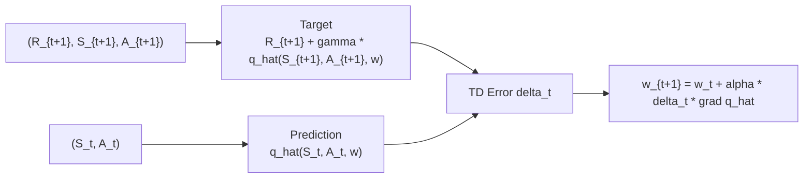
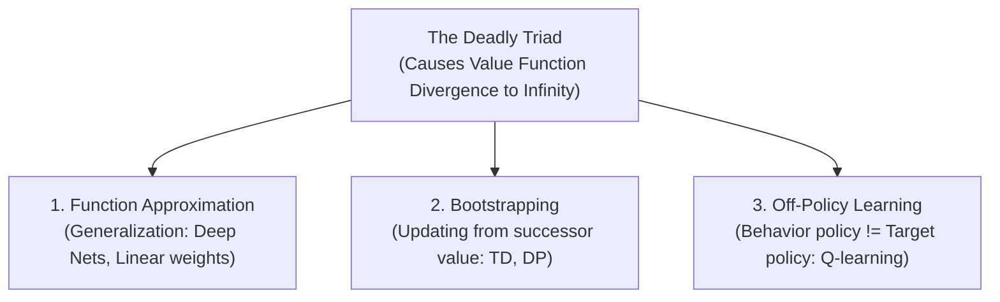
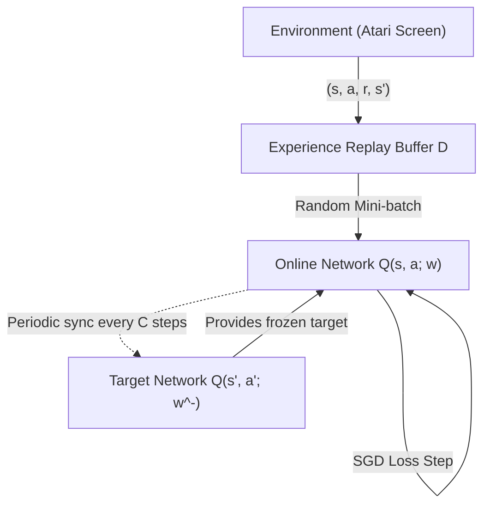

# APS1080: Intro to Reinforcement Learning
# Lecture 6 Study Notes: Control with Function Approximation & Deep Q-Networks (DQN)
**Textbook Reference**: Sutton & Barto (2020), Chapters 10 & 11 (Section 11.3)  
**Foundational Paper**: Mnih et al. (2015), *"Human-level control through deep reinforcement learning"*, Nature  
**Course Schedule**: Lecture 6 (Oct 14)  
**Code Reference**: [`chapter10/mountain_car.py`](file:///G:/Other%20computers/My%20Computer/aps1080/chapter10/mountain_car.py), [`chapter10/access_control.py`](file:///G:/Other%20computers/My%20Computer/aps1080/chapter10/access_control.py)

---

## 1. On-Policy Control with Function Approximation

In Chapter 9, function approximation was applied to evaluate a fixed policy ($\hat{v} \approx v_\pi$). In Chapter 10, we extend function approximation to **control** by approximating the action-value function:
$$\hat{q}(s, a, \mathbf{w}) \approx q_*(s, a) \quad \text{where } \mathbf{w} \in \mathbb{R}^d$$

### 1.1 Episodic Semi-Gradient Sarsa
To find an optimal policy, we use the Generalized Policy Iteration (GPI) framework with parameterized action values. At transition $(S_t, A_t, R_{t+1}, S_{t+1}, A_{t+1})$:

$$\mathbf{w}_{t+1} \leftarrow \mathbf{w}_t + \alpha \left[ R_{t+1} + \gamma \hat{q}(S_{t+1}, A_{t+1}, \mathbf{w}_t) - \hat{q}(S_t, A_t, \mathbf{w}_t) \right] \nabla_{\mathbf{w}} \hat{q}(S_t, A_t, \mathbf{w}_t)$$

### 1.2 Continuous Control Benchmark: Mountain Car ([`chapter10/mountain_car.py`](file:///G:/Other%20computers/My%20Computer/aps1080/chapter10/mountain_car.py))
* **Environment**: Underpowered car stuck in a valley; must drive backward up the left hill to gain enough momentum to reach the goal on the right hill.
* **State**: Continuous 2D vector $\mathbf{s} = (\text{position } x, \text{velocity } \dot{x})$.
* **Actions**: $\mathcal{A} = \{-1 \text{ (reverse)}, 0 \text{ (coast)}, +1 \text{ (forward)}\}$.
* **Reward**: $R = -1$ per step until goal is reached (encourages fastest escape).
* **Representation**: Tile coding with 8 overlapping tilings.

> 💡 **粵語解構 (Mountain Car：想衝上山，必須先倒車蓄力！)**:  
> Mountain Car 係 RL 歷史上最標誌性嘅環境之一！架車引擎馬力不足，就算油門踩到盡，架車都會喺半山腰滑返落嚟。Agent 想成功上右邊山頂，**唯一的生路係先向左倒車衝上左邊斜坡，借勢蕩返落嚟先至夠衝力衝上右邊山頂！**  
> 如果係貪婪嘅盲目 Agent，向左倒車會離終點更遠，佢打死都唔肯做。只有透過 Semi-gradient Sarsa 配搭 Tile Coding，Agent 先至學識「犧牲眼前利益，換取未來勢能」嘅高深物理智慧！

---

## 2. Continuing Tasks and Average-Reward Reinforcement Learning

In continuing (non-episodic) tasks with function approximation, traditional **discounting breaks down**:
* When using function approximation, states are fundamentally entangled through shared parameters $\mathbf{w}$.
* The discount factor $\gamma$ fails to prioritize policy ranking correctly because the ranking depends on an arbitrary starting state distribution.

### 2.1 The Average-Reward Formulation
Instead of discounting, the quality of a policy is measured by its **average rate of reward per step** ($r(\pi)$):

$$r(\pi) \doteq \lim_{h \to \infty} \frac{1}{h} \sum_{t=1}^h \mathbb{E}[R_t \mid S_0, A_{0:t-1} \sim \pi] = \sum_{s \in \mathcal{S}} \mu(s) \sum_{a \in \mathcal{A}} \pi(a \mid s) \sum_{s', r} p(s', r \mid s, a) r$$

### 2.2 Differential Returns & Differential Sarsa
In the average-reward setting, returns are defined as **differences** between received rewards and the baseline average reward:
$$G_t \doteq (R_{t+1} - r(\pi)) + (R_{t+2} - r(\pi)) + (R_{t+3} - r(\pi)) + \dots$$

**Differential TD Error**:
$$\delta_t \doteq R_{t+1} - \bar{R}_t + \hat{q}(S_{t+1}, A_{t+1}, \mathbf{w}_t) - \hat{q}(S_t, A_t, \mathbf{w}_t)$$

where $\bar{R}_t$ is an online running estimate of the average reward:
$$\bar{R}_{t+1} \leftarrow \bar{R}_t + \beta \delta_t$$

> 💡 **粵語解構 (Differential Sarsa：用「打工底薪」嚟評分)**:  
> 喺永不結束嘅任務入面，點解唔用 $\gamma$？因為當神經網絡參數共享嗰陣，$\gamma$ 會令策略好壞取決於你喺邊度出發。  
> 所以 Sutton 提出 **Average-Reward**：首先計出全場嘅「平均時薪」（$\bar{R}_t$）。  
> 每一筆收入 $R_{t+1}$，我哋唔睇佢絕對值，而係睇佢**比平均底薪多咗定少咗（$R_{t+1} - \bar{R}_t$）**！如果比平均好，加分；比平均差，扣分！呢個概念乾淨利落，係工業伺服器控制同網絡調度嘅標準做法！

---

## 3. The Deadly Triad: Instability and Divergence in RL

One of the most profound theoretical discoveries in reinforcement learning is **The Deadly Triad** (Sutton & Barto Section 11.3).

### The Three Deadly Elements:
1. **Function Approximation**: Values are approximated with parameters $\mathbf{w}$ ($d \ll |\mathcal{S}|$), creating generalization across states.
2. **Bootstrapping**: Value targets depend on estimates of subsequent states ($R_{t+1} + \gamma V(S_{t+1})$) rather than actual empirical returns ($G_t$).
3. **Off-Policy Learning**: Experience is generated from a distribution different from the target policy's stationary distribution.

> [!CAUTION]
> **The Stability Rule**:
> You can safely combine **any two** of these three elements:
> - **DP**: Bootstrapping + Off-Policy, but *Tabular* (Stable).
> - **Linear MC**: Function Approximation + Off-Policy, but *No Bootstrapping* (Stable).
> - **Linear Sarsa**: Function Approximation + Bootstrapping, but *On-Policy* (Stable).
> **If all three are present simultaneously, the value estimates can diverge uncontrollably to infinity ($\mathbf{w} \to \infty$)!**

> 💡 **粵語解構 (死亡鐵三角 The Deadly Triad：點解一齊用會爆炸？)**:  
> 呢個係全個 RL 最恐怖嘅詛咒！  
> 想像三個毒藥：  
> 1. **函數逼近（FA）**：改變狀態 A 嘅數值，隔離狀態 B 嘅數值會莫名其妙跟住郁。  
> 2. **Bootstrapping**：自己抄自己嘅估值。  
> 3. **Off-Policy**：採樣分佈同你想學嘅分佈唔同（權重分佈對唔上）。  
> 只要三毒齊聚（例如用神經網絡行 Q-Learning），就會形成致命的正反饋惡性循環：A 估高咗少少，泛化搞到 B 跟住估高；B 又作為 Target 逼 A 估得更高！幾步之內，成個神經網絡嘅 $Q$ 值就會呈指數級爆炸（Diverge to Infinity）！

---

## 4. Deep Q-Networks (DQN): Taming the Triad

Mnih et al. (Nature 2015) successfully combined all three elements of the Deadly Triad using Deep Convolutional Neural Networks to achieve human-level play across 49 Atari games directly from raw pixel inputs.

### 4.1 Key Innovation 1: Experience Replay
* **The Problem**: Consecutive frames in video games are heavily correlated ($s_t \approx s_{t+1}$), violating the independent and identically distributed (i.i.d.) assumption of SGD.
* **The Solution**: Store transitions $e_t = (s_t, a_t, r_{t+1}, s_{t+1})$ in a large circular memory buffer $\mathcal{D}$ (e.g., $10^6$ transitions).
* **Training**: Sample uniformly at random mini-batches of transitions from $\mathcal{D}$ to update weights.
* **Benefits**:
  1. Breaks temporal correlations.
  2. Greatly improves data efficiency (each sample is reused across multiple SGD gradient steps).

### 4.2 Key Innovation 2: Target Network ($\mathbf{w}^-$)
* **The Problem**: In standard Q-learning with neural networks, the target $r + \gamma \max_a Q(s', a; \mathbf{w})$ shifts whenever $\mathbf{w}$ is updated. This is like **shooting at a moving target**, causing extreme oscillations and divergence.
* **The Solution**: Maintain two sets of parameters:
  - Online network weights $\mathbf{w}$: updated at every step via SGD.
  - Target network weights $\mathbf{w}^-$: kept frozen and periodically copied from $\mathbf{w}$ every $C$ steps (e.g., $C = 10,000$ steps).

### 4.3 The DQN Loss Function
$$L_i(\mathbf{w}_i) \doteq \mathbb{E}_{(s, a, r, s') \sim \mathcal{D}} \left[ \left( r + \gamma \max_{a'} Q(s', a'; \mathbf{w}_i^-) - Q(s, a; \mathbf{w}_i) \right)^2 \right]$$

> 💡 **粵語解構 (DQN 兩大神技：點樣制服死亡鐵三角？)**:  
> DeepMind 點樣打破「死亡鐵三角」嘅詛咒？全靠兩大天才發明：  
> 1. **Experience Replay（記憶回放池）**：  
>    打機嗰陣相鄰兩幀畫面基本上 99% 一樣，如果即刻學，神經網絡會「偏食嚴重」。DQN 將所有玩過嘅片段存入一個超大記憶庫，學習嗰陣**隨機抽樣（Random Mini-batch）**，好似洗啤牌咁將時間相關性彻底洗散！  
> 2. **Target Network（固定靶心）**：  
>    原本神經網絡邊學邊郁 Target，好似隻狗追住自己條尾咬。DQN 複製多一個「副身（Target Net $\mathbf{w}^-$）」，**將靶心凍結固定 10,000 步！** 主力網絡拼命射同一個固定靶，射準咗之後，先至將靶心瞬移去最新位置。呢兩招一出，死亡鐵三角即刻被馴服得服服帖帖！

---

## 5. Major DQN Extensions

| Extension | Core Innovation | Problem Solved |
| :--- | :--- | :--- |
| **Double DQN (2016)** | Action chosen by online net $\arg\max_a Q(s', a; \mathbf{w})$, evaluated by target net $Q(s', a^*; \mathbf{w}^-)$ | Eliminates severe overestimation bias of standard DQN. |
| **Prioritized Experience Replay (PER, 2016)** | Samples transitions with probability proportional to absolute TD error: $P(i) \propto |\delta_i|^\alpha$ | Prioritizes surprising/difficult transitions rather than uniform random sampling. |
| **Dueling DQN (2016)** | Decomposes $Q(s, a) = V(s) + \left( A(s, a) - \frac{1}{|\mathcal{A}|}\sum_{a'} A(s, a') \right)$ | Learns state value $V(s)$ independently without having to evaluate every action. |
| **Rainbow (2018)** | Integrates DQN + Double DQN + PER + Dueling + Multi-step TD + Distributional RL + Noisy Nets | Establishes state-of-the-art master synthesis across classic Atari benchmarks. |
