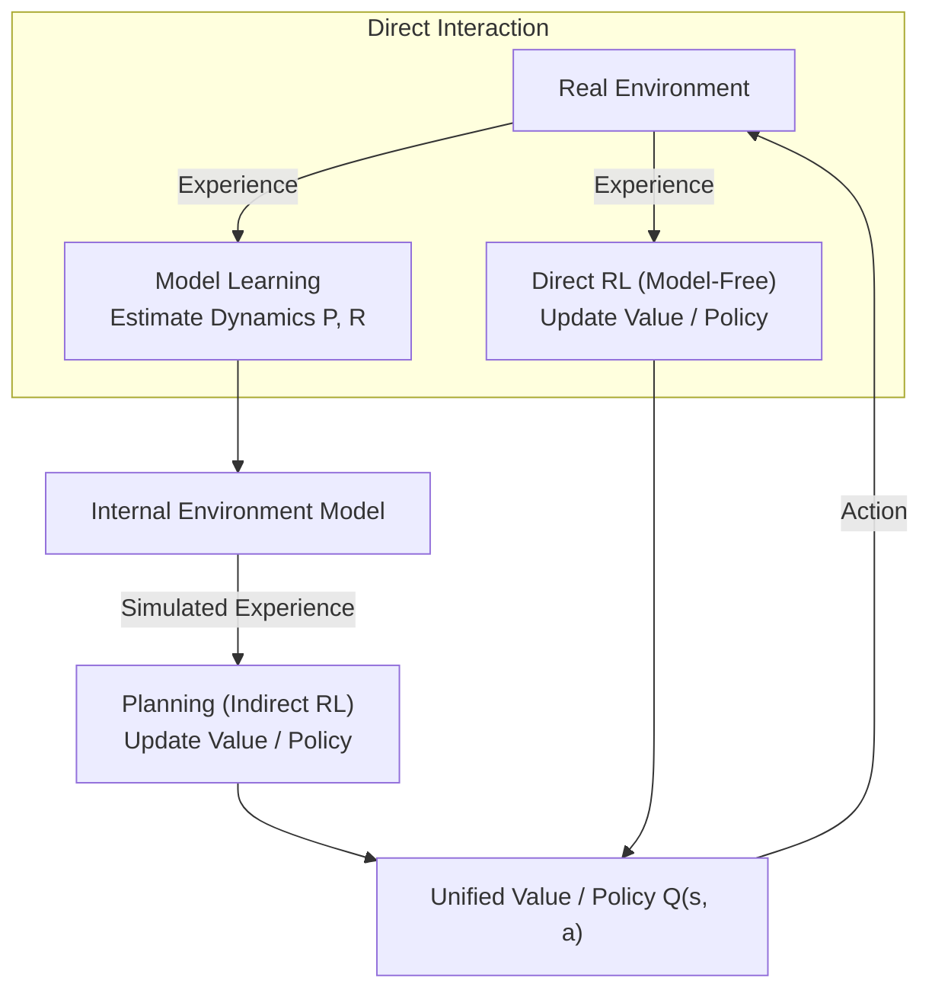
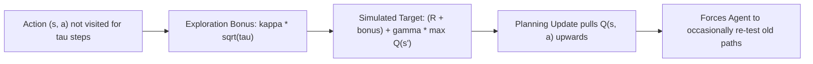
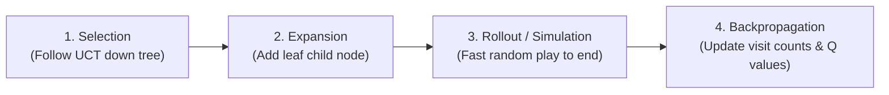

# APS1080: Intro to Reinforcement Learning
# Lecture 7 Study Notes: Model Learning, Planning & Dyna Architecture
**Textbook Reference**: Sutton & Barto (2020), Chapter 8  
**Course Schedule**: Lecture 7 (Nov 4)  
**Code Reference**: [`chapter08/maze.py`](file:///G:/Other%20computers/My%20Computer/aps1080/chapter08/maze.py), [`chapter08/trajectory_sampling.py`](file:///G:/Other%20computers/My%20Computer/aps1080/chapter08/trajectory_sampling.py), [`chapter08/expectation_vs_sample.py`](file:///G:/Other%20computers/My%20Computer/aps1080/chapter08/expectation_vs_sample.py)

---

## 1. Models and Planning

Until now, we divided methods into:
* **Model-Based** (Dynamic Programming: requires full distribution model $p(s', r \mid s, a)$).
* **Model-Free** (Monte Carlo & Temporal-Difference: learns from raw sample interaction without a model).

Chapter 8 unifies these two approaches into a single cohesive framework: **Model Learning and Planning**.

### 1.1 What is a Model?
An internal representation of the environment used by the agent to simulate future transitions:
* **Distribution Model**: Outputs the full probability distribution over all possible next states and rewards $p(s', r \mid s, a)$ (used in DP).
* **Sample Model**: Produces one plausible next state and reward sampled from the transition distribution (much easier to learn and simulate in high dimensions).

> 💡 **粵語解構 (點解要把 Model-Free 同 Model-Based 合體？)**:  
> 以前我哋覺得 Model-Based 同 Model-Free 勢成水火：一個係有攻略本（DP），一個係落場肉搏（TD）。  
> 但 Sutton 喺 Chapter 8 話：「**點解唔兩樣一齊要？！**」  
> 現實中，落場試錯嘅代價好昂貴（例如撞爛架真實跑車好肉赤）。但如果你將平時行過嘅路記喺腦海入面建構個「虛擬模型（Model）」，咁你喺現實中行一步，就可以喺腦海入面「模擬想像（Planning）」一萬次！呢種將真實經驗同腦內想像完美融合嘅架構，就係 **Dyna**！

---

## 2. The Dyna Architecture (Dyna-Q)

Richard Sutton's **Dyna** architecture seamlessly integrates **online execution**, **direct learning**, **model learning**, and **planning**.

### 2.1 The Dyna-Q Algorithm
At each time step:
1. **Act**: Choose $A_t$ in state $S_t$ using an $\epsilon$-greedy policy derived from $Q$.
2. **Execute**: Take action $A_t$, observe reward $R_{t+1}$ and next state $S_{t+1}$.
3. **Direct RL**: Perform standard one-step Q-learning update:
   $$Q(S_t, A_t) \leftarrow Q(S_t, A_t) + \alpha \left[ R_{t+1} + \gamma \max_a Q(S_{t+1}, a) - Q(S_t, A_t) \right]$$
4. **Model Learning**: Update internal model assuming deterministic transitions:
   $$\text{Model}(S_t, A_t) \leftarrow (R_{t+1}, S_{t+1})$$
5. **Planning**: Repeat $n$ times (where $n$ is planning steps per real step):
   - Sample previously visited state $S$ and action $A$ from model memory.
   - Query model: $R, S' \leftarrow \text{Model}(S, A)$.
   - Perform simulated Q-learning update:
     $$Q(S, A) \leftarrow Q(S, A) + \alpha \left[ R + \gamma \max_a Q(S', a) - Q(S, A) \right]$$

### 2.2 The Power of Planning Steps ($n$)
* If $n = 0$: Pure model-free Q-learning. An agent reaching a goal takes dozens of episodes to backpropagate the reward backward to the start state.
* If $n = 5$ or $50$: In a single real episode, the agent simulates 50 updates per step, diffusing the reward rapidly throughout the state space. The agent finds the optimal path orders of magnitude faster in terms of real environment interactions!

> 💡 **粵語解構 (Dyna-Q：行一步，發 50 次「白日夢」)**:  
> Dyna-Q 嘅運作方式生動到極：  
> Agent 每喺真實世界踩一步，佢做三件事：  
> 1. 用真身體驗做一次 Q-learning（Direct RL）。  
> 2. 將頭先發生嘅事寫入地圖手冊（Model Learning）。  
> 3. **關鍵嚟啦！** 佢企喺度唔郁，閉上眼睛喺腦海入面「發 $n$ 次白日夢（Planning Steps）」！每次白日夢隨機挑選以前行過嘅一格，問個 Model：「如果我以前喺度出呢招會點？」然後喺腦海入面做一次虛擬 Q-learning！  
> 如果 $n=50$，即係真實行咗 1 步，腦海入面已經演練咗 50 次！當佢行到終點攞到獎勵嗰一瞬間，呢個勝利訊息會喺腦內模擬中幾秒鐘之內傳遍成個地圖，學嘢效率快普通 Q-learning 幾十倍！

---

## 3. Non-Stationary Environments: Dyna-Q+

If the environment changes (e.g., a shortcut opens or a barrier blocks the path):
* A standard model becomes **inaccurate**.
* The agent may fail to discover newly opened shortcuts because its existing $Q$-values tell it that the new direction has low value.

### 3.1 The Dyna-Q+ Exploration Bonus
To encourage testing long-unvisited transitions, Dyna-Q+ adds an exploration bonus proportional to the square root of elapsed time $\tau$:
$$R_{\text{bonus}} = R + \kappa \sqrt{\tau}$$
where $\tau$ is the number of time steps since state-action pair $(s, a)$ was last tried in real interaction, and $\kappa > 0$ is a small weight.

> 💡 **粵語解構 (Dyna-Q+：時間會沖淡信任，越耐無見越要查訪)**:  
> 想像你平時返工開車行開大馬路，有一條小巷原本係死胡同（以前試過唔通）。但某日小巷打通咗變成超快捷徑！  
> 普通 Dyna-Q 呢世都唔會發現，因為佢個腦海 Model 記住嗰條係死胡同，永遠唔會再去行。  
> **Dyna-Q+ 點樣解決？**  
> 佢引入一個計時器 $\tau$（距離上次走訪經過咗幾多日）。只要你越耐無去過嗰度，$\tau$ 越大，獎勵紅利 $\kappa \sqrt{\tau}$ 就會越高！直到某一日，呢個探索紅利大到壓過大馬路嘅價值，Agent 就會忍唔住特登走去小巷兜一兜，即刻發現新捷徑！呢個機制令 Model 具備適應環境突變嘅自我修復能力！

---

## 4. Prioritized Sweeping

In standard Dyna-Q, planning updates sample states and actions uniformly at random from memory. Most sampled updates do nothing because their TD error is zero ($\delta = 0$).

### 4.1 Prioritizing Updates
**Prioritized Sweeping** focuses computation backward from states whose values just changed:
1. When a real transition or planning step produces a large TD error:
   $$P \leftarrow |R + \gamma \max_a Q(S', a) - Q(S, A)|$$
2. If $P > \theta$, insert $(S, A)$ into a **Priority Queue** with priority $P$.
3. In the planning loop:
   - Pop the state-action pair $(S, A)$ with the **highest priority** from the queue.
   - Update $Q(S, A)$.
   - Query the model for all **predecessors** $(\bar{S}, \bar{A})$ that lead into $S$.
   - Calculate their predicted priority $\bar{P}$; if $\bar{P} > \theta$, push them into the queue.

* **Result**: Information propagates backward along high-impact causal chains directly toward the start state, orders of magnitude faster than random sampling!

---

## 5. Decision-Time Planning: Monte Carlo Tree Search (MCTS)

MCTS is the decision-time planning algorithm that powered DeepMind's **AlphaGo**, **AlphaZero**, and **MuZero**.

### The Four Phases of MCTS:
1. **Selection**: Starting from the root state, navigate through the existing tree using the Upper Confidence Bound applied to Trees (**UCT**):
   $$a^* = \arg\max_a \left[ Q(s, a) + c \sqrt{\frac{\ln N(s)}{N(s, a)}} \right]$$
2. **Expansion**: Once an unexpanded state is reached, create one or more child nodes.
3. **Simulation (Rollout)**: From the new child node, simulate the remainder of the game using a fast, simple rollout policy until terminal outcome $R$.
4. **Backpropagation**: Propagate the terminal outcome $R$ up the search tree, incrementing visit counts $N(s, a) \leftarrow N(s, a) + 1$ and updating running average values $Q(s, a)$.

> 💡 **粵語解構 (AlphaGo 的靈魂：MCTS 四部曲)**:  
> 點解圍棋狀態空間高達 $10^{170}$，AlphaGo 都可以秒殺人類？核心就係 **MCTS**：  
> 1. **Selection（挑選精華）**：用 UCT 公式喺已經推演過嘅樹狀圖入面行，既挑選身價最高嘅路，又兼顧無行過嘅潛力路徑。  
> 2. **Expansion（擴展葉節點）**：行到未知領域，開一個新節點。  
> 3. **Simulation（高速大腦盲猜）**：由新節點開始，用極快嘅速度雙方隨機/半隨機亂打到終局（Rollout），睇下最後邊個贏。  
> 4. **Backpropagation（回傳功績）**：將輸贏結果倒流返成條路徑，所有沿途節點嘅訪問次數加一，勝率更新！  
> 喺真正落子前，電腦大腦喺幾秒內做十萬次呢種虛擬輪迴，最後只揀勝率最高嗰手棋行。呢個就係現代決策智能嘅巔峰！
