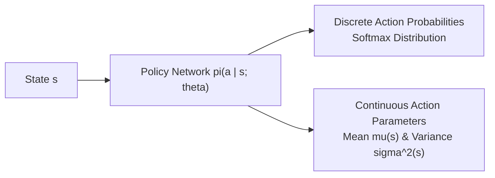
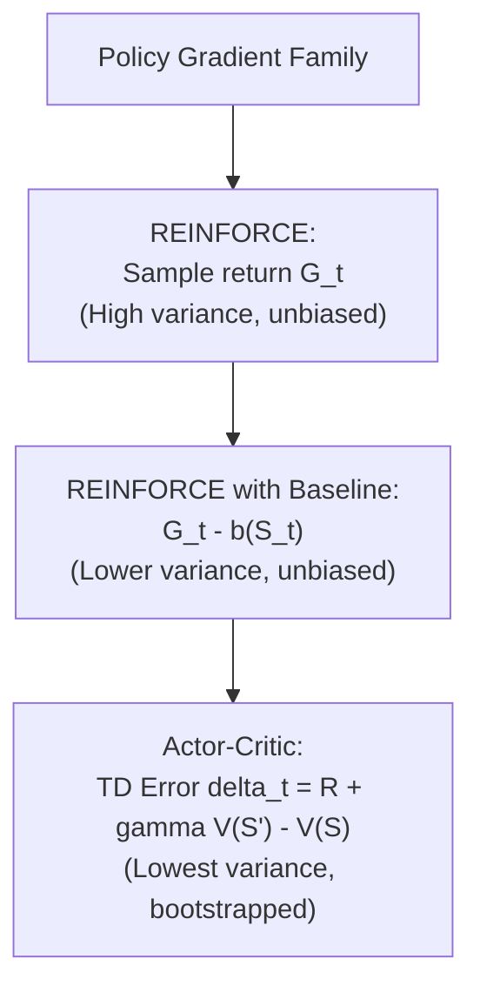
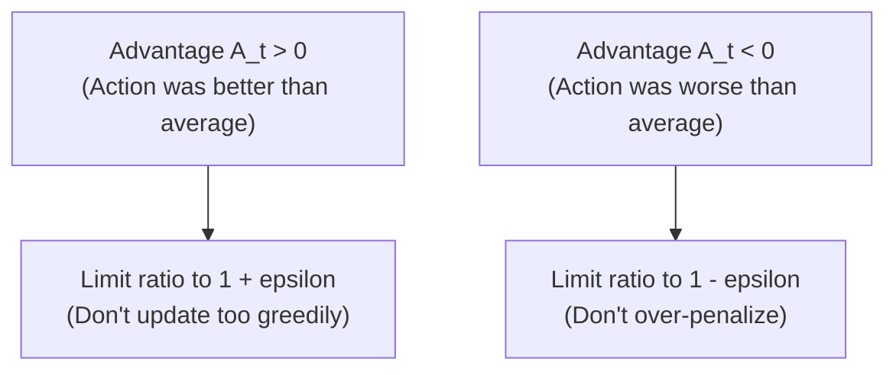

# APS1080: Intro to Reinforcement Learning
# Lecture 8 Study Notes: Policy Learning, Policy Gradients & LLM Alignment
**Textbook Reference**: Sutton & Barto (2020), Chapter 13  
**Modern Literature Reference**: Schulman et al. (PPO, 2017), Ouyang et al. (InstructGPT/RLHF, 2022), Rafailov et al. (DPO, 2023)  
**Course Schedule**: Lecture 8 (Nov 11)  
**Code Reference**: [`chapter13/short_corridor.py`](file:///G:/Other%20computers/My%20Computer/aps1080/chapter13/short_corridor.py)

---

## 1. Why Policy Gradient Methods?

In value-based methods (DQN, Sarsa, Q-learning), the policy is implicit: we approximate $Q(s, a)$ and select actions greedily: $\pi(s) = \arg\max_a Q(s, a)$.

**Policy Gradient methods** parameterize the policy directly with weights $\boldsymbol{\theta} \in \mathbb{R}^{d'}$:
$$\pi(a \mid s, \boldsymbol{\theta}) \doteq \Pr(A_t = a \mid S_t = s, \boldsymbol{\theta}_t = \boldsymbol{\theta})$$

### 1.1 Advantages Over Value-Based Methods:
1. **Continuous and High-Dimensional Action Spaces**: In robotics, finding $\arg\max_a Q(s, a)$ over a continuous 20-joint vector requires solving an expensive non-convex optimization at every millisecond. A policy network directly outputs joint torques or Gaussian parameters $(\mu(s), \sigma(s))$.
2. **True Stochastic Policies**: In imperfect-information games (Poker, Rock-Paper-Scissors) or partially observable environments, the optimal policy is fundamentally stochastic. Value-based methods with $\epsilon$-greedy cannot learn arbitrary mixed strategies (demonstrated in [`chapter13/short_corridor.py`](file:///G:/Other%20computers/My%20Computer/aps1080/chapter13/short_corridor.py)).
3. **Smooth Policy Updates**: In action-value methods, a minute change in $Q(s, a)$ can abruptly flip the greedy action from left to right, creating policy oscillation. Policy parameterizations change action probabilities smoothly and continuously.

> 💡 **粵語解構 (點解要直接學 Policy，唔再執著於 Q 值？)**:  
> 以前嘅 DQN 好似個計縮數嘅會計師：一定要同每隻動作打個分數 $Q(s, a)$，最後揀最高分嗰個（$\arg\max$）。  
> 但如果係機械人控制，動作係連續嘅浮點數（例如關節扭力由 $-1.0$ 到 $+1.0$ 有無限個可能），你每毫秒點樣喺無限個動作入面搵個 $\arg\max$ 出嚟？搵得嚟架機械人已經跌散咗！  
> **Policy Gradient（策略梯度）** 就好似個太極宗師：**佢根本唔計分，個神經網絡直接輸出動作嘅概率分佈！**  
> 猜包剪揼嗰陣，佢自然識得以三分之一概率隨機出招（Mixed Strategy）；機械人行路嗰陣，神經網絡直接輸出平均力道同方差。直截了當，如行雲流水！

---

## 2. The Policy Gradient Theorem

### 2.1 The Objective Function
We want to maximize expected return:
$$J(\boldsymbol{\theta}) \doteq v_{\pi_{\boldsymbol{\theta}}}(s_0) \quad \text{(episodic)} \quad \text{or} \quad J(\boldsymbol{\theta}) \doteq r(\pi) \quad \text{(continuing)}$$

To perform gradient ascent: $\boldsymbol{\theta}_{t+1} = \boldsymbol{\theta}_t + \alpha \nabla_{\boldsymbol{\theta}} J(\boldsymbol{\theta})$.

### 2.2 The Fundamental Challenge & The Theorem
Changing $\boldsymbol{\theta}$ changes the actions, which changes the distribution of visited states $\mu(s)$. Differentiating through the unknown state distribution would normally require knowing the environment dynamics $p(s', r \mid s, a)$!

The **Policy Gradient Theorem** proves that the gradient does **not** depend on the derivatives of the state distribution:

$$\nabla_{\boldsymbol{\theta}} J(\boldsymbol{\theta}) \propto \sum_{s \in \mathcal{S}} \mu(s) \sum_{a \in \mathcal{A}} q_\pi(s, a) \nabla_{\boldsymbol{\theta}} \pi(a \mid s, \boldsymbol{\theta})$$

Using the identity $\nabla f = f \nabla \ln f$ (the **likelihood ratio / score function trick**):
$$\nabla_{\boldsymbol{\theta}} \pi(a \mid s, \boldsymbol{\theta}) = \pi(a \mid s, \boldsymbol{\theta}) \nabla_{\boldsymbol{\theta}} \ln \pi(a \mid s, \boldsymbol{\theta})$$

Substituting this gives an expectation that can be sampled directly:
$$\nabla_{\boldsymbol{\theta}} J(\boldsymbol{\theta}) = \mathbb{E}_\pi \left[ q_\pi(S_t, A_t) \nabla_{\boldsymbol{\theta}} \ln \pi(A_t \mid S_t, \boldsymbol{\theta}) \right]$$

> 💡 **粵語解構 (Policy Gradient Theorem 嘅黑魔法：未知導數點解會消失？)**:  
> 呢條定理係數學上嘅奇蹟！  
> 直覺話你知：當你改動策略參數 $\boldsymbol{\theta}$，架車行嘅軌跡就會唔同，造訪唔同狀態嘅機率分佈 $\mu(s)$ 一定會變！如果要對效能 $J$ 求導，微積分鏈式法則一定會扯出 $\frac{\partial \mu(s)}{\partial \boldsymbol{\theta}}$——而呢項偏偏取決於大自然未知嘅物理規律 $p(s'|s,a)$！  
> 但 Sutton 嘅證明顯示：**喺精巧的展開同抵消之後，$\frac{\partial \mu(s)}{\partial \boldsymbol{\theta}}$ 竟然完完全全消失咗！**  
> 最終公式只剩低兩樣嘢：  
> 1. $\nabla_{\boldsymbol{\theta}} \ln \pi(A_t|S_t, \boldsymbol{\theta})$（你自己神經網絡嘅輸出導數，完全可控可算）。  
> 2. $q_\pi(S_t, A_t)$（用落場抽樣嘅回報或者 Critic 嚟代替）。  
> 換言之：**完全唔需要知大自然物理公式，都可以精準向「表現更好」嘅方向做梯度上升！**

---

## 3. Core Policy Gradient Algorithms

### 3.1 REINFORCE (Monte Carlo Policy Gradient)
Substitute actual return $G_t$ for $q_\pi(S_t, A_t)$:
$$\boldsymbol{\theta}_{t+1} = \boldsymbol{\theta}_t + \alpha G_t \nabla_{\boldsymbol{\theta}} \ln \pi(A_t \mid S_t, \boldsymbol{\theta}_t)$$
- **Intuition**: If return $G_t > 0$, increase the probability of action $A_t$; if $G_t$ is negative, decrease its probability.
- **Challenge**: Extremely high sampling variance.

### 3.2 REINFORCE with Baseline
Subtract a baseline value $b(s)$ that does not depend on action $a$:
$$\boldsymbol{\theta}_{t+1} = \boldsymbol{\theta}_t + \alpha (G_t - b(S_t)) \nabla_{\boldsymbol{\theta}} \ln \pi(A_t \mid S_t, \boldsymbol{\theta}_t)$$
- Choosing $b(s) = \hat{v}(s, \mathbf{w})$ drastically reduces variance without introducing any bias.

### 3.3 Actor-Critic Methods
Replace the full-episode return $G_t$ with a one-step TD error $\delta_t$:
- **Actor** (Policy $\pi_{\boldsymbol{\theta}}$): Chooses actions and updates via policy gradient.
- **Critic** (Value Function $\hat{v}_{\mathbf{w}}$): Evaluates state values and computes TD error:
  $$\delta_t = R_{t+1} + \gamma \hat{v}(S_{t+1}, \mathbf{w}) - \hat{v}(S_t, \mathbf{w})$$
- **Actor Update**: $\boldsymbol{\theta} \leftarrow \boldsymbol{\theta} + \alpha_{\theta} \delta_t \nabla_{\boldsymbol{\theta}} \ln \pi(A_t \mid S_t, \boldsymbol{\theta})$.

---

## 4. Modern Deep Policy Optimization: Proximal Policy Optimization (PPO)

Schulman et al. (2017) developed **PPO**, the undisputed workhorse of modern RL and LLM alignment (ChatGPT, Claude, Gemini).

### 4.1 The Probability Ratio
$$r_t(\boldsymbol{\theta}) \doteq \frac{\pi_{\boldsymbol{\theta}}(A_t \mid S_t)}{\pi_{\boldsymbol{\theta}_{\text{old}}}(A_t \mid S_t)}$$

### 4.2 The Clipped Surrogate Objective
To prevent catastrophic, overly aggressive updates that ruin policy stability:
$$L^{\text{CLIP}}(\boldsymbol{\theta}) \doteq \hat{\mathbb{E}}_t \left[ \min \left( r_t(\boldsymbol{\theta}) \hat{A}_t, \, \text{clip}(r_t(\boldsymbol{\theta}), 1 - \epsilon, 1 + \epsilon) \hat{A}_t \right) \right]$$

> 💡 **粵語解構 (PPO 嘅剪裁公式：點解全世界 LLM 都用佢？)**:  
> 喺深度學習入面，策略神經網絡最怕「更新過猛」——一步踩得太盡，原本講嘢好斯文嘅 AI 突然變咗胡言亂語嘅智障，成個 Model 當場報廢！  
> **PPO 點解咁穩健？**  
> 睇下佢條 Clipped Objective：  
> - 如果某個動作表現好（優勢 $\hat{A}_t > 0$），我哋想提高佢嘅機率，但 PPO 用 $\text{clip}(r_t, 1-\epsilon, 1+\epsilon)$ 頂住個天花板！最多只准將機率調高 $20\%$（例如 $\epsilon = 0.2$），唔准無限暴增！  
> - 呢種「**悲觀下界剪裁（Pessimistic Bound）**」，好似幫神經網絡繫上安全帶，確保每一步都穩打穩紮！

---

## 5. Modern LLM Alignment: RLHF & Direct Preference Optimization (DPO)

### 5.1 Reinforcement Learning from Human Feedback (RLHF)
1. **Supervised Fine-Tuning (SFT)**: Train LLM on high-quality demonstration prompts.
2. **Reward Model (RM)**: Train a scalar reward network $r_\psi(x, y)$ on pairwise human preferences ($y_w \succ y_l$).
3. **PPO Alignment**: Optimize the LLM policy $\pi_\theta$ against the reward model with a KL penalty to prevent drift:
   $$\max_\theta \mathbb{E} \left[ r_\psi(x, y) - \beta D_{\text{KL}}(\pi_\theta(y \mid x) \parallel \pi_{\text{ref}}(y \mid x)) \right]$$

### 5.2 Direct Preference Optimization (DPO, 2023)
Rafailov et al. proved that the RLHF objective has an exact closed-form mapping between the optimal policy $\pi^*$ and ground-truth reward $r^*(x, y)$:
$$r(x, y) = \beta \log \frac{\pi_\theta(y \mid x)}{\pi_{\text{ref}}(y \mid x)} + \beta \log Z(x)$$

Substituting this into the Bradley-Terry preference model bypasses training a separate reward model entirely!
$$L_{\text{DPO}}(\theta) = -\mathbb{E}_{(x, y_w, y_l)} \left[ \log \sigma \left( \beta \log \frac{\pi_\theta(y_w \mid x)}{\pi_{\text{ref}}(y_w \mid x)} - \beta \log \frac{\pi_\theta(y_l \mid x)}{\pi_{\text{ref}}(y_l \mid x)} \right) \right]$$
- **Significance**: Solves the RLHF problem using standard binary cross-entropy loss, without online sampling or PPO instability.
