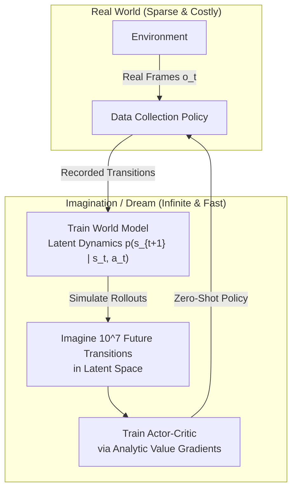
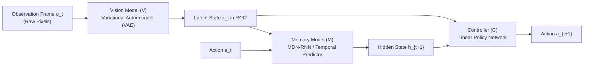
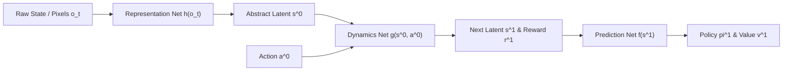

# APS1080: Intro to Reinforcement Learning
# Lecture 9 Study Notes: World Models & Latent Dynamics
**Literature Reference**: Ha & Schmidhuber (2018), *"World Models"*; Hafner et al. (DreamerV1-V3, 2020-2023); Schrittwieser et al. (MuZero, Nature 2020)  
**Course Schedule**: Lecture 9 (Nov 18)

---

## 1. Motivation: Why World Models?

Model-free algorithms (like DQN or PPO) achieve remarkable performance but are notoriously **sample inefficient**:
* Mastering an Atari game or robotic manipulation task often requires tens of millions of environment interactions.
* In physical robotics or real-world industrial control, gathering millions of trials is economically and physically impossible.

**World Models** solve this by enabling agents to build an internal generative simulation of the environment ("a mental model"), and then **learn entirely within their own imagination**.

> 💡 **粵語解構 (點解人類學打波唔洗幾百萬球？——World Models 嘅啟發)**:  
> 你諗下：點解人類學識揸車只需要十幾廿個鐘，但 DQN 打個雅達利遊戲要撞幾千萬次？  
> 因為人類個腦入面有套強大嘅「**世界模型（World Model）**」！  
> 你瞓覺發夢嗰陣，個腦會自動重演：「如果我頭先踩迫力架車會點煞停？」  
> **World Models 嘅終極思想就係：將 RL Agent 嘅學習過程搬入「夢境」入面！**  
> Agent 喺真實世界只收集少量數據，建構一個腦內物理引擎；然後喺 GPU 入面以每秒幾百萬步嘅超光速「閉關做夢修煉」！夢中練成神功之後，直接出山接管真實機械人！

---

## 2. The Canonical Ha & Schmidhuber Architecture (2018)

David Ha and Jürgen Schmidhuber proposed the foundational three-component architecture:

### The Three Modules:
1. **Vision Model (V)**:
   - A convolutional **Variational Autoencoder (VAE)**.
   - Compresses high-dimensional observation frames $o_t$ (e.g., $64 \times 64 \times 3$) into a low-dimensional stochastic latent vector $z_t \in \mathbb{R}^{32}$.
   - Loss: Reconstruction loss + KL divergence:
     $$\mathcal{L}_{\text{VAE}} = \|o_t - \hat{o}_t\|^2 + D_{\text{KL}}(q(z_t \mid o_t) \parallel \mathcal{N}(0, I))$$
2. **Memory Model (M)**:
   - A **Mixture Density Network-Recurrent Neural Network (MDN-RNN)**.
   - Predicts the probability distribution of the next latent state $z_{t+1}$ given current action $a_t$ and historical hidden state $h_t$:
     $$P(z_{t+1} \mid a_t, z_t, h_t)$$
3. **Controller (C)**:
   - A compact policy mapping concatenated state $[z_t, h_t] \to a_t$.
   - Because $V$ and $M$ handle all spatial and temporal feature extraction, the Controller $C$ can be a single linear layer with fewer than 1,000 parameters!

### "Learning Inside the Dream":
* The agent simulates an infinite number of rollouts completely inside the hallucinated latent model $M$ without ever querying the real game engine.
* The policy learned inside the dream transfers zero-shot to the actual game environment with superhuman performance!

> 💡 **粵語解構 (Ha & Schmidhuber 嘅三位一體大腦)**:  
> 睇下呢三個模組幾咁像真：  
> - **V 模組（視覺神經）**：負責「睇嘢縮圖」。將成幅複雜嘅 4K 畫面壓縮成得 32 個數字嘅潛在代碼 $z_t$。  
> - **M 模組（海馬體記憶與想像）**：負責「預測未來」。佢係個 RNN，專門想像：「如果我而家扭軚盤，下一個畫面代碼 $z_{t+1}$ 會係點？」  
> - **C 模組（小腦運動神經）**：極度輕巧，得幾百粒參數嘅線性網絡！因為對眼同大腦已經幫佢搞掂晒所有特徵提取，佢只要閉目沉思做最簡單嘅動作輸出就搞掂！

---

## 3. The Dreamer Series: DreamerV1 to DreamerV3

Danijar Hafner et al. evolved latent world models into a unified, general-purpose RL algorithm that masters Atari, continuous control, and Minecraft from scratch.

### 3.1 Recurrent State-Space Model (RSSM)
Instead of predicting next frames purely deterministically or purely stochastically, RSSM combines both:
* **Deterministic Path ($h_t$)**: A GRU cell tracking long-term memory history:
  $$h_t = f(h_{t-1}, z_{t-1}, a_{t-1})$$
* **Stochastic Path ($z_t$)**: Captures transition uncertainty and multimodal outcomes:
  $$z_t \sim p(z_t \mid h_t)$$

### 3.2 Learning via Analytic Value Gradients
Because the latent world model is represented as differentiable neural networks, the agent does **not** need policy gradient score functions!
It directly **backpropagates value gradients analytically** through imagined rollouts:
$$\nabla_\theta \mathbb{E} \left[ \sum_{\tau=t}^{t+H} \gamma^{\tau-t} \hat{v}(s_\tau) \right] \quad \leftarrow \text{Backpropagation Through Time (BPTT) in imagination!}$$

### 3.3 DreamerV3 (2023): Mastering Minecraft from Scratch
* **Categorical Latents**: Replaced continuous Gaussians with vectors of 32 discrete categorical variables (eliminates mode collapse).
* **Symlog Predictions**: Compresses arbitrarily scaled rewards and values using $\text{symlog}(x) \doteq \text{sign}(x) \ln(|x| + 1)$, enabling training across completely different domains without hyperparameter tuning.

> 💡 **粵語解構 (DreamerV3 點樣喺 Minecraft 掘出鑽石？)**:  
> 喺《Minecraft》入面由零開始掘鑽石，係 RL 界多年嘅終極噩夢（要先斬樹、整工作台、做木鎬、採石、做石鎬、搵鐵、熔鐵、做鐵鎬，再去深層地底掘鑽石，成個過程要幾萬步，而且前幾千步 Reward 係 0）！  
> **DreamerV3 點樣創造奇蹟？**  
> 1. **唔用連乘微積分，改用離散 Categorical 變量**：避免數值爆炸。  
> 2. **Symlog 縮放**：無論你獎勵係 0.001 分定係 1,000,000 分，一律用雙對數壓平，模型唔會爆 gradients！  
> 3. **夢境可微分反向傳播（Analytic Gradients）**：喺腦海入面想像 15 步未來，直接對神經網絡做微積分求導！DreamerV3 成為歷史上第一個零人類專家數據、純靠自學喺 Minecraft 掘到鑽石嘅通用 AI！

---

## 4. MuZero: Planning in Abstract Latent Dynamics

Schrittwieser et al. (DeepMind, Nature 2020) resolved a fundamental inefficiency in World Models: **Why waste neural capacity predicting irrelevant background pixels?**

### The Three Functions of MuZero:
1. **Representation Function ($h_\theta$)**: Maps past observations to initial abstract latent state: $s^0 = h_\theta(o_1, \dots, o_t)$.
2. **Dynamics Function ($g_\theta$)**: Transitions latent states forward and predicts immediate reward: $(r^k, s^k) = g_\theta(s^{k-1}, a^k)$.
3. **Prediction Function ($f_\theta$)**: Directly predicts policy logits and value from latent state: $(p^k, v^k) = f_\theta(s^k)$.

* **The Breakthrough**: The abstract state $s^k$ has **no semantics matching visual frames**; it is trained purely to predict the quantities essential for winning: **Policy ($\pi$), Value ($v$), and Reward ($r$)**!

> 💡 **粵語解構 (MuZero 的極致哲學：畫得靚有咩用？能打贏先係硬道理！)**:  
> 以前嘅 World Models（例如 VAE）好執著於「重建畫面」——畫面有棵樹、有朵雲，神經網絡都要費盡心思畫得一清二楚。  
> 但 DeepMind 嘅 **MuZero** 當頭棒喝：「喂，我而家打緊仗或者捉緊棋，天上面有朵雲同我有咩關係？！**我只在乎贏定輸！**」  
> 所以 MuZero 的潛在空間完全放棄咗「視覺像素解碼器」，佢嘅抽象神經編碼只預測三樣嘢：  
> 1. **出邊招（Policy $\pi$）**  
> 2. **贏面有幾高（Value $v$）**  
> 3. **有無分攞（Reward $r$）**  
> 呢種「目標導向嘅純極致抽象規劃」，令 MuZero 橫掃圍棋、國際象棋、日本將棋以及 Atari 遊戲，成為近代強化學習最強悍嘅王牌！
