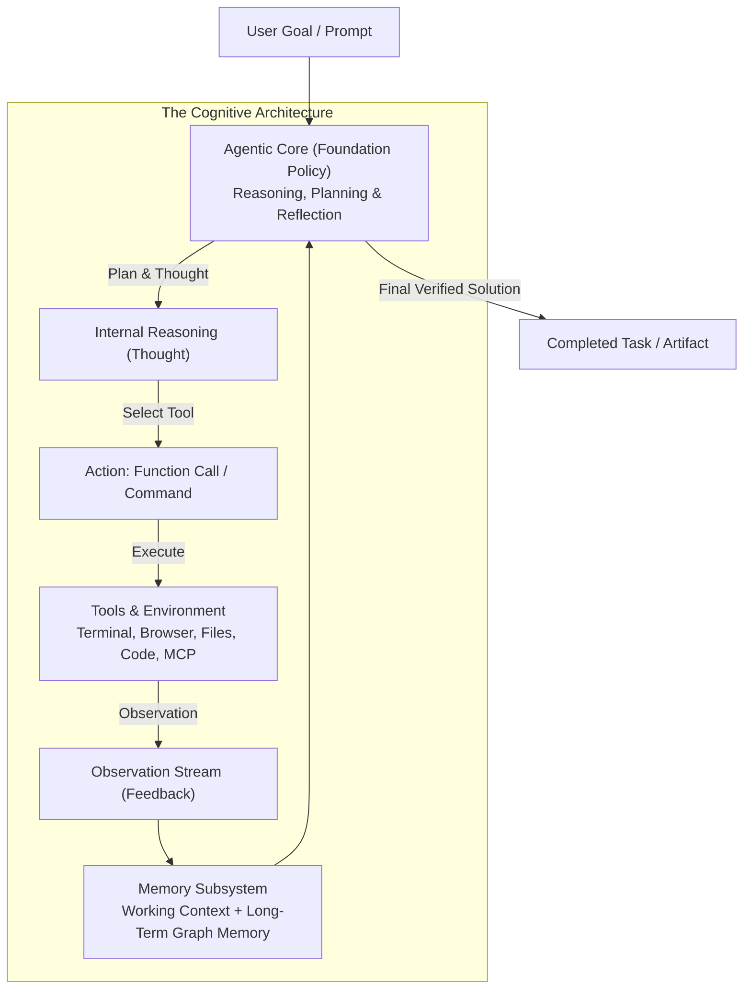
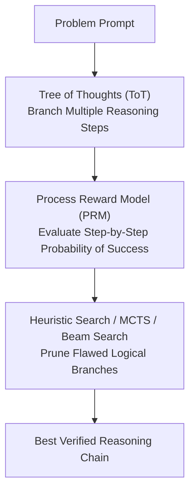

# APS1080: Intro to Reinforcement Learning
# Lecture 10 Study Notes: Agentic Systems & Autonomous Decision Architectures
**Literature Reference**: Yao et al. (ReAct, 2022); Shinn et al. (Reflexion, 2023); Yao et al. (Tree of Thoughts, 2023); Wang et al. (Survey on LLM-based Autonomous Agents, 2024)  
**Course Schedule**: Lecture 10 (Nov 25)

---

## 1. The Paradigm Shift: From Primitive RL to Agentic Systems

In classical reinforcement learning, an action $A_t$ is typically a low-level primitive (e.g., motor torques, grid directions, or single token logits). In **Agentic Systems**, the RL loop is scaled up to cognitive, semantic operations:

| Dimension | Classical Reinforcement Learning | Agentic AI Systems |
| :--- | :--- | :--- |
| **State Space $\mathcal{S}$** | Numerical feature vector or raw pixel tensors | Multi-modal context, conversation history, disk files, tool outputs |
| **Action Space $\mathcal{A}$** | Discrete indices $\{0, \dots, k\}$ or continuous $\mathbb{R}^d$ | **Tool calls, bash commands, code execution, subagent dispatch** |
| **Transition Dynamics** | Physics engine, game simulator, MDP kernel | Software operating system, APIs, web browsers, humans |
| **Policy Network $\pi$** | Small MLP, CNN, or ResNet | Foundation Model / Reasoning LLM (e.g., Gemini, Claude) |
| **Reward Signal** | Scalar step-reward $R_{t+1}$ | Unit test pass/fail, compiler success, tool status, user satisfaction |

> 💡 **粵語解構 (點解 Agent 其實就係強化學習嘅終極化身？)**:  
> 望下我哋平時同 AI 傾偈，或者你望下我（Antigravity Agent）而家幫你做緊嘅嘢：  
> - **State（狀態）**：唔再係幾個坐標數字，而係成個工程項目嘅代碼、終端機報錯、對話歷史！  
> - **Action（動作）**：唔再係向左行向右行，而係執行 PowerShell 指令、讀寫檔案、呼叫工具、甚至分派子 Agent！  
> - **Environment（環境）**：就係你部電腦嘅操作系統（Windows / Linux）同 Compiler！  
> - **Reward（回報）**：程式行唔行得通？Test cases pass 咗幾多個？  
> 現代大模型智能體（Agentic AI）本質上就係將經典 RL 嘅 State-Action-Reward 循環，直接投射去成個軟體工程世界！

---

## 2. The Cognitive Loop: ReAct & Reflexion

### 2.1 ReAct: Synergizing Reasoning and Acting (Yao et al., 2022)
Traditional systems either reasoned in a vacuum (pure Chain-of-Thought without external validation) or acted reactively (calling tools without structured reasoning). **ReAct** interleaves both in a continuous loop:

$$\dots \to \text{Thought}_t \to \text{Action}_t \to \text{Observation}_{t+1} \to \text{Thought}_{t+1} \to \dots$$

* **Thought**: Decomposes subgoals, analyzes errors, and plans next steps: *"I need to inspect mcp_config.json to see the registered server name."*
* **Action**: Dispatches a concrete, structured tool call: `view_file(path)`.
* **Observation**: Receives the ground-truth environment return from the execution sandbox.

### 2.2 Reflexion: Language Agents with Verbal Reinforcement (Shinn et al., 2023)
In standard RL, an agent improves by backpropagating numeric reward scalar signals through weights. In **Reflexion**, the agent improves via **linguistic self-reflection**:
1. When a trial fails (e.g., code fails unit tests), an Evaluator produces a scalar performance metric.
2. A Self-Reflection model analyzes the trajectory and generates a verbal post-mortem: *"I assumed the server was named 'local-memory', but the config used 'local-memory-aps1080'. In the next trial, I will check the file first."*
3. The verbal feedback is stored in working memory, altering the policy for subsequent trials without gradient parameter updates!

> 💡 **粵語解構 (ReAct 與 Reflexion：識得諗先行動，做錯識寫檢討書)**:  
> - **ReAct（邊諗邊做）**：以前啲白痴 Chatbot 一收到指令就亂撞亂衝。ReAct 教識 AI 點樣做個成熟嘅工程師：**Thought（先喺腦海分析現況） $\to$ Action（精準 call 一個工具） $\to$ Observation（睇下終端機比咩 output）**。一步一步推導，極少幻覺！  
> - **Reflexion（文字版強化學習）**：傳統 RL 要更新幾百萬粒神經網絡權重，慢到死。Reflexion 好似學生做錯題目罰抄檢討書：佢喺腦海用廣東話寫：「頭先嗰下我唔記得咗 activate conda env，下次行 python 前我一定會先行 conda activate！」下一鋪開局嗰陣，佢睇返自己寫嘅檢討書，即刻避開地雷，**連微調權重都唔洗做就完成 Policy Improvement**！

---

## 3. Test-Time Compute & Search in Reasoning Models

Modern frontier reasoning models scale **test-time compute** using RL-guided search, bridging classic MCTS with neural language generation.

### 3.1 Tree of Thoughts (ToT, 2023)
Extends linear Chain-of-Thought into a tree search over thought steps:
- Enables backtracking when a reasoning path hits a contradiction.
- Evaluates intermediate thought quality using value heuristics.

### 3.2 Process Reward Models (PRMs)
* **Outcome Reward Model (ORM)**: Evaluates only the final answer ($+1$ or $-1$). Prone to rewarding "right answer via wrong reasoning" (credit assignment failure).
* **Process Reward Model (PRM)**: A specialized neural critic that evaluates each individual reasoning step $z_k$:
  $$r(z_k \mid z_{1:k-1}, x) \in [0, 1]$$
* Enables fine-grained MCTS and best-of-$N$ test-time compute search over mathematical proofs and complex code refactors.

---

## 4. Multi-Agent Systems & Knowledge Subsystems

### 4.1 Orchestrator-Worker Architecture
* **Orchestrator Agent**: High-level planner that decomposes large system goals into isolated functional subtasks.
* **Worker Subagents**: Specialized, sandboxed agents executing targeted tasks concurrently (e.g., Code Researcher, Unit Tester, Documentation Generator).

### 4.2 Model Context Protocol (MCP) & Long-Term Memory
* Standardizes how autonomous agents access external tools, databases, and persistent memory graphs.
* As demonstrated by this project's `local-memory-aps1080`, agents maintain dual persistent memory (human-readable `MEMORY.md` + machine-readable semantic knowledge graph), enabling seamless continuity across independent chat sessions.
