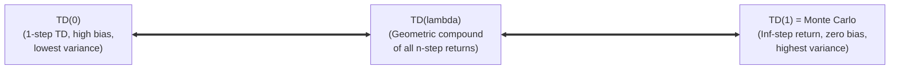
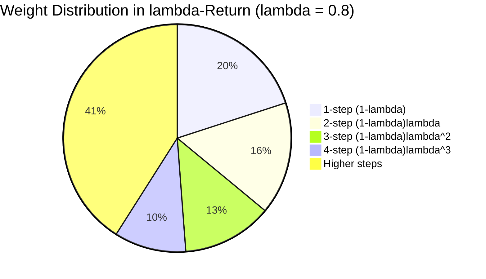
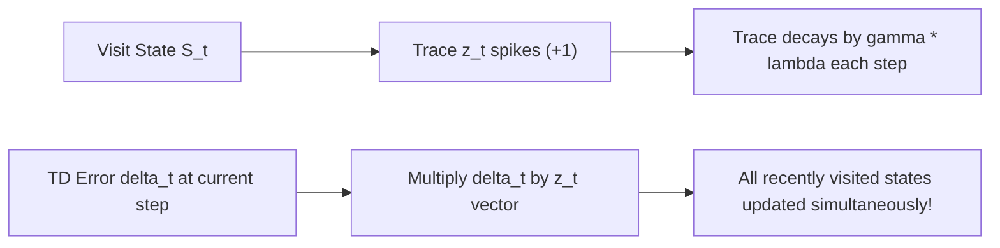

# APS1080: Intro to Reinforcement Learning
# Lecture 11 Study Notes: Eligibility Traces & Advanced TD Methods
**Textbook Reference**: Sutton & Barto (2020), Chapter 12  
**Course Schedule**: Lecture 11 (Advanced Foundations)  
**Code Reference**: [`chapter12/lambda_effect.py`](file:///G:/Other%20computers/My%20Computer/aps1080/chapter12/lambda_effect.py), [`chapter12/mountain_car.py`](file:///G:/Other%20computers/My%20Computer/aps1080/chapter12/mountain_car.py), [`chapter12/random_walk.py`](file:///G:/Other%20computers/My%20Computer/aps1080/chapter12/random_walk.py)

---

## 1. Bridging Monte Carlo and One-Step TD

In Chapter 5, Monte Carlo updated values toward the full return $G_t$ ($n = \infty$, zero bias, high variance). In Chapter 6, one-step TD updated values toward $R_{t+1} + \gamma V(S_{t+1})$ ($n = 1$, low variance, biased).

**Eligibility Traces (TD($\lambda$))** seamlessly bridge this entire spectrum, providing a mechanism that combines the speed and low variance of TD with the multi-step credit assignment of Monte Carlo.

> 💡 **粵語解構 (Eligibility Traces：連通 MC 與 TD 的彩虹橋)**:  
> 以前我哋好極端：  
> - **TD(0)**：淨係睇前一步（1-step），目光太短淺。  
> - **MC（即 TD(1)）**：一定要打到世界末日睇晒所有未來（$\infty$-step），變數太大。  
> 點解唔折衷？**TD($\lambda$)** 就係用參數 $\lambda \in [0, 1]$ 做調和：  
> - 當 $\lambda = 0$，佢就係眼光得一步嘅 TD(0)；  
> - 當 $\lambda = 1$，佢就係堅持到底嘅 Monte Carlo；  
> - 當 $\lambda \approx 0.8$，佢兼具兩者之長——既有 TD 的即時低方差，又有 MC 嘅長遠大局觀！

---

## 2. The Forward View: The $\lambda$-Return

### 2.1 Compounding $n$-Step Returns
Recall the $n$-step return:
$$G_{t:t+n} \doteq R_{t+1} + \gamma R_{t+2} + \dots + \gamma^{n-1} R_{t+n} + \gamma^n V_{t+n-1}(S_{t+n})$$

Instead of picking an arbitrary single $n$, the **$\lambda$-return** ($G_t^\lambda$) combines **all** $n$-step returns, weighting each by $(1 - \lambda) \lambda^{n-1}$:

$$G_t^\lambda \doteq (1 - \lambda) \sum_{n=1}^\infty \lambda^{n-1} G_{t:t+n}$$

### 2.2 Boundary Behavior:
* If $\lambda = 0$: $G_t^0 = G_{t:t+1} = R_{t+1} + \gamma V(S_{t+1})$ (exactly **one-step TD(0)**).
* If $\lambda = 1$: All intermediate terms drop out, leaving $G_t^1 = G_t$ (exactly **Monte Carlo**).
* For intermediate $\lambda \in (0, 1)$, $\lambda$-returns consistently outperform both pure TD(0) and pure Monte Carlo (see [`chapter12/lambda_effect.py`](file:///G:/Other%20computers/My%20Computer/aps1080/chapter12/lambda_effect.py)).

> [!WARNING]
> **The Problem with the Forward View**:
> The forward view is **acausal**. To calculate $G_t^\lambda$, an agent must wait until the end of the episode to observe all future rewards and states. It cannot be computed online step-by-step!

> 💡 **粵語解構 (Forward View 前向視角：美麗但不能實時運行的「水晶球」)**:  
> 咩叫 **Forward View（前向視角）**？  
> 佢好似個預言家企喺起點望向未來：「我將 1 步回報、2 步回報、3 步回報...用幾何級數權重全部加埋一齊！」  
> 概念非常優美，但致命缺點係 **Acausal（非因果）**：你必須穿越時空睇晒未來所有事情，先至計得出 $G_t^\lambda$！如果每行一步都要等未來，我哋根本無辦法在線實時學嘢！點樣破解？就要靠神奇的 **Backward View**！

---

## 3. The Backward View: TD($\lambda$) via Eligibility Traces

The **backward view** provides a causal, online, incremental mechanism that achieves the exact effect of the forward view without looking into the future.

### 3.1 The Eligibility Trace Vector ($\mathbf{z}_t$)
The agent maintains an **eligibility trace vector** $\mathbf{z}_t \in \mathbb{R}^d$ of the same dimension as parameter vector $\mathbf{w}_t$:
* When a state or feature is visited, its trace spikes upward.
* At every time step, all traces decay exponentially by factor $\gamma \lambda$.

#### Accumulating Traces:
$$\mathbf{z}_t \doteq \gamma \lambda \mathbf{z}_{t-1} + \nabla_{\mathbf{w}} \hat{v}(S_t, \mathbf{w}_t)$$

#### Replacing Traces (for binary features):
$$\mathbf{z}_t \doteq \min \left( 1, \, \gamma \lambda \mathbf{z}_{t-1} + \mathbf{x}(S_t) \right)$$

### 3.2 The Backward Update Rule
At each step, calculate the standard one-step TD error $\delta_t$:
$$\delta_t \doteq R_{t+1} + \gamma \hat{v}(S_{t+1}, \mathbf{w}_t) - \hat{v}(S_t, \mathbf{w}_t)$$

Then update **all** weights simultaneously in proportion to their eligibility trace:
$$\mathbf{w}_{t+1} \leftarrow \mathbf{w}_t + \alpha \delta_t \mathbf{z}_t$$

> 💡 **粵語解構 (Backward View 後向視角：熱能足跡與即時功過分攤)**:  
> 呢個係全書最巧妙嘅神技！  
> 想像你行過雪地，你每踩過一格，嗰格就會留低熱騰騰嘅「熱能足跡（$\mathbf{z}_t$）」。隨著時間推移，舊足跡會以 $\gamma \lambda$ 嘅速度慢慢降溫冷卻。  
> 當你行到第 10 步，突然中咗個大獎（或者踩中地雷產生咗好大嘅 TD Error $\delta_t$）：  
> - 普通 TD(0) 只會更新第 9 步（前面嗰步），好短視。  
> - **TD($\lambda$)** 唔同：佢揸住呢個 $\delta_t$「大喝一聲」，**所有地下仲有餘溫嘅足跡全部同時被更新！**  
> 剛剛踩過嘅格仔熱度高，更新最多；幾步前踩過嘅格仔仲有微溫，分到少少更新；完全無行過嘅地方熱度係 0，完全唔郁！  
> **重點： Agent 完全唔需要預知未來，只睇背後留低嘅殘影，就實時實現咗 Forward View 嘅幾何回報加權！**

---

## 4. Control with Traces: Sarsa($\lambda$) & Watkins' $Q(\lambda)$

### 4.1 Sarsa($\lambda$)
Apply traces to action-values $Q(s, a)$:
$$\delta_t = R_{t+1} + \gamma \hat{q}(S_{t+1}, A_{t+1}, \mathbf{w}_t) - \hat{q}(S_t, A_t, \mathbf{w}_t)$$
$$\mathbf{w}_{t+1} \leftarrow \mathbf{w}_t + \alpha \delta_t \mathbf{z}_t$$

Because Sarsa is **on-policy**, the trajectory actually matches the evaluated policy; traces decay naturally without interruption.

### 4.2 Watkins' $Q(\lambda)$ and the Cutoff Rule
Can we apply eligibility traces to off-policy Q-learning?
* Q-learning evaluates the **greedy policy** ($\max_a Q(s', a)$).
* If the agent takes an exploratory, non-greedy action ($A_{t+1} \neq \arg\max_a Q(S_{t+1}, a)$), the causal chain connecting future rewards to past states is **broken**!
* **Watkins' Cutoff Rule**:
  $$\mathbf{z}_t \leftarrow \begin{cases} 
  \gamma \lambda \mathbf{z}_{t-1} + \nabla Q(S_t, A_t) & \text{if } A_t = \arg\max_a Q(S_t, a) \\ 
  \nabla Q(S_t, A_t) & \text{if } A_t \neq \arg\max_a Q(S_t, a) \text{ (zero out past traces!)} 
  \end{cases}$$

> 💡 **粵語解構 (Watkins' Q($\lambda$) 點解要「無情清零」？)**:  
> 呢個係進階考試最愛考嘅細節！  
> Q-learning 心中學緊嘅係「全天下最完美嘅貪婪打法」。  
> 只要你一直行緊最佳招式，熱能足跡（Traces）就可以一直向後傳遞。  
> 但只要你一旦手痕行咗一步非貪婪嘅探索動作（Exploratory Action），**因果關係即刻斷裂！** 因為李小龍絕對唔會出呢步廢招，未來發生嘅任何事都再同你以前嘅輝煌無關！  
> 所以 Watkins 規定：**只要一出探索招式，之前積累嘅所有熱能足跡 $\mathbf{z}_t$ 一律當場清零（Cut off to zero）！**
