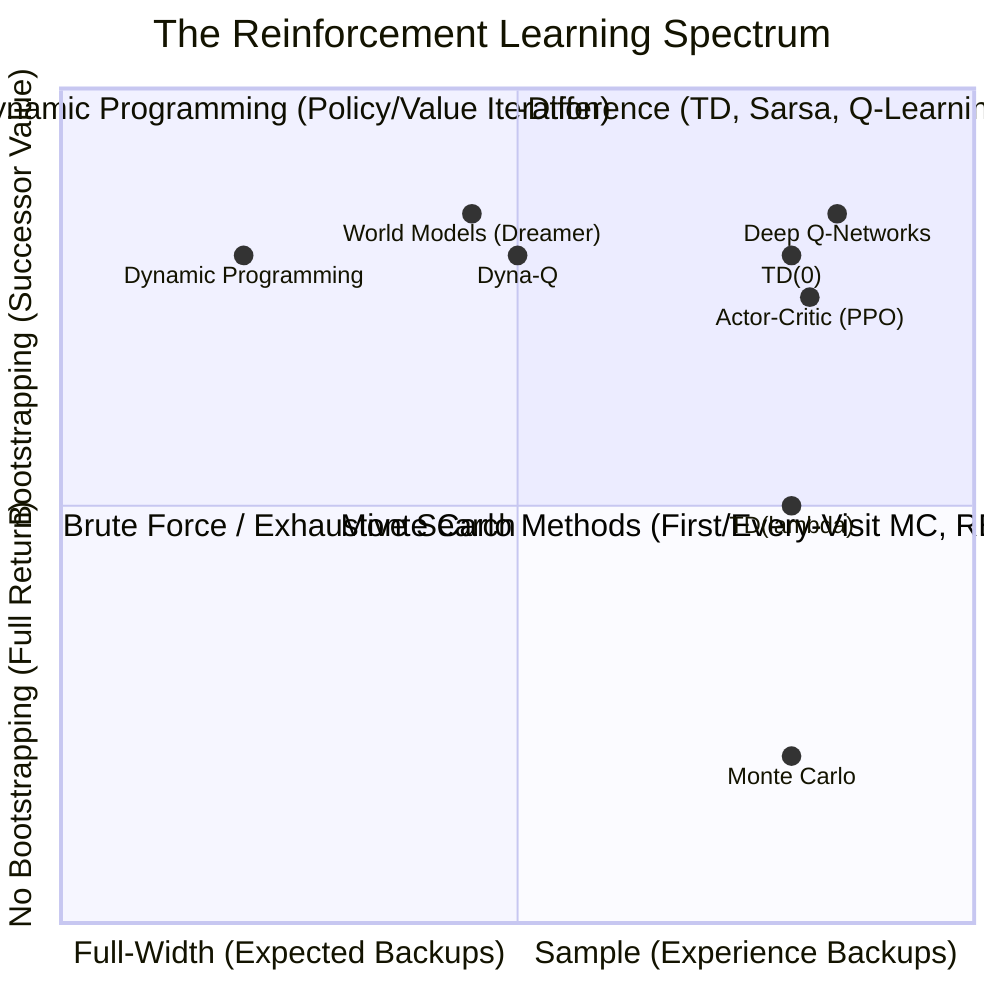
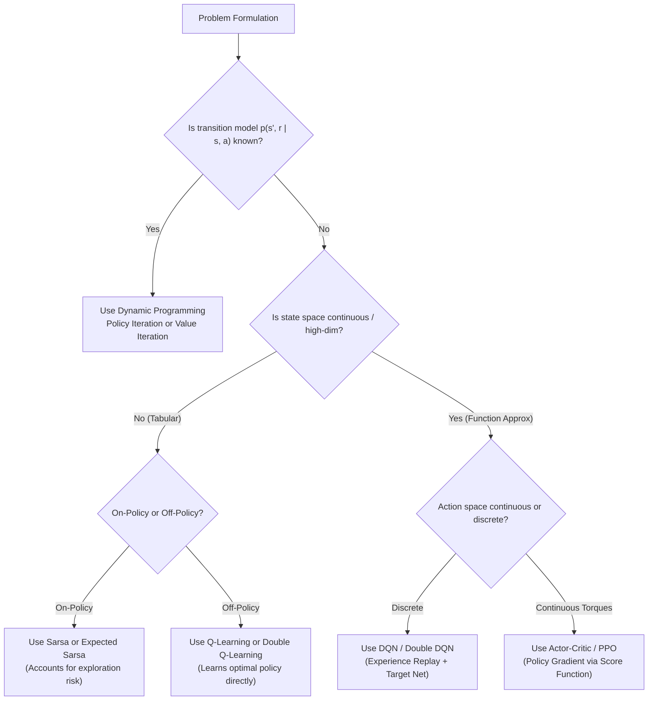

# APS1080: Intro to Reinforcement Learning
# Lecture 12 Study Notes: Comprehensive Course Synthesis & Cumulative Test B Exam Mastery
**Textbook Reference**: Sutton & Barto (2020), Chapters 1–13  
**Course Milestones**: Cumulative Test A (Oct 21) & Cumulative Test B (Dec 2) — 90% Course Grade Weight  
**Associated Workspace Reference**: [Lecture 1–11 Study Notes](file:///G:/Other%20computers/My%20Computer/aps1080/)

---

## 1. The Grand Architectural Map of Reinforcement Learning

Every algorithm in reinforcement learning can be placed along two fundamental axes:
1. **Sample Backups vs. Full-Width Backups** (Trial-and-error experience vs. Model distribution expectation).
2. **Bootstrapping vs. Non-Bootstrapping** (Updating estimates from successor estimates vs. Actual returns).

> 💡 **粵語解構 (全課程大一統：兩條坐標軸看透天下 RL 算法)**:  
> 溫書記住呢張四象限圖，成個學期 12 堂課一目了然：  
> - **橫坐標（Sample vs Full-Width）**：你係咪落場抽樣試錯（Sample，即 MC、TD、DQN），定係企喺高處俯瞰所有可能（Full-Width，即 DP）？  
> - **縱坐標（Bootstrap vs Non-Bootstrap）**：你係咪用下一個狀態嘅估值嚟抄近路（Bootstrap，即 DP、TD、DQN），定係老老實實打到最後攞真實總分（Non-Bootstrap，即 MC、REINFORCE）？  
> 只要分清楚呢兩個維度，任何新演算法出現在考試卷上，你都能一眼洞悉佢嘅本質同血統！

---

## 2. Master Mathematical Equation Cheatsheet

### 2.1 The Four Bellman Equations
$$\begin{array}{|l|l|}
\hline
\textbf{Equation} & \textbf{Mathematical Definition} \\ \hline
\textbf{Bellman Expectation } v_\pi(s) & v_\pi(s) = \sum_a \pi(a \mid s) \sum_{s', r} p(s', r \mid s, a) \left[ r + \gamma v_\pi(s') \right] \\ \hline
\textbf{Bellman Expectation } q_\pi(s, a) & q_\pi(s, a) = \sum_{s', r} p(s', r \mid s, a) \left[ r + \gamma \sum_{a'} \pi(a' \mid s') q_\pi(s', a') \right] \\ \hline
\textbf{Bellman Optimality } v_*(s) & v_*(s) = \max_{a \in \mathcal{A}(s)} \sum_{s', r} p(s', r \mid s, a) \left[ r + \gamma v_*(s') \right] \\ \hline
\textbf{Bellman Optimality } q_*(s, a) & q_*(s, a) = \sum_{s', r} p(s', r \mid s, a) \left[ r + \gamma \max_{a' \in \mathcal{A}(s')} q_*(s', a') \right] \\ \hline
\end{array}$$

---

### 2.2 Core Algorithm Update Rules Compared

| Algorithm | Type | Target Update Formula |
| :--- | :--- | :--- |
| **Policy Evaluation** | DP (Expectation) | $V_{k+1}(s) \leftarrow \sum_a \pi(a \mid s) \sum_{s', r} p(s', r \mid s, a) [r + \gamma V_k(s')]$ |
| **Value Iteration** | DP (Control) | $V_{k+1}(s) \leftarrow \max_a \sum_{s', r} p(s', r \mid s, a) [r + \gamma V_k(s')]$ |
| **Monte Carlo (First-Visit)** | Sample (No bootstrap) | $V(S_t) \leftarrow V(S_t) + \alpha [G_t - V(S_t)]$ |
| **TD(0) Prediction** | Sample (Bootstrapped) | $V(S_t) \leftarrow V(S_t) + \alpha [R_{t+1} + \gamma V(S_{t+1}) - V(S_t)]$ |
| **Sarsa** | On-Policy Control | $Q(S_t, A_t) \leftarrow Q(S_t, A_t) + \alpha [R_{t+1} + \gamma Q(S_{t+1}, A_{t+1}) - Q(S_t, A_t)]$ |
| **Q-Learning** | Off-Policy Control | $Q(S_t, A_t) \leftarrow Q(S_t, A_t) + \alpha [R_{t+1} + \gamma \max_a Q(S_{t+1}, a) - Q(S_t, A_t)]$ |
| **Expected Sarsa** | Expected Next-Action | $Q(S_t, A_t) \leftarrow Q(S_t, A_t) + \alpha [R_{t+1} + \gamma \sum_a \pi(a \mid S_{t+1}) Q(S_{t+1}, a) - Q(S_t, A_t)]$ |
| **Double Q-Learning** | Unbiased Control | $Q_1(S_t, A_t) \leftarrow Q_1(S_t, A_t) + \alpha [R_{t+1} + \gamma Q_2(S_{t+1}, \arg\max_a Q_1(S_{t+1}, a)) - Q_1(S_t, A_t)]$ |
| **REINFORCE** | Policy Gradient | $\boldsymbol{\theta} \leftarrow \boldsymbol{\theta} + \alpha G_t \nabla_{\boldsymbol{\theta}} \ln \pi(A_t \mid S_t, \boldsymbol{\theta})$ |
| **PPO (Clipped)** | Trust Region Policy | $\boldsymbol{\theta} \leftarrow \boldsymbol{\theta} + \alpha \nabla_{\boldsymbol{\theta}} \min(r_t(\boldsymbol{\theta})\hat{A}_t, \text{clip}(r_t(\boldsymbol{\theta}), 1-\epsilon, 1+\epsilon)\hat{A}_t)$ |

---

## 3. The Four Pillar Proofs for Tests A & B

### Proof 1: Policy Improvement Theorem ($v_{\pi'}(s) \ge v_\pi(s)$)
**Theorem**: If $q_\pi(s, \pi'(s)) \ge v_\pi(s)$ for all $s \in \mathcal{S}$, then $v_{\pi'}(s) \ge v_\pi(s)$.
**Proof by Recursive Expansion**:
$$\begin{aligned}
v_\pi(s) &\le q_\pi(s, \pi'(s)) \\
&= \mathbb{E}_{\pi'} \left[ R_{t+1} + \gamma v_\pi(S_{t+1}) \mid S_t = s \right] \\
&\le \mathbb{E}_{\pi'} \left[ R_{t+1} + \gamma q_\pi(S_{t+1}, \pi'(S_{t+1})) \mid S_t = s \right] \\
&= \mathbb{E}_{\pi'} \left[ R_{t+1} + \gamma R_{t+2} + \gamma^2 v_\pi(S_{t+2}) \mid S_t = s \right] \\
&\dots \\
&\le \mathbb{E}_{\pi'} \left[ R_{t+1} + \gamma R_{t+2} + \gamma^2 R_{t+3} + \dots \mid S_t = s \right] = v_{\pi'}(s) \quad \blacksquare
\end{aligned}$$

> 💡 **粵語解構 (證明技巧：骨牌式連環代入)**:  
> 考試見到呢題即刻笑出嚟！  
> 秘訣就係四個字：「**一路代入**」！  
> 由 $v_\pi(s) \le q_\pi(s, \pi'(s))$ 開始，將最尾嗰項 $v_\pi(S_{t+1})$ 又用小於等於換成 $q_\pi$，再展開出 $R_{t+2} + \gamma v_\pi(S_{t+2})$。好似推骨牌咁一直向未來展開到無限項，最後成串獎勵加埋就直接變成新策略嘅身價 $v_{\pi'}(s)$！證明完畢！

---

### Proof 2: Policy Gradient Theorem (Likelihood Ratio Derivation)
$$\begin{aligned}
\nabla_\theta v_\pi(s) &= \nabla_\theta \left[ \sum_a \pi(a \mid s) q_\pi(s, a) \right] \\
&= \sum_a \left[ \nabla \pi(a \mid s) q_\pi(s, a) + \pi(a \mid s) \nabla q_\pi(s, a) \right] \\
&= \sum_a \left[ \nabla \pi(a \mid s) q_\pi(s, a) + \pi(a \mid s) \nabla \sum_{s', r} p(s', r \mid s, a) [r + \gamma v_\pi(s')] \right] \\
&= \sum_a \nabla \pi(a \mid s) q_\pi(s, a) + \gamma \sum_a \pi(a \mid s) \sum_{s'} p(s' \mid s, a) \nabla v_\pi(s')
\end{aligned}$$
Unrolling recursively down the Markov chain across time horizons $t \to \infty$:
$$\nabla_\theta J(\theta) = \sum_{s} \mu(s) \sum_a \nabla_\theta \pi(a \mid s) q_\pi(s, a) = \mathbb{E}_\pi \left[ q_\pi(S_t, A_t) \nabla_\theta \ln \pi(A_t \mid S_t, \theta) \right] \quad \blacksquare$$

---

### Proof 3: Maximization Bias Derivation
Let $X_1, X_2, \dots, X_m$ be independent, identically distributed random variables with mean $\mathbb{E}[X_i] = 0$.
Because the maximum function $f(x) = \max_i x_i$ is **convex**:
By **Jensen's Inequality** ($\mathbb{E}[f(X)] \ge f(\mathbb{E}[X])$):
$$\mathbb{E} \left[ \max(X_1, \dots, X_m) \right] \ge \max \left( \mathbb{E}[X_1], \dots, \mathbb{E}[X_m] \right) = \max(0, \dots, 0) = 0$$
Whenever variance $\text{Var}(X) > 0$ and $m > 1$, strict inequality holds:
$$\mathbb{E} \left[ \max_i X_i \right] > 0$$
This proves that noisy function approximations or sample estimates **always overestimate expected values**, theoretically mandating **Double Q-Learning**! $\blacksquare$

> 💡 **粵語解構 (Jensen 不等式與 Double Q-learning 的必然性)**:  
> 呢題證明極度優雅！  
> 凸函數（Convex Function，好似個碗咁凹落去）嘅平均值，永遠大過或等於平均值嘅函數值（$\mathbb{E}[f(X)] \ge f(\mathbb{E}[X])$）。因為 $\max$ 運算符係凸函數，所以雜音嘅期望最大值永遠 $> 0$！  
> 即係話：**只要世界上仲有隨機雜音，Q-learning 就必然盲目虛火過高！** 呢個就係點解 DeepMind 必須發明 Double DQN 嘅數學鐵證！

---

## 4. Final Exam Troubleshooting & Diagnostic Decision Tree

When solving exam problems or debugging reinforcement learning algorithms:

